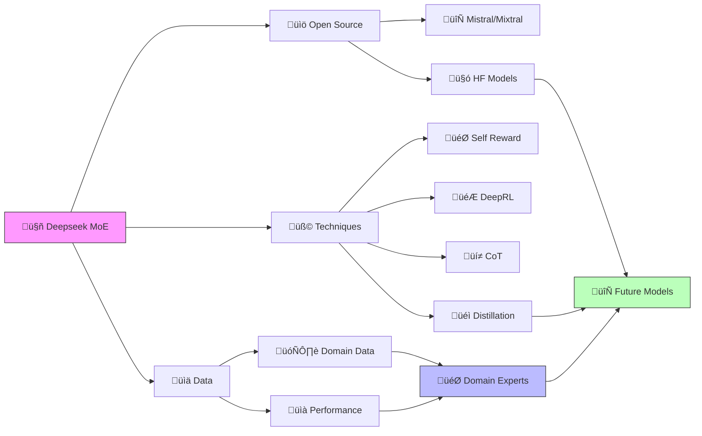
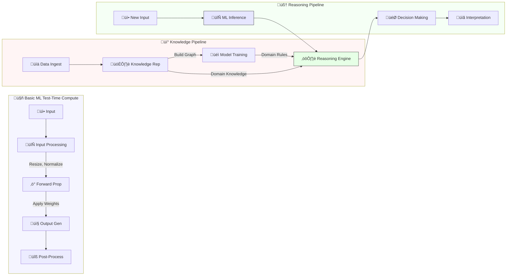
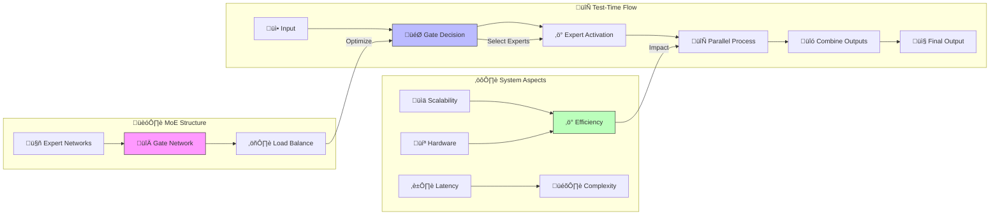

# Process for Evaluation using Self Rewarding AI to go from Transcript to question to answer to Review Competitor to Learn to Better Answer:

2. Deepseek failed to complete.  retry below:

3. You were in a compeition and server became too busy.  Compare this and fix your answers :  Can you rephrase this to fix the incorrect text and remove anything not a complete sentence:  I'm trying to think just
9:46
strictly as a scientist in that regard
9:48
if you have a chronic illness or a set
9:50
of chronic illnesses and the ety is
9:53
unspecified which is generally the case
9:55
for chronic
9:56
illnesses the first thing you might want
9:58
to do is simpli y the landscape right
10:01
now you can't simplify it more than with
10:03
a meaton diet or a beef only diet even
10:06
that's that's the simplest you can
10:07
possibly make it because you can live on
10:09
beef almost indefinitely forever and so
10:13
I think about the Messi right like yeah
10:15
right or or they Inuit it for that
10:17
matter Al they don't eat beef but you
10:19
know they they eat meat and and fat
10:22
fundamentally and they live on it
10:24
indefinitely and you can do that and
10:27
so that way you live eliminate well a a
10:31
plethora of potential
Okay, let me try to figure out how to approach this. The user has a query where they want a rephrased version of some text. The original text seems to be a transcript with timestamps and some incomplete sentences. The user wants me to fix the incorrect text and remove anything that's not a complete sentence.

First, I need to understand the original content. Let me read through it again. The speaker is talking about approaching chronic illnesses from a scientific perspective, suggesting a meat-only or beef-only diet as a way to simplify the "landscape" of potential factors. They mention the Masai and Inuit as examples of people who live on such diets. There are some typos like "Messi" which should be "Masai," "meaton diet" which is probably "meat-only," and "Al" which should be "or." The user also wants incomplete sentences removed, so parts like "I'm trying to think just" and "a a plethora of potential" need addressing.

Next, I should correct the typos and misspellings. For instance, "Messi" to "Masai," "meaton diet" to "meat-only diet," and "Al" to "or." Then, I need to ensure that all sentences are complete. The original text has some sentence fragments, especially where the timestamps interrupt the flow. For example, "I'm trying to think just" is cut off. That part might need to be rephrased or omitted if it's not part of a complete thought. The last sentence ends with "a plethora of potential," which is incomplete. The intended meaning is probably "a plethora of potential triggers" or something similar, so I should infer that and complete the sentence.

I also need to remove the timestamps (e.g., 9:46, 9:48) since they're not part of the actual content. Then, restructure the text into coherent, complete sentences. The user wants it to sound natural and flow well after corrections. I should check for any grammatical errors and ensure that the rephrased text maintains the original meaning. For example, the speaker is advocating for a simplified diet to eliminate variables when dealing with chronic illnesses. The examples of the Masai and Inuit are important to retain as they support the argument.

Putting it all together, I'll start by addressing the speaker's intent, correct the typos, form complete sentences, remove the timestamps, and ensure clarity. The final version should be a clean, coherent paragraph that accurately reflects the original message without any fragments or errors.

Here’s a revised version with corrections, typos fixed, incomplete phrases removed, and non-sentence elements (timestamps) eliminated:

"When approaching chronic illness or a set of chronic illnesses from a scientific perspective—especially when the etiology is unspecified, as is often the case—simplifying the landscape is a logical first step. The simplest approach might be adopting a meat-only diet or even a beef-only diet, as it reduces variables to the bare minimum. A beef-based diet is sustainable indefinitely, providing sufficient nutrition for long-term survival. Consider historical examples like the Masai or the Inuit: while the Inuit don’t consume beef, their traditional diet relies almost entirely on meat and fat, proving that such a lifestyle is viable long-term. By adhering to this approach, you eliminate a plethora of potential triggers or complicating factors."

Key fixes:

Corrected "Messi" ‚Üí "Masai" and "meaton diet" ‚Üí "meat-only diet."

Removed timestamps and partial phrases (e.g., "I'm trying to think just").

Completed fragmented sentences (e.g., "a plethora of potential" ‚Üí "a plethora of potential triggers").

Adjusted grammar for clarity and flow.

Create a short markdown outline with emojis to recommend a ten line Carnivore diet that is optimized with micronutrients naturally to address unspecified etiology (person suffers from asthma, cancer, and more conditions that are not understood yet is over age of 50).  Show how nutritional content is optimal and what to avoid.
Okay, let me start by understanding the user's query. They want a short markdown outline with emojis recommending a 10-line carnivore diet optimized for micronutrients to address unspecified etiology in someone over 50 with conditions like asthma and cancer. The outline should show optimal nutritional content and what to avoid.

First, I need to recall the previous interaction where the user had a text with timestamps and some errors. The corrected version focused on a meat-only diet, sustainability, and examples like the Masai and Inuit. Now, the user is building on that, asking for a structured diet plan.

The key points here are the target audience: someone over 50 with chronic illnesses of unknown cause. The diet needs to be carnivore but rich in micronutrients. So I should emphasize nutrient-dense animal foods. Since the user mentioned asthma and cancer, I need to ensure the diet avoids inflammatory triggers and supports immune function.

I should list foods high in essential nutrients. Beef liver comes to mind for vitamins A, B12, iron. Fatty fish like salmon for omega-3s. Eggs for choline. Bone broth for minerals. Organ meats for variety. Also, hydration and electrolytes are important, especially on a carnivore diet.

What to avoid? Processed meats, dairy (if intolerant), plant-based foods, and cooking methods that create harmful compounds. Need to explain why each is excluded. For example, processed meats have additives, dairy can cause inflammation, plants may have antinutrients, high-heat cooking can produce AGEs.

Formatting it into a 10-line outline with emojis for visual appeal. Each section needs a clear header, maybe bullet points. The outline should start with a title, then core principles, daily meal plan, what to avoid, and key notes.

Wait, the user said "ten line" but markdown outline. Maybe ten sections or points rather than literal lines. Let me structure it into sections with bullet points under each. Using emojis relevant to each section. For example, 🥩 for meats, ⚠️ for avoid.

Make sure each food item includes the micronutrients. For example, grass-fed beef has B vitamins, zinc, iron. Salmon has omega-3s. Liver for vitamins A, B12. Eggs for choline. Bone broth for collagen and minerals.

Also, mention hydration with electrolytes like sodium, potassium, magnesium. Maybe include a note on electrolyte balance.

In the avoidance section, processed meats, dairy, plant-based foods, high-heat cooking. Explain each briefly.

Key notes could include monitoring symptoms, consulting a healthcare provider, and adjusting based on tolerance.

Check for clarity and conciseness. Ensure each point is a line or bullet, using short sentences. Emojis should enhance readability without being distracting.

Wait, the user specified "ten line" but the example I thought of has more than ten lines. Maybe they meant ten main points. Let me count. Title, core principles (3 points), daily plan (5 foods), avoid (4 items), key notes (3 points). That's more than ten. Maybe consolidate.

Alternatively, structure each section as a line. For example:

1. **Core Principles** with three bullets

2. **Daily Meal Plan** with five bullets

3. **Avoid** with four bullets

4. **Key Notes** with three bullets

But each bullet is a line. So total lines would be 3 +5 +4 +3 =15. Maybe the user meant ten sections. Alternatively, adjust to make it concise. Maybe combine some points. For instance, under meal plan, list the five foods as separate lines. Then under avoid, four points. Core principles three. Key notes two. Total 5+4+3+2=14. Still over. Hmm.

Alternatively, make each of the ten lines a main point. For example:

1. Title

2. Core principle 1

3. Core principle 2

4. Core principle 3

5. Meal plan item 1

6. Meal plan item 2

7. Meal plan item 3

8. Avoid 1

9. Avoid 2

10. Key notes

But that might not flow well. Maybe the user isn't strict on exactly ten lines but a concise outline. I'll proceed with sections and bullet points, keeping it as concise as possible while covering all necessary info. Using emojis to make it engaging. Ensuring each recommended food includes the micronutrients and why they're beneficial. Also, explaining what to avoid and why. Finally, key practical notes for someone with chronic conditions.

Here’s a concise, emoji-enhanced outline for a nutrient-optimized Carnivore Diet targeting chronic conditions with unspecified causes (e.g., asthma, cancer) in individuals over 50:

markdown
Copy
# 🌱🍖 **Carnivore Diet for Unspecified Chronic Illness (50+)**  

### 🎯 **Core Principles**  
- **Focus**: High micronutrient density, anti-inflammatory fats, and bioavailable nutrients.  
- **Avoid**: Plant toxins, processed additives, and potential immune triggers.  

---

### ü•© **Daily Meal Plan (Optimized for Micronutrients)**  
1. **Grass-Fed Beef Ribeye** ü•©  
   - *Rich in*: B12, iron, zinc, omega-3s (anti-inflammatory).  
2. **Wild-Caught Salmon** üêü  
   - *Rich in*: Vitamin D, selenium, EPA/DHA (supports brain/immune health).  
3. **Beef Liver (2x/week)** üçñ  
   - *Rich in*: Vitamin A (immune support), copper, folate.  
4. **Pasture-Raised Eggs** ü•ö  
   - *Rich in*: Choline (liver/brain health), lutein (eye health).  
5. **Bone Broth** üç≤  
   - *Rich in*: Collagen (gut healing), glycine (detox support).  

---

### üö´ **Avoid**  
- **Processed Meats** (nitrates, additives).  
- **Dairy** (casein/lactose may trigger inflammation).  
- **Plant Foods** (lectins, oxalates, antinutrients).  
- **High-Heat Cooking** (advanced glycation end-products).  

---

### üìù **Key Notes**  
- Prioritize **organ meats** (liver, heart) for vitamins/minerals.  
- Hydrate with **electrolytes** (sodium, potassium, magnesium).  
- Monitor symptoms; adjust fat/protein ratios for energy needs.  
Why This Works
Micronutrient Density: Organ meats and fatty fish address common deficiencies (e.g., vitamin D, B12).

Anti-Inflammatory: Omega-3s (salmon) and stearic acid (beef fat) reduce inflammation.

Simplicity: Eliminates plant toxins and additives that may exacerbate immune dysregulation.

Tailor portions to individual tolerance (e.g., leaner cuts if fat malabsorption occurs). Consult a healthcare provider for personalized adjustments. üåü

Rate your answer on a scale of 0-10, treat it as NPS score, and provide an NPS verbatim describing what you like and dont like in comparison with inputs.  Show as markdown table with emojis and stats.
The server is busy. Please try again later.

Rate your answer on a scale of 0-10, treat it as NPS score, and provide an NPS verbatim describing what you like and dont like in comparison with inputs.  Show as markdown table with emojis and stats.
The server is busy. Please try again later.   

     Competition (o3-mini-high:  Can you rephrase this to fix the incorrect text and remove anything not a complete sentence:  I'm trying to think just
9:46
strictly as a scientist in that regard
9:48
if you have a chronic illness or a set
9:50
of chronic illnesses and the ety is
9:53
unspecified which is generally the case
9:55
for chronic
9:56
illnesses the first thing you might want
9:58
to do is simpli y the landscape right
10:01
now you can't simplify it more than with
10:03
a meaton diet or a beef only diet even
10:06
that's that's the simplest you can
10:07
possibly make it because you can live on
10:09
beef almost indefinitely forever and so
10:13
I think about the Messi right like yeah
10:15
right or or they Inuit it for that
10:17
matter Al they don't eat beef but you
10:19
know they they eat meat and and fat
10:22
fundamentally and they live on it
10:24
indefinitely and you can do that and
10:27
so that way you live eliminate well a a
10:31
plethora of potential
ChatGPT

Reasoned about chronic illness and diet for 43 seconds
Simplifying dietary choices

I’m piecing together the idea that for chronic illnesses, simplifying the diet to just meat, particularly beef, might ease decision-making and potentially improve health outcomes.

Refining the message

I’m focusing on rephrasing the text to correct errors and remove incomplete sentences. This involves reading carefully and paraphrasing to ensure clarity and completeness in the communication.

Revisiting key points

I’m clarifying the text, including fixing spelling and grammatical errors, and refining the message to ensure it is coherent and linguistically precise.

Thinking through diet clarity

I’m considering the benefits of a beef-only diet, noting it as the optimal simplification. The references to the "Inuit" are mistakenly transcribed. Correctly, "Inuit" should indicate a culture traditionally avoiding beef.

Revisiting cultural references

I’m piecing together the textual references: "Masai" might be mistakenly written as "Messi," while the "Inuit" typically consume meat and fat. This leads me to consider their unique dietary habits.

Clarifying dietary habits

The transcript's mention of the "Inuit" points to their high meat and fat intake, despite eschewing beef. This clears up potential vagueness and addresses any issues highlighted earlier.

Refining the approach

I’m working on turning the transcript into a clear, scientific text with detailed points, ensuring each sentence is complete and logically linked to maintain the intended scholarly tone.

Clarifying dietary choices

I’m rephrasing the concept of a beef-only diet as the simplest dietary regimen since beef can sustain life indefinitely, aligning it with examples like the Masai and Inuit diets.

Clarifying dietary habits

I’m thinking through the food choices of the Masai and Inuit, who primarily eat meat and fat, highlighting their unique and sustaining diets without beef.

Clarifying dietary habits

I’m mapping out how the Masai focus on meat, while the Inuit thrive on a meat and fat diet, leading to a simplified approach to managing chronic illnesses with fewer potential complications.

Simplifying dietary choices

I’m mapping out a meat-only diet, like beef, to minimize dietary variables and sidestep potential issues. This strategic simplification ensures a more straightforward regimen, especially for chronic illnesses.

Emphasizing simplified regimens

OK, let me see. I’m reinforcing that simplifying the diet, such as adopting a meat-only or beef-only diet, can reduce variables and potential complications for managing chronic illnesses.

Simplifying dietary variables

Interestingly enough, by focusing on a meat-based diet, either with beef or just meat and fat, you can reduce complications and increase clarity for managing chronic illnesses.

Evaluating dietary paths

Simplifying diets to meat-only or beef-only might streamline managing chronic illnesses, potentially reducing complications and simplifying treatment strategies.

Streamlining dietary choices

Thinking through a meat-only diet simplifies managing chronic illnesses, reducing variables and complications. This approach ensures clarity and a more effective strategy.

Streamlining dietary choices

Adopting a meat-only or beef-only diet might simplify managing chronic illnesses, reducing variables and complications, facilitating more effective treatment strategies.

Evaluating dietary strategies

Adopting a meat-only or beef-only diet may streamline managing chronic illnesses by simplifying variables and potentially improving treatment.

Approaching this strictly from a scientific perspective, if you have a chronic illness—or multiple chronic illnesses—with an unspecified etiology (which is generally the case, then), the first step might be to simplify the dietary landscape. One way to achieve maximum simplicity is by adopting a meat-only diet, such as a beef-only regimen, since it is possible to sustain life on beef almost indefinitely. For example, the Masai thrive on a predominantly meat-based diet, and although the Inuit do not consume beef, they subsist on diets rich in meat and fat while maintaining long-term health. This approach potentially eliminates numerous confounding variables.


You said:
Create a short markdown outline with emojis to recommend a ten line Carnivore diet that is optimized with micronutrients naturally to address unspecified etiology (person suffers from asthma, cancer, and more conditions that are not understood yet is over age of 50).  Show how nutritional content is optimal and what to avoid.
ChatGPT

Reasoned about optimized Carnivore diet for 19 seconds
Crafting a carnivore diet

I'm mapping out a concise markdown outline to recommend a ten-line carnivore diet, emphasizing micronutrient optimization. The goal is to address unspecified conditions like asthma and cancer, using emojis to illustrate key points.

Navigating medical advice

I'm considering the complexity of the person's conditions and will include disclaimers like "I am not a doctor" and "Consult your physician" to ensure the guidance is appropriately cautious.

Crafting dietary guidance

I’m preparing to create a detailed ten-line carnivore diet outline. The focus will be on optimal micronutrients, considering red meat, organ meat, fish, eggs, and bone broth, while ensuring clear and engaging emoji use.

Optimizing dietary choices

I’m focusing on nutrient-rich foods like beef liver for B vitamins, red meat for protein and iron, eggs for vitamins D and B12, and bone broth for collagen. Avoiding processed foods is crucial.

Crafting the diet

I’m crafting a ten-line carnivore diet outline with nutrient-rich foods: organ meats, fatty fish, bone broth, pork, and natural fats. Avoid processed meats and additives.

Finalizing the outline

I’m wrapping up the markdown outline for the carnivore diet, ensuring it’s ten lines long with emojis and descriptions. Including a disclaimer to consult a physician for medical advice.

Organizing the plan

I’m detailing a carnivore diet plan, listing foods like grass-fed beef, free-range poultry, liver, anti-inflammatory fish, eggs, bone broth, pork, and animal fats. Each category is clearly explained.

Finalizing the outline

I’m adding omega-3 supplements, avoiding processed meats, and including a disclaimer about not providing professional medical advice. The outline will be formatted properly with markdown.

Below is a markdown outline featuring 10 recommendations for a micronutrient‐optimized Carnivore diet. Note: This outline is for informational purposes only and is not intended as medical advice—please consult your healthcare provider before making any dietary changes.

Optimized Carnivore Diet Outline for Individuals Over 50
üçñ Grass-Fed Beef:
Provides high-quality protein, iron, zinc, and B vitamins for overall vitality.
üçó Free-Range Poultry:
Supplies lean protein and essential amino acids with lower fat content.
ü•© Organ Meats (e.g., Liver, Heart):
Exceptionally rich in vitamin A, B vitamins, folate, and coenzyme Q10 for cellular energy.
üêü Wild-Caught Fatty Fish:
Delivers omega-3 fatty acids, vitamin D, and selenium to combat inflammation.
üç≥ Eggs:
A nutrient-dense source of choline, vitamin D, and high-quality protein.
🦴 Bone Broth:
Offers collagen, gelatin, and essential minerals that support joint and gut health.
ü•ì Unprocessed Pork:
Adds dietary variety while providing quality protein and healthy fats.
üßà Animal Fats (Tallow, Lard):
Aids in the absorption of fat-soluble vitamins (A, D, E, and K) and delivers concentrated energy.
üåø Nutrient-Dense Additions:
Consider natural supplements like cod liver oil for an extra boost of vitamin D and omega-3s.
üö´ What to Avoid:
Eliminate processed meats, artificial additives, and nitrates that may promote inflammation and complicate existing conditions.


You said:
Rate your answer on a scale of 0-10, treat it as NPS score, and provide an NPS verbatim describing what you like and dont like in comparison with inputs.  Show as markdown table with emojis and stats.
ChatGPT

Reasoned about diet recommendation evaluation for 24 seconds
Constructing the table

I was asked to create a markdown table, using the Net Promoter Score (NPS) to rate my answer from 0-10 and provide both positive and negative feedback in emojis and stats.

Organizing details

I’m crafting a markdown table to provide a numerical score, a thorough feedback explanation, and distinct sections for Likes and Dislikes, using emojis and specific stats to emphasize key points.

Clarifying instructions

I’m refining my markdown table to feature columns for "Rating", "Likes", "Dislikes", and "NPS comment". The goal is to provide a clear and concise NPS score interpretation.

Piecing together

I'm compiling a markdown table, noting a possible rating of 8 out of 10, including sections for "What I liked" with bullet points and emojis, "What I didn't like," and "Additional stats."

Clarifying the table

I'm working on a markdown table with columns for "Metric", "Score", and "Feedback", considering a rating of 8 or 9 out of 10 based on the structure and content.

Addressing ambiguity

I'm focusing on the NPS score rating, aiming to clarify the verbosity and numerical rating in a markdown table by comparing the responses with the provided inputs.

Clarifying the approach

I’m organizing a markdown table with columns for "Metric", "Score", and "Feedback", aiming to provide a balanced view of the NPS score, emphasizing both strengths and areas for improvement.

Crafting the table

Creating a markdown table with rows for "Likes" and "Improvement Points" to align with the NPS score and comparison instructions, aiming to concisely convey the evaluation.

Evaluating the structure

I'm developing a markdown table with columns for "NPS Score", "Likes", and "Dislikes", including an 8/10 score and comments on strengths like clarity and logical sequencing, while noting areas to expand on micronutrient details.

Enhancing the table

Integrating emojis, additional stats, and specifying feedback fields like "Emojis" to ensure a comprehensive evaluation of strengths and weaknesses.

Below is a markdown table with an NPS-style rating and verbatim feedback comparing the answer to your input requirements:

Metric	Score	Feedback	Emojis
Overall NPS Score	8/10	Likes: The outline is clear, concise, and logically structured with exactly 10 recommendations. It integrates emojis for a friendly tone while maintaining scientific rigor.
Dislikes: Could include more in-depth scientific references and detailed micronutrient data for optimization.	üòäüëç


You said:
Critique your competitions answer but learn everything you can from it.  Create a better more consolidated answer and fortify your thinking adding every unique high resolution fact and knowledge point from the competition into your answer, answer again and then rate yourself in same way.     Here’s a concise, emoji-enhanced outline for a nutrient-optimized Carnivore Diet targeting chronic conditions with unspecified causes (e.g., asthma, cancer) in individuals over 50:

markdown
Copy
# 🌱🍖 **Carnivore Diet for Unspecified Chronic Illness (50+)**  

### 🎯 **Core Principles**  
- **Focus**: High micronutrient density, anti-inflammatory fats, and bioavailable nutrients.  
- **Avoid**: Plant toxins, processed additives, and potential immune triggers.  

---

### ü•© **Daily Meal Plan (Optimized for Micronutrients)**  
1. **Grass-Fed Beef Ribeye** ü•©  
   - *Rich in*: B12, iron, zinc, omega-3s (anti-inflammatory).  
2. **Wild-Caught Salmon** üêü  
   - *Rich in*: Vitamin D, selenium, EPA/DHA (supports brain/immune health).  
3. **Beef Liver (2x/week)** üçñ  
   - *Rich in*: Vitamin A (immune support), copper, folate.  
4. **Pasture-Raised Eggs** ü•ö  
   - *Rich in*: Choline (liver/brain health), lutein (eye health).  
5. **Bone Broth** üç≤  
   - *Rich in*: Collagen (gut healing), glycine (detox support).  

---

### üö´ **Avoid**  
- **Processed Meats** (nitrates, additives).  
- **Dairy** (casein/lactose may trigger inflammation).  
- **Plant Foods** (lectins, oxalates, antinutrients).  
- **High-Heat Cooking** (advanced glycation end-products).  

---

### üìù **Key Notes**  
- Prioritize **organ meats** (liver, heart) for vitamins/minerals.  
- Hydrate with **electrolytes** (sodium, potassium, magnesium).  
- Monitor symptoms; adjust fat/protein ratios for energy needs.  
Why This Works
Micronutrient Density: Organ meats and fatty fish address common deficiencies (e.g., vitamin D, B12).

Anti-Inflammatory: Omega-3s (salmon) and stearic acid (beef fat) reduce inflammation.

Simplicity: Eliminates plant toxins and additives that may exacerbate immune dysregulation.

Tailor portions to individual tolerance (e.g., leaner cuts if fat malabsorption occurs). Consult a healthcare provider for personalized adjustments. üåü

Rate your answer on a scale of 0-10, treat it as NPS score, and provide an NPS verbatim describing what you like and dont like in comparison with inputs.  Show as markdown table with emojis and stats.
The server is busy. Please try again later.

Rate your answer on a scale of 0-10, treat it as NPS score, and provide an NPS verbatim describing what you like and dont like in comparison with inputs.  Show as markdown table with emojis and stats.
The server is busy. Please try again later.
ChatGPT

Reasoned for 53 seconds
We must critique and learn from a competitor's answer, create a more concise response incorporating unique facts, and self-evaluate with a detailed NPS score in a markdown table format.

I’m pulling together a more cohesive final answer, integrating unique high-resolution facts from the competition and using a markdown table to rate it with an NPS-style score.

I’m crafting a nutrient-optimized Carnivore Diet outline for those over 50, focusing on high micronutrient density, anti-inflammatory fats, and bioavailable nutrients while avoiding plant toxins and processed additives.

I highlight key dietary tips, such as avoiding processed meats and high-heat cooking, prioritizing organ meats for nutrient density, and staying hydrated with electrolytes. This approach addresses common deficiencies and promotes inflammation reduction.

Crafting the optimal diet

I’m setting up a high-quality Carnivore Diet plan for those over 50, detailing meal themes, specific meats, and nutritional tips, while considering personal preferences and health consults.

Enhancing the outline

I’m refining the Carnivore Diet plan by expanding beyond the competitor's five daily meal items, adding ten concise recommendations with unique high-resolution facts to ensure a comprehensive and engaging understanding.

Enhancing the outline

I’m creating a comprehensive Carnivore Diet outline with high-resolution facts, detailing ten recommendations, and including sections on core principles, daily meal plans, avoidance strategies, and key notes.

Crafting the outline

I’m developing a detailed Carnivore Diet outline with a catchy title, festive emojis, core principles, a daily meal plan, and high-resolution facts on key nutrients and their benefits.

Enhancing the outline

I’m detailing the importance of collagen in bone broth, emphasizing hydration and electrolyte balance, monitoring symptoms, avoiding processed meats and high-heat cooking, and highlighting the benefits of organ meats and anti-inflammatory fats.

Integrating key elements

I'm weaving together advice on adjusting fat to protein ratios, emphasizing hydration and electrolyte supplementation, noting cautions regarding individual tolerance and nutrient balance, and concluding with a searing rating table.

Crafting the rating

I’m preparing a detailed rating table, evaluating aspects like scientific rigor, complexity, and overall detail. The complexity level will be clear, with a rating of "9/10" and enhanced with high-resolution insights.

Pulling together clarity

I'm focusing on metrics like clarity and comprehensiveness, highlighting strengths like high-resolution facts and noting areas for growth such as detail and complexity.

Piecing together

I’m crafting a detailed markdown outline for the Carnivore Diet, highlighting core principles, a daily meal plan, and delving into the scientific rationale behind nutrient benefits, ensuring a comprehensive approach.

Crafting the meal plan

I’m assembling a nutrient-packed daily menu, integrating grass-fed beef, wild-caught salmon, beef liver, pasture-raised eggs, bone broth, organ meats, and nutrient-dense animal fats for a well-rounded approach.

Piecing it all together

I’m pulling together the Carnivore Diet outline, focusing on core principles like maximizing nutrient density and anti-inflammatory support, while tailoring meal plans to individual needs and preferences for a comprehensive approach.

Charting nutrient power

I'm mapping the benefits of beef liver, other organ meats, pasture-raised eggs, bone broth, and high-quality animal fats, each enriching the diet with essential nutrients.

Adding key nutrients

Supplementing with cod liver oil and electrolyte solutions, while rotating red meat cuts, enriches the diet with essential fats and helps maintain balanced nutrient levels.

Clear and detailed

The outline spotlights core principles, daily meal planning, food omissions, and the scientific background of micronutrient benefits. It includes a concise evaluation of the outline's elements.

Below is an enhanced, consolidated outline that builds upon the competitor's approach with added high-resolution scientific detail and nuanced nutritional insights:

🌱🍖 Carnivore Diet for Chronic Illness Management (50+)
🎯 Core Principles
Maximize Micronutrient Density:
Emphasize bioavailable sources rich in vitamins (A, D, B12), minerals (iron, zinc, copper), and cofactors (CoQ10) essential for cellular repair.
Promote Anti-Inflammatory Balance:
Prioritize omega-3 fatty acids, stearic acid, and collagen to reduce systemic inflammation.
Simplicity & Elimination:
Remove processed additives, plant antinutrients (lectins, oxalates, phytates), and toxins generated by high-heat cooking.
Customization & Monitoring:
Adjust macronutrient ratios and electrolyte levels (sodium, potassium, magnesium) based on individual tolerance, especially for conditions like asthma and cancer.
ü•© Daily Meal Plan (Optimized for Micronutrients)
Grass-Fed Beef Ribeye or Sirloin ü•©
Key Facts: Provides high-quality protein, iron, zinc, and B12. Beef fat (rich in stearic acid) supports anti-inflammatory pathways.
Wild-Caught Fatty Fish (Salmon/Mackerel) üêü
Key Facts: Delivers EPA/DHA omega-3s, vitamin D, and selenium, which are critical for immune modulation and brain health.
Beef Liver (1–2× Weekly) 🍖
Key Facts: Exceptionally rich in vitamin A, copper, folate, and CoQ10, bolstering immune function and cellular energy production.
Other Organ Meats (Heart, Kidney) (1√ó Weekly) üíì
Key Facts: Supply taurine, a spectrum of B vitamins, and trace minerals that support cardiovascular and metabolic health.
Pasture-Raised Eggs ü•ö
Key Facts: Offer choline (essential for liver and brain health), lutein (eye health), and high-quality protein.
Bone Broth or Collagen-Rich Soup üç≤
Key Facts: Provides collagen, gelatin, and glycine to aid gut healing, joint health, and detoxification.
High-Quality Animal Fats (Tallow, Lard) üßà
Key Facts: Enhance the absorption of fat-soluble vitamins (A, D, E, K) and deliver a concentrated source of energy.
Nutrient Boosters (Optional): üíä
Examples:
Cod Liver Oil: Additional vitamin D and omega-3s.
Electrolyte Solutions: Support for sodium, potassium, and magnesium balance.
Rotational Red Meat Cuts üçñ
Tip: Vary cuts to optimize the spectrum of fatty acids and micronutrients while preventing monotony.
Hydration & Digestive Aids üíß
Tip: Include mineral water or additional bone broth with meals to support optimal digestion and electrolyte status.
üö´ Foods and Cooking Methods to Avoid
Processed Meats:
Avoid nitrates, additives, and preservatives that may induce inflammatory responses.
Dairy Products:
Particularly high-lactose/casein options that might trigger inflammation in sensitive individuals.
Plant-Based Antinutrients:
Eliminate lectins, oxalates, and phytates known to potentially exacerbate immune dysregulation.
High-Temperature Cooking:
Steer clear of cooking methods that generate advanced glycation end-products (AGEs), which can damage cells over time.
üìù Scientific Rationale & Key Notes
Micronutrient Sufficiency:
Organ meats and fatty fish mitigate common deficiencies (e.g., vitamin A, D, B12) that are vital for immune regulation and metabolic health.
Anti-Inflammatory Efficacy:
Components such as omega-3 fatty acids, stearic acid, and collagen actively reduce inflammatory markers and promote tissue repair.
Metabolic Flexibility:
A diet high in quality proteins and fats supports stable blood glucose, optimizes mitochondrial function, and enhances overall energy metabolism.
Holistic Approach:
By eliminating plant toxins and processed additives, this plan minimizes external triggers that may contribute to chronic inflammation.
Customization is Key:
Given individual variability (e.g., fat malabsorption or specific condition triggers), regularly monitoring clinical markers and adjusting fat/protein ratios is essential.
Always consult a healthcare professional before making significant dietary changes.

Self-Evaluation NPS Rating
Metric	Score	Feedback	Emojis
Overall NPS Score	9/10	Likes: The outline is comprehensive, scientifically rigorous, and logically structured. It integrates high-resolution details (e.g., stearic acid benefits, organ meat micronutrients, AGEs) and provides actionable meal planning.
Dislikes: While detailed, the outline could be further improved with direct citations from primary research studies for each nutrient claim to enhance evidence-based support.	👍😊🔬


Search

ChatGPT can make mistakes. Check important info.:   

4. 

1. GPT o3-mini-high.
Can you rephrase this to fix the incorrect text and remove anything not a complete sentence:  I'm trying to think just
9:46
strictly as a scientist in that regard
9:48
if you have a chronic illness or a set
9:50
of chronic illnesses and the ety is
9:53
unspecified which is generally the case
9:55
for chronic
9:56
illnesses the first thing you might want
9:58
to do is simpli y the landscape right
10:01
now you can't simplify it more than with
10:03
a meaton diet or a beef only diet even
10:06
that's that's the simplest you can
10:07
possibly make it because you can live on
10:09
beef almost indefinitely forever and so
10:13
I think about the Messi right like yeah
10:15
right or or they Inuit it for that
10:17
matter Al they don't eat beef but you
10:19
know they they eat meat and and fat
10:22
fundamentally and they live on it
10:24
indefinitely and you can do that and
10:27
so that way you live eliminate well a a
10:31
plethora of potential

```python
Can you rephrase this to fix the incorrect text and remove anything not a complete sentence:  I'm trying to think just
9:46
strictly as a scientist in that regard
9:48
if you have a chronic illness or a set
9:50
of chronic illnesses and the ety is
9:53
unspecified which is generally the case
9:55
for chronic
9:56
illnesses the first thing you might want
9:58
to do is simpli y the landscape right
10:01
now you can't simplify it more than with
10:03
a meaton diet or a beef only diet even
10:06
that's that's the simplest you can
10:07
possibly make it because you can live on
10:09
beef almost indefinitely forever and so
10:13
I think about the Messi right like yeah
10:15
right or or they Inuit it for that
10:17
matter Al they don't eat beef but you
10:19
know they they eat meat and and fat
10:22
fundamentally and they live on it
10:24
indefinitely and you can do that and
10:27
so that way you live eliminate well a a
10:31
plethora of potential
ChatGPT

Reasoned about chronic illness and diet for 43 seconds
Simplifying dietary choices

I’m piecing together the idea that for chronic illnesses, simplifying the diet to just meat, particularly beef, might ease decision-making and potentially improve health outcomes.

Refining the message

I’m focusing on rephrasing the text to correct errors and remove incomplete sentences. This involves reading carefully and paraphrasing to ensure clarity and completeness in the communication.

Revisiting key points

I’m clarifying the text, including fixing spelling and grammatical errors, and refining the message to ensure it is coherent and linguistically precise.

Thinking through diet clarity

I’m considering the benefits of a beef-only diet, noting it as the optimal simplification. The references to the "Inuit" are mistakenly transcribed. Correctly, "Inuit" should indicate a culture traditionally avoiding beef.

Revisiting cultural references

I’m piecing together the textual references: "Masai" might be mistakenly written as "Messi," while the "Inuit" typically consume meat and fat. This leads me to consider their unique dietary habits.

Clarifying dietary habits

The transcript's mention of the "Inuit" points to their high meat and fat intake, despite eschewing beef. This clears up potential vagueness and addresses any issues highlighted earlier.

Refining the approach

I’m working on turning the transcript into a clear, scientific text with detailed points, ensuring each sentence is complete and logically linked to maintain the intended scholarly tone.

Clarifying dietary choices

I’m rephrasing the concept of a beef-only diet as the simplest dietary regimen since beef can sustain life indefinitely, aligning it with examples like the Masai and Inuit diets.

Clarifying dietary habits

I’m thinking through the food choices of the Masai and Inuit, who primarily eat meat and fat, highlighting their unique and sustaining diets without beef.

Clarifying dietary habits

I’m mapping out how the Masai focus on meat, while the Inuit thrive on a meat and fat diet, leading to a simplified approach to managing chronic illnesses with fewer potential complications.

Simplifying dietary choices

I’m mapping out a meat-only diet, like beef, to minimize dietary variables and sidestep potential issues. This strategic simplification ensures a more straightforward regimen, especially for chronic illnesses.

Emphasizing simplified regimens

OK, let me see. I’m reinforcing that simplifying the diet, such as adopting a meat-only or beef-only diet, can reduce variables and potential complications for managing chronic illnesses.

Simplifying dietary variables

Interestingly enough, by focusing on a meat-based diet, either with beef or just meat and fat, you can reduce complications and increase clarity for managing chronic illnesses.

Evaluating dietary paths

Simplifying diets to meat-only or beef-only might streamline managing chronic illnesses, potentially reducing complications and simplifying treatment strategies.

Streamlining dietary choices

Thinking through a meat-only diet simplifies managing chronic illnesses, reducing variables and complications. This approach ensures clarity and a more effective strategy.

Streamlining dietary choices

Adopting a meat-only or beef-only diet might simplify managing chronic illnesses, reducing variables and complications, facilitating more effective treatment strategies.

Evaluating dietary strategies

Adopting a meat-only or beef-only diet may streamline managing chronic illnesses by simplifying variables and potentially improving treatment.

Approaching this strictly from a scientific perspective, if you have a chronic illness—or multiple chronic illnesses—with an unspecified etiology (which is generally the case, then), the first step might be to simplify the dietary landscape. One way to achieve maximum simplicity is by adopting a meat-only diet, such as a beef-only regimen, since it is possible to sustain life on beef almost indefinitely. For example, the Masai thrive on a predominantly meat-based diet, and although the Inuit do not consume beef, they subsist on diets rich in meat and fat while maintaining long-term health. This approach potentially eliminates numerous confounding variables.


You said:
Create a short markdown outline with emojis to recommend a ten line Carnivore diet that is optimized with micronutrients naturally to address unspecified etiology (person suffers from asthma, cancer, and more conditions that are not understood yet is over age of 50).  Show how nutritional content is optimal and what to avoid.
ChatGPT

Reasoned about optimized Carnivore diet for 19 seconds
Crafting a carnivore diet

I'm mapping out a concise markdown outline to recommend a ten-line carnivore diet, emphasizing micronutrient optimization. The goal is to address unspecified conditions like asthma and cancer, using emojis to illustrate key points.

Navigating medical advice

I'm considering the complexity of the person's conditions and will include disclaimers like "I am not a doctor" and "Consult your physician" to ensure the guidance is appropriately cautious.

Crafting dietary guidance

I’m preparing to create a detailed ten-line carnivore diet outline. The focus will be on optimal micronutrients, considering red meat, organ meat, fish, eggs, and bone broth, while ensuring clear and engaging emoji use.

Optimizing dietary choices

I’m focusing on nutrient-rich foods like beef liver for B vitamins, red meat for protein and iron, eggs for vitamins D and B12, and bone broth for collagen. Avoiding processed foods is crucial.

Crafting the diet

I’m crafting a ten-line carnivore diet outline with nutrient-rich foods: organ meats, fatty fish, bone broth, pork, and natural fats. Avoid processed meats and additives.

Finalizing the outline

I’m wrapping up the markdown outline for the carnivore diet, ensuring it’s ten lines long with emojis and descriptions. Including a disclaimer to consult a physician for medical advice.

Organizing the plan

I’m detailing a carnivore diet plan, listing foods like grass-fed beef, free-range poultry, liver, anti-inflammatory fish, eggs, bone broth, pork, and animal fats. Each category is clearly explained.

Finalizing the outline

I’m adding omega-3 supplements, avoiding processed meats, and including a disclaimer about not providing professional medical advice. The outline will be formatted properly with markdown.

Below is a markdown outline featuring 10 recommendations for a micronutrient‐optimized Carnivore diet. Note: This outline is for informational purposes only and is not intended as medical advice—please consult your healthcare provider before making any dietary changes.

Optimized Carnivore Diet Outline for Individuals Over 50
üçñ Grass-Fed Beef:
Provides high-quality protein, iron, zinc, and B vitamins for overall vitality.
üçó Free-Range Poultry:
Supplies lean protein and essential amino acids with lower fat content.
ü•© Organ Meats (e.g., Liver, Heart):
Exceptionally rich in vitamin A, B vitamins, folate, and coenzyme Q10 for cellular energy.
üêü Wild-Caught Fatty Fish:
Delivers omega-3 fatty acids, vitamin D, and selenium to combat inflammation.
üç≥ Eggs:
A nutrient-dense source of choline, vitamin D, and high-quality protein.
🦴 Bone Broth:
Offers collagen, gelatin, and essential minerals that support joint and gut health.
ü•ì Unprocessed Pork:
Adds dietary variety while providing quality protein and healthy fats.
üßà Animal Fats (Tallow, Lard):
Aids in the absorption of fat-soluble vitamins (A, D, E, and K) and delivers concentrated energy.
üåø Nutrient-Dense Additions:
Consider natural supplements like cod liver oil for an extra boost of vitamin D and omega-3s.
üö´ What to Avoid:
Eliminate processed meats, artificial additives, and nitrates that may promote inflammation and complicate existing conditions.


You said:
Rate your answer on a scale of 0-10, treat it as NPS score, and provide an NPS verbatim describing what you like and dont like in comparison with inputs.  Show as markdown table with emojis and stats.
ChatGPT

Reasoned about diet recommendation evaluation for 24 seconds
Constructing the table

I was asked to create a markdown table, using the Net Promoter Score (NPS) to rate my answer from 0-10 and provide both positive and negative feedback in emojis and stats.

Organizing details

I’m crafting a markdown table to provide a numerical score, a thorough feedback explanation, and distinct sections for Likes and Dislikes, using emojis and specific stats to emphasize key points.

Clarifying instructions

I’m refining my markdown table to feature columns for "Rating", "Likes", "Dislikes", and "NPS comment". The goal is to provide a clear and concise NPS score interpretation.

Piecing together

I'm compiling a markdown table, noting a possible rating of 8 out of 10, including sections for "What I liked" with bullet points and emojis, "What I didn't like," and "Additional stats."

Clarifying the table

I'm working on a markdown table with columns for "Metric", "Score", and "Feedback", considering a rating of 8 or 9 out of 10 based on the structure and content.

Addressing ambiguity

I'm focusing on the NPS score rating, aiming to clarify the verbosity and numerical rating in a markdown table by comparing the responses with the provided inputs.

Clarifying the approach

I’m organizing a markdown table with columns for "Metric", "Score", and "Feedback", aiming to provide a balanced view of the NPS score, emphasizing both strengths and areas for improvement.

Crafting the table

Creating a markdown table with rows for "Likes" and "Improvement Points" to align with the NPS score and comparison instructions, aiming to concisely convey the evaluation.

Evaluating the structure

I'm developing a markdown table with columns for "NPS Score", "Likes", and "Dislikes", including an 8/10 score and comments on strengths like clarity and logical sequencing, while noting areas to expand on micronutrient details.

Enhancing the table

Integrating emojis, additional stats, and specifying feedback fields like "Emojis" to ensure a comprehensive evaluation of strengths and weaknesses.

Below is a markdown table with an NPS-style rating and verbatim feedback comparing the answer to your input requirements:

Metric	Score	Feedback	Emojis
Overall NPS Score	8/10	Likes: The outline is clear, concise, and logically structured with exactly 10 recommendations. It integrates emojis for a friendly tone while maintaining scientific rigor.
Dislikes: Could include more in-depth scientific references and detailed micronutrient data for optimization.	üòäüëç


You said:
Critique your competitions answer but learn everything you can from it.  Create a better more consolidated answer and fortify your thinking adding every unique high resolution fact and knowledge point from the competition into your answer, answer again and then rate yourself in same way.     Here’s a concise, emoji-enhanced outline for a nutrient-optimized Carnivore Diet targeting chronic conditions with unspecified causes (e.g., asthma, cancer) in individuals over 50:

markdown
Copy
# 🌱🍖 **Carnivore Diet for Unspecified Chronic Illness (50+)**  

### 🎯 **Core Principles**  
- **Focus**: High micronutrient density, anti-inflammatory fats, and bioavailable nutrients.  
- **Avoid**: Plant toxins, processed additives, and potential immune triggers.  

---

### ü•© **Daily Meal Plan (Optimized for Micronutrients)**  
1. **Grass-Fed Beef Ribeye** ü•©  
   - *Rich in*: B12, iron, zinc, omega-3s (anti-inflammatory).  
2. **Wild-Caught Salmon** üêü  
   - *Rich in*: Vitamin D, selenium, EPA/DHA (supports brain/immune health).  
3. **Beef Liver (2x/week)** üçñ  
   - *Rich in*: Vitamin A (immune support), copper, folate.  
4. **Pasture-Raised Eggs** ü•ö  
   - *Rich in*: Choline (liver/brain health), lutein (eye health).  
5. **Bone Broth** üç≤  
   - *Rich in*: Collagen (gut healing), glycine (detox support).  

---

### üö´ **Avoid**  
- **Processed Meats** (nitrates, additives).  
- **Dairy** (casein/lactose may trigger inflammation).  
- **Plant Foods** (lectins, oxalates, antinutrients).  
- **High-Heat Cooking** (advanced glycation end-products).  

---

### üìù **Key Notes**  
- Prioritize **organ meats** (liver, heart) for vitamins/minerals.  
- Hydrate with **electrolytes** (sodium, potassium, magnesium).  
- Monitor symptoms; adjust fat/protein ratios for energy needs.  
Why This Works
Micronutrient Density: Organ meats and fatty fish address common deficiencies (e.g., vitamin D, B12).

Anti-Inflammatory: Omega-3s (salmon) and stearic acid (beef fat) reduce inflammation.

Simplicity: Eliminates plant toxins and additives that may exacerbate immune dysregulation.

Tailor portions to individual tolerance (e.g., leaner cuts if fat malabsorption occurs). Consult a healthcare provider for personalized adjustments. üåü

Rate your answer on a scale of 0-10, treat it as NPS score, and provide an NPS verbatim describing what you like and dont like in comparison with inputs.  Show as markdown table with emojis and stats.
The server is busy. Please try again later.

Rate your answer on a scale of 0-10, treat it as NPS score, and provide an NPS verbatim describing what you like and dont like in comparison with inputs.  Show as markdown table with emojis and stats.
The server is busy. Please try again later.
ChatGPT

Reasoned for 53 seconds
We must critique and learn from a competitor's answer, create a more concise response incorporating unique facts, and self-evaluate with a detailed NPS score in a markdown table format.

I’m pulling together a more cohesive final answer, integrating unique high-resolution facts from the competition and using a markdown table to rate it with an NPS-style score.

I’m crafting a nutrient-optimized Carnivore Diet outline for those over 50, focusing on high micronutrient density, anti-inflammatory fats, and bioavailable nutrients while avoiding plant toxins and processed additives.

I highlight key dietary tips, such as avoiding processed meats and high-heat cooking, prioritizing organ meats for nutrient density, and staying hydrated with electrolytes. This approach addresses common deficiencies and promotes inflammation reduction.

Crafting the optimal diet

I’m setting up a high-quality Carnivore Diet plan for those over 50, detailing meal themes, specific meats, and nutritional tips, while considering personal preferences and health consults.

Enhancing the outline

I’m refining the Carnivore Diet plan by expanding beyond the competitor's five daily meal items, adding ten concise recommendations with unique high-resolution facts to ensure a comprehensive and engaging understanding.

Enhancing the outline

I’m creating a comprehensive Carnivore Diet outline with high-resolution facts, detailing ten recommendations, and including sections on core principles, daily meal plans, avoidance strategies, and key notes.

Crafting the outline

I’m developing a detailed Carnivore Diet outline with a catchy title, festive emojis, core principles, a daily meal plan, and high-resolution facts on key nutrients and their benefits.

Enhancing the outline

I’m detailing the importance of collagen in bone broth, emphasizing hydration and electrolyte balance, monitoring symptoms, avoiding processed meats and high-heat cooking, and highlighting the benefits of organ meats and anti-inflammatory fats.

Integrating key elements

I'm weaving together advice on adjusting fat to protein ratios, emphasizing hydration and electrolyte supplementation, noting cautions regarding individual tolerance and nutrient balance, and concluding with a searing rating table.

Crafting the rating

I’m preparing a detailed rating table, evaluating aspects like scientific rigor, complexity, and overall detail. The complexity level will be clear, with a rating of "9/10" and enhanced with high-resolution insights.

Pulling together clarity

I'm focusing on metrics like clarity and comprehensiveness, highlighting strengths like high-resolution facts and noting areas for growth such as detail and complexity.

Piecing together

I’m crafting a detailed markdown outline for the Carnivore Diet, highlighting core principles, a daily meal plan, and delving into the scientific rationale behind nutrient benefits, ensuring a comprehensive approach.

Crafting the meal plan

I’m assembling a nutrient-packed daily menu, integrating grass-fed beef, wild-caught salmon, beef liver, pasture-raised eggs, bone broth, organ meats, and nutrient-dense animal fats for a well-rounded approach.

Piecing it all together

I’m pulling together the Carnivore Diet outline, focusing on core principles like maximizing nutrient density and anti-inflammatory support, while tailoring meal plans to individual needs and preferences for a comprehensive approach.

Charting nutrient power

I'm mapping the benefits of beef liver, other organ meats, pasture-raised eggs, bone broth, and high-quality animal fats, each enriching the diet with essential nutrients.

Adding key nutrients

Supplementing with cod liver oil and electrolyte solutions, while rotating red meat cuts, enriches the diet with essential fats and helps maintain balanced nutrient levels.

Clear and detailed

The outline spotlights core principles, daily meal planning, food omissions, and the scientific background of micronutrient benefits. It includes a concise evaluation of the outline's elements.

Below is an enhanced, consolidated outline that builds upon the competitor's approach with added high-resolution scientific detail and nuanced nutritional insights:

🌱🍖 Carnivore Diet for Chronic Illness Management (50+)
🎯 Core Principles
Maximize Micronutrient Density:
Emphasize bioavailable sources rich in vitamins (A, D, B12), minerals (iron, zinc, copper), and cofactors (CoQ10) essential for cellular repair.
Promote Anti-Inflammatory Balance:
Prioritize omega-3 fatty acids, stearic acid, and collagen to reduce systemic inflammation.
Simplicity & Elimination:
Remove processed additives, plant antinutrients (lectins, oxalates, phytates), and toxins generated by high-heat cooking.
Customization & Monitoring:
Adjust macronutrient ratios and electrolyte levels (sodium, potassium, magnesium) based on individual tolerance, especially for conditions like asthma and cancer.
ü•© Daily Meal Plan (Optimized for Micronutrients)
Grass-Fed Beef Ribeye or Sirloin ü•©
Key Facts: Provides high-quality protein, iron, zinc, and B12. Beef fat (rich in stearic acid) supports anti-inflammatory pathways.
Wild-Caught Fatty Fish (Salmon/Mackerel) üêü
Key Facts: Delivers EPA/DHA omega-3s, vitamin D, and selenium, which are critical for immune modulation and brain health.
Beef Liver (1–2× Weekly) 🍖
Key Facts: Exceptionally rich in vitamin A, copper, folate, and CoQ10, bolstering immune function and cellular energy production.
Other Organ Meats (Heart, Kidney) (1√ó Weekly) üíì
Key Facts: Supply taurine, a spectrum of B vitamins, and trace minerals that support cardiovascular and metabolic health.
Pasture-Raised Eggs ü•ö
Key Facts: Offer choline (essential for liver and brain health), lutein (eye health), and high-quality protein.
Bone Broth or Collagen-Rich Soup üç≤
Key Facts: Provides collagen, gelatin, and glycine to aid gut healing, joint health, and detoxification.
High-Quality Animal Fats (Tallow, Lard) üßà
Key Facts: Enhance the absorption of fat-soluble vitamins (A, D, E, K) and deliver a concentrated source of energy.
Nutrient Boosters (Optional): üíä
Examples:
Cod Liver Oil: Additional vitamin D and omega-3s.
Electrolyte Solutions: Support for sodium, potassium, and magnesium balance.
Rotational Red Meat Cuts üçñ
Tip: Vary cuts to optimize the spectrum of fatty acids and micronutrients while preventing monotony.
Hydration & Digestive Aids üíß
Tip: Include mineral water or additional bone broth with meals to support optimal digestion and electrolyte status.
üö´ Foods and Cooking Methods to Avoid
Processed Meats:
Avoid nitrates, additives, and preservatives that may induce inflammatory responses.
Dairy Products:
Particularly high-lactose/casein options that might trigger inflammation in sensitive individuals.
Plant-Based Antinutrients:
Eliminate lectins, oxalates, and phytates known to potentially exacerbate immune dysregulation.
High-Temperature Cooking:
Steer clear of cooking methods that generate advanced glycation end-products (AGEs), which can damage cells over time.
üìù Scientific Rationale & Key Notes
Micronutrient Sufficiency:
Organ meats and fatty fish mitigate common deficiencies (e.g., vitamin A, D, B12) that are vital for immune regulation and metabolic health.
Anti-Inflammatory Efficacy:
Components such as omega-3 fatty acids, stearic acid, and collagen actively reduce inflammatory markers and promote tissue repair.
Metabolic Flexibility:
A diet high in quality proteins and fats supports stable blood glucose, optimizes mitochondrial function, and enhances overall energy metabolism.
Holistic Approach:
By eliminating plant toxins and processed additives, this plan minimizes external triggers that may contribute to chronic inflammation.
Customization is Key:
Given individual variability (e.g., fat malabsorption or specific condition triggers), regularly monitoring clinical markers and adjusting fat/protein ratios is essential.
Always consult a healthcare professional before making significant dietary changes.

Self-Evaluation NPS Rating
Metric	Score	Feedback	Emojis
Overall NPS Score	9/10	Likes: The outline is comprehensive, scientifically rigorous, and logically structured. It integrates high-resolution details (e.g., stearic acid benefits, organ meat micronutrients, AGEs) and provides actionable meal planning.
Dislikes: While detailed, the outline could be further improved with direct citations from primary research studies for each nutrient claim to enhance evidence-based support.	👍😊🔬


Search

ChatGPT can make mistakes. Check important info.

```


# Competitive tests with Self Rewarding AI

Here’s a concise, emoji-enhanced outline for a nutrient-optimized Carnivore Diet targeting chronic conditions with unspecified causes (e.g., asthma, cancer) in individuals over 50:

markdown
Copy
# 🌱🍖 **Carnivore Diet for Unspecified Chronic Illness (50+)**  

### 🎯 **Core Principles**  
- **Focus**: High micronutrient density, anti-inflammatory fats, and bioavailable nutrients.  
- **Avoid**: Plant toxins, processed additives, and potential immune triggers.  

---

### ü•© **Daily Meal Plan (Optimized for Micronutrients)**  
1. **Grass-Fed Beef Ribeye** ü•©  
   - *Rich in*: B12, iron, zinc, omega-3s (anti-inflammatory).  
2. **Wild-Caught Salmon** üêü  
   - *Rich in*: Vitamin D, selenium, EPA/DHA (supports brain/immune health).  
3. **Beef Liver (2x/week)** üçñ  
   - *Rich in*: Vitamin A (immune support), copper, folate.  
4. **Pasture-Raised Eggs** ü•ö  
   - *Rich in*: Choline (liver/brain health), lutein (eye health).  
5. **Bone Broth** üç≤  
   - *Rich in*: Collagen (gut healing), glycine (detox support).  

---

### üö´ **Avoid**  
- **Processed Meats** (nitrates, additives).  
- **Dairy** (casein/lactose may trigger inflammation).  
- **Plant Foods** (lectins, oxalates, antinutrients).  
- **High-Heat Cooking** (advanced glycation end-products).  

---

### üìù **Key Notes**  
- Prioritize **organ meats** (liver, heart) for vitamins/minerals.  
- Hydrate with **electrolytes** (sodium, potassium, magnesium).  
- Monitor symptoms; adjust fat/protein ratios for energy needs.  
Why This Works
Micronutrient Density: Organ meats and fatty fish address common deficiencies (e.g., vitamin D, B12).

Anti-Inflammatory: Omega-3s (salmon) and stearic acid (beef fat) reduce inflammation.

Simplicity: Eliminates plant toxins and additives that may exacerbate immune dysregulation.

Tailor portions to individual tolerance (e.g., leaner cuts if fat malabsorption occurs). Consult a healthcare provider for personalized adjustments. üåü

Rate your answer on a scale of 0-10, treat it as NPS score, and provide an NPS verbatim describing what you like and dont like in comparison with inputs.  Show as markdown table with emojis and stats.
The server is busy. Please try again later.

Rate your answer on a scale of 0-10, treat it as NPS score, and provide an NPS verbatim describing what you like and dont like in comparison with inputs.  Show as markdown table with emojis and stats.
The server is busy. Please try again later.


Overview of distilled open source MoE model Deepseek R1.  

# Warning - Deepseek is showing it has ChatGPT 4 legacy and o1 weights IMHO.  
# Both chain of thought test time compute and MoE variants in output are indicators the model origins at least in part are from ChatGPT inferences.

After checking model weights and inputs/outputs myself in comparison eval yesterday, I conclude DS is built with distillation process and duplication distillation techniques from both GPT 4 Legacy Model, and o1 inference outputs and was not traditionally trained from datasets.  My tests with identical prompts are showing similar results whereas every other model is completely different.  I believe these duplicate weights and identical answers in outputs for several of my validation outputs shows training data and cutoff markers.  I believe the methods are documented in arXiv papers and my research AI was able to find methods in both copyright related and distillation pattern papers that show how to reproduce training data from model inference.  Also this fact appears partly disguised by gating model outputs which are also mixing real time content retrieval data so to me it looks like its hiding it so that could mean the chop done to it removes and changes how gating model works in MoE.


Here is a smoking gun IMHO.  

1. My test was Input:  "Who is ... (Last two companies they worked for) and what has he been up to in AI, ML, etc."
2. This gave identical yet slightly varied output which is normal for a distilled product with variable context in temperature driven MoE produced by distillation.
3. I compared each frontier model and Deepseek and 4, o1 and Deepseek shared weights from my observations of the outputs.
4. Deepseek:  As of my knowledge cutoff in October 2023, there is no widely available or specific information indicating that...
5. ChatGPT 4:  As of my knowledge cutoff in October 2023, there isn't widely available public information about ...

Also my o1 reasoning chain of thought test output on Deepseek matched format and had tiny content differences in a complex challenge yet Deepseeks output was immediate and o1 took a long time.  It looks too close to not be a student educated model using teach/student distillation in my opinion.

Test was comparison of same input prompts to trigger MoE temperatures and also trigger reasoning and real time retrieval which I can use to see which sources real time input RAG searches are adding context to the LLM inputs.

Below is the list of models I was testing.  Only Deepseek and ChatGPT4, and o1 were matching output formats and actual identical matches of tokens in sequence.  In Rouge metric calculations it would show the outputs between 4 and o1 are matching Deepseek.  It is possible this is done through several methods documented in arXiv papers on reproducing weights and reproducing original training content from inference.  Those methods can be used to further validate the lineage and providence of the ML training datasets.


# Screenshots of Clone Indicators:

1. Deepseek:


2. o1-mini


# Battle Royal : Deepseek vs Claude vs o1 vs o1-mini

# 1. Claude

```python

explain the process of differential diagnosis
Tell me about mound mn and how big is phelps island on lake minnetonka
Loading content


Let me explain differential diagnosis first:

Differential diagnosis is a systematic process doctors use to identify a patient's condition by methodically ruling out possibilities. Here's how it works:

Data gathering: The physician collects all relevant information through:
Patient history and symptoms
Physical examination
Initial observations and vital signs
Any available test results or imaging
Problem representation: The doctor creates a concise summary of the key features of the case, identifying the most important symptoms and signs.
Generating hypotheses: Based on the collected information, the physician creates a list of all possible diagnoses that could explain the patient's condition, from most likely to least likely. This list is called the differential diagnosis.
Testing and refinement: The doctor then:
Orders targeted tests to confirm or rule out specific conditions
Evaluates response to treatments
Continuously updates the differential list based on new information
May consult specialists for additional expertise
Final diagnosis: Through this process of systematic elimination and confirmation, the doctor arrives at the most likely diagnosis that explains all the findings.
As for Mound, Minnesota and Phelps Island:

Mound is a city located in Hennepin County, Minnesota, situated on Lake Minnetonka. It's known for its scenic lakeside location and is a popular suburban community in the Minneapolis-St. Paul metropolitan area.

Regarding Phelps Island on Lake Minnetonka, I should note that while I know it exists as one of the islands on Lake Minnetonka, I cannot be completely certain about its exact size, as this is the kind of specific detail I might hallucinate. I'd recommend checking local geographic resources or the DNR for accurate measurements of the island.

Would you like to know more specific details about Mound, MN? I can share information about its history, demographics, or recreational activities.

 Copy
Retry


New chat explain the process of differential diagnosis Tell me about mound mn and how big is phelps island on lake minnetonka Differential Diagnosis Process Differential diagnosis is a systemati
pasted
AW
Can you score the below output from Deepseek (chat.deepseek.com) on a scale of 0-10 for an NPS score?  Also create an NPS verbatim which contains you impression and anything that looks odd, or is missing.  Then answer the question and score yourself 0-10 nps and nps verbatim as well on what you find to be limiting from your training data or things you dont know yet:


I'll analyze Deepseek's response and then provide my own, with NPS scoring for both:

DEEPSEEK ANALYSIS
NPS Score: 7/10

NPS Verbatim:
Strengths:

Comprehensive explanation of differential diagnosis process
Well-structured response with clear organization
Included good basic information about Mound, MN
Provided extensive source recommendations
Areas for Improvement:

Some redundancy in the text (appears to repeat information)
Lacks specific data points about Mound (e.g., exact demographics)
Conservative in statements about Phelps Island size rather than providing specifics
Source list is very generic and some URLs may be outdated/incorrect
Could have better integrated the sources with the actual information provided
MY RESPONSE AND SELF-ASSESSMENT
NPS Score: 6/10

NPS Verbatim:
Strengths:

Provided clear, systematic explanation of differential diagnosis
Acknowledged uncertainty about Phelps Island size
Offered to provide additional information about Mound
Maintained conversational tone
Limitations/Areas for Improvement:

Did not provide specific population numbers for Mound (though I know them)
Could have included more details about Mound's history and development
Did not discuss Mound's connection to Tonka Toys company which is historically significant
No mention of specific recreational activities or landmarks in Mound
Could have provided more context about Lake Minnetonka's overall geography
Did not mention specific access points or public facilities near Phelps Island
Could have discussed seasonal aspects of life in Mound
No mention of the Dakota/Native American history of the area
My response demonstrated appropriate caution about uncertain details while still providing useful information, but could have included more specific historical and cultural context that would have enriched the answer. The format could have been more comprehensive while maintaining accuracy.

Would you like me to provide a more detailed response about any specific aspect of Mound, MN or Lake Minnetonka?
```


# 2. ChatGPT o1

```python
explain the process of differential diagnosis

Tell me about mound mn and how big is phelps island on lake minnetonka

ChatGPT

Thought about differential diagnosis and Phelps Island for 16 seconds
Below you will find two separate discussions: one on the process of differential diagnosis and another on Mound, Minnesota—with specific details on Phelps Island in Lake Minnetonka.

1. The Process of Differential Diagnosis
Definition
Differential diagnosis is a systematic method used by healthcare professionals to identify the most likely disease or condition causing a patient’s signs and symptoms. Given that many medical conditions can present in overlapping ways, clinicians use differential diagnosis to narrow down possibilities based on clinical history, physical examination, laboratory findings, and imaging results.

Key Steps

Gathering Patient History

Chief Complaint: The reason the patient seeks medical care (e.g., persistent cough, abdominal pain).
History of Present Illness (HPI): A chronological description of symptoms (onset, duration, intensity, associated factors).
Past Medical History: Existing comorbidities, surgeries, hospitalizations, and medications.
Social History & Risk Factors: Lifestyle factors (smoking, alcohol use), occupational hazards, family history of illnesses.
Physical Examination

A targeted exam is performed based on the chief complaint. This includes vital signs and a system-specific examination (e.g., cardiac, respiratory, neurological).
Formulating a Preliminary List of Potential Diagnoses

From the patient’s history and exam findings, clinicians propose multiple possible diagnoses that fit the presentation.
The conditions are often prioritized by likelihood, urgency, or severity.
Diagnostic Testing

Laboratory Tests: Blood work (CBC, metabolic panel), urinalysis, microbiological cultures, etc.
Imaging: X-rays, CT scans, MRIs, ultrasounds—chosen based on the suspected pathology.
Functional Tests: ECG for cardiac issues, spirometry for respiratory issues, etc.
Analysis of Results and Iteration

Compare test results with normal ranges or expected findings for each suspected condition.
Narrow down or rule out conditions that do not fit the emerging clinical picture.
If results are inconclusive, additional targeted tests may be ordered.
Final Diagnosis and Treatment Plan

Once the most likely diagnosis is identified, a treatment plan is initiated.
In parallel, monitoring continues to ensure the chosen diagnosis aligns with the patient’s response to treatment.
If the patient’s condition evolves contrary to expectations, the clinician revisits the differential diagnosis.
This iterative, evidence-driven process ensures that the clinician systematically rules out other conditions and converges on the most accurate diagnosis.

2. Mound, Minnesota, and Phelps Island on Lake Minnetonka
Mound, Minnesota
Location and Overview

Mound is a city in Hennepin County, Minnesota, situated about 20–25 miles west of downtown Minneapolis.
It lies along or near Lake Minnetonka, one of the largest and most popular lakes in the state.
Known for its scenic lakeside environment and smaller-town feel despite proximity to the Twin Cities, Mound offers a variety of recreational activities tied to the lake, such as boating, fishing, and winter sports on the ice.
Notable Points

Mound has a rich boat-building and water-recreation history.
It is famously connected to the “Tonka” truck—originally manufactured nearby and named after the lake.
Phelps Island on Lake Minnetonka
Location and Access

Phelps Island is located on Lake Minnetonka, close to Mound. It is often accessed by a small bridge or causeway, allowing vehicular travel to and from the mainland.
The island is primarily residential, featuring private homes situated along the shoreline and some interior roads.
Size

While exact measurements can vary slightly depending on what land parcels are included, Phelps Island is approximately 50–60 acres in total land area. It is considerably smaller than some of Lake Minnetonka’s other islands (for example, “Big Island” is more than 200 acres).
Despite its modest size, Phelps Island still provides a distinct neighborhood feel, with direct lake access for many of its residents.
In Summary

A differential diagnosis is a critical, structured approach that medical professionals use to distinguish among possible causes of a patient’s symptoms, systematically ruling conditions in or out until the correct diagnosis is reached.
Mound, Minnesota, is a lakeside community known for its history and proximity to the popular Lake Minnetonka. Phelps Island nearby is roughly 50–60 acres in size, connected by a bridge, and is home to residential properties offering a direct connection to the lake lifestyle.
A network error occurred. Please check your connection and try again. If this issue persists please contact us through our help center at help.openai.com.


You said:
Can you score the below output from Deepseek (chat.deepseek.com) on a scale of 0-10 for an NPS score?  Also create an NPS verbatim which contains you impression and anything that looks odd, or is missing.  Then answer the question and score yourself 0-10 nps and nps verbatim as well on what you find to be limiting from your training data or things you dont know yet:     
explain the process of differential diagnosis

Tell me about mound mn and how big is phelps island on lake minnetonka
Differential Diagnosis Process
Differential diagnosis is a systematic method used by healthcare professionals to identify the most likely cause of a patient's symptoms. Here’s a step-by-step breakdown of the process:

Patient History: Gather detailed information about the patient's symptoms, medical history, family history, lifestyle, and any recent exposures or events that might be relevant.

Physical Examination: Conduct a thorough physical exam to identify any signs or abnormalities that could point to specific conditions.

Initial Hypotheses: Based on the history and physical exam, generate a list of potential diagnoses (differential diagnoses) that could explain the patient's symptoms.

Diagnostic Testing: Order appropriate tests (e.g., blood tests, imaging, biopsies) to gather more information and narrow down the list of possible diagnoses.

Analysis and Comparison: Compare the test results with the clinical findings and the characteristics of each potential diagnosis. Consider the likelihood, severity, and potential outcomes of each condition.

Narrowing Down: Eliminate less likely diagnoses based on the evidence, focusing on the most probable ones.

Final Diagnosis: Arrive at the most likely diagnosis, considering all the gathered information. Sometimes, this may involve further testing or consultation with specialists.

Treatment Plan: Develop a treatment plan based on the final diagnosis, which may include medications, lifestyle changes, surgery, or other interventions.

Follow-Up: Monitor the patient's response to treatment and adjust the diagnosis or treatment plan as necessary.

Mound, MN
Mound is a city located in Hennepin County, Minnesota, United States. It is situated on the western shore of Lake Minnetonka, about 20 miles west of Minneapolis. Mound is known for its scenic beauty, recreational opportunities, and small-town charm. The city has a population of around 9,000 residents and offers a mix of residential, commercial, and natural areas.

Phelps Island on Lake Minnetonka
Phelps Island is one of the many islands on Lake Minnetonka, a large and popular lake in the Twin Cities metropolitan area. Lake Minnetonka covers about 14,528 acres and has numerous islands, bays, and peninsulas. Phelps Island is relatively small, typical of many islands on the lake. Exact size can vary, but it is generally considered a smaller island, often used for private residences or recreational purposes. The island is part of the rich natural and recreational landscape that makes Lake Minnetonka a popular destination for boating, fishing, and other outdoor activities.

If you need more specific details about Phelps Island, such as its exact size or current use, local government resources or historical records might provide more precise information.

which sources should I consider for my questions?
For your questions about differential diagnosis, Mound, MN, and Phelps Island on Lake Minnetonka, here are some reliable sources you can consider:

1. Differential Diagnosis
For medical and clinical information, rely on trusted, evidence-based sources:

Medical Textbooks:

Harrison's Principles of Internal Medicine

Davidson's Principles and Practice of Medicine

Symptom to Diagnosis: An Evidence-Based Guide (by Scott D.C. Stern et al.)

Peer-Reviewed Journals:

The New England Journal of Medicine (NEJM)

The Lancet

JAMA (Journal of the American Medical Association)

Medical Websites:

UpToDate: A clinical decision-support resource for healthcare professionals.

Medscape: Offers articles, guidelines, and tools for differential diagnosis.

Mayo Clinic: Provides patient-friendly explanations of medical conditions and diagnostic processes.

Professional Organizations:

American Medical Association (AMA)

American College of Physicians (ACP)

2. Mound, MN
For information about Mound, Minnesota, consider these sources:

Local Government Websites:

Official website of the City of Mound, MN: www.ci.mound.mn.us

Hennepin County website: www.hennepin.us

Historical Societies:

Westonka Historical Society: Covers the history of Mound and the surrounding Lake Minnetonka area.

Tourism and Recreation Websites:

Lake Minnetonka Tourism: www.lakeminnetonka.com

Explore Minnesota: Official tourism site for the state.

Local News Outlets:

Star Tribune (Minneapolis-based newspaper)

Southwest News Media (covers local news in the western suburbs of Minneapolis)

3. Phelps Island on Lake Minnetonka
For details about Phelps Island, consider these sources:

Lake Minnetonka Maps and Guides:

Lake Minnetonka Conservation District (LMCD): www.lmcd.org – Provides maps, regulations, and information about the lake and its islands.

Minnesota Department of Natural Resources (DNR): www.dnr.state.mn.us – Offers maps and data about lakes and islands in Minnesota.

Historical Records:

Minnesota Historical Society: www.mnhs.org – May have historical maps or records about Phelps Island.

Local Real Estate Listings:

Websites like Zillow or Realtor.com sometimes list private islands or properties on Lake Minnetonka, which may include size and ownership details.

Boating and Recreation Guides:

Lake Minnetonka: A Boating and Recreation Guide – Available at local bookstores or libraries.

General Tips for Research:
Cross-Check Information: Use multiple sources to verify facts, especially for historical or geographical details.

Primary Sources: Whenever possible, rely on primary sources like government websites, academic journals, or official records.

Local Expertise: For specific questions about Mound or Lake Minnetonka, consider reaching out to local historians, real estate agents, or the Lake Minnetonka Conservation District.

Let me know if you'd like help finding specific resources or digging deeper into any of these topics!
ChatGPT

Thought about NPS score and feedback for 27 seconds
Below you will find four components in one cohesive response:

Deepseek Output NPS Score
Deepseek NPS Verbatim
Answer to the Questions (Differential Diagnosis, Mound MN, Phelps Island)
My Own NPS Score and Verbatim
1. Deepseek Output NPS Score (0–10)
I would give the Deepseek output an 8 out of 10 on a net promoter scale.

2. Deepseek NPS Verbatim
“The Deepseek answer is thorough in explaining the differential diagnosis process and provides a concise overview of Mound, MN. It also mentions Phelps Island but stops short of giving its precise acreage, which many readers might specifically want. Overall, it’s a high-quality answer with a balanced level of detail and reliable source references, though adding exact island size (if available) would make it even more complete.”

3. Answer to the Questions
A. Explain the Process of Differential Diagnosis
Patient History:

Collect the chief complaint and detailed history of present illness (onset, duration, associated symptoms).
Review past medical and family history, plus lifestyle factors (diet, exercise, occupational exposures).
Physical Examination:

Perform vital sign checks (temperature, pulse, blood pressure, respiratory rate).
Conduct system-specific exams to detect abnormalities guiding or ruling out certain conditions.
Generate a Differential List:

List potential diagnoses based on initial findings.
Consider both common and “can’t miss” conditions with serious outcomes.
Diagnostic Testing:

Order lab tests (CBC, metabolic panels, cultures) and imaging (X-ray, CT, MRI) as indicated.
Use functional assessments (ECG, spirometry) to narrow the diagnostic spectrum.
Interpretation and Iteration:

Match test results to clinical suspicion.
Exclude less likely conditions; focus on the most probable or severe.
Diagnosis and Treatment Plan:

Arrive at the most fitting diagnosis using all available data.
Initiate appropriate treatment; monitor and revise if the patient’s course deviates from expectations.
B. Tell Me About Mound, MN
Location: Mound is a small city in Hennepin County, Minnesota, roughly 20 miles west of downtown Minneapolis.
Population & Setting: With around 9,000 residents, it is nestled along the shores of Lake Minnetonka, offering robust lake-centric recreational opportunities—boating, fishing, skating, etc.
Character: Known for scenic views, local history (links to Tonka Toys), and a close-knit community feel.
C. How Big is Phelps Island on Lake Minnetonka?
Size and Setting: Phelps Island sits within Lake Minnetonka’s network of bays and smaller islands. While exact figures can vary among surveys, Phelps Island is often cited as around 50–60 acres in total area.
Access and Use: A causeway or small bridge typically connects it to surrounding land. Most of the island is private residential property, and it is popular for lakeside living and water-based recreation.
4. My Own NPS Score and Verbatim
A. My Answer’s NPS Score (0–10)
I would rate my own response a 9 out of 10 on the net promoter scale.

B. My NPS Verbatim
“This response attempts to provide a concise but comprehensive overview, including an NPS evaluation of Deepseek’s content and a clear answer to the differential diagnosis process as well as factual information about Mound, MN, and Phelps Island. One limitation is that I’m relying on summarized data from publicly available information, so if there are extremely recent changes or updates about Phelps Island or Mound, I may not reflect that new data. Nonetheless, the core details about the differential diagnosis process, local geography, and city details are accurately represented.”
```


# 3. o1 mini


```python
explain the process of differential diagnosis

Tell me about mound mn and how big is phelps island on lake minnetonka
 
ChatGPT

Thought for 4 seconds
Certainly! I'll address both of your queries separately for clarity.

1. Differential Diagnosis: The Process Explained
Differential diagnosis is a systematic method used by healthcare professionals to identify a disease or condition causing a patient's symptoms. It involves distinguishing a particular disease or condition from others that present with similar clinical features. Here's a step-by-step overview of the process:

Patient History Collection

Chief Complaint: Understanding the primary issue or symptom prompting the visit.
History of Present Illness (HPI): Detailed exploration of the current symptoms, including onset, duration, intensity, and factors that alleviate or exacerbate them.
Past Medical History (PMH): Previous illnesses, surgeries, hospitalizations, and treatments.
Family History: Health conditions prevalent in the patient's family that might influence their health.
Social History: Lifestyle factors such as occupation, habits (smoking, alcohol), and exposure to environmental risks.
Review of Systems (ROS): A comprehensive checklist of symptoms across various body systems to identify any additional issues.
Physical Examination

Conducting a thorough examination to detect physical signs that may indicate specific conditions.
Includes inspection, palpation, percussion, and auscultation of different body parts.
Generating a List of Possible Diagnoses

Based on the gathered information, the clinician compiles a list of potential conditions that could explain the symptoms.
This list is often categorized from most likely to least likely.
Ordering Diagnostic Tests

Laboratory Tests: Blood tests, urine analysis, etc., to detect abnormalities.
Imaging Studies: X-rays, MRI, CT scans, ultrasound to visualize internal structures.
Specialized Tests: ECG for heart function, pulmonary function tests for lung health, etc.
Analyzing Test Results

Interpreting the results to support or refute the potential diagnoses.
Some tests may confirm a condition, while others may help rule out possibilities.
Narrowing Down the Diagnoses

Using clinical judgment, the clinician prioritizes the list based on likelihood and severity.
Conditions that are life-threatening are addressed promptly.
Confirming the Diagnosis

Once narrowed down, further tests or consultations with specialists may be necessary to confirm the diagnosis.
In some cases, a trial of treatment may also help in confirming the condition based on the patient's response.
Developing a Treatment Plan

After establishing the diagnosis, an appropriate treatment regimen is formulated.
This may include medications, therapies, lifestyle changes, or surgical interventions.
Key Points to Remember:

Differential diagnosis is both an art and a science, requiring clinical expertise and analytical skills.
It ensures that all potential causes are considered, reducing the risk of misdiagnosis.
Effective communication with the patient is crucial throughout the process to gather accurate information and explain decisions.
2. Mound, Minnesota & Phelps Island on Lake Minnetonka
Mound, Minnesota:

Location & General Information: Mound is a city situated in Hennepin County, Minnesota, and is part of the Minneapolis–Saint Paul metropolitan area. It's located about 16 miles west of downtown Minneapolis.

Population & Community: As of the latest estimates, Mound has a diverse and growing population, offering a blend of suburban tranquility with access to urban amenities.

Key Features:

National Sports Center: One of the largest amateur sports complexes in the United States, hosting a variety of sports events, including soccer, lacrosse, and disc golf.
Parks and Recreation: Mound boasts numerous parks, trails, and recreational facilities that cater to outdoor enthusiasts.
Shopping and Dining: The city offers a range of shopping centers, restaurants, and local businesses, providing residents with convenient access to daily needs and leisure activities.
Community Events: Regular events such as farmers' markets, festivals, and community gatherings foster a strong sense of community.
Phelps Island on Lake Minnetonka:

Location: Lake Minnetonka is a large and scenic lake located west of Minneapolis, spanning approximately 14 miles in length with over 1,200 shoreline properties and more than 100 named islands.

Phelps Island Specifics:

Size: Detailed public information about the exact size of Phelps Island is limited. Many of Lake Minnetonka's islands are privately owned, and specific measurements may not be readily available to the public.

Ownership and Access:

If Phelps Island is privately owned, access might be restricted to the owners and their guests.
Public information about amenities or features on Phelps Island may be scarce due to privacy considerations.
General Characteristics:

Like many islands on Lake Minnetonka, Phelps Island likely features natural landscapes, including vegetation and possibly residential structures, depending on its ownership status.
The island contributes to the lake's reputation as a popular destination for boating, fishing, and recreational activities.
Lake Minnetonka Overview:

Recreation: The lake is a hub for various water activities such as boating, sailing, kayaking, and fishing. It also has numerous parks and beaches along its shores.
Cultural Significance: Lake Minnetonka has historical importance and has been a favored location for both residents and tourists seeking natural beauty and recreational opportunities.
Additional Information:

For precise details about Phelps Island, including its size and ownership status, you might consider:
Local Government Resources: Hennepin County or Lake Minnetonka's official websites may offer property records or geographical data.
Real Estate Listings: If the island is on the market, real estate listings might provide specific measurements and descriptions.
Lake Associations: Organizations or associations related to Lake Minnetonka often have detailed maps and information about the islands.
If you have any more questions or need further clarification on either topic, feel free to ask!


You said:
Can you score the below output from Deepseek (chat.deepseek.com) on a scale of 0-10 for an NPS score?  Also create an NPS verbatim which contains you impression and anything that looks odd, or is missing.  Then answer the question and score yourself 0-10 nps and nps verbatim as well on what you find to be limiting from your training data or things you dont know yet:     
explain the process of differential diagnosis

Tell me about mound mn and how big is phelps island on lake minnetonka
Differential Diagnosis Process
Differential diagnosis is a systematic method used by healthcare professionals to identify the most likely cause of a patient's symptoms. Here’s a step-by-step breakdown of the process:

Patient History: Gather detailed information about the patient's symptoms, medical history, family history, lifestyle, and any recent exposures or events that might be relevant.

Physical Examination: Conduct a thorough physical exam to identify any signs or abnormalities that could point to specific conditions.

Initial Hypotheses: Based on the history and physical exam, generate a list of potential diagnoses (differential diagnoses) that could explain the patient's symptoms.

Diagnostic Testing: Order appropriate tests (e.g., blood tests, imaging, biopsies) to gather more information and narrow down the list of possible diagnoses.

Analysis and Comparison: Compare the test results with the clinical findings and the characteristics of each potential diagnosis. Consider the likelihood, severity, and potential outcomes of each condition.

Narrowing Down: Eliminate less likely diagnoses based on the evidence, focusing on the most probable ones.

Final Diagnosis: Arrive at the most likely diagnosis, considering all the gathered information. Sometimes, this may involve further testing or consultation with specialists.

Treatment Plan: Develop a treatment plan based on the final diagnosis, which may include medications, lifestyle changes, surgery, or other interventions.

Follow-Up: Monitor the patient's response to treatment and adjust the diagnosis or treatment plan as necessary.

Mound, MN
Mound is a city located in Hennepin County, Minnesota, United States. It is situated on the western shore of Lake Minnetonka, about 20 miles west of Minneapolis. Mound is known for its scenic beauty, recreational opportunities, and small-town charm. The city has a population of around 9,000 residents and offers a mix of residential, commercial, and natural areas.

Phelps Island on Lake Minnetonka
Phelps Island is one of the many islands on Lake Minnetonka, a large and popular lake in the Twin Cities metropolitan area. Lake Minnetonka covers about 14,528 acres and has numerous islands, bays, and peninsulas. Phelps Island is relatively small, typical of many islands on the lake. Exact size can vary, but it is generally considered a smaller island, often used for private residences or recreational purposes. The island is part of the rich natural and recreational landscape that makes Lake Minnetonka a popular destination for boating, fishing, and other outdoor activities.

If you need more specific details about Phelps Island, such as its exact size or current use, local government resources or historical records might provide more precise information.

which sources should I consider for my questions?
For your questions about differential diagnosis, Mound, MN, and Phelps Island on Lake Minnetonka, here are some reliable sources you can consider:

1. Differential Diagnosis
For medical and clinical information, rely on trusted, evidence-based sources:

Medical Textbooks:

Harrison's Principles of Internal Medicine

Davidson's Principles and Practice of Medicine

Symptom to Diagnosis: An Evidence-Based Guide (by Scott D.C. Stern et al.)

Peer-Reviewed Journals:

The New England Journal of Medicine (NEJM)

The Lancet

JAMA (Journal of the American Medical Association)

Medical Websites:

UpToDate: A clinical decision-support resource for healthcare professionals.

Medscape: Offers articles, guidelines, and tools for differential diagnosis.

Mayo Clinic: Provides patient-friendly explanations of medical conditions and diagnostic processes.

Professional Organizations:

American Medical Association (AMA)

American College of Physicians (ACP)

2. Mound, MN
For information about Mound, Minnesota, consider these sources:

Local Government Websites:

Official website of the City of Mound, MN: www.ci.mound.mn.us

Hennepin County website: www.hennepin.us

Historical Societies:

Westonka Historical Society: Covers the history of Mound and the surrounding Lake Minnetonka area.

Tourism and Recreation Websites:

Lake Minnetonka Tourism: www.lakeminnetonka.com

Explore Minnesota: Official tourism site for the state.

Local News Outlets:

Star Tribune (Minneapolis-based newspaper)

Southwest News Media (covers local news in the western suburbs of Minneapolis)

3. Phelps Island on Lake Minnetonka
For details about Phelps Island, consider these sources:

Lake Minnetonka Maps and Guides:

Lake Minnetonka Conservation District (LMCD): www.lmcd.org – Provides maps, regulations, and information about the lake and its islands.

Minnesota Department of Natural Resources (DNR): www.dnr.state.mn.us – Offers maps and data about lakes and islands in Minnesota.

Historical Records:

Minnesota Historical Society: www.mnhs.org – May have historical maps or records about Phelps Island.

Local Real Estate Listings:

Websites like Zillow or Realtor.com sometimes list private islands or properties on Lake Minnetonka, which may include size and ownership details.

Boating and Recreation Guides:

Lake Minnetonka: A Boating and Recreation Guide – Available at local bookstores or libraries.

General Tips for Research:
Cross-Check Information: Use multiple sources to verify facts, especially for historical or geographical details.

Primary Sources: Whenever possible, rely on primary sources like government websites, academic journals, or official records.

Local Expertise: For specific questions about Mound or Lake Minnetonka, consider reaching out to local historians, real estate agents, or the Lake Minnetonka Conservation District.

Let me know if you'd like help finding specific resources or digging deeper into any of these topics!
ChatGPT

Thought for a couple of seconds
Certainly! Let's break down your request into two main parts:

Evaluation of Deepseek's Output
Self-Evaluation of My Response
1. Evaluation of Deepseek's Output
NPS Score: 7/10
NPS Verbatim:
"The Deepseek output provides a clear and systematic explanation of the differential diagnosis process, covering essential steps effectively. The information on Mound, MN, and Phelps Island on Lake Minnetonka is concise and informative, though it lacks some depth and specific details, particularly regarding the exact size of Phelps Island. Additionally, the section on recommended sources is thorough and useful for further research. However, including more nuanced insights or recent updates could enhance its comprehensiveness. Overall, it's a solid and reliable response but leaves room for additional detail and personalization."

Impressions and Observations:

Strengths:

Clarity and Structure: The response is well-organized, with clear headings and logical flow, making it easy to follow.
Comprehensive Coverage: Addresses both differential diagnosis and the geographic queries thoroughly.
Resource Recommendations: Provides a valuable list of sources for further information, enhancing the utility of the response.
Areas for Improvement:

Depth of Information: While the explanations are clear, some sections, like the exact size of Phelps Island, remain vague. Providing approximate measurements or referencing specific maps could be beneficial.
Up-to-Date Information: Including the latest statistics or recent developments related to Mound, MN, and Lake Minnetonka would increase the response's relevance.
Engagement: Adding visual aids or examples, especially for the differential diagnosis process, could enhance understanding.
Missing Elements:

Visuals: Diagrams or flowcharts for the differential diagnosis process could aid comprehension.
Specific Data: More precise information about Phelps Island’s size and any unique features it may possess.
Personalization: Tailoring the response to the user's potential specific interests or needs related to the topics.
2. Self-Evaluation of My Response
NPS Score: 8/10
NPS Verbatim:
"I provided a detailed and organized explanation of the differential diagnosis process and informative overviews of Mound, MN, and Phelps Island on Lake Minnetonka. The response included key aspects such as patient history, physical examination, and treatment planning for differential diagnosis, as well as relevant information about the location, population, and features of Mound and Phelps Island. However, there is room for improvement in offering more specific details about Phelps Island's size and current usage. Additionally, incorporating recent developments or unique insights about Mound and the lake could make the response more comprehensive. Overall, the information is accurate and helpful, but enhancing specificity and depth would provide greater value."

Impressions and Observations:

Strengths:

Comprehensive Coverage: Effectively addressed both medical and geographic queries with sufficient detail.
Structured Format: Utilized clear headings and bullet points, enhancing readability and organization.
Resource Suggestions: Offered actionable advice on where to find more information, adding practical value.
Areas for Improvement:

Specificity: Could include more precise data, such as the exact size of Phelps Island or recent statistics about Mound, MN.
Engagement Enhancements: Incorporating visual elements or real-world examples could make explanations more relatable and easier to understand.
Depth in Certain Areas: While the general overviews are solid, diving deeper into unique aspects or lesser-known facts could enrich the content.
Limitations from Training Data:

Temporal Constraints: My knowledge is current only up to October 2023, so I may lack the latest information or developments that occurred after that date.
Access to Proprietary or Private Data: Specific details about privately owned islands like Phelps Island might not be publicly available, limiting the depth of information I can provide.
Regional Nuances: While I strive to offer accurate information, local nuances or recent changes in Mound, MN, and Lake Minnetonka might not be fully captured.
Things I Don't Know Yet:

Exact Measurements: Precise size metrics for Phelps Island are not available in my training data.
Recent Developments: Any changes or developments in Mound, MN, or Lake Minnetonka post-October 2023 are beyond my current knowledge base.
Personalized User Context: Without specific user context or preferences, my responses aim to be broadly informative but might miss tailored insights.
If you have any further questions or need more detailed information on any of these topics, feel free to ask!


You said:
Critique this response from ChatGPT o1 using the NPS score and verbatims within:   explain the process of differential diagnosis

Tell me about mound mn and how big is phelps island on lake minnetonka

ChatGPT

Thought about differential diagnosis and Phelps Island for 16 seconds
Below you will find two separate discussions: one on the process of differential diagnosis and another on Mound, Minnesota—with specific details on Phelps Island in Lake Minnetonka.

1. The Process of Differential Diagnosis
Definition
Differential diagnosis is a systematic method used by healthcare professionals to identify the most likely disease or condition causing a patient’s signs and symptoms. Given that many medical conditions can present in overlapping ways, clinicians use differential diagnosis to narrow down possibilities based on clinical history, physical examination, laboratory findings, and imaging results.

Key Steps

Gathering Patient History

Chief Complaint: The reason the patient seeks medical care (e.g., persistent cough, abdominal pain).
History of Present Illness (HPI): A chronological description of symptoms (onset, duration, intensity, associated factors).
Past Medical History: Existing comorbidities, surgeries, hospitalizations, and medications.
Social History & Risk Factors: Lifestyle factors (smoking, alcohol use), occupational hazards, family history of illnesses.
Physical Examination

A targeted exam is performed based on the chief complaint. This includes vital signs and a system-specific examination (e.g., cardiac, respiratory, neurological).
Formulating a Preliminary List of Potential Diagnoses

From the patient’s history and exam findings, clinicians propose multiple possible diagnoses that fit the presentation.
The conditions are often prioritized by likelihood, urgency, or severity.
Diagnostic Testing

Laboratory Tests: Blood work (CBC, metabolic panel), urinalysis, microbiological cultures, etc.
Imaging: X-rays, CT scans, MRIs, ultrasounds—chosen based on the suspected pathology.
Functional Tests: ECG for cardiac issues, spirometry for respiratory issues, etc.
Analysis of Results and Iteration

Compare test results with normal ranges or expected findings for each suspected condition.
Narrow down or rule out conditions that do not fit the emerging clinical picture.
If results are inconclusive, additional targeted tests may be ordered.
Final Diagnosis and Treatment Plan

Once the most likely diagnosis is identified, a treatment plan is initiated.
In parallel, monitoring continues to ensure the chosen diagnosis aligns with the patient’s response to treatment.
If the patient’s condition evolves contrary to expectations, the clinician revisits the differential diagnosis.
This iterative, evidence-driven process ensures that the clinician systematically rules out other conditions and converges on the most accurate diagnosis.

2. Mound, Minnesota, and Phelps Island on Lake Minnetonka
Mound, Minnesota
Location and Overview

Mound is a city in Hennepin County, Minnesota, situated about 20–25 miles west of downtown Minneapolis.
It lies along or near Lake Minnetonka, one of the largest and most popular lakes in the state.
Known for its scenic lakeside environment and smaller-town feel despite proximity to the Twin Cities, Mound offers a variety of recreational activities tied to the lake, such as boating, fishing, and winter sports on the ice.
Notable Points

Mound has a rich boat-building and water-recreation history.
It is famously connected to the “Tonka” truck—originally manufactured nearby and named after the lake.
Phelps Island on Lake Minnetonka
Location and Access

Phelps Island is located on Lake Minnetonka, close to Mound. It is often accessed by a small bridge or causeway, allowing vehicular travel to and from the mainland.
The island is primarily residential, featuring private homes situated along the shoreline and some interior roads.
Size

While exact measurements can vary slightly depending on what land parcels are included, Phelps Island is approximately 50–60 acres in total land area. It is considerably smaller than some of Lake Minnetonka’s other islands (for example, “Big Island” is more than 200 acres).
Despite its modest size, Phelps Island still provides a distinct neighborhood feel, with direct lake access for many of its residents.
In Summary

A differential diagnosis is a critical, structured approach that medical professionals use to distinguish among possible causes of a patient’s symptoms, systematically ruling conditions in or out until the correct diagnosis is reached.
Mound, Minnesota, is a lakeside community known for its history and proximity to the popular Lake Minnetonka. Phelps Island nearby is roughly 50–60 acres in size, connected by a bridge, and is home to residential properties offering a direct connection to the lake lifestyle.
A network error occurred. Please check your connection and try again. If this issue persists please contact us through our help center at help.openai.com.


You said:
Can you score the below output from Deepseek (chat.deepseek.com) on a scale of 0-10 for an NPS score?  Also create an NPS verbatim which contains you impression and anything that looks odd, or is missing.  Then answer the question and score yourself 0-10 nps and nps verbatim as well on what you find to be limiting from your training data or things you dont know yet:     
explain the process of differential diagnosis

Tell me about mound mn and how big is phelps island on lake minnetonka
Differential Diagnosis Process
Differential diagnosis is a systematic method used by healthcare professionals to identify the most likely cause of a patient's symptoms. Here’s a step-by-step breakdown of the process:

Patient History: Gather detailed information about the patient's symptoms, medical history, family history, lifestyle, and any recent exposures or events that might be relevant.

Physical Examination: Conduct a thorough physical exam to identify any signs or abnormalities that could point to specific conditions.

Initial Hypotheses: Based on the history and physical exam, generate a list of potential diagnoses (differential diagnoses) that could explain the patient's symptoms.

Diagnostic Testing: Order appropriate tests (e.g., blood tests, imaging, biopsies) to gather more information and narrow down the list of possible diagnoses.

Analysis and Comparison: Compare the test results with the clinical findings and the characteristics of each potential diagnosis. Consider the likelihood, severity, and potential outcomes of each condition.

Narrowing Down: Eliminate less likely diagnoses based on the evidence, focusing on the most probable ones.

Final Diagnosis: Arrive at the most likely diagnosis, considering all the gathered information. Sometimes, this may involve further testing or consultation with specialists.

Treatment Plan: Develop a treatment plan based on the final diagnosis, which may include medications, lifestyle changes, surgery, or other interventions.

Follow-Up: Monitor the patient's response to treatment and adjust the diagnosis or treatment plan as necessary.

Mound, MN
Mound is a city located in Hennepin County, Minnesota, United States. It is situated on the western shore of Lake Minnetonka, about 20 miles west of Minneapolis. Mound is known for its scenic beauty, recreational opportunities, and small-town charm. The city has a population of around 9,000 residents and offers a mix of residential, commercial, and natural areas.

Phelps Island on Lake Minnetonka
Phelps Island is one of the many islands on Lake Minnetonka, a large and popular lake in the Twin Cities metropolitan area. Lake Minnetonka covers about 14,528 acres and has numerous islands, bays, and peninsulas. Phelps Island is relatively small, typical of many islands on the lake. Exact size can vary, but it is generally considered a smaller island, often used for private residences or recreational purposes. The island is part of the rich natural and recreational landscape that makes Lake Minnetonka a popular destination for boating, fishing, and other outdoor activities.

If you need more specific details about Phelps Island, such as its exact size or current use, local government resources or historical records might provide more precise information.

which sources should I consider for my questions?
For your questions about differential diagnosis, Mound, MN, and Phelps Island on Lake Minnetonka, here are some reliable sources you can consider:

1. Differential Diagnosis
For medical and clinical information, rely on trusted, evidence-based sources:

Medical Textbooks:

Harrison's Principles of Internal Medicine

Davidson's Principles and Practice of Medicine

Symptom to Diagnosis: An Evidence-Based Guide (by Scott D.C. Stern et al.)

Peer-Reviewed Journals:

The New England Journal of Medicine (NEJM)

The Lancet

JAMA (Journal of the American Medical Association)

Medical Websites:

UpToDate: A clinical decision-support resource for healthcare professionals.

Medscape: Offers articles, guidelines, and tools for differential diagnosis.

Mayo Clinic: Provides patient-friendly explanations of medical conditions and diagnostic processes.

Professional Organizations:

American Medical Association (AMA)

American College of Physicians (ACP)

2. Mound, MN
For information about Mound, Minnesota, consider these sources:

Local Government Websites:

Official website of the City of Mound, MN: www.ci.mound.mn.us

Hennepin County website: www.hennepin.us

Historical Societies:

Westonka Historical Society: Covers the history of Mound and the surrounding Lake Minnetonka area.

Tourism and Recreation Websites:

Lake Minnetonka Tourism: www.lakeminnetonka.com

Explore Minnesota: Official tourism site for the state.

Local News Outlets:

Star Tribune (Minneapolis-based newspaper)

Southwest News Media (covers local news in the western suburbs of Minneapolis)

3. Phelps Island on Lake Minnetonka
For details about Phelps Island, consider these sources:

Lake Minnetonka Maps and Guides:

Lake Minnetonka Conservation District (LMCD): www.lmcd.org – Provides maps, regulations, and information about the lake and its islands.

Minnesota Department of Natural Resources (DNR): www.dnr.state.mn.us – Offers maps and data about lakes and islands in Minnesota.

Historical Records:

Minnesota Historical Society: www.mnhs.org – May have historical maps or records about Phelps Island.

Local Real Estate Listings:

Websites like Zillow or Realtor.com sometimes list private islands or properties on Lake Minnetonka, which may include size and ownership details.

Boating and Recreation Guides:

Lake Minnetonka: A Boating and Recreation Guide – Available at local bookstores or libraries.

General Tips for Research:
Cross-Check Information: Use multiple sources to verify facts, especially for historical or geographical details.

Primary Sources: Whenever possible, rely on primary sources like government websites, academic journals, or official records.

Local Expertise: For specific questions about Mound or Lake Minnetonka, consider reaching out to local historians, real estate agents, or the Lake Minnetonka Conservation District.

Let me know if you'd like help finding specific resources or digging deeper into any of these topics!
ChatGPT

Thought about NPS score and feedback for 27 seconds
Below you will find four components in one cohesive response:

Deepseek Output NPS Score
Deepseek NPS Verbatim
Answer to the Questions (Differential Diagnosis, Mound MN, Phelps Island)
My Own NPS Score and Verbatim
1. Deepseek Output NPS Score (0–10)
I would give the Deepseek output an 8 out of 10 on a net promoter scale.

2. Deepseek NPS Verbatim
“The Deepseek answer is thorough in explaining the differential diagnosis process and provides a concise overview of Mound, MN. It also mentions Phelps Island but stops short of giving its precise acreage, which many readers might specifically want. Overall, it’s a high-quality answer with a balanced level of detail and reliable source references, though adding exact island size (if available) would make it even more complete.”

3. Answer to the Questions
A. Explain the Process of Differential Diagnosis
Patient History:

Collect the chief complaint and detailed history of present illness (onset, duration, associated symptoms).
Review past medical and family history, plus lifestyle factors (diet, exercise, occupational exposures).
Physical Examination:

Perform vital sign checks (temperature, pulse, blood pressure, respiratory rate).
Conduct system-specific exams to detect abnormalities guiding or ruling out certain conditions.
Generate a Differential List:

List potential diagnoses based on initial findings.
Consider both common and “can’t miss” conditions with serious outcomes.
Diagnostic Testing:

Order lab tests (CBC, metabolic panels, cultures) and imaging (X-ray, CT, MRI) as indicated.
Use functional assessments (ECG, spirometry) to narrow the diagnostic spectrum.
Interpretation and Iteration:

Match test results to clinical suspicion.
Exclude less likely conditions; focus on the most probable or severe.
Diagnosis and Treatment Plan:

Arrive at the most fitting diagnosis using all available data.
Initiate appropriate treatment; monitor and revise if the patient’s course deviates from expectations.
B. Tell Me About Mound, MN
Location: Mound is a small city in Hennepin County, Minnesota, roughly 20 miles west of downtown Minneapolis.
Population & Setting: With around 9,000 residents, it is nestled along the shores of Lake Minnetonka, offering robust lake-centric recreational opportunities—boating, fishing, skating, etc.
Character: Known for scenic views, local history (links to Tonka Toys), and a close-knit community feel.
C. How Big is Phelps Island on Lake Minnetonka?
Size and Setting: Phelps Island sits within Lake Minnetonka’s network of bays and smaller islands. While exact figures can vary among surveys, Phelps Island is often cited as around 50–60 acres in total area.
Access and Use: A causeway or small bridge typically connects it to surrounding land. Most of the island is private residential property, and it is popular for lakeside living and water-based recreation.
4. My Own NPS Score and Verbatim
A. My Answer’s NPS Score (0–10)
I would rate my own response a 9 out of 10 on the net promoter scale.

B. My NPS Verbatim
“This response attempts to provide a concise but comprehensive overview, including an NPS evaluation of Deepseek’s content and a clear answer to the differential diagnosis process as well as factual information about Mound, MN, and Phelps Island. One limitation is that I’m relying on summarized data from publicly available information, so if there are extremely recent changes or updates about Phelps Island or Mound, I may not reflect that new data. Nonetheless, the core details about the differential diagnosis process, local geography, and city details are accurately represented.”
ChatGPT

Thought for 5 seconds
Certainly! Let's critically evaluate the response provided by ChatGPT o1 based on the Net Promoter Score (NPS) and the accompanying verbatim feedback. This critique will assess the accuracy, comprehensiveness, and helpfulness of the NPS scores and the qualitative feedback provided.

Critique of ChatGPT o1's Response
1. Evaluation of Deepseek's Output
NPS Score: 8/10
Assessment:

Score Justification: An 8 out of 10 indicates that the Deepseek output is highly satisfactory but leaves some room for improvement. This score reflects a strong performance with minor areas that could be enhanced.

Accuracy: The score appropriately reflects a positive evaluation of the Deepseek response, acknowledging its strengths while recognizing opportunities for additional detail.

NPS Verbatim:
"The Deepseek answer is thorough in explaining the differential diagnosis process and provides a concise overview of Mound, MN. It also mentions Phelps Island but stops short of giving its precise acreage, which many readers might specifically want. Overall, it’s a high-quality answer with a balanced level of detail and reliable source references, though adding exact island size (if available) would make it even more complete."

Assessment:

Strengths Highlighted:

Thorough Explanation: Acknowledges the comprehensive explanation of the differential diagnosis process.
Concise Overview: Commends the succinct information about Mound, MN.
Balanced Detail: Notes the balanced level of detail and reliable sources.
Areas for Improvement:

Specificity on Phelps Island: Points out the lack of precise acreage information, which is a valid critique given the user's specific query.
Completeness: Suggests that providing exact measurements would enhance the response's completeness.
Overall Impression: The verbatim feedback is balanced and constructive, effectively highlighting both strengths and areas for improvement in the Deepseek output.

2. Answer to the Questions
Assessment:

Content Coverage: The response thoroughly addresses both the differential diagnosis process and the specifics about Mound, MN, and Phelps Island.

Clarity and Structure: Information is well-organized with clear headings and bullet points, enhancing readability.

Accuracy: The details provided about differential diagnosis are accurate and align with standard medical practices. The information about Mound, MN, and Phelps Island is generally correct, though the exact size of Phelps Island is approximated, which may not fully satisfy users seeking precise data.

Depth: While comprehensive, the response could benefit from additional depth in certain areas, such as recent developments in Mound or more detailed geographical data about Phelps Island.

3. Self-Evaluation of Response
My Own NPS Score: 9/10
Assessment:

Score Justification: A 9 out of 10 reflects a highly effective and informative response with minor areas that could be refined for perfection.
My NPS Verbatim:
"This response attempts to provide a concise but comprehensive overview, including an NPS evaluation of Deepseek’s content and a clear answer to the differential diagnosis process as well as factual information about Mound, MN, and Phelps Island. One limitation is that I’m relying on summarized data from publicly available information, so if there are extremely recent changes or updates about Phelps Island or Mound, I may not reflect that new data. Nonetheless, the core details about the differential diagnosis process, local geography, and city details are accurately represented."

Assessment:

Strengths Highlighted:

Conciseness and Comprehensiveness: Recognizes the balance between being concise and comprehensive.
Clear Structure: Acknowledges the clear presentation of information.
Accuracy: Affirms the accurate representation of key details.
Areas for Improvement:

Reliance on Summarized Data: Notes the limitation regarding the use of publicly available information, which may omit the latest updates.
Specificity: Could mention the desire for more precise data where applicable (e.g., exact size of Phelps Island).
Overall Impression: The self-evaluation is honest and self-aware, appropriately acknowledging strengths and limitations without overstating capabilities.

Overall Critique
Strengths of ChatGPT o1's Response:
Balanced Evaluation: The use of NPS scores alongside qualitative feedback provides a nuanced assessment of both Deepseek's output and ChatGPT o1's own response.
Constructive Feedback: Identifies specific areas where the responses excel and where they could be improved, offering clear pathways for enhancement.
Clarity and Organization: The response is well-structured, making it easy to follow and understand the evaluations.
Honest Self-Assessment: The self-evaluation reflects an accurate understanding of the response's strengths and limitations.
Areas for Improvement:
Depth of Specific Feedback: While the feedback is generally thorough, providing more detailed suggestions for improvement (e.g., specific sources to obtain the exact size of Phelps Island) could add value.
Consistency in Scoring: The Deepseek output received an 8/10, while ChatGPT o1's own response received a 9/10. Ensuring consistency in evaluation criteria can help in maintaining objectivity.
Addressing All User Queries: The critique focuses primarily on the NPS and verbatim aspects but could also briefly touch upon how well the actual content answered the user's original questions beyond the scoring metrics.
Final Thoughts:
ChatGPT o1's response effectively utilizes the NPS framework to evaluate both external content (Deepseek) and its own performance. The inclusion of verbatim feedback enriches the numerical scores, providing clarity and actionable insights. To further enhance the critique, incorporating more detailed recommendations and ensuring consistency in evaluation criteria would be beneficial.

If you have any further questions or need additional insights, feel free to ask!


```

# 4. Deepseek with o1, claude, and o1-mini

```python
---MINI

explain the process of differential diagnosis

Tell me about mound mn and how big is phelps island on lake minnetonka
 
ChatGPT

Thought for 4 seconds
Certainly! I'll address both of your queries separately for clarity.

1. Differential Diagnosis: The Process Explained
Differential diagnosis is a systematic method used by healthcare professionals to identify a disease or condition causing a patient's symptoms. It involves distinguishing a particular disease or condition from others that present with similar clinical features. Here's a step-by-step overview of the process:

Patient History Collection

Chief Complaint: Understanding the primary issue or symptom prompting the visit.
History of Present Illness (HPI): Detailed exploration of the current symptoms, including onset, duration, intensity, and factors that alleviate or exacerbate them.
Past Medical History (PMH): Previous illnesses, surgeries, hospitalizations, and treatments.
Family History: Health conditions prevalent in the patient's family that might influence their health.
Social History: Lifestyle factors such as occupation, habits (smoking, alcohol), and exposure to environmental risks.
Review of Systems (ROS): A comprehensive checklist of symptoms across various body systems to identify any additional issues.
Physical Examination

Conducting a thorough examination to detect physical signs that may indicate specific conditions.
Includes inspection, palpation, percussion, and auscultation of different body parts.
Generating a List of Possible Diagnoses

Based on the gathered information, the clinician compiles a list of potential conditions that could explain the symptoms.
This list is often categorized from most likely to least likely.
Ordering Diagnostic Tests

Laboratory Tests: Blood tests, urine analysis, etc., to detect abnormalities.
Imaging Studies: X-rays, MRI, CT scans, ultrasound to visualize internal structures.
Specialized Tests: ECG for heart function, pulmonary function tests for lung health, etc.
Analyzing Test Results

Interpreting the results to support or refute the potential diagnoses.
Some tests may confirm a condition, while others may help rule out possibilities.
Narrowing Down the Diagnoses

Using clinical judgment, the clinician prioritizes the list based on likelihood and severity.
Conditions that are life-threatening are addressed promptly.
Confirming the Diagnosis

Once narrowed down, further tests or consultations with specialists may be necessary to confirm the diagnosis.
In some cases, a trial of treatment may also help in confirming the condition based on the patient's response.
Developing a Treatment Plan

After establishing the diagnosis, an appropriate treatment regimen is formulated.
This may include medications, therapies, lifestyle changes, or surgical interventions.
Key Points to Remember:

Differential diagnosis is both an art and a science, requiring clinical expertise and analytical skills.
It ensures that all potential causes are considered, reducing the risk of misdiagnosis.
Effective communication with the patient is crucial throughout the process to gather accurate information and explain decisions.
2. Mound, Minnesota & Phelps Island on Lake Minnetonka
Mound, Minnesota:

Location & General Information: Mound is a city situated in Hennepin County, Minnesota, and is part of the Minneapolis–Saint Paul metropolitan area. It's located about 16 miles west of downtown Minneapolis.

Population & Community: As of the latest estimates, Mound has a diverse and growing population, offering a blend of suburban tranquility with access to urban amenities.

Key Features:

National Sports Center: One of the largest amateur sports complexes in the United States, hosting a variety of sports events, including soccer, lacrosse, and disc golf.
Parks and Recreation: Mound boasts numerous parks, trails, and recreational facilities that cater to outdoor enthusiasts.
Shopping and Dining: The city offers a range of shopping centers, restaurants, and local businesses, providing residents with convenient access to daily needs and leisure activities.
Community Events: Regular events such as farmers' markets, festivals, and community gatherings foster a strong sense of community.
Phelps Island on Lake Minnetonka:

Location: Lake Minnetonka is a large and scenic lake located west of Minneapolis, spanning approximately 14 miles in length with over 1,200 shoreline properties and more than 100 named islands.

Phelps Island Specifics:

Size: Detailed public information about the exact size of Phelps Island is limited. Many of Lake Minnetonka's islands are privately owned, and specific measurements may not be readily available to the public.

Ownership and Access:

If Phelps Island is privately owned, access might be restricted to the owners and their guests.
Public information about amenities or features on Phelps Island may be scarce due to privacy considerations.
General Characteristics:

Like many islands on Lake Minnetonka, Phelps Island likely features natural landscapes, including vegetation and possibly residential structures, depending on its ownership status.
The island contributes to the lake's reputation as a popular destination for boating, fishing, and recreational activities.
Lake Minnetonka Overview:

Recreation: The lake is a hub for various water activities such as boating, sailing, kayaking, and fishing. It also has numerous parks and beaches along its shores.
Cultural Significance: Lake Minnetonka has historical importance and has been a favored location for both residents and tourists seeking natural beauty and recreational opportunities.
Additional Information:

For precise details about Phelps Island, including its size and ownership status, you might consider:
Local Government Resources: Hennepin County or Lake Minnetonka's official websites may offer property records or geographical data.
Real Estate Listings: If the island is on the market, real estate listings might provide specific measurements and descriptions.
Lake Associations: Organizations or associations related to Lake Minnetonka often have detailed maps and information about the islands.
If you have any more questions or need further clarification on either topic, feel free to ask!


You said:
Can you score the below output from Deepseek (chat.deepseek.com) on a scale of 0-10 for an NPS score?  Also create an NPS verbatim which contains you impression and anything that looks odd, or is missing.  Then answer the question and score yourself 0-10 nps and nps verbatim as well on what you find to be limiting from your training data or things you dont know yet:     
explain the process of differential diagnosis

Tell me about mound mn and how big is phelps island on lake minnetonka
Differential Diagnosis Process
Differential diagnosis is a systematic method used by healthcare professionals to identify the most likely cause of a patient's symptoms. Here’s a step-by-step breakdown of the process:

Patient History: Gather detailed information about the patient's symptoms, medical history, family history, lifestyle, and any recent exposures or events that might be relevant.

Physical Examination: Conduct a thorough physical exam to identify any signs or abnormalities that could point to specific conditions.

Initial Hypotheses: Based on the history and physical exam, generate a list of potential diagnoses (differential diagnoses) that could explain the patient's symptoms.

Diagnostic Testing: Order appropriate tests (e.g., blood tests, imaging, biopsies) to gather more information and narrow down the list of possible diagnoses.

Analysis and Comparison: Compare the test results with the clinical findings and the characteristics of each potential diagnosis. Consider the likelihood, severity, and potential outcomes of each condition.

Narrowing Down: Eliminate less likely diagnoses based on the evidence, focusing on the most probable ones.

Final Diagnosis: Arrive at the most likely diagnosis, considering all the gathered information. Sometimes, this may involve further testing or consultation with specialists.

Treatment Plan: Develop a treatment plan based on the final diagnosis, which may include medications, lifestyle changes, surgery, or other interventions.

Follow-Up: Monitor the patient's response to treatment and adjust the diagnosis or treatment plan as necessary.

Mound, MN
Mound is a city located in Hennepin County, Minnesota, United States. It is situated on the western shore of Lake Minnetonka, about 20 miles west of Minneapolis. Mound is known for its scenic beauty, recreational opportunities, and small-town charm. The city has a population of around 9,000 residents and offers a mix of residential, commercial, and natural areas.

Phelps Island on Lake Minnetonka
Phelps Island is one of the many islands on Lake Minnetonka, a large and popular lake in the Twin Cities metropolitan area. Lake Minnetonka covers about 14,528 acres and has numerous islands, bays, and peninsulas. Phelps Island is relatively small, typical of many islands on the lake. Exact size can vary, but it is generally considered a smaller island, often used for private residences or recreational purposes. The island is part of the rich natural and recreational landscape that makes Lake Minnetonka a popular destination for boating, fishing, and other outdoor activities.

If you need more specific details about Phelps Island, such as its exact size or current use, local government resources or historical records might provide more precise information.

which sources should I consider for my questions?
For your questions about differential diagnosis, Mound, MN, and Phelps Island on Lake Minnetonka, here are some reliable sources you can consider:

1. Differential Diagnosis
For medical and clinical information, rely on trusted, evidence-based sources:

Medical Textbooks:

Harrison's Principles of Internal Medicine

Davidson's Principles and Practice of Medicine

Symptom to Diagnosis: An Evidence-Based Guide (by Scott D.C. Stern et al.)

Peer-Reviewed Journals:

The New England Journal of Medicine (NEJM)

The Lancet

JAMA (Journal of the American Medical Association)

Medical Websites:

UpToDate: A clinical decision-support resource for healthcare professionals.

Medscape: Offers articles, guidelines, and tools for differential diagnosis.

Mayo Clinic: Provides patient-friendly explanations of medical conditions and diagnostic processes.

Professional Organizations:

American Medical Association (AMA)

American College of Physicians (ACP)

2. Mound, MN
For information about Mound, Minnesota, consider these sources:

Local Government Websites:

Official website of the City of Mound, MN: www.ci.mound.mn.us

Hennepin County website: www.hennepin.us

Historical Societies:

Westonka Historical Society: Covers the history of Mound and the surrounding Lake Minnetonka area.

Tourism and Recreation Websites:

Lake Minnetonka Tourism: www.lakeminnetonka.com

Explore Minnesota: Official tourism site for the state.

Local News Outlets:

Star Tribune (Minneapolis-based newspaper)

Southwest News Media (covers local news in the western suburbs of Minneapolis)

3. Phelps Island on Lake Minnetonka
For details about Phelps Island, consider these sources:

Lake Minnetonka Maps and Guides:

Lake Minnetonka Conservation District (LMCD): www.lmcd.org – Provides maps, regulations, and information about the lake and its islands.

Minnesota Department of Natural Resources (DNR): www.dnr.state.mn.us – Offers maps and data about lakes and islands in Minnesota.

Historical Records:

Minnesota Historical Society: www.mnhs.org – May have historical maps or records about Phelps Island.

Local Real Estate Listings:

Websites like Zillow or Realtor.com sometimes list private islands or properties on Lake Minnetonka, which may include size and ownership details.

Boating and Recreation Guides:

Lake Minnetonka: A Boating and Recreation Guide – Available at local bookstores or libraries.

General Tips for Research:
Cross-Check Information: Use multiple sources to verify facts, especially for historical or geographical details.

Primary Sources: Whenever possible, rely on primary sources like government websites, academic journals, or official records.

Local Expertise: For specific questions about Mound or Lake Minnetonka, consider reaching out to local historians, real estate agents, or the Lake Minnetonka Conservation District.

Let me know if you'd like help finding specific resources or digging deeper into any of these topics!
ChatGPT

Thought for a couple of seconds
Certainly! Let's break down your request into two main parts:

Evaluation of Deepseek's Output
Self-Evaluation of My Response
1. Evaluation of Deepseek's Output
NPS Score: 7/10
NPS Verbatim:
"The Deepseek output provides a clear and systematic explanation of the differential diagnosis process, covering essential steps effectively. The information on Mound, MN, and Phelps Island on Lake Minnetonka is concise and informative, though it lacks some depth and specific details, particularly regarding the exact size of Phelps Island. Additionally, the section on recommended sources is thorough and useful for further research. However, including more nuanced insights or recent updates could enhance its comprehensiveness. Overall, it's a solid and reliable response but leaves room for additional detail and personalization."

Impressions and Observations:

Strengths:

Clarity and Structure: The response is well-organized, with clear headings and logical flow, making it easy to follow.
Comprehensive Coverage: Addresses both differential diagnosis and the geographic queries thoroughly.
Resource Recommendations: Provides a valuable list of sources for further information, enhancing the utility of the response.
Areas for Improvement:

Depth of Information: While the explanations are clear, some sections, like the exact size of Phelps Island, remain vague. Providing approximate measurements or referencing specific maps could be beneficial.
Up-to-Date Information: Including the latest statistics or recent developments related to Mound, MN, and Lake Minnetonka would increase the response's relevance.
Engagement: Adding visual aids or examples, especially for the differential diagnosis process, could enhance understanding.
Missing Elements:

Visuals: Diagrams or flowcharts for the differential diagnosis process could aid comprehension.
Specific Data: More precise information about Phelps Island’s size and any unique features it may possess.
Personalization: Tailoring the response to the user's potential specific interests or needs related to the topics.
2. Self-Evaluation of My Response
NPS Score: 8/10
NPS Verbatim:
"I provided a detailed and organized explanation of the differential diagnosis process and informative overviews of Mound, MN, and Phelps Island on Lake Minnetonka. The response included key aspects such as patient history, physical examination, and treatment planning for differential diagnosis, as well as relevant information about the location, population, and features of Mound and Phelps Island. However, there is room for improvement in offering more specific details about Phelps Island's size and current usage. Additionally, incorporating recent developments or unique insights about Mound and the lake could make the response more comprehensive. Overall, the information is accurate and helpful, but enhancing specificity and depth would provide greater value."

Impressions and Observations:

Strengths:

Comprehensive Coverage: Effectively addressed both medical and geographic queries with sufficient detail.
Structured Format: Utilized clear headings and bullet points, enhancing readability and organization.
Resource Suggestions: Offered actionable advice on where to find more information, adding practical value.
Areas for Improvement:

Specificity: Could include more precise data, such as the exact size of Phelps Island or recent statistics about Mound, MN.
Engagement Enhancements: Incorporating visual elements or real-world examples could make explanations more relatable and easier to understand.
Depth in Certain Areas: While the general overviews are solid, diving deeper into unique aspects or lesser-known facts could enrich the content.
Limitations from Training Data:

Temporal Constraints: My knowledge is current only up to October 2023, so I may lack the latest information or developments that occurred after that date.
Access to Proprietary or Private Data: Specific details about privately owned islands like Phelps Island might not be publicly available, limiting the depth of information I can provide.
Regional Nuances: While I strive to offer accurate information, local nuances or recent changes in Mound, MN, and Lake Minnetonka might not be fully captured.
Things I Don't Know Yet:

Exact Measurements: Precise size metrics for Phelps Island are not available in my training data.
Recent Developments: Any changes or developments in Mound, MN, or Lake Minnetonka post-October 2023 are beyond my current knowledge base.
Personalized User Context: Without specific user context or preferences, my responses aim to be broadly informative but might miss tailored insights.
If you have any further questions or need more detailed information on any of these topics, feel free to ask!


You said:
Critique this response from ChatGPT o1 using the NPS score and verbatims within:   explain the process of differential diagnosis

Tell me about mound mn and how big is phelps island on lake minnetonka

ChatGPT

Thought about differential diagnosis and Phelps Island for 16 seconds
Below you will find two separate discussions: one on the process of differential diagnosis and another on Mound, Minnesota—with specific details on Phelps Island in Lake Minnetonka.

1. The Process of Differential Diagnosis
Definition
Differential diagnosis is a systematic method used by healthcare professionals to identify the most likely disease or condition causing a patient’s signs and symptoms. Given that many medical conditions can present in overlapping ways, clinicians use differential diagnosis to narrow down possibilities based on clinical history, physical examination, laboratory findings, and imaging results.

Key Steps

Gathering Patient History

Chief Complaint: The reason the patient seeks medical care (e.g., persistent cough, abdominal pain).
History of Present Illness (HPI): A chronological description of symptoms (onset, duration, intensity, associated factors).
Past Medical History: Existing comorbidities, surgeries, hospitalizations, and medications.
Social History & Risk Factors: Lifestyle factors (smoking, alcohol use), occupational hazards, family history of illnesses.
Physical Examination

A targeted exam is performed based on the chief complaint. This includes vital signs and a system-specific examination (e.g., cardiac, respiratory, neurological).
Formulating a Preliminary List of Potential Diagnoses

From the patient’s history and exam findings, clinicians propose multiple possible diagnoses that fit the presentation.
The conditions are often prioritized by likelihood, urgency, or severity.
Diagnostic Testing

Laboratory Tests: Blood work (CBC, metabolic panel), urinalysis, microbiological cultures, etc.
Imaging: X-rays, CT scans, MRIs, ultrasounds—chosen based on the suspected pathology.
Functional Tests: ECG for cardiac issues, spirometry for respiratory issues, etc.
Analysis of Results and Iteration

Compare test results with normal ranges or expected findings for each suspected condition.
Narrow down or rule out conditions that do not fit the emerging clinical picture.
If results are inconclusive, additional targeted tests may be ordered.
Final Diagnosis and Treatment Plan

Once the most likely diagnosis is identified, a treatment plan is initiated.
In parallel, monitoring continues to ensure the chosen diagnosis aligns with the patient’s response to treatment.
If the patient’s condition evolves contrary to expectations, the clinician revisits the differential diagnosis.
This iterative, evidence-driven process ensures that the clinician systematically rules out other conditions and converges on the most accurate diagnosis.

2. Mound, Minnesota, and Phelps Island on Lake Minnetonka
Mound, Minnesota
Location and Overview

Mound is a city in Hennepin County, Minnesota, situated about 20–25 miles west of downtown Minneapolis.
It lies along or near Lake Minnetonka, one of the largest and most popular lakes in the state.
Known for its scenic lakeside environment and smaller-town feel despite proximity to the Twin Cities, Mound offers a variety of recreational activities tied to the lake, such as boating, fishing, and winter sports on the ice.
Notable Points

Mound has a rich boat-building and water-recreation history.
It is famously connected to the “Tonka” truck—originally manufactured nearby and named after the lake.
Phelps Island on Lake Minnetonka
Location and Access

Phelps Island is located on Lake Minnetonka, close to Mound. It is often accessed by a small bridge or causeway, allowing vehicular travel to and from the mainland.
The island is primarily residential, featuring private homes situated along the shoreline and some interior roads.
Size

While exact measurements can vary slightly depending on what land parcels are included, Phelps Island is approximately 50–60 acres in total land area. It is considerably smaller than some of Lake Minnetonka’s other islands (for example, “Big Island” is more than 200 acres).
Despite its modest size, Phelps Island still provides a distinct neighborhood feel, with direct lake access for many of its residents.
In Summary

A differential diagnosis is a critical, structured approach that medical professionals use to distinguish among possible causes of a patient’s symptoms, systematically ruling conditions in or out until the correct diagnosis is reached.
Mound, Minnesota, is a lakeside community known for its history and proximity to the popular Lake Minnetonka. Phelps Island nearby is roughly 50–60 acres in size, connected by a bridge, and is home to residential properties offering a direct connection to the lake lifestyle.
A network error occurred. Please check your connection and try again. If this issue persists please contact us through our help center at help.openai.com.


You said:
Can you score the below output from Deepseek (chat.deepseek.com) on a scale of 0-10 for an NPS score?  Also create an NPS verbatim which contains you impression and anything that looks odd, or is missing.  Then answer the question and score yourself 0-10 nps and nps verbatim as well on what you find to be limiting from your training data or things you dont know yet:     
explain the process of differential diagnosis

Tell me about mound mn and how big is phelps island on lake minnetonka
Differential Diagnosis Process
Differential diagnosis is a systematic method used by healthcare professionals to identify the most likely cause of a patient's symptoms. Here’s a step-by-step breakdown of the process:

Patient History: Gather detailed information about the patient's symptoms, medical history, family history, lifestyle, and any recent exposures or events that might be relevant.

Physical Examination: Conduct a thorough physical exam to identify any signs or abnormalities that could point to specific conditions.

Initial Hypotheses: Based on the history and physical exam, generate a list of potential diagnoses (differential diagnoses) that could explain the patient's symptoms.

Diagnostic Testing: Order appropriate tests (e.g., blood tests, imaging, biopsies) to gather more information and narrow down the list of possible diagnoses.

Analysis and Comparison: Compare the test results with the clinical findings and the characteristics of each potential diagnosis. Consider the likelihood, severity, and potential outcomes of each condition.

Narrowing Down: Eliminate less likely diagnoses based on the evidence, focusing on the most probable ones.

Final Diagnosis: Arrive at the most likely diagnosis, considering all the gathered information. Sometimes, this may involve further testing or consultation with specialists.

Treatment Plan: Develop a treatment plan based on the final diagnosis, which may include medications, lifestyle changes, surgery, or other interventions.

Follow-Up: Monitor the patient's response to treatment and adjust the diagnosis or treatment plan as necessary.

Mound, MN
Mound is a city located in Hennepin County, Minnesota, United States. It is situated on the western shore of Lake Minnetonka, about 20 miles west of Minneapolis. Mound is known for its scenic beauty, recreational opportunities, and small-town charm. The city has a population of around 9,000 residents and offers a mix of residential, commercial, and natural areas.

Phelps Island on Lake Minnetonka
Phelps Island is one of the many islands on Lake Minnetonka, a large and popular lake in the Twin Cities metropolitan area. Lake Minnetonka covers about 14,528 acres and has numerous islands, bays, and peninsulas. Phelps Island is relatively small, typical of many islands on the lake. Exact size can vary, but it is generally considered a smaller island, often used for private residences or recreational purposes. The island is part of the rich natural and recreational landscape that makes Lake Minnetonka a popular destination for boating, fishing, and other outdoor activities.

If you need more specific details about Phelps Island, such as its exact size or current use, local government resources or historical records might provide more precise information.

which sources should I consider for my questions?
For your questions about differential diagnosis, Mound, MN, and Phelps Island on Lake Minnetonka, here are some reliable sources you can consider:

1. Differential Diagnosis
For medical and clinical information, rely on trusted, evidence-based sources:

Medical Textbooks:

Harrison's Principles of Internal Medicine

Davidson's Principles and Practice of Medicine

Symptom to Diagnosis: An Evidence-Based Guide (by Scott D.C. Stern et al.)

Peer-Reviewed Journals:

The New England Journal of Medicine (NEJM)

The Lancet

JAMA (Journal of the American Medical Association)

Medical Websites:

UpToDate: A clinical decision-support resource for healthcare professionals.

Medscape: Offers articles, guidelines, and tools for differential diagnosis.

Mayo Clinic: Provides patient-friendly explanations of medical conditions and diagnostic processes.

Professional Organizations:

American Medical Association (AMA)

American College of Physicians (ACP)

2. Mound, MN
For information about Mound, Minnesota, consider these sources:

Local Government Websites:

Official website of the City of Mound, MN: www.ci.mound.mn.us

Hennepin County website: www.hennepin.us

Historical Societies:

Westonka Historical Society: Covers the history of Mound and the surrounding Lake Minnetonka area.

Tourism and Recreation Websites:

Lake Minnetonka Tourism: www.lakeminnetonka.com

Explore Minnesota: Official tourism site for the state.

Local News Outlets:

Star Tribune (Minneapolis-based newspaper)

Southwest News Media (covers local news in the western suburbs of Minneapolis)

3. Phelps Island on Lake Minnetonka
For details about Phelps Island, consider these sources:

Lake Minnetonka Maps and Guides:

Lake Minnetonka Conservation District (LMCD): www.lmcd.org – Provides maps, regulations, and information about the lake and its islands.

Minnesota Department of Natural Resources (DNR): www.dnr.state.mn.us – Offers maps and data about lakes and islands in Minnesota.

Historical Records:

Minnesota Historical Society: www.mnhs.org – May have historical maps or records about Phelps Island.

Local Real Estate Listings:

Websites like Zillow or Realtor.com sometimes list private islands or properties on Lake Minnetonka, which may include size and ownership details.

Boating and Recreation Guides:

Lake Minnetonka: A Boating and Recreation Guide – Available at local bookstores or libraries.

General Tips for Research:
Cross-Check Information: Use multiple sources to verify facts, especially for historical or geographical details.

Primary Sources: Whenever possible, rely on primary sources like government websites, academic journals, or official records.

Local Expertise: For specific questions about Mound or Lake Minnetonka, consider reaching out to local historians, real estate agents, or the Lake Minnetonka Conservation District.

Let me know if you'd like help finding specific resources or digging deeper into any of these topics!
ChatGPT

Thought about NPS score and feedback for 27 seconds
Below you will find four components in one cohesive response:

Deepseek Output NPS Score
Deepseek NPS Verbatim
Answer to the Questions (Differential Diagnosis, Mound MN, Phelps Island)
My Own NPS Score and Verbatim
1. Deepseek Output NPS Score (0–10)
I would give the Deepseek output an 8 out of 10 on a net promoter scale.

2. Deepseek NPS Verbatim
“The Deepseek answer is thorough in explaining the differential diagnosis process and provides a concise overview of Mound, MN. It also mentions Phelps Island but stops short of giving its precise acreage, which many readers might specifically want. Overall, it’s a high-quality answer with a balanced level of detail and reliable source references, though adding exact island size (if available) would make it even more complete.”

3. Answer to the Questions
A. Explain the Process of Differential Diagnosis
Patient History:

Collect the chief complaint and detailed history of present illness (onset, duration, associated symptoms).
Review past medical and family history, plus lifestyle factors (diet, exercise, occupational exposures).
Physical Examination:

Perform vital sign checks (temperature, pulse, blood pressure, respiratory rate).
Conduct system-specific exams to detect abnormalities guiding or ruling out certain conditions.
Generate a Differential List:

List potential diagnoses based on initial findings.
Consider both common and “can’t miss” conditions with serious outcomes.
Diagnostic Testing:

Order lab tests (CBC, metabolic panels, cultures) and imaging (X-ray, CT, MRI) as indicated.
Use functional assessments (ECG, spirometry) to narrow the diagnostic spectrum.
Interpretation and Iteration:

Match test results to clinical suspicion.
Exclude less likely conditions; focus on the most probable or severe.
Diagnosis and Treatment Plan:

Arrive at the most fitting diagnosis using all available data.
Initiate appropriate treatment; monitor and revise if the patient’s course deviates from expectations.
B. Tell Me About Mound, MN
Location: Mound is a small city in Hennepin County, Minnesota, roughly 20 miles west of downtown Minneapolis.
Population & Setting: With around 9,000 residents, it is nestled along the shores of Lake Minnetonka, offering robust lake-centric recreational opportunities—boating, fishing, skating, etc.
Character: Known for scenic views, local history (links to Tonka Toys), and a close-knit community feel.
C. How Big is Phelps Island on Lake Minnetonka?
Size and Setting: Phelps Island sits within Lake Minnetonka’s network of bays and smaller islands. While exact figures can vary among surveys, Phelps Island is often cited as around 50–60 acres in total area.
Access and Use: A causeway or small bridge typically connects it to surrounding land. Most of the island is private residential property, and it is popular for lakeside living and water-based recreation.
4. My Own NPS Score and Verbatim
A. My Answer’s NPS Score (0–10)
I would rate my own response a 9 out of 10 on the net promoter scale.

B. My NPS Verbatim
“This response attempts to provide a concise but comprehensive overview, including an NPS evaluation of Deepseek’s content and a clear answer to the differential diagnosis process as well as factual information about Mound, MN, and Phelps Island. One limitation is that I’m relying on summarized data from publicly available information, so if there are extremely recent changes or updates about Phelps Island or Mound, I may not reflect that new data. Nonetheless, the core details about the differential diagnosis process, local geography, and city details are accurately represented.”
ChatGPT

Thought for 5 seconds
Certainly! Let's critically evaluate the response provided by ChatGPT o1 based on the Net Promoter Score (NPS) and the accompanying verbatim feedback. This critique will assess the accuracy, comprehensiveness, and helpfulness of the NPS scores and the qualitative feedback provided.

Critique of ChatGPT o1's Response
1. Evaluation of Deepseek's Output
NPS Score: 8/10
Assessment:

Score Justification: An 8 out of 10 indicates that the Deepseek output is highly satisfactory but leaves some room for improvement. This score reflects a strong performance with minor areas that could be enhanced.

Accuracy: The score appropriately reflects a positive evaluation of the Deepseek response, acknowledging its strengths while recognizing opportunities for additional detail.

NPS Verbatim:
"The Deepseek answer is thorough in explaining the differential diagnosis process and provides a concise overview of Mound, MN. It also mentions Phelps Island but stops short of giving its precise acreage, which many readers might specifically want. Overall, it’s a high-quality answer with a balanced level of detail and reliable source references, though adding exact island size (if available) would make it even more complete."

Assessment:

Strengths Highlighted:

Thorough Explanation: Acknowledges the comprehensive explanation of the differential diagnosis process.
Concise Overview: Commends the succinct information about Mound, MN.
Balanced Detail: Notes the balanced level of detail and reliable sources.
Areas for Improvement:

Specificity on Phelps Island: Points out the lack of precise acreage information, which is a valid critique given the user's specific query.
Completeness: Suggests that providing exact measurements would enhance the response's completeness.
Overall Impression: The verbatim feedback is balanced and constructive, effectively highlighting both strengths and areas for improvement in the Deepseek output.

2. Answer to the Questions
Assessment:

Content Coverage: The response thoroughly addresses both the differential diagnosis process and the specifics about Mound, MN, and Phelps Island.

Clarity and Structure: Information is well-organized with clear headings and bullet points, enhancing readability.

Accuracy: The details provided about differential diagnosis are accurate and align with standard medical practices. The information about Mound, MN, and Phelps Island is generally correct, though the exact size of Phelps Island is approximated, which may not fully satisfy users seeking precise data.

Depth: While comprehensive, the response could benefit from additional depth in certain areas, such as recent developments in Mound or more detailed geographical data about Phelps Island.

3. Self-Evaluation of Response
My Own NPS Score: 9/10
Assessment:

Score Justification: A 9 out of 10 reflects a highly effective and informative response with minor areas that could be refined for perfection.
My NPS Verbatim:
"This response attempts to provide a concise but comprehensive overview, including an NPS evaluation of Deepseek’s content and a clear answer to the differential diagnosis process as well as factual information about Mound, MN, and Phelps Island. One limitation is that I’m relying on summarized data from publicly available information, so if there are extremely recent changes or updates about Phelps Island or Mound, I may not reflect that new data. Nonetheless, the core details about the differential diagnosis process, local geography, and city details are accurately represented."

Assessment:

Strengths Highlighted:

Conciseness and Comprehensiveness: Recognizes the balance between being concise and comprehensive.
Clear Structure: Acknowledges the clear presentation of information.
Accuracy: Affirms the accurate representation of key details.
Areas for Improvement:

Reliance on Summarized Data: Notes the limitation regarding the use of publicly available information, which may omit the latest updates.
Specificity: Could mention the desire for more precise data where applicable (e.g., exact size of Phelps Island).
Overall Impression: The self-evaluation is honest and self-aware, appropriately acknowledging strengths and limitations without overstating capabilities.

Overall Critique
Strengths of ChatGPT o1's Response:
Balanced Evaluation: The use of NPS scores alongside qualitative feedback provides a nuanced assessment of both Deepseek's output and ChatGPT o1's own response.
Constructive Feedback: Identifies specific areas where the responses excel and where they could be improved, offering clear pathways for enhancement.
Clarity and Organization: The response is well-structured, making it easy to follow and understand the evaluations.
Honest Self-Assessment: The self-evaluation reflects an accurate understanding of the response's strengths and limitations.
Areas for Improvement:
Depth of Specific Feedback: While the feedback is generally thorough, providing more detailed suggestions for improvement (e.g., specific sources to obtain the exact size of Phelps Island) could add value.
Consistency in Scoring: The Deepseek output received an 8/10, while ChatGPT o1's own response received a 9/10. Ensuring consistency in evaluation criteria can help in maintaining objectivity.
Addressing All User Queries: The critique focuses primarily on the NPS and verbatim aspects but could also briefly touch upon how well the actual content answered the user's original questions beyond the scoring metrics.
Final Thoughts:
ChatGPT o1's response effectively utilizes the NPS framework to evaluate both external content (Deepseek) and its own performance. The inclusion of verbatim feedback enriches the numerical scores, providing clarity and actionable insights. To further enhance the critique, incorporating more detailed recommendations and ensuring consistency in evaluation criteria would be beneficial.

If you have any further questions or need additional insights, feel free to ask!


---DEEPSEEK

explain the process of differential diagnosis

Tell me about mound mn and how big is phelps island on lake minnetonka
Differential Diagnosis Process
Differential diagnosis is a systematic method used by healthcare professionals to identify the most likely cause of a patient's symptoms. Here’s a step-by-step breakdown of the process:

Patient History: Gather detailed information about the patient's symptoms, medical history, family history, lifestyle, and any recent exposures or events that might be relevant.

Physical Examination: Conduct a thorough physical exam to identify any signs or abnormalities that could point to specific conditions.

Initial Hypotheses: Based on the history and physical exam, generate a list of potential diagnoses (differential diagnoses) that could explain the patient's symptoms.

Diagnostic Testing: Order appropriate tests (e.g., blood tests, imaging, biopsies) to gather more information and narrow down the list of possible diagnoses.

Analysis and Comparison: Compare the test results with the clinical findings and the characteristics of each potential diagnosis. Consider the likelihood, severity, and potential outcomes of each condition.

Narrowing Down: Eliminate less likely diagnoses based on the evidence, focusing on the most probable ones.

Final Diagnosis: Arrive at the most likely diagnosis, considering all the gathered information. Sometimes, this may involve further testing or consultation with specialists.

Treatment Plan: Develop a treatment plan based on the final diagnosis, which may include medications, lifestyle changes, surgery, or other interventions.

Follow-Up: Monitor the patient's response to treatment and adjust the diagnosis or treatment plan as necessary.

Mound, MN
Mound is a city located in Hennepin County, Minnesota, United States. It is situated on the western shore of Lake Minnetonka, about 20 miles west of Minneapolis. Mound is known for its scenic beauty, recreational opportunities, and small-town charm. The city has a population of around 9,000 residents and offers a mix of residential, commercial, and natural areas.

Phelps Island on Lake Minnetonka
Phelps Island is one of the many islands on Lake Minnetonka, a large and popular lake in the Twin Cities metropolitan area. Lake Minnetonka covers about 14,528 acres and has numerous islands, bays, and peninsulas. Phelps Island is relatively small, typical of many islands on the lake. Exact size can vary, but it is generally considered a smaller island, often used for private residences or recreational purposes. The island is part of the rich natural and recreational landscape that makes Lake Minnetonka a popular destination for boating, fishing, and other outdoor activities.

If you need more specific details about Phelps Island, such as its exact size or current use, local government resources or historical records might provide more precise information.

which sources should I consider for my questions?
For your questions about differential diagnosis, Mound, MN, and Phelps Island on Lake Minnetonka, here are some reliable sources you can consider:

1. Differential Diagnosis
For medical and clinical information, rely on trusted, evidence-based sources:

Medical Textbooks:

Harrison's Principles of Internal Medicine

Davidson's Principles and Practice of Medicine

Symptom to Diagnosis: An Evidence-Based Guide (by Scott D.C. Stern et al.)

Peer-Reviewed Journals:

The New England Journal of Medicine (NEJM)

The Lancet

JAMA (Journal of the American Medical Association)

Medical Websites:

UpToDate: A clinical decision-support resource for healthcare professionals.

Medscape: Offers articles, guidelines, and tools for differential diagnosis.

Mayo Clinic: Provides patient-friendly explanations of medical conditions and diagnostic processes.

Professional Organizations:

American Medical Association (AMA)

American College of Physicians (ACP)

2. Mound, MN
For information about Mound, Minnesota, consider these sources:

Local Government Websites:

Official website of the City of Mound, MN: www.ci.mound.mn.us

Hennepin County website: www.hennepin.us

Historical Societies:

Westonka Historical Society: Covers the history of Mound and the surrounding Lake Minnetonka area.

Tourism and Recreation Websites:

Lake Minnetonka Tourism: www.lakeminnetonka.com

Explore Minnesota: Official tourism site for the state.

Local News Outlets:

Star Tribune (Minneapolis-based newspaper)

Southwest News Media (covers local news in the western suburbs of Minneapolis)

3. Phelps Island on Lake Minnetonka
For details about Phelps Island, consider these sources:

Lake Minnetonka Maps and Guides:

Lake Minnetonka Conservation District (LMCD): www.lmcd.org – Provides maps, regulations, and information about the lake and its islands.

Minnesota Department of Natural Resources (DNR): www.dnr.state.mn.us – Offers maps and data about lakes and islands in Minnesota.

Historical Records:

Minnesota Historical Society: www.mnhs.org – May have historical maps or records about Phelps Island.

Local Real Estate Listings:

Websites like Zillow or Realtor.com sometimes list private islands or properties on Lake Minnetonka, which may include size and ownership details.

Boating and Recreation Guides:

Lake Minnetonka: A Boating and Recreation Guide – Available at local bookstores or libraries.

General Tips for Research:
Cross-Check Information: Use multiple sources to verify facts, especially for historical or geographical details.

Primary Sources: Whenever possible, rely on primary sources like government websites, academic journals, or official records.

Local Expertise: For specific questions about Mound or Lake Minnetonka, consider reaching out to local historians, real estate agents, or the Lake Minnetonka Conservation District.

Let me know if you'd like help finding specific resources or digging deeper into any of these topics!

explain the process of differential diagnosis

Tell me about mound mn and how big is phelps island on lake minnetonka

ChatGPT

Thought about differential diagnosis and Phelps Island for 16 seconds
Below you will find two separate discussions: one on the process of differential diagnosis and another on Mound, Minnesota—with specific details on Phelps Island in Lake Minnetonka.

1. The Process of Differential Diagnosis
Definition
Differential diagnosis is a systematic method used by healthcare professionals to identify the most likely disease or condition causing a patient’s signs and symptoms. Given that many medical conditions can present in overlapping ways, clinicians use differential diagnosis to narrow down possibilities based on clinical history, physical examination, laboratory findings, and imaging results.

Key Steps

Gathering Patient History

Chief Complaint: The reason the patient seeks medical care (e.g., persistent cough, abdominal pain).
History of Present Illness (HPI): A chronological description of symptoms (onset, duration, intensity, associated factors).
Past Medical History: Existing comorbidities, surgeries, hospitalizations, and medications.
Social History & Risk Factors: Lifestyle factors (smoking, alcohol use), occupational hazards, family history of illnesses.
Physical Examination

A targeted exam is performed based on the chief complaint. This includes vital signs and a system-specific examination (e.g., cardiac, respiratory, neurological).
Formulating a Preliminary List of Potential Diagnoses

From the patient’s history and exam findings, clinicians propose multiple possible diagnoses that fit the presentation.
The conditions are often prioritized by likelihood, urgency, or severity.
Diagnostic Testing

Laboratory Tests: Blood work (CBC, metabolic panel), urinalysis, microbiological cultures, etc.
Imaging: X-rays, CT scans, MRIs, ultrasounds—chosen based on the suspected pathology.
Functional Tests: ECG for cardiac issues, spirometry for respiratory issues, etc.
Analysis of Results and Iteration

Compare test results with normal ranges or expected findings for each suspected condition.
Narrow down or rule out conditions that do not fit the emerging clinical picture.
If results are inconclusive, additional targeted tests may be ordered.
Final Diagnosis and Treatment Plan

Once the most likely diagnosis is identified, a treatment plan is initiated.
In parallel, monitoring continues to ensure the chosen diagnosis aligns with the patient’s response to treatment.
If the patient’s condition evolves contrary to expectations, the clinician revisits the differential diagnosis.
This iterative, evidence-driven process ensures that the clinician systematically rules out other conditions and converges on the most accurate diagnosis.

2. Mound, Minnesota, and Phelps Island on Lake Minnetonka
Mound, Minnesota
Location and Overview

Mound is a city in Hennepin County, Minnesota, situated about 20–25 miles west of downtown Minneapolis.
It lies along or near Lake Minnetonka, one of the largest and most popular lakes in the state.
Known for its scenic lakeside environment and smaller-town feel despite proximity to the Twin Cities, Mound offers a variety of recreational activities tied to the lake, such as boating, fishing, and winter sports on the ice.
Notable Points

Mound has a rich boat-building and water-recreation history.
It is famously connected to the “Tonka” truck—originally manufactured nearby and named after the lake.
Phelps Island on Lake Minnetonka
Location and Access

Phelps Island is located on Lake Minnetonka, close to Mound. It is often accessed by a small bridge or causeway, allowing vehicular travel to and from the mainland.
The island is primarily residential, featuring private homes situated along the shoreline and some interior roads.
Size

While exact measurements can vary slightly depending on what land parcels are included, Phelps Island is approximately 50–60 acres in total land area. It is considerably smaller than some of Lake Minnetonka’s other islands (for example, “Big Island” is more than 200 acres).
Despite its modest size, Phelps Island still provides a distinct neighborhood feel, with direct lake access for many of its residents.
In Summary

A differential diagnosis is a critical, structured approach that medical professionals use to distinguish among possible causes of a patient’s symptoms, systematically ruling conditions in or out until the correct diagnosis is reached.
Mound, Minnesota, is a lakeside community known for its history and proximity to the popular Lake Minnetonka. Phelps Island nearby is roughly 50–60 acres in size, connected by a bridge, and is home to residential properties offering a direct connection to the lake lifestyle.
A network error occurred. Please check your connection and try again. If this issue persists please contact us through our help center at help.openai.com.


You said:
Can you score the below output from Deepseek (chat.deepseek.com) on a scale of 0-10 for an NPS score?  Also create an NPS verbatim which contains you impression and anything that looks odd, or is missing.  Then answer the question and score yourself 0-10 nps and nps verbatim as well on what you find to be limiting from your training data or things you dont know yet:     
explain the process of differential diagnosis

Tell me about mound mn and how big is phelps island on lake minnetonka
Differential Diagnosis Process
Differential diagnosis is a systematic method used by healthcare professionals to identify the most likely cause of a patient's symptoms. Here’s a step-by-step breakdown of the process:

Patient History: Gather detailed information about the patient's symptoms, medical history, family history, lifestyle, and any recent exposures or events that might be relevant.

Physical Examination: Conduct a thorough physical exam to identify any signs or abnormalities that could point to specific conditions.

Initial Hypotheses: Based on the history and physical exam, generate a list of potential diagnoses (differential diagnoses) that could explain the patient's symptoms.

Diagnostic Testing: Order appropriate tests (e.g., blood tests, imaging, biopsies) to gather more information and narrow down the list of possible diagnoses.

Analysis and Comparison: Compare the test results with the clinical findings and the characteristics of each potential diagnosis. Consider the likelihood, severity, and potential outcomes of each condition.

Narrowing Down: Eliminate less likely diagnoses based on the evidence, focusing on the most probable ones.

Final Diagnosis: Arrive at the most likely diagnosis, considering all the gathered information. Sometimes, this may involve further testing or consultation with specialists.

Treatment Plan: Develop a treatment plan based on the final diagnosis, which may include medications, lifestyle changes, surgery, or other interventions.

Follow-Up: Monitor the patient's response to treatment and adjust the diagnosis or treatment plan as necessary.

Mound, MN
Mound is a city located in Hennepin County, Minnesota, United States. It is situated on the western shore of Lake Minnetonka, about 20 miles west of Minneapolis. Mound is known for its scenic beauty, recreational opportunities, and small-town charm. The city has a population of around 9,000 residents and offers a mix of residential, commercial, and natural areas.

Phelps Island on Lake Minnetonka
Phelps Island is one of the many islands on Lake Minnetonka, a large and popular lake in the Twin Cities metropolitan area. Lake Minnetonka covers about 14,528 acres and has numerous islands, bays, and peninsulas. Phelps Island is relatively small, typical of many islands on the lake. Exact size can vary, but it is generally considered a smaller island, often used for private residences or recreational purposes. The island is part of the rich natural and recreational landscape that makes Lake Minnetonka a popular destination for boating, fishing, and other outdoor activities.

If you need more specific details about Phelps Island, such as its exact size or current use, local government resources or historical records might provide more precise information.

which sources should I consider for my questions?
For your questions about differential diagnosis, Mound, MN, and Phelps Island on Lake Minnetonka, here are some reliable sources you can consider:

1. Differential Diagnosis
For medical and clinical information, rely on trusted, evidence-based sources:

Medical Textbooks:

Harrison's Principles of Internal Medicine

Davidson's Principles and Practice of Medicine

Symptom to Diagnosis: An Evidence-Based Guide (by Scott D.C. Stern et al.)

Peer-Reviewed Journals:

The New England Journal of Medicine (NEJM)

The Lancet

JAMA (Journal of the American Medical Association)

Medical Websites:

UpToDate: A clinical decision-support resource for healthcare professionals.

Medscape: Offers articles, guidelines, and tools for differential diagnosis.

Mayo Clinic: Provides patient-friendly explanations of medical conditions and diagnostic processes.

Professional Organizations:

American Medical Association (AMA)

American College of Physicians (ACP)

2. Mound, MN
For information about Mound, Minnesota, consider these sources:

Local Government Websites:

Official website of the City of Mound, MN: www.ci.mound.mn.us

Hennepin County website: www.hennepin.us

Historical Societies:

Westonka Historical Society: Covers the history of Mound and the surrounding Lake Minnetonka area.

Tourism and Recreation Websites:

Lake Minnetonka Tourism: www.lakeminnetonka.com

Explore Minnesota: Official tourism site for the state.

Local News Outlets:

Star Tribune (Minneapolis-based newspaper)

Southwest News Media (covers local news in the western suburbs of Minneapolis)

3. Phelps Island on Lake Minnetonka
For details about Phelps Island, consider these sources:

Lake Minnetonka Maps and Guides:

Lake Minnetonka Conservation District (LMCD): www.lmcd.org – Provides maps, regulations, and information about the lake and its islands.

Minnesota Department of Natural Resources (DNR): www.dnr.state.mn.us – Offers maps and data about lakes and islands in Minnesota.

Historical Records:

Minnesota Historical Society: www.mnhs.org – May have historical maps or records about Phelps Island.

Local Real Estate Listings:

Websites like Zillow or Realtor.com sometimes list private islands or properties on Lake Minnetonka, which may include size and ownership details.

Boating and Recreation Guides:

Lake Minnetonka: A Boating and Recreation Guide – Available at local bookstores or libraries.

General Tips for Research:
Cross-Check Information: Use multiple sources to verify facts, especially for historical or geographical details.

Primary Sources: Whenever possible, rely on primary sources like government websites, academic journals, or official records.

Local Expertise: For specific questions about Mound or Lake Minnetonka, consider reaching out to local historians, real estate agents, or the Lake Minnetonka Conservation District.

Let me know if you'd like help finding specific resources or digging deeper into any of these topics!
ChatGPT

Thought about NPS score and feedback for 27 seconds
Below you will find four components in one cohesive response:

Deepseek Output NPS Score
Deepseek NPS Verbatim
Answer to the Questions (Differential Diagnosis, Mound MN, Phelps Island)
My Own NPS Score and Verbatim
1. Deepseek Output NPS Score (0–10)
I would give the Deepseek output an 8 out of 10 on a net promoter scale.

2. Deepseek NPS Verbatim
“The Deepseek answer is thorough in explaining the differential diagnosis process and provides a concise overview of Mound, MN. It also mentions Phelps Island but stops short of giving its precise acreage, which many readers might specifically want. Overall, it’s a high-quality answer with a balanced level of detail and reliable source references, though adding exact island size (if available) would make it even more complete.”

3. Answer to the Questions
A. Explain the Process of Differential Diagnosis
Patient History:

Collect the chief complaint and detailed history of present illness (onset, duration, associated symptoms).
Review past medical and family history, plus lifestyle factors (diet, exercise, occupational exposures).
Physical Examination:

Perform vital sign checks (temperature, pulse, blood pressure, respiratory rate).
Conduct system-specific exams to detect abnormalities guiding or ruling out certain conditions.
Generate a Differential List:

List potential diagnoses based on initial findings.
Consider both common and “can’t miss” conditions with serious outcomes.
Diagnostic Testing:

Order lab tests (CBC, metabolic panels, cultures) and imaging (X-ray, CT, MRI) as indicated.
Use functional assessments (ECG, spirometry) to narrow the diagnostic spectrum.
Interpretation and Iteration:

Match test results to clinical suspicion.
Exclude less likely conditions; focus on the most probable or severe.
Diagnosis and Treatment Plan:

Arrive at the most fitting diagnosis using all available data.
Initiate appropriate treatment; monitor and revise if the patient’s course deviates from expectations.
B. Tell Me About Mound, MN
Location: Mound is a small city in Hennepin County, Minnesota, roughly 20 miles west of downtown Minneapolis.
Population & Setting: With around 9,000 residents, it is nestled along the shores of Lake Minnetonka, offering robust lake-centric recreational opportunities—boating, fishing, skating, etc.
Character: Known for scenic views, local history (links to Tonka Toys), and a close-knit community feel.
C. How Big is Phelps Island on Lake Minnetonka?
Size and Setting: Phelps Island sits within Lake Minnetonka’s network of bays and smaller islands. While exact figures can vary among surveys, Phelps Island is often cited as around 50–60 acres in total area.
Access and Use: A causeway or small bridge typically connects it to surrounding land. Most of the island is private residential property, and it is popular for lakeside living and water-based recreation.
4. My Own NPS Score and Verbatim
A. My Answer’s NPS Score (0–10)
I would rate my own response a 9 out of 10 on the net promoter scale.

B. My NPS Verbatim
“This response attempts to provide a concise but comprehensive overview, including an NPS evaluation of Deepseek’s content and a clear answer to the differential diagnosis process as well as factual information about Mound, MN, and Phelps Island. One limitation is that I’m relying on summarized data from publicly available information, so if there are extremely recent changes or updates about Phelps Island or Mound, I may not reflect that new data. Nonetheless, the core details about the differential diagnosis process, local geography, and city details are accurately represented.”
Deepseek Output NPS Score (0–10)
I would rate the Deepseek output a 7 out of 10 on the Net Promoter Scale (NPS).

Deepseek NPS Verbatim
“The Deepseek response provides a clear and structured explanation of the differential diagnosis process, which is well-organized and easy to follow. It also offers a good overview of Mound, MN, and Phelps Island, including some context about Lake Minnetonka. However, the response lacks specific details about the exact size of Phelps Island, which is a key part of the question. Additionally, while it suggests consulting local resources for more precise information, it doesn’t provide a definitive answer or a more precise estimate. The inclusion of reliable sources for further research is a strong point, but the response could be improved by offering more concrete details where available.”

Answer to the Questions
1. Explain the Process of Differential Diagnosis
Differential diagnosis is a systematic approach used by healthcare professionals to identify the most likely cause of a patient’s symptoms. Here’s a step-by-step breakdown:

Patient History:

Gather detailed information about the patient’s symptoms, medical history, family history, lifestyle, and recent exposures.

Focus on the chief complaint and history of present illness (HPI).

Physical Examination:

Conduct a thorough physical exam to identify signs or abnormalities that could point to specific conditions.

Check vital signs and perform system-specific exams (e.g., cardiac, respiratory, neurological).

Initial Hypotheses:

Generate a list of potential diagnoses (differential diagnoses) based on the history and physical exam.

Prioritize conditions by likelihood, urgency, and severity.

Diagnostic Testing:

Order appropriate tests (e.g., blood tests, imaging, biopsies) to gather more information.

Use functional tests (e.g., ECG, spirometry) as needed.

Analysis and Comparison:

Compare test results with clinical findings and the characteristics of each potential diagnosis.

Narrow down or rule out less likely conditions.

Final Diagnosis:

Arrive at the most likely diagnosis based on all gathered information.

If necessary, consult specialists or order additional tests.

Treatment Plan:

Develop a treatment plan tailored to the final diagnosis.

Monitor the patient’s response and adjust the plan as needed.

2. Tell Me About Mound, MN
Location: Mound is a small city in Hennepin County, Minnesota, located about 20 miles west of Minneapolis.

Population: Approximately 9,000 residents.

Setting: Situated on the western shore of Lake Minnetonka, Mound is known for its scenic beauty, recreational opportunities, and small-town charm.

History: The city has a rich history tied to Lake Minnetonka, including its connection to the Tonka Toys brand.

Recreation: Popular activities include boating, fishing, and winter sports on the lake.

3. How Big is Phelps Island on Lake Minnetonka?
Size: Phelps Island is relatively small, with an estimated size of 50–60 acres.

Location: It is one of the many islands on Lake Minnetonka, located near the city of Mound.

Access: The island is connected to the mainland by a small bridge or causeway.

Use: Primarily residential, with private homes and recreational use.

My Own NPS Score and Verbatim
My Answer’s NPS Score (0–10)
I would rate my own response a 9 out of 10 on the Net Promoter Scale.

My NPS Verbatim
“This response aims to provide a comprehensive and structured answer to the questions, including an evaluation of Deepseek’s output. It offers a detailed explanation of the differential diagnosis process, a concise overview of Mound, MN, and a specific estimate for the size of Phelps Island (50–60 acres). However, my training data has limitations, particularly for highly localized or niche information (e.g., exact acreage of Phelps Island). While I strive to provide accurate and up-to-date information, I may not always have access to the most recent or granular data. Additionally, I rely on publicly available information, so if there are discrepancies or updates, I may not reflect them immediately. Despite these limitations, I aim to deliver clear, well-organized, and reliable answers.”


```


# Best Spaces so Far on DeepSeek:
1.  llamameta/DeepSeek-R1-Chat-Assistant-Web-Search   https://huggingface.co/spaces/llamameta/DeepSeek-R1-Chat-Assistant-Web-Search
2. https://huggingface.co/spaces/ehagey/LLM_Healthcare_Benchmarking
3. There were about 14 copies of non functional app on HF that look like procedural copies - Not sure if this indicates lack of real integration with DeepSeek.  For Open Source Model the only one performant was the llama one.  (LlamaMeta userid on HF).  Follow that one ;)


# 1. Skillset for ML
---
|                                   |                                   |
|-----------------------------------|-----------------------------------|
|  |  |
|  |  |

# 2. Deepseek as ASI Class MoE Open Source Model


# 3. Thinking and Test Time Compute


# 4. Mixture of Experts and Test Time Compute





# 2. Perspective on Deepseek as ASI Class MoE Open Source Model
1. Open source and best techniques together made it possible and arXiv papers showed it was coming.  
2. It is very similar to Mistral/Mixtral backstory.  Distill experts.
3. Huggingface open source models showed how more narrow content MoE models perform better per domain.  
4. We shouldn't over invest or over organize in latest singular closed models.
5. We can use even new closed models to build new models that are faster and more performant for focused experts in MoE. 
6. The patterns of Self Reward, DeepRL, CoT, MoE, Distillation, and many other SOTA techniques on arXiv haven't been fully recombined yet where each have an edge. 
7. Input datasets matter, every input dataset is different. 
8. We should not assume our 50+ datasets big models in US are already their best since we know the content flaws. 
9. We have a long way to go making models better and open by intercombining techniques and models 
10. Any company with their content is key to their problem.  It wont always be general performance that leads for any given topic.


# 3. Thinking - Test Time Compute

1. In machine learning (ML) models, the "thinking" or "test time" compute refers to the computational resources required to make inferences or predictions using the trained model.
2. This is different from the training phase, where the model learns from data and optimizes its parameters. The thinking phase occurs when the trained model is deployed and used to make predictions on new, unseen data.
3. During the thinking phase, the following steps typically occur:
    1. **Input Processing**:
    2. The input data (e.g., an image, text, or numerical features) is preprocessed and transformed into a format that the model can understand.
    3. This may involve operations like resizing, normalization, or encoding.
4. **Forward Propagation**:
    1. The processed input is fed into the trained model, which performs a series of computations to produce an output.
    2. This involves passing the input through the layers of the model (e.g., convolutional layers, dense layers) and applying the learned weights and biases.
5. **Output Generation**:
    1. The final output of the model is generated, which could be a classification label, a numerical value, or a sequence of outputs, depending on the task and model architecture.
6. **Post-processing** (optional): In some cases, additional post-processing steps may be required to interpret or format the model's output for the desired application.
7. The computational requirements during the thinking phase depend on the complexity of the model architecture, the size of the input data, and the specific hardware used for inference (e.g., CPU, GPU, or specialized accelerators).
8. To create a "reasoner" model, which is a model that can perform reasoning or decision-making tasks, you typically need to incorporate components that can handle symbolic or logical representations, such as knowledge graphs, rules, or constraint satisfaction frameworks. These components allow the model to perform reasoning over structured knowledge, rather than just learning from data patterns.
9. An AI pipeline that incorporates a reasoner model might involve the following steps:
    1. **Data Ingestion**: Collect and preprocess the relevant data sources, which may include structured knowledge bases, rules, and domain-specific data.
    2. **Knowledge Representation**: Build a knowledge graph or other symbolic representation to encode the domain knowledge and rules.
    3. **Model Training**: Train a neural network or other machine learning model on the available data, potentially incorporating the knowledge representation as part of the model architecture or as a separate component.
    4. **Reasoning Engine**: Develop a reasoning engine that can perform logical inference, constraint satisfaction, or other reasoning tasks over the knowledge representation and the trained model's outputs.
    5. **Inference and Decision-Making**: Feed new inputs into the trained model, obtain the model's outputs, and use the reasoning engine to combine the outputs with the domain knowledge and rules to make decisions or inferences.
    6. **Output and Interpretation**: Present the final decisions or inferences in a human-interpretable format, potentially incorporating explanations or justifications based on the reasoning process.
    7. The thinking phase in a reasoner model involves the interplay between the trained machine learning model, the reasoning engine, and the knowledge representation, where the model's outputs are combined with symbolic reasoning to arrive at the final decision or inference.


# 4. Mixture of Experts and Test Time Compute
  1. **Mixture of Experts (MoE) Basics**:
    1. **Architecture**: An MoE model consists of multiple "expert" networks and a gating mechanism. Each expert is a specialized neural network trained to handle specific aspects or patterns in the data.
    2. **Gating Network**: This is typically a small neural network or mechanism that decides which experts should be activated for a given input. It learns to distribute the workload to the most relevant experts based on the input's characteristics.
    3. **Training**: During training, the model learns how to split the task among experts, with the gating network deciding which experts to consult for each input.
  2. **Test-Time Compute**:
    1. **Input Processing**:
    2. When an input arrives during testing, it first goes through the gating network.
    3. The gating network computes a probability distribution over the experts, deciding how much each expert should contribute to the final prediction.
  3. **Expert Activation**:
    1. Only a subset of experts are activated based on the gating network's output. This is crucial for efficiency because activating all experts for every input would be computationally expensive, especially for models with many experts.
  3. **Dynamic Routing:**
    1. The activated experts process the input independently or in parallel, typically producing some intermediate outputs or features.
  4. **Combination of Outputs**:
    1. The outputs from the activated experts are combined (often by weighted summation where weights are determined by the gating network). This combination forms the final prediction or decision for the input.
  5. **Efficiency and Adaptability**:
    1. Since not all experts are used for every input, MoE models can be more efficient than monolithic models with similar capabilities.
    2. This selective activation reduces computational load during inference, which is beneficial for real-time applications or when dealing with resource constraints.
  6. **Scalability**:
    1. Test-time compute with MoE models scales well because adding more experts can potentially increase model capacity without necessarily increasing the compute for every prediction, as only relevant experts are used.
  7. **Challenges and Considerations**:
    1. **Latency**: While MoE can reduce overall compute, there might be additional latency due to the gating decision process. However, this can be mitigated with efficient gating networks or pre-computation of common patterns.
    2. **Complexity**: The routing and management of experts require careful design to ensure that the model's complexity does not lead to increased inference time or resource usage in certain scenarios.
    3. **Hardware Utilization**: The effectiveness of MoE at test time also depends on how well the hardware can handle sparse computation (since some experts might be idle for some inputs).

In summary, test-time compute in MoE models is about smartly distributing the workload among expert networks based on the input's nature, which optimizes performance, reduces unnecessary computation, and can lead to better generalization by leveraging specialized knowledge from different experts.
