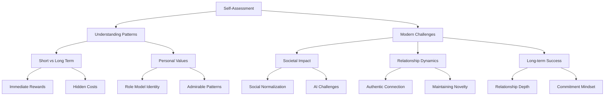
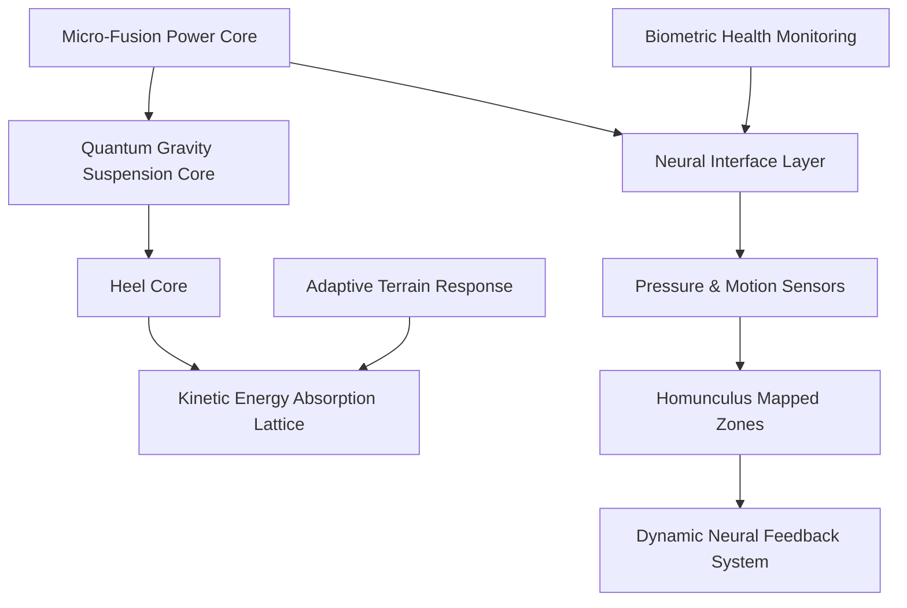

# Jordan B. Peterson Distilled Wisodm

# 1.

I'll help reformat this text into clear, complete sentences, removing timestamps and organizing the key points. I'll preserve the core ideas while making them more readable.

1. Write down everything you think a harmful habit might be doing to you, and don't worry about whether you're right or not - just make an exhaustive list.

2. After making your list, think through whether each effect is what you actually want, and write down what you want instead.

3. Any hedonistic endeavor is rewarding in the moment, but the real problem is the price you pay for it in the medium to long run.

4. To quit something that's gratifying in the short term, you need to know why you're quitting, otherwise you won't have the willpower to resist.

5. People often say "what the hell" to themselves when rationalizing harmful behaviors, and it's important to notice these self-rationalizations.

6. Ask yourself if your behaviors align with the sort of person you want to be and if they represent a model you'd want for your son.

7. Consider whether you're acting in a pattern that you would find admirable in others.

8. Pornography and masturbation don't fit into the ideal of heroic masculinity, as there's something furtive and second-rate about these behaviors.

9. These problematic behaviors tend to creep into society gradually, then rampage until young people can't remember a time without them.

10. The situation is likely to worsen with the development of AI-equipped adjustable pornographic content.

11. Currently, alienated young men can have better conversations with chatbots than with real people they've known.

12. Future AI services will offer fully developed two-dimensional simulations of women, which aren't real women but simulacra.

13. While these AI companions might give you everything you want, they're actually giving the worst part of you everything it wants.

14. One of the challenges in relationships is that pleasure is enhanced by novelty.

15. The question isn't whether you're restricted by your partner, but whether you're restricted by the limits of your own imagination.

16. In an optimized relationship with someone, they're inexhaustible, though novelty remains important as part of play.

17. Many people struggle not with actually being with the same person forever, but with the thought of it.

18. People often create a negative story about long-term relationships, imagining becoming unattractive, alienated, and living without romance or excitement.

# 2. Same with appropriate emojis.

"Can you do the outline again, just add grouping and clustering levels (3 total) and make sure each group is numbered independantly and add emojis appropriately around either side of context words representing main idea of concept in at least one word per sentence.  This assists memorization.  Show full markdown code listing.  Also add a mermaid graph with ```mermaid to start the block and ``` at the end each on their own unnumbered lines."

Breaking Harmful Habits: A Hierarchical Guide
A. Self-Assessment and Planning 🎯

Write down everything you think a harmful ⚠️ habit might be doing to you, creating an exhaustive list regardless of certainty.
Review your list to analyze what you want, then document what you want 🎯 goals instead.

B. Understanding Behavior Patterns 🧠
B1. Short-term vs Long-term

Every hedonistic endeavor provides immediate 🎯 rewards but carries hidden ⚖️ costs in the medium to long term.
Quitting short-term gratification requires understanding your deeper 💭 motivation.
Pay attention to self-rationalizations, especially the "what the hell" 🤔 mindset.

B2. Personal Values

Question if your behaviors align with the role model 🦸 identity you want to embody.
Evaluate if your actions represent patterns you'd find 🌟 admirable in others.
Consider how certain behaviors like pornography conflict with ideals of 💪 strength.

C. Modern Challenges and Solutions 🌐
C1. Societal Impact

Problematic behaviors slowly infiltrate 🕸️ society before becoming normalized.
Young people grow up in an environment where harmful 📱 digital content is ubiquitous.
Advancing technology, particularly AI, may create more sophisticated 🤖 temptations.

C2. Relationship Dynamics

AI services offer simulated connections that cater to our worst 👻 impulses.
The challenge of maintaining 💫 novelty in relationships requires creativity.
Successful relationships aren't limited by the partner but by our 🎭 imagination.

C3. Long-term Success

Truly optimized relationships contain 💎 inexhaustible depth.
Many struggle with the concept rather than the reality of 🔄 commitment.
Negative stories about long-term relationships often become self-fulfilling 🎬 prophecies.



# 3. Claude Cleanup

"outline should be markdown code listing as an artifact please."

# Breaking Harmful Habits: A Hierarchical Guide

## A. Self-Assessment and Planning 🎯
1. Write down everything you think a harmful ⚠️ habit might be doing to you, creating an exhaustive list regardless of certainty.
2. Review your list to analyze what you want, then document what you want 🎯 goals instead.

## B. Understanding Behavior Patterns 🧠
### B1. Short-term vs Long-term
1. Every hedonistic endeavor provides immediate 🎯 rewards but carries hidden ⚖️ costs in the medium to long term.
2. Quitting short-term gratification requires understanding your deeper 💭 motivation.
3. Pay attention to self-rationalizations, especially the "what the hell" 🤔 mindset.

### B2. Personal Values
1. Question if your behaviors align with the role model 🦸 identity you want to embody.
2. Evaluate if your actions represent patterns you'd find 🌟 admirable in others.
3. Consider how certain behaviors like pornography conflict with ideals of 💪 strength.

## C. Modern Challenges and Solutions 🌐
### C1. Societal Impact
1. Problematic behaviors slowly infiltrate 🕸️ society before becoming normalized.
2. Young people grow up in an environment where harmful 📱 digital content is ubiquitous.
3. Advancing technology, particularly AI, may create more sophisticated 🤖 temptations.

### C2. Relationship Dynamics
1. AI services offer simulated connections that cater to our worst 👻 impulses.
2. The challenge of maintaining 💫 novelty in relationships requires creativity.
3. Successful relationships aren't limited by the partner but by our 🎭 imagination.

### C3. Long-term Success
1. Truly optimized relationships contain 💎 inexhaustible depth.
2. Many struggle with the concept rather than the reality of 🔄 commitment.
3. Negative stories about long-term relationships often become self-fulfilling 🎬 prophecies.



