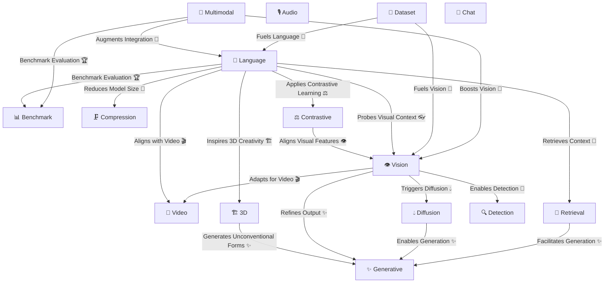
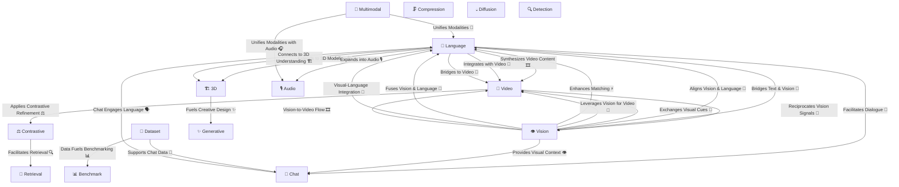
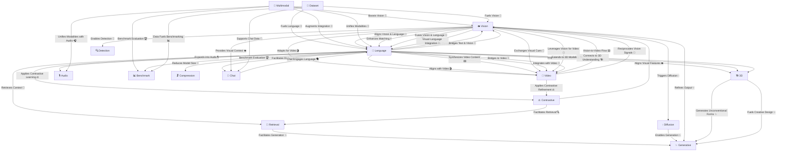
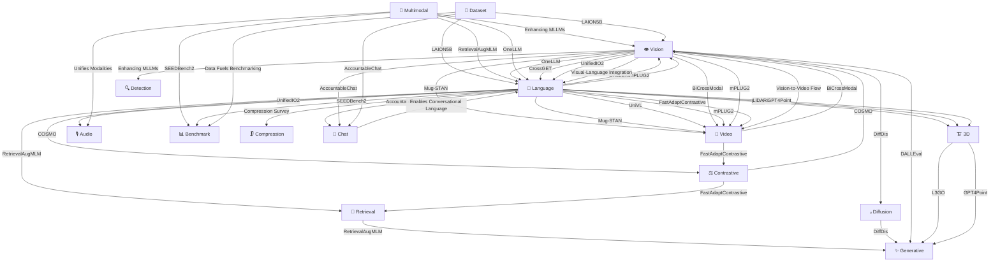
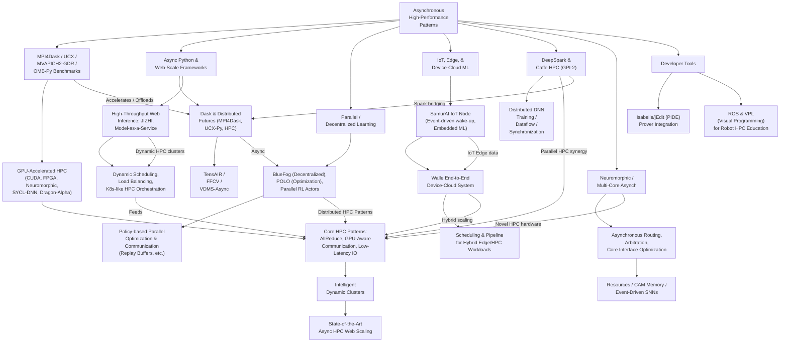

The graphs below represent my multi agent system created synopsis of what technology and skills are most in demand for ML in 2025.

# Python app.py v2

import streamlit as st

# Mermaid Diagram - Part 1 (P1-P10)
mermaid_diagram_part1 = '''




'''

# Mermaid Diagram - Part 2 (P11-P20 + Inherent Relationships)
mermaid_diagram_part2 = '''




'''

# Dense Markdown Outline with Glossary for Nodes and Relationships
markdown_outline = '''---
### Outline & Glossary

#### Nodes
- **🤖 Multimodal (MM):** Systems integrating various data types.
- **👁️ Vision (VI):** Visual processing and image data.
- **📝 Language (LA):** Text and linguistic data.
- **🎥 Video (VD):** Video content and processing.
- **🏗️ 3D (T3D):** Three-dimensional modeling.
- **🎙️ Audio (AU):** Audio and speech signals.
- **💾 Dataset (DS):** Data collections for training/evaluation.
- **📊 Benchmark (BM):** Performance evaluation standards.
- **🗜️ Compression (CO):** Techniques to reduce model size.
- **🔎 Retrieval (RE):** Methods to fetch and augment data.
- **💧 Diffusion (DI):** Diffusion-based generative processes.
- **⚖️ Contrastive (CT):** Methods for feature alignment via contrast.
- **✨ Generative (GE):** Models that create new content.
- **💬 Chat (CH):** Conversational/dialogue systems.
- **🔍 Detection (DT):** Systems for identifying features.

#### Relationships Glossary
- **🚀 Boosts Vision:** Enhances visual processing.
- **🔎 Enables Detection:** Activates detection capabilities.
- **🎬 Adapts/Aligns for Video:** Connects visuals and language to video.
- **🔋 Fuels Vision/Language:** Supplies essential input data.
- **🏆 Benchmark Evaluation:** Assesses performance via benchmarks.
- **🔽 Reduces Model Size:** Optimizes models through compression.
- **🔗 Augments/Bridges Integration:** Links different modalities.
- **📡 Retrieves Context:** Fetches additional relevant information.
- **✨ Facilitates Generation:** Supports creative output.
- **💧 Triggers Diffusion:** Initiates generative diffusion processes.
- **👓 Probes Visual Context:** Investigates visual cues.
- **⚖️ Applies Contrastive Learning/Refinement:** Aligns features via contrast.
- **🤝 Aligns/Unifies Modalities:** Integrates vision and language.
- **🎞️ Synthesizes/Flows Video Content:** Transforms data into video.
- **🔄 Exchanges/Bridges Visual Cues:** Establishes two-way visual interaction.
- **🎥 Integrates with Video:** Combines vision for video processing.
- **💬 Facilitates Dialogue:** Supports conversation systems.
- **🎙️ Expands into Audio:** Incorporates audio elements.
- **🏗️ Connects to 3D Understanding:** Relates to 3D modeling.
- **🎧 Unifies with Audio:** Merges audio with other modalities.
- **📊 Data Fuels Benchmarking:** Uses data to drive evaluations.
- **🗣️ Chat Engages Language:** Enables interactive communication.
''' 

st.title("Mermaid Diagrams & Dense Outline with Glossary")

st.header("Mermaid Diagram - Part 1 (P1-P10)")
st.code(mermaid_diagram_part1, language="mermaid", line_numbers=True)

st.header("Mermaid Diagram - Part 2 (P11-P20 + Inherent Relationships)")
st.code(mermaid_diagram_part2, language="mermaid", line_numbers=True)

st.header("Dense Markdown Outline & Glossary")
st.code(markdown_outline, language="markdown", line_numbers=True)


# Python app.py

import streamlit as st

mermaid_diagram = '''



'''

markdown_outline = '''---
### Markdown Outline & Glossary

#### Nodes

- **🤖 Multimodal (MM):**  
  Represents systems or models that integrate multiple modalities (e.g., vision, language, audio).

- **👁️ Vision (VI):**  
  Focuses on image or visual information processing.

- **📝 Language (LA):**  
  Pertains to text-based or linguistic data and processing.

- **🎥 Video (VD):**  
  Represents video data and related processing models.

- **🏗️ 3D (T3D):**  
  Denotes three-dimensional data processing and modeling.

- **🎙️ Audio (AU):**  
  Covers sound and speech-related processing.

- **💾 Dataset (DS):**  
  Represents large-scale datasets used for training and evaluation.

- **📊 Benchmark (BM):**  
  Used for evaluation metrics and performance benchmarks.

- **🗜️ Compression (CO):**  
  Refers to techniques that reduce model size or complexity.

- **🔎 Retrieval (RE):**  
  Denotes mechanisms for retrieving and augmenting information.

- **💧 Diffusion (DI):**  
  Represents diffusion models in generative modeling.

- **⚖️ Contrastive (CT):**  
  Pertains to contrastive learning methods for feature alignment.

- **✨ Generative (GE):**  
  Focuses on models that generate new content (text, images, etc.).

- **💬 Chat (CH):**  
  Represents conversational or dialogue-based systems.

- **🔍 Detection (DT):**  
  Involves models that detect or identify visual elements.

#### Edge Labels (Relationships)

- **Boosts Vision 🚀:**  
  Enhances the visual processing capability of multimodal systems.

- **Enables Detection 🔎:**  
  Facilitates the detection of visual details and features.

- **Adapts for Video 🎬:**  
  Modifies visual information for video understanding.

- **Aligns with Video 🎬:**  
  Integrates language with video content.

- **Fuels Vision 🔋:**  
  Provides essential data to enhance vision models.

- **Fuels Language 🔋:**  
  Supplies linguistic data for language models.

- **Benchmark Evaluation 🏆:**  
  Evaluates model performance against established benchmarks.

- **Reduces Model Size 🔽:**  
  Applies compression techniques to optimize text models.

- **Augments Integration 🔗:**  
  Strengthens the connection between modalities.

- **Retrieves Context 📡:**  
  Fetches relevant data to support model performance.

- **Facilitates Generation ✨:**  
  Enables models to generate new, creative outputs.

- **Triggers Diffusion 💧:**  
  Initiates the diffusion process in generative models.

- **Probes Visual Context 👓:**  
  Examines visual cues to improve model understanding.

- **Refines Output ✨:**  
  Enhances the quality of generated content.

- **Applies Contrastive Learning ⚖️:**  
  Uses contrastive methods to align and refine features.

- **Aligns Visual Features 👁️:**  
  Synchronizes visual cues for better integration with text.

- **Inspires 3D Creativity 🏗️:**  
  Drives innovative applications in 3D modeling.

- **Generates Unconventional Forms ✨:**  
  Produces novel designs and creative outputs in 3D.

- **Aligns Vision & Language 🤝:**  
  Integrates visual and textual data seamlessly.

- **Unifies Modalities 🤝:**  
  Combines different data modalities into a cohesive system.

- **Synthesizes Video Content 🎞️:**  
  Transforms language inputs into video outputs.

- **Exchanges Visual Cues 🔄:**  
  Enables two-way transfer between vision and video systems.

- **Reciprocates Vision Signals 🔄:**  
  Facilitates mutual exchange of visual information.

- **Bridges Text & Vision 🔗:**  
  Connects textual data with visual information.

- **Integrates with Video 🎥:**  
  Merges language and vision into video frameworks.

- **Leverages Vision for Video 🎥:**  
  Utilizes visual features to enhance video processing.

- **Enhances Matching ⚡:**  
  Improves the alignment between vision and language signals.

- **Facilitates Dialogue 💬:**  
  Enables effective conversational interactions in chat systems.

- **Provides Visual Context 👁️:**  
  Supplies essential visual data to support dialogue.

- **Supports Chat Data 💾:**  
  Uses datasets to underpin chat system performance.

- **Bridges to Video 🔄:**  
  Connects language directly to video processing pipelines.

- **Applies Contrastive Refinement ⚖️:**  
  Uses contrastive techniques to improve video features.

- **Facilitates Retrieval 🔍:**  
  Enhances the retrieval process to support model performance.

- **Extends to 3D Modeling 🏗️:**  
  Adapts language models for 3D data interpretation.

- **Fuses Vision & Language 🤝:**  
  Combines visual and textual information for unified processing.

- **Expands into Audio 🎙️:**  
  Incorporates audio data into multimodal models.

- **Connects to 3D Understanding 🏗️:**  
  Links language inputs to 3D modeling processes.

- **Fuels Creative Design ✨:**  
  Drives generative design and innovation in 3D outputs.

- **Visual-Language Integration 🔗:**  
  Inherently integrates visual and textual modalities.

- **Vision-to-Video Flow 🎞️:**  
  Ensures smooth translation of visual data into video.

- **Unifies Modalities with Audio 🎧:**  
  Integrates audio into the broader multimodal framework.

- **Data Fuels Benchmarking 📊:**  
  Leverages datasets to support evaluation and benchmarking.

- **Chat Engages Language 🗣️:**  
  Enhances conversational capabilities through language integration.
'''

st.title("Mermaid Diagram & Markdown Outline with Glossary")
st.code(mermaid_diagram, language="mermaid", line_numbers=True)
st.code(markdown_outline, language="markdown", line_numbers=True)


# Top Discoveries in ML - Mermaid Model of LLM Integration




This list is descending order frequency by volume of demand.

Below is a top 10 list for ML Learning - Topics deserving most study and research based on unique contributions of each organization contributing to 'state of art' evolution in ML.
Also if one organization is the center of activity for a given skill or technology advancement, I list the important URLs to learn more.


| Number | **Company & Focus** | **Company & Focus** |
|--------|-------------------|-------------------|
| Row 1 | **1. NVIDIA - ML Architecture** <br> ML originates with HPC and GPU/TPU/Hardware <br>  | **2. OpenAI - LLM Innovation** <br> Python, HPC, LLMs/Generative AI with Transformers <br>  |
| Row 2 | **3. Anthropic - Infrastructure** <br> Python, K8s (KEDA for HPC!), GPU/TPU/Hardware <br>  | **4. Hugging Face - ML Hub** <br> Python, ML, GPU/TPU/Hardware <br>  |

1. Python
2. High Performance Computing (HPC)
3. GPU/TPU/Hardware
4. ML/LLM/Transformers
5. Varies by org.  Nvidia & OpenAI: C++ & SQL. Anthropic: UI/React/JS.  Huggingface: Open Source Community.
6. Pytorch and Model Development.
7. Datasets, Databases and SQL.
8. Cloud platforms.  Top 3 in order for ML:  1. Azure, 2. AWS, 3. GCP
9. Linux/OS/MLOps.  Dockerfile to spin up replica instances.  Making it easy is SOTA.
10. 3D Computer Vision.

# Prompts to See SOTA Papers and Ideas in Code.

1. Python - Create a short python app.py and requirements.txt where requirements.txt has these libraries: streamlit, gradio, transformers, torch, andd huggingface_hub to create python library and wheel file package example to demonstrate a minimal ML model build using Python - https://pypi.org/).
2. HPC (High Performance Computing or Compute) - Create a python app.py, requirements.txt, gradio UI, and Dockerfile to deploy to azure container apps environment and configure KEDA to autoscale up  to 10 on web waits, and down to zero when not used for fifteen minutes.  Discuss patterns for coordinated load across replicas, Docker to Azure ACAE KEDA replicas using a azure container registry is most scalable pattern).  Create code to add the azure resources required.
3. GPU/TPU/Hardware (Get a GPU or use HF Zero, learn CUDA.  https://developer.nvidia.com/, https://huggingface.co/GPUModelSpotlight) demonstrate in python app.py, gradio UI and requirements.txt detection and display of CUDA properties to ddetect devicce or hardware capabilities using python and then demonstrate the performance differencce in python to do an automated benchmark visually for your GPU.
4. ML/LLM/Transformers (Huggingface python library Transformers is used by everyone and the cornerstone of LLMs/GAI - https://huggingface.co/docs/transformers/en/index), Create several app.py functions and a gradio UI for testing the main functions in the transformers library.
5. When you put together roles in an organization simulated as agents, you would want to generate code of three varieties: 1. Python for wrapping C++ cuda library functions, 2. SQL and JSON queries for NOSQL demonstrating KM by database using azure cosmosdb as an example.  3. Open source model building which includes the MIT license or Apache license and show differences and instrucctions for building python wheel files to distribute libraries but not code.  Also demonstrate the huggingface_hub library functions.  Use gradio as UI library and show app.py and requirements.txt. For position 5 demand varies dramatically by org.  This one I subdivide to explain differences between organizations.
  1. Nvidia and OpenAI both have languages C++, and SQL.  These are frontrunners still due to HPC patterns for massive datasets and compute jobs.
  2. Anthropic next favors the React/Javascript/JS pattern and Artifacts and Computer Use in Claude set the SOTA.  This pattern can also be used direct from python libraries surprisingly (streamlit has good support for reactive componentns)
  3. Huggingface favors Open Source contribution and Community Engagement.  They are setting hardware independent patterns and have the worlds largest model and dataset hub with huggingface spaces.
6. Pytorch and Model Development.  Two main python libraries are at the heart of ML:  Torch and Tensorflow.  All four orgs favor Pytorch.  Write a demo program app.py for comparison of each in a single streamlit app.py and requirements.txt using streamlit or gradio for the UI and model interactions.
7. Datasets, Databases and SQL - ML starts with datasets.  ML models are direct descendants of datasets chosen and ML won't know what isn't in input datasets.  Show building a small model from an uploaded dataset and show user what input should look like as a template.  Then create interactive app.py and requirements.txt using gradio or streamlit UI to generate a short dataset, and use it to create a model.  Show concepts of distillation techniques in the build.
8. Cloud platforms.  Each have advantages, disadvantages and cost differences.  Top 3 in order for ML:  1. Azure, 2. AWS, 3. GCP  Write a short code demonstration on how to interact with python libraries from each and list all python libraries associated with the cloud type.
9. Linux/OS/MLOps.  State of art is to use Dockerfile to spin up replica instances.  Making it easy is SOTA.  Huggingface open source and platform are easiest and cheapest at scale for Global audience.  Replicate is #2.
10. 3D Computer Vision.  This one only Hugginface and NVIDIA have an edge with.  DeepRL patterns (Unity, OpenAI's gym, Nvidia's Magic3D and Omniverse blaze the trail.  Create an app.py and requirements.txt that uses torch and transformers to take a png image file as input and output a 3d model of an extrude done on pixel brightness.  Also if the pixel color is black, weld the model with a flat plane so black is transparent.  Output as glb or obj download and use gradio or stremamlit UI.


# Move 37

I had a move 37 moment with o3-mini-high since it was able to figure out a cross platform async issue in python for HPC scaling patterns.

Here is the move (in python code):
# Patch the asyncio event loop to allow nested use of asyncio.run()
import nest_asyncio
nest_asyncio.apply()

Below is followup session to study the mermaid based knowledge trees combined for main idea synthesis and breeding of children trees.




```python
Explanation of the Integrated Model
Center (A):

“Asynchronous High-Performance Patterns” is the conceptual “root” capturing the overall idea of asynchronous concurrency and scalability across HPC and web frameworks.
MPI, UCX, GPU (B, C, D):

Collects all the MPI-based efforts:
MPI4Dask, UCX, MVAPICH2-GDR, and OMB-Py (microbenchmarks).
GPU acceleration (NVIDIA CUDA, FPGA integration, Neuromorphic chips, Dragon-Alpha for Java, SYCL-DNN for OpenCL/SYCL) is shown as a hardware backbone for HPC training.
Core HPC patterns like AllReduce and GPU-aware communication anchor the HPC cluster design.
Python and Dataflow (E, F, G):

Highlights async Python (using async/await) and web-scale concurrency.
Dask with various backends (UCX-Py, MPI4Dask) for big data tasks.
TensAIR, FFCV, and VDMS-Async represent specialized dataflow or I/O acceleration frameworks.
Web-Scale Inference (H, I):

Systems like JIZHI (Baidu) target large-scale real-time inference with dynamic scheduling, high throughput, and HPC-like orchestration (container-based or K8s-like scaling in the cloud).
Parallel + Decentralized Learning (J, K, L):

BlueFog for decentralized communication, POLO for policy-based optimization, and parallel actor–learner RL frameworks show how distributed HPC can accelerate advanced ML/RL tasks.
IoT & Device-Cloud ML (M, N, O, P):

SamurAI represents a low-power, event-driven IoT node with embedded ML.
Walle is an end-to-end system bridging device-to-cloud synergy.
Emphasizes the HPC pipeline for hybrid edge + HPC workloads.
DeepSpark & Caffe HPC (Q, R):

Reflects Spark-based (DeepSpark) distributed deep learning and Caffe HPC expansions (GPI-2).
Showcases how classical HPC synchronization (like fine-grained GPI-2) merges with big data ecosystems.
Neuromorphic HPC (S, T, U):

Focus on asynchronous routing in multi-core neuromorphic designs, specialized arbitration, and SNN hardware.
Developer Tools (V, W, X):

Isabelle/jEdit integrative proving environment (PIDE).
ROS & VPL for visual programming in robotics HPC education.
Overall Convergence (Y, Z):

The final synergy forms “Intelligent Dynamic Clusters” capable of state-of-the-art asynchronous HPC and web-scale scaling, bridging everything from device-level IoT to large HPC clusters to formal verification and programming tools.
Key Takeaways
Asynchronicity is central: leveraging Python’s async/await or equivalents in web-scale microservices and HPC frameworks.
High-performance compute merges with data-driven ML and edge/IoT systems.
Scalability hinges on specialized hardware (GPU, FPGA, neuromorphic) plus advanced communication libraries (MPI4Dask, UCX, GPI-2, etc.).
The ecosystem is multi-faceted, from low-level HPC benchmarks (OMB-Py) to large-scale orchestration (JIZHI, Walle) to decentralized or parallel RL (BlueFog, POLO, actor–learner).
In practice, intelligent dynamic clusters will:

Scale across heterogeneous hardware (GPUs, neuromorphic, FPGA, edge devices).
Use asynchronous communication patterns to maximize concurrency.
Integrate optimized HPC frameworks (MPI, UCX) for low-latency GPU-to-GPU or node-to-node data transfer.
Merge with web-scale or IoT orchestration methods to handle real-time, device-to-cloud traffic.
This consolidated model thus demonstrates a unified state-of-the-art approach to building asynchronous HPC + web clusters for modern machine intelligence workloads.
```


Create a mermaid model from the consolidated 20 mermaid models below.  Integrate them to explain state of the art in asynchronous high performance scaling patterns in async python code mixed with web async code for creating intelligent dynamic clusters based on HPC patterns.  Here are Paper mermaid trees:  Detailed Research Paper Summary
📄 Efficient MPI-based Communication for GPU-Accelerated Dask Applications
Authors: Aamir Shafi, Jahanzeb Maqbool Hashmi, Hari Subramoni and Dhabaleswar K. Panda
Date: ### 21 Jan 2021
Word Count (Title): 7 | Word Count (Summary): 277

Links: Abstract) | PDF.pdf)

High Info Terms: mpi4dask, dask, communication, ucx, applications, is, which, two, using, gpus, by, 1, 2, respectively, workers
ROUGE Score: 5.42%

🎤 TTF Read Aloud
Title: Efficient MPI-based Communication for GPU-Accelerated Dask Applications
Key Terms: mpi4dask, dask, communication, ucx, applications, is, which, two, using, gpus, by, 1, 2, respectively, workers
ROUGE: 5.42%
Mermaid Graph of Key Concepts
flowchart TD
    T1["mpi4dask"] --> T2["dask"]
    T2["dask"] --> T3["communication"]
    T3["communication"] --> T4["ucx"]
    T4["ucx"] --> T5["applications"]
    T5["applications"] --> T6["is"]
    T6["is"] --> T7["which"]
    T7["which"] --> T8["two"]
    T8["two"] --> T9["using"]
    T9["using"] --> T10["gpus"]
    T10["gpus"] --> T11["by"]
    T11["by"] --> T12["1"]
    T12["1"] --> T13["2"]
    T13["2"] --> T14["respectively"]
    T14["respectively"] --> T15["workers"]

📄 Dragon-Alpha&cu32: A Java-based Tensor Computing Framework With its High-Performance CUDA Library
Authors: Zhiyi Zhang, Pengfei Zhang, Qi Wang
Date: ### 15 May 2023
Word Count (Title): 11 | Word Count (Summary): 157

Links: Abstract) | PDF.pdf)

High Info Terms: dragon-alpha, its, java, has, apis, is, deep, learning, field, compared, java-based, pytorch, easy-to-use, ecosystem, s
ROUGE Score: 9.55%

🎤 TTF Read Aloud
Title: Dragon-Alpha&cu32: A Java-based Tensor Computing Framework With its High-Performance CUDA Library
Key Terms: dragon-alpha, its, java, has, apis, is, deep, learning, field, compared, java-based, pytorch, easy-to-use, ecosystem, s
ROUGE: 9.55%
Mermaid Graph of Key Concepts
flowchart TD
    T1["dragon-alpha"] --> T2["its"]
    T2["its"] --> T3["java"]
    T3["java"] --> T4["has"]
    T4["has"] --> T5["apis"]
    T5["apis"] --> T6["is"]
    T6["is"] --> T7["deep"]
    T7["deep"] --> T8["learning"]
    T8["learning"] --> T9["field"]
    T9["field"] --> T10["compared"]
    T10["compared"] --> T11["java-based"]
    T11["java-based"] --> T12["pytorch"]
    T12["pytorch"] --> T13["easy-to-use"]
    T13["easy-to-use"] --> T14["ecosystem"]
    T14["ecosystem"] --> T15["s"]

📄 Using GPI-2 for Distributed Memory Paralleliziation of the Caffe Toolbox to Speed up Deep Neural Network Training
Authors: Martin Kuehn, Janis Keuper and Franz-Josef Pfreundt
Date: ### 18 Aug 2017
Word Count (Title): 17 | Word Count (Summary): 220

Links: Abstract) | PDF.pdf)

High Info Terms: is, we, caffe, communication, these, standard, dnn, training, cost, toolbox, fine, synchronization, patterns, global, interface
ROUGE Score: 6.82%

🎤 TTF Read Aloud
Title: Using GPI-2 for Distributed Memory Paralleliziation of the Caffe Toolbox to Speed up Deep Neural Network Training
Key Terms: is, we, caffe, communication, these, standard, dnn, training, cost, toolbox, fine, synchronization, patterns, global, interface
ROUGE: 6.82%
Mermaid Graph of Key Concepts
flowchart TD
    T1["is"] --> T2["we"]
    T2["we"] --> T3["caffe"]
    T3["caffe"] --> T4["communication"]
    T4["communication"] --> T5["these"]
    T5["these"] --> T6["standard"]
    T6["standard"] --> T7["dnn"]
    T7["dnn"] --> T8["training"]
    T8["training"] --> T9["cost"]
    T9["cost"] --> T10["toolbox"]
    T10["toolbox"] --> T11["fine"]
    T11["fine"] --> T12["synchronization"]
    T12["synchronization"] --> T13["patterns"]
    T13["patterns"] --> T14["global"]
    T14["global"] --> T15["interface"]

📄 POLO: a POLicy-based Optimization library
Authors: Arda Aytekin and Martin Biel and Mikael Johansson
Date: ### 08 Oct 2018
Word Count (Title): 5 | Word Count (Summary): 156

Links: Abstract) | PDF.pdf)

High Info Terms: polo, we, parallel, code, optimization, algorithm, it, algorithms, policies, computing, architectures, users, from, distributed-memory, parallel optimization
ROUGE Score: 9.62%

🎤 TTF Read Aloud
Title: POLO: a POLicy-based Optimization library
Key Terms: polo, we, parallel, code, optimization, algorithm, it, algorithms, policies, computing, architectures, users, from, distributed-memory, parallel optimization
ROUGE: 9.62%
Mermaid Graph of Key Concepts
flowchart TD
    T1["polo"] --> T2["we"]
    T2["we"] --> T3["parallel"]
    T3["parallel"] --> T4["code"]
    T4["code"] --> T5["optimization"]
    T5["optimization"] --> T6["algorithm"]
    T6["algorithm"] --> T7["it"]
    T7["it"] --> T8["algorithms"]
    T8["algorithms"] --> T9["policies"]
    T9["policies"] --> T10["computing"]
    T10["computing"] --> T11["architectures"]
    T11["architectures"] --> T12["users"]
    T12["users"] --> T13["from"]
    T13["from"] --> T14["distributed-memory"]
    T14["distributed-memory"] --> T15["parallel optimization"]

📄 BlueFog: Make Decentralized Algorithms Practical for Optimization and Deep Learning
Authors: Bicheng Ying, Kun Yuan, Hanbin Hu, Yiming Chen, Wotao Yin
Date: ### 08 Nov 2021
Word Count (Title): 10 | Word Count (Summary): 202

Links: Abstract) | PDF.pdf)

High Info Terms: decentralized, algorithms, bluefog, decentralized algorithms, tasks, distributed, deep, learning, those, using, operations, deep learning, those using, is, that
ROUGE Score: 7.43%

🎤 TTF Read Aloud
Title: BlueFog: Make Decentralized Algorithms Practical for Optimization and Deep Learning
Key Terms: decentralized, algorithms, bluefog, decentralized algorithms, tasks, distributed, deep, learning, those, using, operations, deep learning, those using, is, that
ROUGE: 7.43%
Mermaid Graph of Key Concepts
flowchart TD
    T1["decentralized"] --> T2["algorithms"]
    T2["algorithms"] --> T3["bluefog"]
    T3["bluefog"] --> T4["decentralized algorithms"]
    T4["decentralized algorithms"] --> T5["tasks"]
    T5["tasks"] --> T6["distributed"]
    T6["distributed"] --> T7["deep"]
    T7["deep"] --> T8["learning"]
    T8["learning"] --> T9["those"]
    T9["those"] --> T10["using"]
    T10["using"] --> T11["operations"]
    T11["operations"] --> T12["deep learning"]
    T12["deep learning"] --> T13["those using"]
    T13["those using"] --> T14["is"]
    T14["is"] --> T15["that"]

📄 SamurAI: A Versatile IoT Node With Event-Driven Wake-Up and Embedded ML Acceleration
Authors: Ivan Miro-Panades (LSTA), Benoit Tain (LECA), Jean-Frederic Christmann (LFIM), David Coriat (LIIM), Romain Lemaire (LIIM), Clement Jany, Baudouin Martineau (DSYS), Fabrice Chaix (DSYS), Guillaume Waltener (DSYS), Emmanuel Pluchart (LSTA), Jean-Philippe Noel (LFIM), Adam Makosiej, Maxime Montoya, Simone Bacles-Min (LIIM), David Briand (LIAE), Jean-Marc Philippe, Yvain Thonnart (LFIM), Alexandre Valentian (LSTA), Frederic Heitzmann (DSYS), Fabien Clermidy (DSCIN)
Date: ### 11 Apr 2023
Word Count (Title): 12 | Word Count (Summary): 201

Links: Abstract) | PDF.pdf)

High Info Terms: iot, processing, node, power, this, applications, is, data, thus, iot node, capabilities, such, as, are, while
ROUGE Score: 7.46%

🎤 TTF Read Aloud
Title: SamurAI: A Versatile IoT Node With Event-Driven Wake-Up and Embedded ML Acceleration
Key Terms: iot, processing, node, power, this, applications, is, data, thus, iot node, capabilities, such, as, are, while
ROUGE: 7.46%
Mermaid Graph of Key Concepts
flowchart TD
    T1["iot"] --> T2["processing"]
    T2["processing"] --> T3["node"]
    T3["node"] --> T4["power"]
    T4["power"] --> T5["this"]
    T5["this"] --> T6["applications"]
    T6["applications"] --> T7["is"]
    T7["is"] --> T8["data"]
    T8["data"] --> T9["thus"]
    T9["thus"] --> T10["iot node"]
    T10["iot node"] --> T11["capabilities"]
    T11["capabilities"] --> T12["such"]
    T12["such"] --> T13["as"]
    T13["as"] --> T14["are"]
    T14["are"] --> T15["while"]

📄 JIZHI: A Fast and Cost-Effective Model-As-A-Service System for Web-Scale Online Inference at Baidu
Authors: Hao Liu, Qian Gao, Jiang Li, Xiaochao Liao, Hao Xiong, Guangxing Chen, Wenlin Wang, Guobao Yang, Zhiwei Zha, Daxiang Dong, Dejing Dou, Haoyi Xiong
Date: ### 03 Jun 2021
Word Count (Title): 13 | Word Count (Summary): 272

Links: Abstract) | PDF.pdf)

High Info Terms: inference, jizhi, deep, online, real-time, traffics, from, more, over, by, resource, have, models, system, requests
ROUGE Score: 5.51%

🎤 TTF Read Aloud
Title: JIZHI: A Fast and Cost-Effective Model-As-A-Service System for Web-Scale Online Inference at Baidu
Key Terms: inference, jizhi, deep, online, real-time, traffics, from, more, over, by, resource, have, models, system, requests
ROUGE: 5.51%
Mermaid Graph of Key Concepts
flowchart TD
    T1["inference"] --> T2["jizhi"]
    T2["jizhi"] --> T3["deep"]
    T3["deep"] --> T4["online"]
    T4["online"] --> T5["real-time"]
    T5["real-time"] --> T6["traffics"]
    T6["traffics"] --> T7["from"]
    T7["from"] --> T8["more"]
    T8["more"] --> T9["over"]
    T9["over"] --> T10["by"]
    T10["by"] --> T11["resource"]
    T11["resource"] --> T12["have"]
    T12["have"] --> T13["models"]
    T13["models"] --> T14["system"]
    T14["system"] --> T15["requests"]

📄 TensAIR: Online Learning from Data Streams via Asynchronous Iterative Routing
Authors: Mauro Dalle Lucca Tosi, Vinu E. Venugopal, Martin Theobald
Date: ### 18 Nov 2022
Word Count (Title): 10 | Word Count (Summary): 278

Links: Abstract) | PDF.pdf)

High Info Terms: we, which, tensair, model, data, as, ol, from, extensions, these, dataflow, by, demonstrate, learning, streams
ROUGE Score: 5.4%

🎤 TTF Read Aloud
Title: TensAIR: Online Learning from Data Streams via Asynchronous Iterative Routing
Key Terms: we, which, tensair, model, data, as, ol, from, extensions, these, dataflow, by, demonstrate, learning, streams
ROUGE: 5.4%
Mermaid Graph of Key Concepts
flowchart TD
    T1["we"] --> T2["which"]
    T2["which"] --> T3["tensair"]
    T3["tensair"] --> T4["model"]
    T4["model"] --> T5["data"]
    T5["data"] --> T6["as"]
    T6["as"] --> T7["ol"]
    T7["ol"] --> T8["from"]
    T8["from"] --> T9["extensions"]
    T9["extensions"] --> T10["these"]
    T10["these"] --> T11["dataflow"]
    T11["dataflow"] --> T12["by"]
    T12["by"] --> T13["demonstrate"]
    T13["demonstrate"] --> T14["learning"]
    T14["learning"] --> T15["streams"]

📄 Towards a Flexible Scale-out Framework for Efficient Visual Data Query Processing
Authors: Rohit Verma, Arun Raghunath
Date: ### 05 Feb 2024
Word Count (Title): 11 | Word Count (Summary): 215

Links: Abstract) | PDF.pdf)

High Info Terms: operations, query, time, vdms-async, remote, visual, data, management, systems, that, such, architecture, execution, visual data, data management
ROUGE Score: 6.98%

🎤 TTF Read Aloud
Title: Towards a Flexible Scale-out Framework for Efficient Visual Data Query Processing
Key Terms: operations, query, time, vdms-async, remote, visual, data, management, systems, that, such, architecture, execution, visual data, data management
ROUGE: 6.98%
Mermaid Graph of Key Concepts
flowchart TD
    T1["operations"] --> T2["query"]
    T2["query"] --> T3["time"]
    T3["time"] --> T4["vdms-async"]
    T4["vdms-async"] --> T5["remote"]
    T5["remote"] --> T6["visual"]
    T6["visual"] --> T7["data"]
    T7["data"] --> T8["management"]
    T8["management"] --> T9["systems"]
    T9["systems"] --> T10["that"]
    T10["that"] --> T11["such"]
    T11["such"] --> T12["architecture"]
    T12["architecture"] --> T13["execution"]
    T13["execution"] --> T14["visual data"]
    T14["visual data"] --> T15["data management"]

📄 FPGA Implementation of Convolutional Neural Network for Real-Time Handwriting Recognition
Authors: Shichen Qiao, Haining Qiu, Lingkai Zhao, Qikun Liu, Eric J. Hoffman
Date: ### 26 Jun 2023
Word Count (Title): 10 | Word Count (Summary): 250

Links: Abstract) | PDF.pdf)

High Info Terms: ml, we, our, were, design, computer, hardware, software, architectures, this, project, designed, letters, digits, fpga
ROUGE Score: 6.0%

🎤 TTF Read Aloud
Title: FPGA Implementation of Convolutional Neural Network for Real-Time Handwriting Recognition
Key Terms: ml, we, our, were, design, computer, hardware, software, architectures, this, project, designed, letters, digits, fpga
ROUGE: 6.0%
Mermaid Graph of Key Concepts
flowchart TD
    T1["ml"] --> T2["we"]
    T2["we"] --> T3["our"]
    T3["our"] --> T4["were"]
    T4["were"] --> T5["design"]
    T5["design"] --> T6["computer"]
    T6["computer"] --> T7["hardware"]
    T7["hardware"] --> T8["software"]
    T8["software"] --> T9["architectures"]
    T9["architectures"] --> T10["this"]
    T10["this"] --> T11["project"]
    T11["project"] --> T12["designed"]
    T12["designed"] --> T13["letters"]
    T13["letters"] --> T14["digits"]
    T14["digits"] --> T15["fpga"]

📄 OMB-Py: Python Micro-Benchmarks for Evaluating Performance of MPI Libraries on HPC Systems
Authors: Nawras Alnaasan, Arpan Jain, Aamir Shafi, Hari Subramoni, and Dhabaleswar K Panda
Date: ### 24 Aug 2022
Word Count (Title): 12 | Word Count (Summary): 235

Links: Abstract) | PDF.pdf)

High Info Terms: python, is, communication, applications, that, performance, hpc, parallel, omb-py, interface, by, mpi, libraries, mpi4py, benchmark
ROUGE Score: 6.38%

🎤 TTF Read Aloud
Title: OMB-Py: Python Micro-Benchmarks for Evaluating Performance of MPI Libraries on HPC Systems
Key Terms: python, is, communication, applications, that, performance, hpc, parallel, omb-py, interface, by, mpi, libraries, mpi4py, benchmark
ROUGE: 6.38%
Mermaid Graph of Key Concepts
flowchart TD
    T1["python"] --> T2["is"]
    T2["is"] --> T3["communication"]
    T3["communication"] --> T4["applications"]
    T4["applications"] --> T5["that"]
    T5["that"] --> T6["performance"]
    T6["performance"] --> T7["hpc"]
    T7["hpc"] --> T8["parallel"]
    T8["parallel"] --> T9["omb-py"]
    T9["omb-py"] --> T10["interface"]
    T10["interface"] --> T11["by"]
    T11["by"] --> T12["mpi"]
    T12["mpi"] --> T13["libraries"]
    T13["libraries"] --> T14["mpi4py"]
    T14["mpi4py"] --> T15["benchmark"]

📄 Isabelle/jEdit --- a Prover IDE within the PIDE framework
Authors: Makarius Wenzel
Date: ### 14 Jul 2012
Word Count (Title): 9 | Word Count (Summary): 231

Links: Abstract) | PDF.pdf)

High Info Terms: prover, is, isabelle, jedit, as, text, pide, interaction, based, that, from, based on, on the, the prover, framework
ROUGE Score: 6.49%

🎤 TTF Read Aloud
Title: Isabelle/jEdit --- a Prover IDE within the PIDE framework
Key Terms: prover, is, isabelle, jedit, as, text, pide, interaction, based, that, from, based on, on the, the prover, framework
ROUGE: 6.49%
Mermaid Graph of Key Concepts
flowchart TD
    T1["prover"] --> T2["is"]
    T2["is"] --> T3["isabelle"]
    T3["isabelle"] --> T4["jedit"]
    T4["jedit"] --> T5["as"]
    T5["as"] --> T6["text"]
    T6["text"] --> T7["pide"]
    T7["pide"] --> T8["interaction"]
    T8["interaction"] --> T9["based"]
    T9["based"] --> T10["that"]
    T10["that"] --> T11["from"]
    T11["from"] --> T12["based on"]
    T12["based on"] --> T13["on the"]
    T13["on the"] --> T14["the prover"]
    T14["the prover"] --> T15["framework"]

📄 Walle: An End-to-End, General-Purpose, and Large-Scale Production System for Device-Cloud Collaborative Machine Learning
Authors: Chengfei Lv, Chaoyue Niu, Renjie Gu, Xiaotang Jiang, Zhaode Wang, Bin Liu, Ziqi Wu, Qiulin Yao, Congyu Huang, Panos Huang, Tao Huang, Hui Shu, Jinde Song, Bin Zou, Peng Lan, Guohuan Xu, Fei Wu, Shaojie Tang, Fan Wu, Guihai Chen
Date: ### 30 May 2022
Word Count (Title): 13 | Word Count (Summary): 238

Links: Abstract) | PDF.pdf)

High Info Terms: ml, walle, data, mnn, deployment, tasks, task, compute, execution, processing, ml tasks, machine, we, platform, pipeline
ROUGE Score: 6.3%

🎤 TTF Read Aloud
Title: Walle: An End-to-End, General-Purpose, and Large-Scale Production System for Device-Cloud Collaborative Machine Learning
Key Terms: ml, walle, data, mnn, deployment, tasks, task, compute, execution, processing, ml tasks, machine, we, platform, pipeline
ROUGE: 6.3%
Mermaid Graph of Key Concepts
flowchart TD
    T1["ml"] --> T2["walle"]
    T2["walle"] --> T3["data"]
    T3["data"] --> T4["mnn"]
    T4["mnn"] --> T5["deployment"]
    T5["deployment"] --> T6["tasks"]
    T6["tasks"] --> T7["task"]
    T7["task"] --> T8["compute"]
    T8["compute"] --> T9["execution"]
    T9["execution"] --> T10["processing"]
    T10["processing"] --> T11["ml tasks"]
    T11["ml tasks"] --> T12["machine"]
    T12["machine"] --> T13["we"]
    T13["we"] --> T14["platform"]
    T14["platform"] --> T15["pipeline"]

📄 Parallel Actors and Learners: A Framework for Generating Scalable RL Implementations
Authors: Chi Zhang, Sanmukh Rao Kuppannagari, Viktor K Prasanna
Date: ### 22 Dec 2021
Word Count (Title): 11 | Word Count (Summary): 215

Links: Abstract) | PDF.pdf)

High Info Terms: we, data, learning, rl, framework, reinforcement, propose, replay, buffer, algorithms, parallel, our, reinforcement learning, we propose, replay buffer
ROUGE Score: 6.98%

🎤 TTF Read Aloud
Title: Parallel Actors and Learners: A Framework for Generating Scalable RL Implementations
Key Terms: we, data, learning, rl, framework, reinforcement, propose, replay, buffer, algorithms, parallel, our, reinforcement learning, we propose, replay buffer
ROUGE: 6.98%
Mermaid Graph of Key Concepts
flowchart TD
    T1["we"] --> T2["data"]
    T2["data"] --> T3["learning"]
    T3["learning"] --> T4["rl"]
    T4["rl"] --> T5["framework"]
    T5["framework"] --> T6["reinforcement"]
    T6["reinforcement"] --> T7["propose"]
    T7["propose"] --> T8["replay"]
    T8["replay"] --> T9["buffer"]
    T9["buffer"] --> T10["algorithms"]
    T10["algorithms"] --> T11["parallel"]
    T11["parallel"] --> T12["our"]
    T12["our"] --> T13["reinforcement learning"]
    T13["reinforcement learning"] --> T14["we propose"]
    T14["we propose"] --> T15["replay buffer"]

📄 ROS Based Visual Programming Tool for Mobile Robot Education and Applications
Authors: Mustafa Karaca and Ugur Yayan
Date: ### 27 Nov 2020
Word Count (Title): 11 | Word Count (Summary): 179

Links: Abstract) | PDF.pdf)

High Info Terms: ros, vpls, coding, vpl, is, system, provides, visual, programming, provide, programmers, used, some, syntax, errors
ROUGE Score: 8.38%

🎤 TTF Read Aloud
Title: ROS Based Visual Programming Tool for Mobile Robot Education and Applications
Key Terms: ros, vpls, coding, vpl, is, system, provides, visual, programming, provide, programmers, used, some, syntax, errors
ROUGE: 8.38%
Mermaid Graph of Key Concepts
flowchart TD
    T1["ros"] --> T2["vpls"]
    T2["vpls"] --> T3["coding"]
    T3["coding"] --> T4["vpl"]
    T4["vpl"] --> T5["is"]
    T5["is"] --> T6["system"]
    T6["system"] --> T7["provides"]
    T7["provides"] --> T8["visual"]
    T8["visual"] --> T9["programming"]
    T9["programming"] --> T10["provide"]
    T10["provide"] --> T11["programmers"]
    T11["programmers"] --> T12["used"]
    T12["used"] --> T13["some"]
    T13["some"] --> T14["syntax"]
    T14["syntax"] --> T15["errors"]

📄 DeepSpark: A Spark-Based Distributed Deep Learning Framework for Commodity Clusters
Authors: Hanjoo Kim, Jaehong Park, Jaehee Jang, and Sungroh Yoon
Date: ### 01 Oct 2016
Word Count (Title): 10 | Word Count (Summary): 122

Links: Abstract) | PDF.pdf)

High Info Terms: deepspark, spark, deep, data, processing, parameters, training, distributed, this, parallel, is, and parameters, increasing, complexity, neural
ROUGE Score: 12.3%

🎤 TTF Read Aloud
Title: DeepSpark: A Spark-Based Distributed Deep Learning Framework for Commodity Clusters
Key Terms: deepspark, spark, deep, data, processing, parameters, training, distributed, this, parallel, is, and parameters, increasing, complexity, neural
ROUGE: 12.3%
Mermaid Graph of Key Concepts
flowchart TD
    T1["deepspark"] --> T2["spark"]
    T2["spark"] --> T3["deep"]
    T3["deep"] --> T4["data"]
    T4["data"] --> T5["processing"]
    T5["processing"] --> T6["parameters"]
    T6["parameters"] --> T7["training"]
    T7["training"] --> T8["distributed"]
    T8["distributed"] --> T9["this"]
    T9["this"] --> T10["parallel"]
    T10["parallel"] --> T11["is"]
    T11["is"] --> T12["and parameters"]
    T12["and parameters"] --> T13["increasing"]
    T13["increasing"] --> T14["complexity"]
    T14["complexity"] --> T15["neural"]

📄 Accelerated Neural Networks on OpenCL Devices Using SYCL-DNN
Authors: Rod Burns, John Lawson, Duncan McBain and Daniel Soutar
Date: ### 08 Apr 2019
Word Count (Title): 8 | Word Count (Summary): 283

Links: Abstract) | PDF.pdf)

High Info Terms: hardware, such, as, opencl, neural, available, s, s opencl, opencl for, range, are, routines, sycl-dnn, range of, such as
ROUGE Score: 5.3%

🎤 TTF Read Aloud
Title: Accelerated Neural Networks on OpenCL Devices Using SYCL-DNN
Key Terms: hardware, such, as, opencl, neural, available, s, s opencl, opencl for, range, are, routines, sycl-dnn, range of, such as
ROUGE: 5.3%
Mermaid Graph of Key Concepts
flowchart TD
    T1["hardware"] --> T2["such"]
    T2["such"] --> T3["as"]
    T3["as"] --> T4["opencl"]
    T4["opencl"] --> T5["neural"]
    T5["neural"] --> T6["available"]
    T6["available"] --> T7["s"]
    T7["s"] --> T8["s opencl"]
    T8["s opencl"] --> T9["opencl for"]
    T9["opencl for"] --> T10["range"]
    T10["range"] --> T11["are"]
    T11["are"] --> T12["routines"]
    T12["routines"] --> T13["sycl-dnn"]
    T13["sycl-dnn"] --> T14["range of"]
    T14["range of"] --> T15["such as"]

📄 A Novel Co-design Peta-scale Heterogeneous Cluster for Deep Learning Training
Authors: Xin Chen and Hua Zhou and Yuxiang Gao and Yu Zhu
Date: ### 18 May 2018
Word Count (Title): 10 | Word Count (Summary): 234

Links: Abstract) | PDF.pdf)

High Info Terms: is, distributed, that, we, manoa, mimatrix, it, system, computational, capacity, server, allreduce, computational capacity, deep, computing
ROUGE Score: 6.41%

🎤 TTF Read Aloud
Title: A Novel Co-design Peta-scale Heterogeneous Cluster for Deep Learning Training
Key Terms: is, distributed, that, we, manoa, mimatrix, it, system, computational, capacity, server, allreduce, computational capacity, deep, computing
ROUGE: 6.41%
Mermaid Graph of Key Concepts
flowchart TD
    T1["is"] --> T2["distributed"]
    T2["distributed"] --> T3["that"]
    T3["that"] --> T4["we"]
    T4["we"] --> T5["manoa"]
    T5["manoa"] --> T6["mimatrix"]
    T6["mimatrix"] --> T7["it"]
    T7["it"] --> T8["system"]
    T8["system"] --> T9["computational"]
    T9["computational"] --> T10["capacity"]
    T10["capacity"] --> T11["server"]
    T11["server"] --> T12["allreduce"]
    T12["allreduce"] --> T13["computational capacity"]
    T13["computational capacity"] --> T14["deep"]
    T14["deep"] --> T15["computing"]

📄 FFCV: Accelerating Training by Removing Data Bottlenecks
Authors: Guillaume Leclerc, Andrew Ilyas, Logan Engstrom, Sung Min Park, Hadi Salman, Aleksander Madry
Date: ### 21 Jun 2023
Word Count (Title): 7 | Word Count (Summary): 155

Links: Abstract) | PDF.pdf)

High Info Terms: we, ffcv, training, data, model, as, machine, efficient, transfer, train, resnet-50, imagenet, are, model training, present
ROUGE Score: 9.68%

🎤 TTF Read Aloud
Title: FFCV: Accelerating Training by Removing Data Bottlenecks
Key Terms: we, ffcv, training, data, model, as, machine, efficient, transfer, train, resnet-50, imagenet, are, model training, present
ROUGE: 9.68%
Mermaid Graph of Key Concepts
flowchart TD
    T1["we"] --> T2["ffcv"]
    T2["ffcv"] --> T3["training"]
    T3["training"] --> T4["data"]
    T4["data"] --> T5["model"]
    T5["model"] --> T6["as"]
    T6["as"] --> T7["machine"]
    T7["machine"] --> T8["efficient"]
    T8["efficient"] --> T9["transfer"]
    T9["transfer"] --> T10["train"]
    T10["train"] --> T11["resnet-50"]
    T11["resnet-50"] --> T12["imagenet"]
    T12["imagenet"] --> T13["are"]
    T13["are"] --> T14["model training"]
    T14["model training"] --> T15["present"]

📄 Core interface optimization for multi-core neuromorphic processors
Authors: Zhe Su, Hyunjung Hwang, Tristan Torchet, Giacomo Indiveri
Date: ### 08 Aug 2023
Word Count (Title): 7 | Word Count (Summary): 234

Links: Abstract) | PDF.pdf)

High Info Terms: asynchronous, arbitration, networks, that, it, routing, architecture, memory, cam, hardware, snns, which, proposed, only, resources
ROUGE Score: 6.41%

🎤 TTF Read Aloud
Title: Core interface optimization for multi-core neuromorphic processors
Key Terms: asynchronous, arbitration, networks, that, it, routing, architecture, memory, cam, hardware, snns, which, proposed, only, resources
ROUGE: 6.41%
Mermaid Graph of Key Concepts
flowchart TD
    T1["asynchronous"] --> T2["arbitration"]
    T2["arbitration"] --> T3["networks"]
    T3["networks"] --> T4["that"]
    T4["that"] --> T5["it"]
    T5["it"] --> T6["routing"]
    T6["routing"] --> T7["architecture"]
    T7["architecture"] --> T8["memory"]
    T8["memory"] --> T9["cam"]
    T9["cam"] --> T10["hardware"]
    T10["hardware"] --> T11["snns"]
    T11["snns"] --> T12["which"]
    T12["which"] --> T13["proposed"]
    T13["proposed"] --> T14["only"]
    T14["only"] --> T15["resources"]

🔎 Research Papers

📄 Efficient MPI-based Communication for GPU-Accelerated Dask Applications
### 21 Jan 2021 | Efficient MPI-based Communication for GPU-Accelerated Dask Applications — Arxiv Link)

PDF Link: PDF.pdf)

Authors: Aamir Shafi, Jahanzeb Maqbool Hashmi, Hari Subramoni and Dhabaleswar K. Panda

Dask is a popular parallel and distributed computing framework, which rivals Apache Spark to enable task-based scalable processing of big data. The Dask Distributed library forms the basis of this computing engine and provides support for adding new communication devices. It currently has two communication devices: one for TCP and the other for high-speed networks using UCX-Py — a Cython wrapper to UCX. This paper presents the design and implementation of a new communication backend for Dask — called MPI4Dask — that is targeted for modern HPC clusters built with GPUs. MPI4Dask exploits mpi4py over MVAPICH2-GDR, which is a GPU-aware implementation of the Message Passing Interface (MPI) standard. MPI4Dask provides point-to-point asynchronous I/O communication coroutines, which are non-blocking concurrent operations defined using the async/await keywords from the Python's asyncio framework. Our latency and throughput comparisons suggest that MPI4Dask outperforms UCX by 6x for 1 Byte message and 4x for large messages (2 MBytes and beyond) respectively. We also conduct comparative performance evaluation of MPI4Dask with UCX using two benchmark applications: 1) sum of cuPy array with its transpose, and 2) cuDF merge. MPI4Dask speeds up the overall execution time of the two applications by an average of 3.47x and 3.11x respectively on an in-house cluster built with NVIDIA Tesla V100 GPUs for 1-6 Dask workers. We also perform scalability analysis of MPI4Dask against UCX for these applications on TACC's Frontera (GPU) system with upto 32 Dask workers on 32 NVIDIA Quadro RTX 5000 GPUs and 256 CPU cores. MPI4Dask speeds up the execution time for cuPy and cuDF applications by an average of 1.71x and 2.91x respectively for 1-32 Dask workers on the Frontera (GPU) system. ---------------

📄 Efficient MPI-based Communication for GPU-Accelerated Dask Applications
Authors: Aamir Shafi, Jahanzeb Maqbool Hashmi, Hari Subramoni and Dhabaleswar K. Panda
Date: ### 21 Jan 2021
Word Count (Title): 7 | Word Count (Summary): 277

Links: Abstract) | PDF.pdf)

High Info Terms: mpi4dask, dask, communication, ucx, applications, is, which, two, using, gpus, by, 1, 2, respectively, workers
ROUGE Score: 5.42%

🎤 TTF Read Aloud
Title: Efficient MPI-based Communication for GPU-Accelerated Dask Applications
Key Terms: mpi4dask, dask, communication, ucx, applications, is, which, two, using, gpus, by, 1, 2, respectively, workers
ROUGE: 5.42%
Mermaid Graph of Key Concepts
flowchart TD
    T1["mpi4dask"] --> T2["dask"]
    T2["dask"] --> T3["communication"]
    T3["communication"] --> T4["ucx"]
    T4["ucx"] --> T5["applications"]
    T5["applications"] --> T6["is"]
    T6["is"] --> T7["which"]
    T7["which"] --> T8["two"]
    T8["two"] --> T9["using"]
    T9["using"] --> T10["gpus"]
    T10["gpus"] --> T11["by"]
    T11["by"] --> T12["1"]
    T12["1"] --> T13["2"]
    T13["2"] --> T14["respectively"]
    T14["respectively"] --> T15["workers"]

Mapping the flow
Creating an integrated model

The user seeks to generate a comprehensive mermaid model from the consolidated 20 mermaid models, merging key terms to illustrate asynchronous high-performance scaling patterns in async Python code combined with web async code.

Crafting a cohesive diagram

I'm pulling together a single mermaid diagram, featuring HPC terms, distributed frameworks, and asynchronous patterns, to show their interconnections and relationships.

Organizing connections

I'm mapping out key terms such as "MPI4Dask," "Dask," "UCX," and "python" to show the interrelationships among HPC frameworks, Python code, and asynchronous patterns in a clear hierarchy.

Crafting the flowchart

Piecing together a comprehensive flowchart, I’m highlighting "Asynchronous HPC Scaling Patterns" and branching out to HPC frameworks and hardware references to elucidate their interconnections.

Mapping out the hierarchy

I’m organizing HPC frameworks and Python code, distinctively separating hardware references and various HPC patterns like "Asynchronous," "Parallel," and "Distributed" into a structured flowchart.

Formulating a hierarchy

I’m piecing together a single flowchart with "Asynchronous HPC Patterns for Python & Web" as the root node. This node will branch into HPC frameworks, hardware references, and patterns, keeping the structure clear and organized.

Choosing the path

I’m considering a single, large flowchart to map out the intricacies of HPC frameworks, codes, and patterns, aiming for a comprehensive yet organized visual representation.

Mapping the flow
