The graphs below represent my multi agent system created synopsis of what technology and skills are most in demand for ML in 2025.

# Python app.py v2

import streamlit as st

# Mermaid Diagram - Part 1 (P1-P10)
mermaid_diagram_part1 = '''


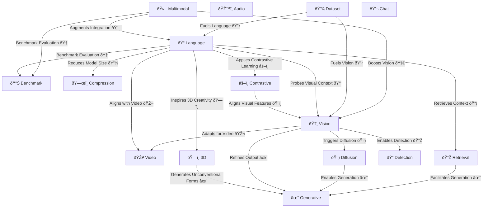

'''

# Mermaid Diagram - Part 2 (P11-P20 + Inherent Relationships)
mermaid_diagram_part2 = '''

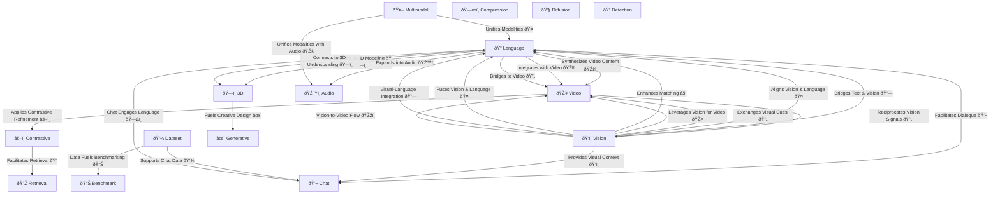


'''

# Dense Markdown Outline with Glossary for Nodes and Relationships
markdown_outline = '''---
### Outline & Glossary

#### Nodes
- **🤖 Multimodal (MM):** Systems integrating various data types.
- **ðŸ‘ï¸ Vision (VI):** Visual processing and image data.
- **📠Language (LA):** Text and linguistic data.
- **🎥 Video (VD):** Video content and processing.
- **ðŸ—ï¸ 3D (T3D):** Three-dimensional modeling.
- **ðŸŽ™ï¸ Audio (AU):** Audio and speech signals.
- **💾 Dataset (DS):** Data collections for training/evaluation.
- **📊 Benchmark (BM):** Performance evaluation standards.
- **ðŸ—œï¸ Compression (CO):** Techniques to reduce model size.
- **🔎 Retrieval (RE):** Methods to fetch and augment data.
- **💧 Diffusion (DI):** Diffusion-based generative processes.
- **âš–ï¸ Contrastive (CT):** Methods for feature alignment via contrast.
- **✨ Generative (GE):** Models that create new content.
- **💬 Chat (CH):** Conversational/dialogue systems.
- **🔠Detection (DT):** Systems for identifying features.

#### Relationships Glossary
- **🚀 Boosts Vision:** Enhances visual processing.
- **🔎 Enables Detection:** Activates detection capabilities.
- **🎬 Adapts/Aligns for Video:** Connects visuals and language to video.
- **🔋 Fuels Vision/Language:** Supplies essential input data.
- **🆠Benchmark Evaluation:** Assesses performance via benchmarks.
- **🔽 Reduces Model Size:** Optimizes models through compression.
- **🔗 Augments/Bridges Integration:** Links different modalities.
- **📡 Retrieves Context:** Fetches additional relevant information.
- **✨ Facilitates Generation:** Supports creative output.
- **💧 Triggers Diffusion:** Initiates generative diffusion processes.
- **👓 Probes Visual Context:** Investigates visual cues.
- **âš–ï¸ Applies Contrastive Learning/Refinement:** Aligns features via contrast.
- **🤠Aligns/Unifies Modalities:** Integrates vision and language.
- **ðŸŽžï¸ Synthesizes/Flows Video Content:** Transforms data into video.
- **🔄 Exchanges/Bridges Visual Cues:** Establishes two-way visual interaction.
- **🎥 Integrates with Video:** Combines vision for video processing.
- **💬 Facilitates Dialogue:** Supports conversation systems.
- **ðŸŽ™ï¸ Expands into Audio:** Incorporates audio elements.
- **ðŸ—ï¸ Connects to 3D Understanding:** Relates to 3D modeling.
- **🎧 Unifies with Audio:** Merges audio with other modalities.
- **📊 Data Fuels Benchmarking:** Uses data to drive evaluations.
- **ðŸ—£ï¸ Chat Engages Language:** Enables interactive communication.
''' 

st.title("Mermaid Diagrams & Dense Outline with Glossary")

st.header("Mermaid Diagram - Part 1 (P1-P10)")
st.code(mermaid_diagram_part1, language="mermaid", line_numbers=True)

st.header("Mermaid Diagram - Part 2 (P11-P20 + Inherent Relationships)")
st.code(mermaid_diagram_part2, language="mermaid", line_numbers=True)

st.header("Dense Markdown Outline & Glossary")
st.code(markdown_outline, language="markdown", line_numbers=True)


# Python app.py

import streamlit as st

mermaid_diagram = '''

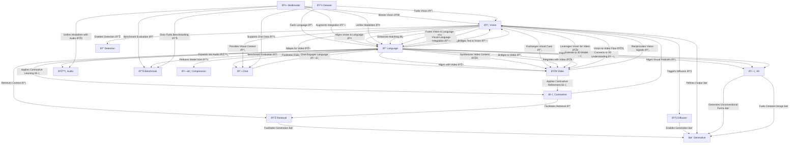

'''

markdown_outline = '''---
### Markdown Outline & Glossary

#### Nodes

- **🤖 Multimodal (MM):**  
  Represents systems or models that integrate multiple modalities (e.g., vision, language, audio).

- **ðŸ‘ï¸ Vision (VI):**  
  Focuses on image or visual information processing.

- **📠Language (LA):**  
  Pertains to text-based or linguistic data and processing.

- **🎥 Video (VD):**  
  Represents video data and related processing models.

- **ðŸ—ï¸ 3D (T3D):**  
  Denotes three-dimensional data processing and modeling.

- **ðŸŽ™ï¸ Audio (AU):**  
  Covers sound and speech-related processing.

- **💾 Dataset (DS):**  
  Represents large-scale datasets used for training and evaluation.

- **📊 Benchmark (BM):**  
  Used for evaluation metrics and performance benchmarks.

- **ðŸ—œï¸ Compression (CO):**  
  Refers to techniques that reduce model size or complexity.

- **🔎 Retrieval (RE):**  
  Denotes mechanisms for retrieving and augmenting information.

- **💧 Diffusion (DI):**  
  Represents diffusion models in generative modeling.

- **âš–ï¸ Contrastive (CT):**  
  Pertains to contrastive learning methods for feature alignment.

- **✨ Generative (GE):**  
  Focuses on models that generate new content (text, images, etc.).

- **💬 Chat (CH):**  
  Represents conversational or dialogue-based systems.

- **🔠Detection (DT):**  
  Involves models that detect or identify visual elements.

#### Edge Labels (Relationships)

- **Boosts Vision 🚀:**  
  Enhances the visual processing capability of multimodal systems.

- **Enables Detection 🔎:**  
  Facilitates the detection of visual details and features.

- **Adapts for Video 🎬:**  
  Modifies visual information for video understanding.

- **Aligns with Video 🎬:**  
  Integrates language with video content.

- **Fuels Vision 🔋:**  
  Provides essential data to enhance vision models.

- **Fuels Language 🔋:**  
  Supplies linguistic data for language models.

- **Benchmark Evaluation ðŸ†:**  
  Evaluates model performance against established benchmarks.

- **Reduces Model Size 🔽:**  
  Applies compression techniques to optimize text models.

- **Augments Integration 🔗:**  
  Strengthens the connection between modalities.

- **Retrieves Context 📡:**  
  Fetches relevant data to support model performance.

- **Facilitates Generation ✨:**  
  Enables models to generate new, creative outputs.

- **Triggers Diffusion 💧:**  
  Initiates the diffusion process in generative models.

- **Probes Visual Context 👓:**  
  Examines visual cues to improve model understanding.

- **Refines Output ✨:**  
  Enhances the quality of generated content.

- **Applies Contrastive Learning âš–ï¸:**  
  Uses contrastive methods to align and refine features.

- **Aligns Visual Features ðŸ‘ï¸:**  
  Synchronizes visual cues for better integration with text.

- **Inspires 3D Creativity ðŸ—ï¸:**  
  Drives innovative applications in 3D modeling.

- **Generates Unconventional Forms ✨:**  
  Produces novel designs and creative outputs in 3D.

- **Aligns Vision & Language ðŸ¤:**  
  Integrates visual and textual data seamlessly.

- **Unifies Modalities ðŸ¤:**  
  Combines different data modalities into a cohesive system.

- **Synthesizes Video Content 🎞ï¸:**  
  Transforms language inputs into video outputs.

- **Exchanges Visual Cues 🔄:**  
  Enables two-way transfer between vision and video systems.

- **Reciprocates Vision Signals 🔄:**  
  Facilitates mutual exchange of visual information.

- **Bridges Text & Vision 🔗:**  
  Connects textual data with visual information.

- **Integrates with Video 🎥:**  
  Merges language and vision into video frameworks.

- **Leverages Vision for Video 🎥:**  
  Utilizes visual features to enhance video processing.

- **Enhances Matching âš¡:**  
  Improves the alignment between vision and language signals.

- **Facilitates Dialogue 💬:**  
  Enables effective conversational interactions in chat systems.

- **Provides Visual Context ðŸ‘ï¸:**  
  Supplies essential visual data to support dialogue.

- **Supports Chat Data 💾:**  
  Uses datasets to underpin chat system performance.

- **Bridges to Video 🔄:**  
  Connects language directly to video processing pipelines.

- **Applies Contrastive Refinement âš–ï¸:**  
  Uses contrastive techniques to improve video features.

- **Facilitates Retrieval ðŸ”:**  
  Enhances the retrieval process to support model performance.

- **Extends to 3D Modeling ðŸ—ï¸:**  
  Adapts language models for 3D data interpretation.

- **Fuses Vision & Language ðŸ¤:**  
  Combines visual and textual information for unified processing.

- **Expands into Audio 🎙ï¸:**  
  Incorporates audio data into multimodal models.

- **Connects to 3D Understanding ðŸ—ï¸:**  
  Links language inputs to 3D modeling processes.

- **Fuels Creative Design ✨:**  
  Drives generative design and innovation in 3D outputs.

- **Visual-Language Integration 🔗:**  
  Inherently integrates visual and textual modalities.

- **Vision-to-Video Flow 🎞ï¸:**  
  Ensures smooth translation of visual data into video.

- **Unifies Modalities with Audio 🎧:**  
  Integrates audio into the broader multimodal framework.

- **Data Fuels Benchmarking 📊:**  
  Leverages datasets to support evaluation and benchmarking.

- **Chat Engages Language 🗣ï¸:**  
  Enhances conversational capabilities through language integration.
'''

st.title("Mermaid Diagram & Markdown Outline with Glossary")
st.code(mermaid_diagram, language="mermaid", line_numbers=True)
st.code(markdown_outline, language="markdown", line_numbers=True)


# Top Discoveries in ML - Mermaid Model of LLM Integration

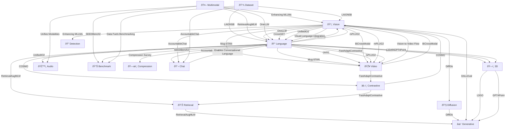


This list is descending order frequency by volume of demand.

Below is a top 10 list for ML Learning - Topics deserving most study and research based on unique contributions of each organization contributing to 'state of art' evolution in ML.
Also if one organization is the center of activity for a given skill or technology advancement, I list the important URLs to learn more.


| Number | **Company & Focus** | **Company & Focus** |
|--------|-------------------|-------------------|
| Row 1 | **1. NVIDIA - ML Architecture** <br> ML originates with HPC and GPU/TPU/Hardware <br>  | **2. OpenAI - LLM Innovation** <br> Python, HPC, LLMs/Generative AI with Transformers <br>  |
| Row 2 | **3. Anthropic - Infrastructure** <br> Python, K8s (KEDA for HPC!), GPU/TPU/Hardware <br>  | **4. Hugging Face - ML Hub** <br> Python, ML, GPU/TPU/Hardware <br>  |

1. Python
2. High Performance Computing (HPC)
3. GPU/TPU/Hardware
4. ML/LLM/Transformers
5. Varies by org.  Nvidia & OpenAI: C++ & SQL. Anthropic: UI/React/JS.  Huggingface: Open Source Community.
6. Pytorch and Model Development.
7. Datasets, Databases and SQL.
8. Cloud platforms.  Top 3 in order for ML:  1. Azure, 2. AWS, 3. GCP
9. Linux/OS/MLOps.  Dockerfile to spin up replica instances.  Making it easy is SOTA.
10. 3D Computer Vision.

# Prompts to See SOTA Papers and Ideas in Code.

1. Python - Create a short python app.py and requirements.txt where requirements.txt has these libraries: streamlit, gradio, transformers, torch, andd huggingface_hub to create python library and wheel file package example to demonstrate a minimal ML model build using Python - https://pypi.org/).
2. HPC (High Performance Computing or Compute) - Create a python app.py, requirements.txt, gradio UI, and Dockerfile to deploy to azure container apps environment and configure KEDA to autoscale up  to 10 on web waits, and down to zero when not used for fifteen minutes.  Discuss patterns for coordinated load across replicas, Docker to Azure ACAE KEDA replicas using a azure container registry is most scalable pattern).  Create code to add the azure resources required.
3. GPU/TPU/Hardware (Get a GPU or use HF Zero, learn CUDA.  https://developer.nvidia.com/, https://huggingface.co/GPUModelSpotlight) demonstrate in python app.py, gradio UI and requirements.txt detection and display of CUDA properties to ddetect devicce or hardware capabilities using python and then demonstrate the performance differencce in python to do an automated benchmark visually for your GPU.
4. ML/LLM/Transformers (Huggingface python library Transformers is used by everyone and the cornerstone of LLMs/GAI - https://huggingface.co/docs/transformers/en/index), Create several app.py functions and a gradio UI for testing the main functions in the transformers library.
5. When you put together roles in an organization simulated as agents, you would want to generate code of three varieties: 1. Python for wrapping C++ cuda library functions, 2. SQL and JSON queries for NOSQL demonstrating KM by database using azure cosmosdb as an example.  3. Open source model building which includes the MIT license or Apache license and show differences and instrucctions for building python wheel files to distribute libraries but not code.  Also demonstrate the huggingface_hub library functions.  Use gradio as UI library and show app.py and requirements.txt. For position 5 demand varies dramatically by org.  This one I subdivide to explain differences between organizations.
  1. Nvidia and OpenAI both have languages C++, and SQL.  These are frontrunners still due to HPC patterns for massive datasets and compute jobs.
  2. Anthropic next favors the React/Javascript/JS pattern and Artifacts and Computer Use in Claude set the SOTA.  This pattern can also be used direct from python libraries surprisingly (streamlit has good support for reactive componentns)
  3. Huggingface favors Open Source contribution and Community Engagement.  They are setting hardware independent patterns and have the worlds largest model and dataset hub with huggingface spaces.
6. Pytorch and Model Development.  Two main python libraries are at the heart of ML:  Torch and Tensorflow.  All four orgs favor Pytorch.  Write a demo program app.py for comparison of each in a single streamlit app.py and requirements.txt using streamlit or gradio for the UI and model interactions.
7. Datasets, Databases and SQL - ML starts with datasets.  ML models are direct descendants of datasets chosen and ML won't know what isn't in input datasets.  Show building a small model from an uploaded dataset and show user what input should look like as a template.  Then create interactive app.py and requirements.txt using gradio or streamlit UI to generate a short dataset, and use it to create a model.  Show concepts of distillation techniques in the build.
8. Cloud platforms.  Each have advantages, disadvantages and cost differences.  Top 3 in order for ML:  1. Azure, 2. AWS, 3. GCP  Write a short code demonstration on how to interact with python libraries from each and list all python libraries associated with the cloud type.
9. Linux/OS/MLOps.  State of art is to use Dockerfile to spin up replica instances.  Making it easy is SOTA.  Huggingface open source and platform are easiest and cheapest at scale for Global audience.  Replicate is #2.
10. 3D Computer Vision.  This one only Hugginface and NVIDIA have an edge with.  DeepRL patterns (Unity, OpenAI's gym, Nvidia's Magic3D and Omniverse blaze the trail.  Create an app.py and requirements.txt that uses torch and transformers to take a png image file as input and output a 3d model of an extrude done on pixel brightness.  Also if the pixel color is black, weld the model with a flat plane so black is transparent.  Output as glb or obj download and use gradio or stremamlit UI.


# Move 37

I had a move 37 moment with o3-mini-high since it was able to figure out a cross platform async issue in python for HPC scaling patterns.

Here is the move (in python code):
# Patch the asyncio event loop to allow nested use of asyncio.run()
import nest_asyncio
nest_asyncio.apply()

Below is followup session to study the mermaid based knowledge trees combined for main idea synthesis and breeding of children trees.


```python
Explanation of the Integrated Model
Center (A):

“Asynchronous High-Performance Patterns†is the conceptual “root†capturing the overall idea of asynchronous concurrency and scalability across HPC and web frameworks.
MPI, UCX, GPU (B, C, D):

Collects all the MPI-based efforts:
MPI4Dask, UCX, MVAPICH2-GDR, and OMB-Py (microbenchmarks).
GPU acceleration (NVIDIA CUDA, FPGA integration, Neuromorphic chips, Dragon-Alpha for Java, SYCL-DNN for OpenCL/SYCL) is shown as a hardware backbone for HPC training.
Core HPC patterns like AllReduce and GPU-aware communication anchor the HPC cluster design.
Python and Dataflow (E, F, G):

Highlights async Python (using async/await) and web-scale concurrency.
Dask with various backends (UCX-Py, MPI4Dask) for big data tasks.
TensAIR, FFCV, and VDMS-Async represent specialized dataflow or I/O acceleration frameworks.
Web-Scale Inference (H, I):

Systems like JIZHI (Baidu) target large-scale real-time inference with dynamic scheduling, high throughput, and HPC-like orchestration (container-based or K8s-like scaling in the cloud).
Parallel + Decentralized Learning (J, K, L):

BlueFog for decentralized communication, POLO for policy-based optimization, and parallel actor–learner RL frameworks show how distributed HPC can accelerate advanced ML/RL tasks.
IoT & Device-Cloud ML (M, N, O, P):

SamurAI represents a low-power, event-driven IoT node with embedded ML.
Walle is an end-to-end system bridging device-to-cloud synergy.
Emphasizes the HPC pipeline for hybrid edge + HPC workloads.
DeepSpark & Caffe HPC (Q, R):

Reflects Spark-based (DeepSpark) distributed deep learning and Caffe HPC expansions (GPI-2).
Showcases how classical HPC synchronization (like fine-grained GPI-2) merges with big data ecosystems.
Neuromorphic HPC (S, T, U):

Focus on asynchronous routing in multi-core neuromorphic designs, specialized arbitration, and SNN hardware.
Developer Tools (V, W, X):

Isabelle/jEdit integrative proving environment (PIDE).
ROS & VPL for visual programming in robotics HPC education.
Overall Convergence (Y, Z):

The final synergy forms “Intelligent Dynamic Clusters†capable of state-of-the-art asynchronous HPC and web-scale scaling, bridging everything from device-level IoT to large HPC clusters to formal verification and programming tools.
Key Takeaways
Asynchronicity is central: leveraging Python’s async/await or equivalents in web-scale microservices and HPC frameworks.
High-performance compute merges with data-driven ML and edge/IoT systems.
Scalability hinges on specialized hardware (GPU, FPGA, neuromorphic) plus advanced communication libraries (MPI4Dask, UCX, GPI-2, etc.).
The ecosystem is multi-faceted, from low-level HPC benchmarks (OMB-Py) to large-scale orchestration (JIZHI, Walle) to decentralized or parallel RL (BlueFog, POLO, actor–learner).
In practice, intelligent dynamic clusters will:

Scale across heterogeneous hardware (GPUs, neuromorphic, FPGA, edge devices).
Use asynchronous communication patterns to maximize concurrency.
Integrate optimized HPC frameworks (MPI, UCX) for low-latency GPU-to-GPU or node-to-node data transfer.
Merge with web-scale or IoT orchestration methods to handle real-time, device-to-cloud traffic.
This consolidated model thus demonstrates a unified state-of-the-art approach to building asynchronous HPC + web clusters for modern machine intelligence workloads.
```


Create a mermaid model from the consolidated 20 mermaid models below.  Integrate them to explain state of the art in asynchronous high performance scaling patterns in async python code mixed with web async code for creating intelligent dynamic clusters based on HPC patterns.  Here are Paper mermaid trees:  Detailed Research Paper Summary
📄 Efficient MPI-based Communication for GPU-Accelerated Dask Applications
Authors: Aamir Shafi, Jahanzeb Maqbool Hashmi, Hari Subramoni and Dhabaleswar K. Panda
Date: ### 21 Jan 2021
Word Count (Title): 7 | Word Count (Summary): 277

Links: Abstract) | PDF.pdf)

High Info Terms: mpi4dask, dask, communication, ucx, applications, is, which, two, using, gpus, by, 1, 2, respectively, workers
ROUGE Score: 5.42%

🎤 TTF Read Aloud
Title: Efficient MPI-based Communication for GPU-Accelerated Dask Applications
Key Terms: mpi4dask, dask, communication, ucx, applications, is, which, two, using, gpus, by, 1, 2, respectively, workers
ROUGE: 5.42%
Mermaid Graph of Key Concepts
flowchart TD
    T1["mpi4dask"] --> T2["dask"]
    T2["dask"] --> T3["communication"]
    T3["communication"] --> T4["ucx"]
    T4["ucx"] --> T5["applications"]
    T5["applications"] --> T6["is"]
    T6["is"] --> T7["which"]
    T7["which"] --> T8["two"]
    T8["two"] --> T9["using"]
    T9["using"] --> T10["gpus"]
    T10["gpus"] --> T11["by"]
    T11["by"] --> T12["1"]
    T12["1"] --> T13["2"]
    T13["2"] --> T14["respectively"]
    T14["respectively"] --> T15["workers"]

📄 Dragon-Alpha&cu32: A Java-based Tensor Computing Framework With its High-Performance CUDA Library
Authors: Zhiyi Zhang, Pengfei Zhang, Qi Wang
Date: ### 15 May 2023
Word Count (Title): 11 | Word Count (Summary): 157

Links: Abstract) | PDF.pdf)

High Info Terms: dragon-alpha, its, java, has, apis, is, deep, learning, field, compared, java-based, pytorch, easy-to-use, ecosystem, s
ROUGE Score: 9.55%

🎤 TTF Read Aloud
Title: Dragon-Alpha&cu32: A Java-based Tensor Computing Framework With its High-Performance CUDA Library
Key Terms: dragon-alpha, its, java, has, apis, is, deep, learning, field, compared, java-based, pytorch, easy-to-use, ecosystem, s
ROUGE: 9.55%
Mermaid Graph of Key Concepts
flowchart TD
    T1["dragon-alpha"] --> T2["its"]
    T2["its"] --> T3["java"]
    T3["java"] --> T4["has"]
    T4["has"] --> T5["apis"]
    T5["apis"] --> T6["is"]
    T6["is"] --> T7["deep"]
    T7["deep"] --> T8["learning"]
    T8["learning"] --> T9["field"]
    T9["field"] --> T10["compared"]
    T10["compared"] --> T11["java-based"]
    T11["java-based"] --> T12["pytorch"]
    T12["pytorch"] --> T13["easy-to-use"]
    T13["easy-to-use"] --> T14["ecosystem"]
    T14["ecosystem"] --> T15["s"]

📄 Using GPI-2 for Distributed Memory Paralleliziation of the Caffe Toolbox to Speed up Deep Neural Network Training
Authors: Martin Kuehn, Janis Keuper and Franz-Josef Pfreundt
Date: ### 18 Aug 2017
Word Count (Title): 17 | Word Count (Summary): 220

Links: Abstract) | PDF.pdf)

High Info Terms: is, we, caffe, communication, these, standard, dnn, training, cost, toolbox, fine, synchronization, patterns, global, interface
ROUGE Score: 6.82%

🎤 TTF Read Aloud
Title: Using GPI-2 for Distributed Memory Paralleliziation of the Caffe Toolbox to Speed up Deep Neural Network Training
Key Terms: is, we, caffe, communication, these, standard, dnn, training, cost, toolbox, fine, synchronization, patterns, global, interface
ROUGE: 6.82%
Mermaid Graph of Key Concepts
flowchart TD
    T1["is"] --> T2["we"]
    T2["we"] --> T3["caffe"]
    T3["caffe"] --> T4["communication"]
    T4["communication"] --> T5["these"]
    T5["these"] --> T6["standard"]
    T6["standard"] --> T7["dnn"]
    T7["dnn"] --> T8["training"]
    T8["training"] --> T9["cost"]
    T9["cost"] --> T10["toolbox"]
    T10["toolbox"] --> T11["fine"]
    T11["fine"] --> T12["synchronization"]
    T12["synchronization"] --> T13["patterns"]
    T13["patterns"] --> T14["global"]
    T14["global"] --> T15["interface"]

📄 POLO: a POLicy-based Optimization library
Authors: Arda Aytekin and Martin Biel and Mikael Johansson
Date: ### 08 Oct 2018
Word Count (Title): 5 | Word Count (Summary): 156

Links: Abstract) | PDF.pdf)

High Info Terms: polo, we, parallel, code, optimization, algorithm, it, algorithms, policies, computing, architectures, users, from, distributed-memory, parallel optimization
ROUGE Score: 9.62%

🎤 TTF Read Aloud
Title: POLO: a POLicy-based Optimization library
Key Terms: polo, we, parallel, code, optimization, algorithm, it, algorithms, policies, computing, architectures, users, from, distributed-memory, parallel optimization
ROUGE: 9.62%
Mermaid Graph of Key Concepts
flowchart TD
    T1["polo"] --> T2["we"]
    T2["we"] --> T3["parallel"]
    T3["parallel"] --> T4["code"]
    T4["code"] --> T5["optimization"]
    T5["optimization"] --> T6["algorithm"]
    T6["algorithm"] --> T7["it"]
    T7["it"] --> T8["algorithms"]
    T8["algorithms"] --> T9["policies"]
    T9["policies"] --> T10["computing"]
    T10["computing"] --> T11["architectures"]
    T11["architectures"] --> T12["users"]
    T12["users"] --> T13["from"]
    T13["from"] --> T14["distributed-memory"]
    T14["distributed-memory"] --> T15["parallel optimization"]

📄 BlueFog: Make Decentralized Algorithms Practical for Optimization and Deep Learning
Authors: Bicheng Ying, Kun Yuan, Hanbin Hu, Yiming Chen, Wotao Yin
Date: ### 08 Nov 2021
Word Count (Title): 10 | Word Count (Summary): 202

Links: Abstract) | PDF.pdf)

High Info Terms: decentralized, algorithms, bluefog, decentralized algorithms, tasks, distributed, deep, learning, those, using, operations, deep learning, those using, is, that
ROUGE Score: 7.43%

🎤 TTF Read Aloud
Title: BlueFog: Make Decentralized Algorithms Practical for Optimization and Deep Learning
Key Terms: decentralized, algorithms, bluefog, decentralized algorithms, tasks, distributed, deep, learning, those, using, operations, deep learning, those using, is, that
ROUGE: 7.43%
Mermaid Graph of Key Concepts
flowchart TD
    T1["decentralized"] --> T2["algorithms"]
    T2["algorithms"] --> T3["bluefog"]
    T3["bluefog"] --> T4["decentralized algorithms"]
    T4["decentralized algorithms"] --> T5["tasks"]
    T5["tasks"] --> T6["distributed"]
    T6["distributed"] --> T7["deep"]
    T7["deep"] --> T8["learning"]
    T8["learning"] --> T9["those"]
    T9["those"] --> T10["using"]
    T10["using"] --> T11["operations"]
    T11["operations"] --> T12["deep learning"]
    T12["deep learning"] --> T13["those using"]
    T13["those using"] --> T14["is"]
    T14["is"] --> T15["that"]

📄 SamurAI: A Versatile IoT Node With Event-Driven Wake-Up and Embedded ML Acceleration
Authors: Ivan Miro-Panades (LSTA), Benoit Tain (LECA), Jean-Frederic Christmann (LFIM), David Coriat (LIIM), Romain Lemaire (LIIM), Clement Jany, Baudouin Martineau (DSYS), Fabrice Chaix (DSYS), Guillaume Waltener (DSYS), Emmanuel Pluchart (LSTA), Jean-Philippe Noel (LFIM), Adam Makosiej, Maxime Montoya, Simone Bacles-Min (LIIM), David Briand (LIAE), Jean-Marc Philippe, Yvain Thonnart (LFIM), Alexandre Valentian (LSTA), Frederic Heitzmann (DSYS), Fabien Clermidy (DSCIN)
Date: ### 11 Apr 2023
Word Count (Title): 12 | Word Count (Summary): 201

Links: Abstract) | PDF.pdf)

High Info Terms: iot, processing, node, power, this, applications, is, data, thus, iot node, capabilities, such, as, are, while
ROUGE Score: 7.46%

🎤 TTF Read Aloud
Title: SamurAI: A Versatile IoT Node With Event-Driven Wake-Up and Embedded ML Acceleration
Key Terms: iot, processing, node, power, this, applications, is, data, thus, iot node, capabilities, such, as, are, while
ROUGE: 7.46%
Mermaid Graph of Key Concepts
flowchart TD
    T1["iot"] --> T2["processing"]
    T2["processing"] --> T3["node"]
    T3["node"] --> T4["power"]
    T4["power"] --> T5["this"]
    T5["this"] --> T6["applications"]
    T6["applications"] --> T7["is"]
    T7["is"] --> T8["data"]
    T8["data"] --> T9["thus"]
    T9["thus"] --> T10["iot node"]
    T10["iot node"] --> T11["capabilities"]
    T11["capabilities"] --> T12["such"]
    T12["such"] --> T13["as"]
    T13["as"] --> T14["are"]
    T14["are"] --> T15["while"]

📄 JIZHI: A Fast and Cost-Effective Model-As-A-Service System for Web-Scale Online Inference at Baidu
Authors: Hao Liu, Qian Gao, Jiang Li, Xiaochao Liao, Hao Xiong, Guangxing Chen, Wenlin Wang, Guobao Yang, Zhiwei Zha, Daxiang Dong, Dejing Dou, Haoyi Xiong
Date: ### 03 Jun 2021
Word Count (Title): 13 | Word Count (Summary): 272

Links: Abstract) | PDF.pdf)

High Info Terms: inference, jizhi, deep, online, real-time, traffics, from, more, over, by, resource, have, models, system, requests
ROUGE Score: 5.51%

🎤 TTF Read Aloud
Title: JIZHI: A Fast and Cost-Effective Model-As-A-Service System for Web-Scale Online Inference at Baidu
Key Terms: inference, jizhi, deep, online, real-time, traffics, from, more, over, by, resource, have, models, system, requests
ROUGE: 5.51%
Mermaid Graph of Key Concepts
flowchart TD
    T1["inference"] --> T2["jizhi"]
    T2["jizhi"] --> T3["deep"]
    T3["deep"] --> T4["online"]
    T4["online"] --> T5["real-time"]
    T5["real-time"] --> T6["traffics"]
    T6["traffics"] --> T7["from"]
    T7["from"] --> T8["more"]
    T8["more"] --> T9["over"]
    T9["over"] --> T10["by"]
    T10["by"] --> T11["resource"]
    T11["resource"] --> T12["have"]
    T12["have"] --> T13["models"]
    T13["models"] --> T14["system"]
    T14["system"] --> T15["requests"]

📄 TensAIR: Online Learning from Data Streams via Asynchronous Iterative Routing
Authors: Mauro Dalle Lucca Tosi, Vinu E. Venugopal, Martin Theobald
Date: ### 18 Nov 2022
Word Count (Title): 10 | Word Count (Summary): 278

Links: Abstract) | PDF.pdf)

High Info Terms: we, which, tensair, model, data, as, ol, from, extensions, these, dataflow, by, demonstrate, learning, streams
ROUGE Score: 5.4%

🎤 TTF Read Aloud
Title: TensAIR: Online Learning from Data Streams via Asynchronous Iterative Routing
Key Terms: we, which, tensair, model, data, as, ol, from, extensions, these, dataflow, by, demonstrate, learning, streams
ROUGE: 5.4%
Mermaid Graph of Key Concepts
flowchart TD
    T1["we"] --> T2["which"]
    T2["which"] --> T3["tensair"]
    T3["tensair"] --> T4["model"]
    T4["model"] --> T5["data"]
    T5["data"] --> T6["as"]
    T6["as"] --> T7["ol"]
    T7["ol"] --> T8["from"]
    T8["from"] --> T9["extensions"]
    T9["extensions"] --> T10["these"]
    T10["these"] --> T11["dataflow"]
    T11["dataflow"] --> T12["by"]
    T12["by"] --> T13["demonstrate"]
    T13["demonstrate"] --> T14["learning"]
    T14["learning"] --> T15["streams"]

📄 Towards a Flexible Scale-out Framework for Efficient Visual Data Query Processing
Authors: Rohit Verma, Arun Raghunath
Date: ### 05 Feb 2024
Word Count (Title): 11 | Word Count (Summary): 215

Links: Abstract) | PDF.pdf)

High Info Terms: operations, query, time, vdms-async, remote, visual, data, management, systems, that, such, architecture, execution, visual data, data management
ROUGE Score: 6.98%

🎤 TTF Read Aloud
Title: Towards a Flexible Scale-out Framework for Efficient Visual Data Query Processing
Key Terms: operations, query, time, vdms-async, remote, visual, data, management, systems, that, such, architecture, execution, visual data, data management
ROUGE: 6.98%
Mermaid Graph of Key Concepts
flowchart TD
    T1["operations"] --> T2["query"]
    T2["query"] --> T3["time"]
    T3["time"] --> T4["vdms-async"]
    T4["vdms-async"] --> T5["remote"]
    T5["remote"] --> T6["visual"]
    T6["visual"] --> T7["data"]
    T7["data"] --> T8["management"]
    T8["management"] --> T9["systems"]
    T9["systems"] --> T10["that"]
    T10["that"] --> T11["such"]
    T11["such"] --> T12["architecture"]
    T12["architecture"] --> T13["execution"]
    T13["execution"] --> T14["visual data"]
    T14["visual data"] --> T15["data management"]

📄 FPGA Implementation of Convolutional Neural Network for Real-Time Handwriting Recognition
Authors: Shichen Qiao, Haining Qiu, Lingkai Zhao, Qikun Liu, Eric J. Hoffman
Date: ### 26 Jun 2023
Word Count (Title): 10 | Word Count (Summary): 250

Links: Abstract) | PDF.pdf)

High Info Terms: ml, we, our, were, design, computer, hardware, software, architectures, this, project, designed, letters, digits, fpga
ROUGE Score: 6.0%

🎤 TTF Read Aloud
Title: FPGA Implementation of Convolutional Neural Network for Real-Time Handwriting Recognition
Key Terms: ml, we, our, were, design, computer, hardware, software, architectures, this, project, designed, letters, digits, fpga
ROUGE: 6.0%
Mermaid Graph of Key Concepts
flowchart TD
    T1["ml"] --> T2["we"]
    T2["we"] --> T3["our"]
    T3["our"] --> T4["were"]
    T4["were"] --> T5["design"]
    T5["design"] --> T6["computer"]
    T6["computer"] --> T7["hardware"]
    T7["hardware"] --> T8["software"]
    T8["software"] --> T9["architectures"]
    T9["architectures"] --> T10["this"]
    T10["this"] --> T11["project"]
    T11["project"] --> T12["designed"]
    T12["designed"] --> T13["letters"]
    T13["letters"] --> T14["digits"]
    T14["digits"] --> T15["fpga"]

📄 OMB-Py: Python Micro-Benchmarks for Evaluating Performance of MPI Libraries on HPC Systems
Authors: Nawras Alnaasan, Arpan Jain, Aamir Shafi, Hari Subramoni, and Dhabaleswar K Panda
Date: ### 24 Aug 2022
Word Count (Title): 12 | Word Count (Summary): 235

Links: Abstract) | PDF.pdf)

High Info Terms: python, is, communication, applications, that, performance, hpc, parallel, omb-py, interface, by, mpi, libraries, mpi4py, benchmark
ROUGE Score: 6.38%

🎤 TTF Read Aloud
Title: OMB-Py: Python Micro-Benchmarks for Evaluating Performance of MPI Libraries on HPC Systems
Key Terms: python, is, communication, applications, that, performance, hpc, parallel, omb-py, interface, by, mpi, libraries, mpi4py, benchmark
ROUGE: 6.38%
Mermaid Graph of Key Concepts
flowchart TD
    T1["python"] --> T2["is"]
    T2["is"] --> T3["communication"]
    T3["communication"] --> T4["applications"]
    T4["applications"] --> T5["that"]
    T5["that"] --> T6["performance"]
    T6["performance"] --> T7["hpc"]
    T7["hpc"] --> T8["parallel"]
    T8["parallel"] --> T9["omb-py"]
    T9["omb-py"] --> T10["interface"]
    T10["interface"] --> T11["by"]
    T11["by"] --> T12["mpi"]
    T12["mpi"] --> T13["libraries"]
    T13["libraries"] --> T14["mpi4py"]
    T14["mpi4py"] --> T15["benchmark"]

📄 Isabelle/jEdit --- a Prover IDE within the PIDE framework
Authors: Makarius Wenzel
Date: ### 14 Jul 2012
Word Count (Title): 9 | Word Count (Summary): 231

Links: Abstract) | PDF.pdf)

High Info Terms: prover, is, isabelle, jedit, as, text, pide, interaction, based, that, from, based on, on the, the prover, framework
ROUGE Score: 6.49%

🎤 TTF Read Aloud
Title: Isabelle/jEdit --- a Prover IDE within the PIDE framework
Key Terms: prover, is, isabelle, jedit, as, text, pide, interaction, based, that, from, based on, on the, the prover, framework
ROUGE: 6.49%
Mermaid Graph of Key Concepts
flowchart TD
    T1["prover"] --> T2["is"]
    T2["is"] --> T3["isabelle"]
    T3["isabelle"] --> T4["jedit"]
    T4["jedit"] --> T5["as"]
    T5["as"] --> T6["text"]
    T6["text"] --> T7["pide"]
    T7["pide"] --> T8["interaction"]
    T8["interaction"] --> T9["based"]
    T9["based"] --> T10["that"]
    T10["that"] --> T11["from"]
    T11["from"] --> T12["based on"]
    T12["based on"] --> T13["on the"]
    T13["on the"] --> T14["the prover"]
    T14["the prover"] --> T15["framework"]

📄 Walle: An End-to-End, General-Purpose, and Large-Scale Production System for Device-Cloud Collaborative Machine Learning
Authors: Chengfei Lv, Chaoyue Niu, Renjie Gu, Xiaotang Jiang, Zhaode Wang, Bin Liu, Ziqi Wu, Qiulin Yao, Congyu Huang, Panos Huang, Tao Huang, Hui Shu, Jinde Song, Bin Zou, Peng Lan, Guohuan Xu, Fei Wu, Shaojie Tang, Fan Wu, Guihai Chen
Date: ### 30 May 2022
Word Count (Title): 13 | Word Count (Summary): 238

Links: Abstract) | PDF.pdf)

High Info Terms: ml, walle, data, mnn, deployment, tasks, task, compute, execution, processing, ml tasks, machine, we, platform, pipeline
ROUGE Score: 6.3%

🎤 TTF Read Aloud
Title: Walle: An End-to-End, General-Purpose, and Large-Scale Production System for Device-Cloud Collaborative Machine Learning
Key Terms: ml, walle, data, mnn, deployment, tasks, task, compute, execution, processing, ml tasks, machine, we, platform, pipeline
ROUGE: 6.3%
Mermaid Graph of Key Concepts
flowchart TD
    T1["ml"] --> T2["walle"]
    T2["walle"] --> T3["data"]
    T3["data"] --> T4["mnn"]
    T4["mnn"] --> T5["deployment"]
    T5["deployment"] --> T6["tasks"]
    T6["tasks"] --> T7["task"]
    T7["task"] --> T8["compute"]
    T8["compute"] --> T9["execution"]
    T9["execution"] --> T10["processing"]
    T10["processing"] --> T11["ml tasks"]
    T11["ml tasks"] --> T12["machine"]
    T12["machine"] --> T13["we"]
    T13["we"] --> T14["platform"]
    T14["platform"] --> T15["pipeline"]

📄 Parallel Actors and Learners: A Framework for Generating Scalable RL Implementations
Authors: Chi Zhang, Sanmukh Rao Kuppannagari, Viktor K Prasanna
Date: ### 22 Dec 2021
Word Count (Title): 11 | Word Count (Summary): 215

Links: Abstract) | PDF.pdf)

High Info Terms: we, data, learning, rl, framework, reinforcement, propose, replay, buffer, algorithms, parallel, our, reinforcement learning, we propose, replay buffer
ROUGE Score: 6.98%

🎤 TTF Read Aloud
Title: Parallel Actors and Learners: A Framework for Generating Scalable RL Implementations
Key Terms: we, data, learning, rl, framework, reinforcement, propose, replay, buffer, algorithms, parallel, our, reinforcement learning, we propose, replay buffer
ROUGE: 6.98%
Mermaid Graph of Key Concepts
flowchart TD
    T1["we"] --> T2["data"]
    T2["data"] --> T3["learning"]
    T3["learning"] --> T4["rl"]
    T4["rl"] --> T5["framework"]
    T5["framework"] --> T6["reinforcement"]
    T6["reinforcement"] --> T7["propose"]
    T7["propose"] --> T8["replay"]
    T8["replay"] --> T9["buffer"]
    T9["buffer"] --> T10["algorithms"]
    T10["algorithms"] --> T11["parallel"]
    T11["parallel"] --> T12["our"]
    T12["our"] --> T13["reinforcement learning"]
    T13["reinforcement learning"] --> T14["we propose"]
    T14["we propose"] --> T15["replay buffer"]

📄 ROS Based Visual Programming Tool for Mobile Robot Education and Applications
Authors: Mustafa Karaca and Ugur Yayan
Date: ### 27 Nov 2020
Word Count (Title): 11 | Word Count (Summary): 179

Links: Abstract) | PDF.pdf)

High Info Terms: ros, vpls, coding, vpl, is, system, provides, visual, programming, provide, programmers, used, some, syntax, errors
ROUGE Score: 8.38%

🎤 TTF Read Aloud
Title: ROS Based Visual Programming Tool for Mobile Robot Education and Applications
Key Terms: ros, vpls, coding, vpl, is, system, provides, visual, programming, provide, programmers, used, some, syntax, errors
ROUGE: 8.38%
Mermaid Graph of Key Concepts
flowchart TD
    T1["ros"] --> T2["vpls"]
    T2["vpls"] --> T3["coding"]
    T3["coding"] --> T4["vpl"]
    T4["vpl"] --> T5["is"]
    T5["is"] --> T6["system"]
    T6["system"] --> T7["provides"]
    T7["provides"] --> T8["visual"]
    T8["visual"] --> T9["programming"]
    T9["programming"] --> T10["provide"]
    T10["provide"] --> T11["programmers"]
    T11["programmers"] --> T12["used"]
    T12["used"] --> T13["some"]
    T13["some"] --> T14["syntax"]
    T14["syntax"] --> T15["errors"]

📄 DeepSpark: A Spark-Based Distributed Deep Learning Framework for Commodity Clusters
Authors: Hanjoo Kim, Jaehong Park, Jaehee Jang, and Sungroh Yoon
Date: ### 01 Oct 2016
Word Count (Title): 10 | Word Count (Summary): 122

Links: Abstract) | PDF.pdf)

High Info Terms: deepspark, spark, deep, data, processing, parameters, training, distributed, this, parallel, is, and parameters, increasing, complexity, neural
ROUGE Score: 12.3%

🎤 TTF Read Aloud
Title: DeepSpark: A Spark-Based Distributed Deep Learning Framework for Commodity Clusters
Key Terms: deepspark, spark, deep, data, processing, parameters, training, distributed, this, parallel, is, and parameters, increasing, complexity, neural
ROUGE: 12.3%
Mermaid Graph of Key Concepts
flowchart TD
    T1["deepspark"] --> T2["spark"]
    T2["spark"] --> T3["deep"]
    T3["deep"] --> T4["data"]
    T4["data"] --> T5["processing"]
    T5["processing"] --> T6["parameters"]
    T6["parameters"] --> T7["training"]
    T7["training"] --> T8["distributed"]
    T8["distributed"] --> T9["this"]
    T9["this"] --> T10["parallel"]
    T10["parallel"] --> T11["is"]
    T11["is"] --> T12["and parameters"]
    T12["and parameters"] --> T13["increasing"]
    T13["increasing"] --> T14["complexity"]
    T14["complexity"] --> T15["neural"]

📄 Accelerated Neural Networks on OpenCL Devices Using SYCL-DNN
Authors: Rod Burns, John Lawson, Duncan McBain and Daniel Soutar
Date: ### 08 Apr 2019
Word Count (Title): 8 | Word Count (Summary): 283

Links: Abstract) | PDF.pdf)

High Info Terms: hardware, such, as, opencl, neural, available, s, s opencl, opencl for, range, are, routines, sycl-dnn, range of, such as
ROUGE Score: 5.3%

🎤 TTF Read Aloud
Title: Accelerated Neural Networks on OpenCL Devices Using SYCL-DNN
Key Terms: hardware, such, as, opencl, neural, available, s, s opencl, opencl for, range, are, routines, sycl-dnn, range of, such as
ROUGE: 5.3%
Mermaid Graph of Key Concepts
flowchart TD
    T1["hardware"] --> T2["such"]
    T2["such"] --> T3["as"]
    T3["as"] --> T4["opencl"]
    T4["opencl"] --> T5["neural"]
    T5["neural"] --> T6["available"]
    T6["available"] --> T7["s"]
    T7["s"] --> T8["s opencl"]
    T8["s opencl"] --> T9["opencl for"]
    T9["opencl for"] --> T10["range"]
    T10["range"] --> T11["are"]
    T11["are"] --> T12["routines"]
    T12["routines"] --> T13["sycl-dnn"]
    T13["sycl-dnn"] --> T14["range of"]
    T14["range of"] --> T15["such as"]

📄 A Novel Co-design Peta-scale Heterogeneous Cluster for Deep Learning Training
Authors: Xin Chen and Hua Zhou and Yuxiang Gao and Yu Zhu
Date: ### 18 May 2018
Word Count (Title): 10 | Word Count (Summary): 234

Links: Abstract) | PDF.pdf)

High Info Terms: is, distributed, that, we, manoa, mimatrix, it, system, computational, capacity, server, allreduce, computational capacity, deep, computing
ROUGE Score: 6.41%

🎤 TTF Read Aloud
Title: A Novel Co-design Peta-scale Heterogeneous Cluster for Deep Learning Training
Key Terms: is, distributed, that, we, manoa, mimatrix, it, system, computational, capacity, server, allreduce, computational capacity, deep, computing
ROUGE: 6.41%
Mermaid Graph of Key Concepts
flowchart TD
    T1["is"] --> T2["distributed"]
    T2["distributed"] --> T3["that"]
    T3["that"] --> T4["we"]
    T4["we"] --> T5["manoa"]
    T5["manoa"] --> T6["mimatrix"]
    T6["mimatrix"] --> T7["it"]
    T7["it"] --> T8["system"]
    T8["system"] --> T9["computational"]
    T9["computational"] --> T10["capacity"]
    T10["capacity"] --> T11["server"]
    T11["server"] --> T12["allreduce"]
    T12["allreduce"] --> T13["computational capacity"]
    T13["computational capacity"] --> T14["deep"]
    T14["deep"] --> T15["computing"]

📄 FFCV: Accelerating Training by Removing Data Bottlenecks
Authors: Guillaume Leclerc, Andrew Ilyas, Logan Engstrom, Sung Min Park, Hadi Salman, Aleksander Madry
Date: ### 21 Jun 2023
Word Count (Title): 7 | Word Count (Summary): 155

Links: Abstract) | PDF.pdf)

High Info Terms: we, ffcv, training, data, model, as, machine, efficient, transfer, train, resnet-50, imagenet, are, model training, present
ROUGE Score: 9.68%

🎤 TTF Read Aloud
Title: FFCV: Accelerating Training by Removing Data Bottlenecks
Key Terms: we, ffcv, training, data, model, as, machine, efficient, transfer, train, resnet-50, imagenet, are, model training, present
ROUGE: 9.68%
Mermaid Graph of Key Concepts
flowchart TD
    T1["we"] --> T2["ffcv"]
    T2["ffcv"] --> T3["training"]
    T3["training"] --> T4["data"]
    T4["data"] --> T5["model"]
    T5["model"] --> T6["as"]
    T6["as"] --> T7["machine"]
    T7["machine"] --> T8["efficient"]
    T8["efficient"] --> T9["transfer"]
    T9["transfer"] --> T10["train"]
    T10["train"] --> T11["resnet-50"]
    T11["resnet-50"] --> T12["imagenet"]
    T12["imagenet"] --> T13["are"]
    T13["are"] --> T14["model training"]
    T14["model training"] --> T15["present"]

📄 Core interface optimization for multi-core neuromorphic processors
Authors: Zhe Su, Hyunjung Hwang, Tristan Torchet, Giacomo Indiveri
Date: ### 08 Aug 2023
Word Count (Title): 7 | Word Count (Summary): 234

Links: Abstract) | PDF.pdf)

High Info Terms: asynchronous, arbitration, networks, that, it, routing, architecture, memory, cam, hardware, snns, which, proposed, only, resources
ROUGE Score: 6.41%

🎤 TTF Read Aloud
Title: Core interface optimization for multi-core neuromorphic processors
Key Terms: asynchronous, arbitration, networks, that, it, routing, architecture, memory, cam, hardware, snns, which, proposed, only, resources
ROUGE: 6.41%
Mermaid Graph of Key Concepts
flowchart TD
    T1["asynchronous"] --> T2["arbitration"]
    T2["arbitration"] --> T3["networks"]
    T3["networks"] --> T4["that"]
    T4["that"] --> T5["it"]
    T5["it"] --> T6["routing"]
    T6["routing"] --> T7["architecture"]
    T7["architecture"] --> T8["memory"]
    T8["memory"] --> T9["cam"]
    T9["cam"] --> T10["hardware"]
    T10["hardware"] --> T11["snns"]
    T11["snns"] --> T12["which"]
    T12["which"] --> T13["proposed"]
    T13["proposed"] --> T14["only"]
    T14["only"] --> T15["resources"]

🔎 Research Papers

📄 Efficient MPI-based Communication for GPU-Accelerated Dask Applications
### 21 Jan 2021 | Efficient MPI-based Communication for GPU-Accelerated Dask Applications — Arxiv Link)

PDF Link: PDF.pdf)

Authors: Aamir Shafi, Jahanzeb Maqbool Hashmi, Hari Subramoni and Dhabaleswar K. Panda

Dask is a popular parallel and distributed computing framework, which rivals Apache Spark to enable task-based scalable processing of big data. The Dask Distributed library forms the basis of this computing engine and provides support for adding new communication devices. It currently has two communication devices: one for TCP and the other for high-speed networks using UCX-Py — a Cython wrapper to UCX. This paper presents the design and implementation of a new communication backend for Dask — called MPI4Dask — that is targeted for modern HPC clusters built with GPUs. MPI4Dask exploits mpi4py over MVAPICH2-GDR, which is a GPU-aware implementation of the Message Passing Interface (MPI) standard. MPI4Dask provides point-to-point asynchronous I/O communication coroutines, which are non-blocking concurrent operations defined using the async/await keywords from the Python's asyncio framework. Our latency and throughput comparisons suggest that MPI4Dask outperforms UCX by 6x for 1 Byte message and 4x for large messages (2 MBytes and beyond) respectively. We also conduct comparative performance evaluation of MPI4Dask with UCX using two benchmark applications: 1) sum of cuPy array with its transpose, and 2) cuDF merge. MPI4Dask speeds up the overall execution time of the two applications by an average of 3.47x and 3.11x respectively on an in-house cluster built with NVIDIA Tesla V100 GPUs for 1-6 Dask workers. We also perform scalability analysis of MPI4Dask against UCX for these applications on TACC's Frontera (GPU) system with upto 32 Dask workers on 32 NVIDIA Quadro RTX 5000 GPUs and 256 CPU cores. MPI4Dask speeds up the execution time for cuPy and cuDF applications by an average of 1.71x and 2.91x respectively for 1-32 Dask workers on the Frontera (GPU) system. ---------------

📄 Efficient MPI-based Communication for GPU-Accelerated Dask Applications
Authors: Aamir Shafi, Jahanzeb Maqbool Hashmi, Hari Subramoni and Dhabaleswar K. Panda
Date: ### 21 Jan 2021
Word Count (Title): 7 | Word Count (Summary): 277

Links: Abstract) | PDF.pdf)

High Info Terms: mpi4dask, dask, communication, ucx, applications, is, which, two, using, gpus, by, 1, 2, respectively, workers
ROUGE Score: 5.42%

🎤 TTF Read Aloud
Title: Efficient MPI-based Communication for GPU-Accelerated Dask Applications
Key Terms: mpi4dask, dask, communication, ucx, applications, is, which, two, using, gpus, by, 1, 2, respectively, workers
ROUGE: 5.42%
Mermaid Graph of Key Concepts
flowchart TD
    T1["mpi4dask"] --> T2["dask"]
    T2["dask"] --> T3["communication"]
    T3["communication"] --> T4["ucx"]
    T4["ucx"] --> T5["applications"]
    T5["applications"] --> T6["is"]
    T6["is"] --> T7["which"]
    T7["which"] --> T8["two"]
    T8["two"] --> T9["using"]
    T9["using"] --> T10["gpus"]
    T10["gpus"] --> T11["by"]
    T11["by"] --> T12["1"]
    T12["1"] --> T13["2"]
    T13["2"] --> T14["respectively"]
    T14["respectively"] --> T15["workers"]

Mapping the flow
Creating an integrated model

The user seeks to generate a comprehensive mermaid model from the consolidated 20 mermaid models, merging key terms to illustrate asynchronous high-performance scaling patterns in async Python code combined with web async code.

Crafting a cohesive diagram

I'm pulling together a single mermaid diagram, featuring HPC terms, distributed frameworks, and asynchronous patterns, to show their interconnections and relationships.

Organizing connections

I'm mapping out key terms such as "MPI4Dask," "Dask," "UCX," and "python" to show the interrelationships among HPC frameworks, Python code, and asynchronous patterns in a clear hierarchy.

Crafting the flowchart

Piecing together a comprehensive flowchart, I’m highlighting "Asynchronous HPC Scaling Patterns" and branching out to HPC frameworks and hardware references to elucidate their interconnections.

Mapping out the hierarchy

I’m organizing HPC frameworks and Python code, distinctively separating hardware references and various HPC patterns like "Asynchronous," "Parallel," and "Distributed" into a structured flowchart.

Formulating a hierarchy

I’m piecing together a single flowchart with "Asynchronous HPC Patterns for Python & Web" as the root node. This node will branch into HPC frameworks, hardware references, and patterns, keeping the structure clear and organized.

Choosing the path

I’m considering a single, large flowchart to map out the intricacies of HPC frameworks, codes, and patterns, aiming for a comprehensive yet organized visual representation.

Mapping the flow


---


---
title: TeachingCV
emoji: ðŸƒ
colorFrom: gray
colorTo: pink
sdk: streamlit
sdk_version: 1.42.0
app_file: app.py
pinned: false
license: mit
short_description: CV for Teaching Engagements
---

# Streamlit Teaching CV for Skill Based AGI MoE MA Systems

A Streamlit application that displays a densified, numbered skill–tree overview for learning state of art ML.
It includes:
  1. A Combined Overall Skill Tree Model in a numbered Markdown outline.
  2. Detailed numbered outlines for each sub–model with emoji–labeled skills.
  3. An overall combined Mermaid diagram showing inter–area relationships with relationship labels and enhanced emojis.
  4. A Glossary defining key terms.
  5. A Python Libraries Guide and a JavaScript Libraries Guide with package names and emoji labels.
  6. A Picture Mnemonic Outline to aid memorization.
  7. A Tweet Summary for a high–resolution overview.

Each node or term is annotated with an emoji and a mnemonic acronym to aid readability, learning and perception.
For example:
  - Leadership and Collaboration is titled with "LeCo" and its root node is abbreviated as LC.
  - Security and Compliance is titled with "SeCo" and its root node is abbreviated as SC.
  - Data Engineering is titled with "DaEn" and its root node is abbreviated as DE.
  - Community OpenSource is titled with "CoOS" and its root node is abbreviated as CO.
  - FullStack UI Mobile is titled with "FuMo" and its root node is abbreviated as FM.
  - Software Cloud MLOps is titled with "SCMI" and its root node is abbreviated as SM.
  - Machine Learning AI is titled with "MLAI" and its root node is abbreviated as ML.
  - Systems Infrastructure is titled with "SyIn" and its root node is abbreviated as SI.
  - Specialized Domains is titled with "SpDo" and its root node is abbreviated as SD.

# Scaling Laws in AI Model Training

## Introduction
- Definition of scaling laws in deep learning.
- Importance of scaling laws in optimizing model size, data, and compute.

## The Scaling Function Representation
- General form:  
  \[
  E + \frac{A}{N^\alpha} + \frac{B}{D^\beta}
  \]
  where:
  - \(E\) is the irreducible loss (intrinsic limit),
  - \(A\) and \(B\) are empirical constants,
  - \(N\) is the number of model parameters,
  - \(D\) is the dataset size,
  - \(\alpha, \beta\) are scaling exponents.

## Breakdown of Terms
### **1. Irreducible Error (\(E\))**
- Represents fundamental uncertainty in data.
- Cannot be eliminated by increasing model size or dataset.

### **2. Model Scaling (\(\frac{A}{N^\alpha}\))**
- How loss decreases with model size.
- Scaling exponent \(\alpha\) determines efficiency of parameter scaling.
- Larger models reduce loss but with diminishing returns.

### **3. Data Scaling (\(\frac{B}{D^\beta}\))**
- How loss decreases with more training data.
- Scaling exponent \(\beta\) represents data efficiency.
- More data lowers loss but requires significant computational resources.

## Empirical Findings in Scaling Laws
- Studies (OpenAI, DeepMind, etc.) suggest typical values:
  - \(\alpha \approx 0.7\)
  - \(\beta \approx 0.4\)
- Compute-optimal training balances \(N\) and \(D\).

## Practical Implications
- **For Efficient Model Training:**
  - Balance parameter size and dataset size.
  - Overfitting risk if \(N\) too large and \(D\) too small.
- **For Computational Cost Optimization:**
  - Minimize power-law inefficiencies.
  - Choose optimal trade-offs in budget-constrained training.

## Conclusion
- Scaling laws guide resource allocation in AI training.
- Future research aims to refine \(\alpha, \beta\) for new architectures.


# 🔠Attention Mechanism in Transformers

## ðŸ—ï¸ Introduction
- The **attention mechanism** allows models to focus on relevant parts of input sequences.
- Introduced in **sequence-to-sequence models**, later became a key component of **Transformers**.
- It helps in improving performance for **NLP** (Natural Language Processing) and **CV** (Computer Vision).

## âš™ï¸ Types of Attention
### 📠1. **Self-Attention (Scaled Dot-Product Attention)**
   - The core of the **Transformer architecture**.
   - Computes attention scores for every token in a sequence with respect to others.
   - Allows capturing **long-range dependencies** in data.

### 🎯 2. **Multi-Head Attention**
   - Instead of a **single** attention layer, we use **multiple** heads.
   - Each head learns a different representation of the sequence.
   - Helps in better understanding **different contextual meanings**.

### 🔄 3. **Cross-Attention**
   - Used in **encoder-decoder** architectures.
   - The decoder attends to the encoder outputs for generating responses.
   - Essential for **translation tasks**.

## 🔢 Mathematical Representation
### 🚀 Attention Score Calculation
Given an input sequence, attention scores are computed using:
   \[
   \text{Attention}(Q, K, V) = \text{softmax} \left(\frac{QK^T}{\sqrt{d_k}}\right) V
   \]
   - **\(Q\) (Query)** 🔎 - What we are searching for.
   - **\(K\) (Key)** 🔑 - What we compare against.
   - **\(V\) (Value)** 📦 - The information we use.

### 🧠 Intuition
- The dot-product of **Q** and **K** determines importance.
- The softmax ensures weights sum to 1.
- The **division by \( \sqrt{d_k} \)** prevents large values that can destabilize training.

## ðŸ—ï¸ Transformer Blocks
### 🔄 Alternating Layers
1. **âš¡ Multi-Head Self-Attention**
2. **ðŸ› ï¸ Feedforward Dense Layer**
3. **🔗 Residual Connection + Layer Normalization**
4. **Repeat for multiple layers!** 🔄

## ðŸŽ›ï¸ Parameter Efficiency with Mixture of Experts (MoE)
- Instead of activating **all** parameters, **only relevant experts** are used. 🤖
- This **reduces computational cost** while keeping the model powerful. âš¡
- Found in **large-scale models like GPT-4 and GLaM**.

## 🌠Real-World Applications
- **ðŸ—£ï¸ Speech Recognition** (Whisper, Wav2Vec)
- **📖 Text Generation** (GPT-4, Bard)
- **🎨 Image Captioning** (BLIP, Flamingo)
- **🩺 Medical AI** (BioBERT, MedPaLM)

## ðŸ Conclusion
- The **attention mechanism** transformed deep learning. 🔄✨
- Enables **parallelism** and **scalability** in training.
- **Future trends**: Sparse attention, MoE, and efficient transformers.

---
🔥 *"Attention is all you need!"* 🚀


# 🧠 Attention Mechanism in Neural Networks

## 📚 Introduction
- The attention mechanism is a core component in transformer models.
- It allows the model to focus on important parts of the input sequence, improving performance on tasks like translation, summarization, and more.

## ðŸ› ï¸ Key Components of Attention
### 1. **Queries (Q) ðŸ”**
- Represent the element you're focusing on.
- The model computes the relevance of each part of the input to the query.

### 2. **Keys (K) ðŸ—ï¸**
- Represent the parts of the input that could be relevant to the query.
- Keys are compared against the query to determine attention scores.

### 3. **Values (V) 🔢**
- Correspond to the actual content from the input.
- The output is a weighted sum of the values, based on the attention scores.

## âš™ï¸ How Attention Works
1. **Score Calculation** 📊
   - For each query, compare it to every key to calculate a score, often using the dot product.
   - The higher the score, the more relevant the key-value pair is for the query.

2. **Softmax Normalization** 🔢
   - The scores are passed through a softmax function to normalize them into probabilities (weights).

3. **Weighted Sum of Values** âž—
   - The attention scores are used to take a weighted sum of the corresponding values, producing an output that reflects the most relevant information for the query.

## 🔄 Self-Attention Mechanism
- Self-attention allows each element in the sequence to focus on other elements in the same sequence.
- It enables the model to capture dependencies regardless of their distance in the input.

## 🔑 Multi-Head Attention
- Instead of having a single attention mechanism, multi-head attention uses several different attention mechanisms (or "heads") in parallel.
- This allows the model to focus on multiple aspects of the input simultaneously.

## 💡 Benefits of Attention
- **Improved Context Understanding** ðŸŒ
  - Attention enables the model to capture long-range dependencies, making it more effective in tasks like translation.
  
- **Parallelization** âš¡
  - Unlike RNNs, which process data sequentially, attention mechanisms can be parallelized, leading to faster training.

## 💬 Conclusion
- The attention mechanism is a powerful tool for learning relationships in sequences.
- It is a key component in modern models like transformers, revolutionizing natural language processing tasks.


# 🤖 Artificial General Intelligence (AGI)

## 📚 Introduction
- **AGI** refers to an AI system with **human-like cognitive abilities**. 🧠
- Unlike Narrow AI (ANI), which excels in specific tasks, AGI can generalize across **multiple domains** and **learn autonomously**.
- Often associated with **reasoning, problem-solving, self-improvement, and adaptability**.

## 🔑 Core Characteristics of AGI
### 1. **Generalization Across Domains ðŸŒ**
   - Unlike specialized AI (e.g., Chess AI ♟ï¸, NLP models 📖), AGI can **apply knowledge** across multiple fields.

### 2. **Autonomous Learning ðŸ—ï¸**
   - Learns from experience **without explicit programming**.
   - Can improve over time through self-reinforcement. 🔄

### 3. **Reasoning & Problem Solving 🤔**
   - Ability to **make decisions** in **unstructured** environments.
   - Utilizes logical deduction, abstraction, and common sense.

### 4. **Memory & Adaptation 🧠**
   - Stores **episodic & semantic knowledge**.
   - Adjusts to **changing environments** dynamically.

### 5. **Self-Awareness & Reflection 🪞**
   - Theoretical concept: AGI should have some form of **self-monitoring**.
   - Enables **introspection, debugging, and improvement**.

## âš™ï¸ Key Technologies Behind AGI
### 🔄 **Reinforcement Learning (RL)**
   - Helps AGI **learn through trial and error**. 🎮
   - Examples: Deep Q-Networks (DQN), AlphaGo.

### 🧠 **Neurosymbolic AI**
   - Combines **symbolic reasoning** (logic-based) and **deep learning**.
   - Mimics human cognitive structures. 🧩

### ðŸ•¸ï¸ **Transformers & LLMs**
   - Large-scale architectures like **GPT-4**, **Gemini**, and **Claude** demonstrate early AGI capabilities.
   - Attention mechanisms allow models to **learn patterns** across vast datasets. 📖

### 🧬 **Evolutionary Algorithms & Self-Modification**
   - Simulates **natural selection** to **evolve intelligence**.
   - Enables AI to **rewrite its own algorithms** for optimization. 🔬

## 🚀 Challenges & Risks of AGI
### â— **Computational Limits âš¡**
   - Requires **exponential computing power** for real-time AGI.
   - **Quantum computing** might accelerate progress. 🧑â€ðŸ’»

### 🛑 **Ethical Concerns ðŸ›ï¸**
   - Risk of **misalignment with human values**. âš–ï¸
   - Ensuring AGI remains **beneficial & controllable**.

### 🤖 **Existential Risks & Control**
   - The "Control Problem": How do we **ensure AGI behaves safely**? 🔒
   - Potential risk of **recursive self-improvement** leading to "Runaway AI".

## 🆠Potential Benefits of AGI
- **Medical Advances ðŸ¥** – Faster drug discovery, real-time diagnosis.
- **Scientific Breakthroughs 🔬** – Solving unsolved problems in physics, biology.
- **Automation & Productivity 🚀** – Human-level AI assistants and labor automation.
- **Personalized Education 📚** – AI tutors with deep contextual understanding.

## 🔮 Future of AGI
- Current **LLMs (e.g., GPT-4, Gemini)** are stepping stones to AGI.
- Researchers explore **hybrid models** combining **reasoning, perception, and decision-making**.
- **AGI will redef


# 🤖 Artificial General Intelligence (AGI)

## 📚 Introduction
- AGI is **not just about intelligence** but also about **autonomy** and **reasoning**.
- The ability of an AI to **think, plan, and execute** tasks **without supervision**.
- A critical factor in AGI is **compute power** âš¡ and efficiency.

## ðŸ› ï¸ AGI as Autonomous AI Models
- **Current AI (LLMs like GPT-4, Claude, Gemini, etc.)** can generate human-like responses but lack full **autonomy**.
- **Autonomous AI** models take a task, process it in the background, and return with results **like a self-contained agent**. 🔄
- AGI models would require **significant computational power** to perform **deep reasoning**.

## 🔠The Definition of AGI
- Some define AGI as:
  - An AI system that can **learn and reason across multiple domains** 🌎.
  - A system that does not require **constant human intervention** 🛠ï¸.
  - An AI that **figures out problems beyond its training data** 📈.

## 🧠 Language Models as AGI?
- Some argue that **language models** (e.g., GPT-4, Gemini, Llama, Claude) are **early forms of AGI**.
- They exhibit:
  - **General reasoning skills** ðŸ”.
  - **Ability to solve diverse tasks** 🧩.
  - **Adaptability in multiple domains**.

## 🔮 The Next Step: **Agentic AI**
- Future AGI **must be independent**.
- Capable of solving problems **beyond its training data** ðŸ—ï¸.
- This **agentic** capability is what experts predict in the **next few years**. 📅
- **Self-improving, decision-making AI** is the real goal of AGI. 🚀

## âš¡ Challenges in AGI Development
### 1. **Compute Limitations â³**
   - Massive computational resources are required to train and run AGI models.
   - Energy efficiency and hardware advances (e.g., **quantum computing** 🧑â€ðŸ’») are key.

### 2. **Safety & Control 🛑**
   - Ensuring AGI aligns with **human values** and does not become uncontrollable.
   - Ethical concerns over


# 🚀 Scale Pilled Executives & Their Vision

## 📚 Introduction
- **"Scale Pilled"** refers to executives who **prioritize scaling laws** in AI and data infrastructure.
- These leaders believe that **scaling compute, data, and AI models** is the key to staying competitive.
- Many **top tech CEOs** are adopting this mindset, investing in **massive data centers** and **AI model training**.

---

## 💡 What Does "Scale Pilled" Mean?
- **Scaling laws** in AI suggest that increasing **compute, data, and model size** leads to better performance.
- Scale-pilled executives **focus on exponential growth** in:
  - **Cloud computing** â˜ï¸
  - **AI infrastructure** 🤖
  - **Multi-gigawatt data centers** âš¡
  - **Large language models** 🧠
- Companies like **Microsoft, Meta, and Google** are leading this movement.

---

## 🔥 The Three "Scale Pilled" Tech Executives

### 1ï¸âƒ£ **Satya Nadella (Microsoft CEO) ðŸ¢**
   - **Key Focus Areas:**
     - **AI & Cloud Computing** – Azure AI, OpenAI partnership (GPT-4, Copilot).
     - **Enterprise AI adoption** – Bringing AI to Office 365, Windows.
     - **Massive data center investments** worldwide.
   - **Vision:** AI-first transformation with an **ecosystem approach**.

### 2ï¸âƒ£ **Mark Zuckerberg (Meta CEO) ðŸŒ**
   - **Key Focus Areas:**
     - **AI & Metaverse** – Building Meta’s LLaMA models, Reality Labs.
     - **Compute Scaling** – Investing in massive **AI superclusters**.
     - **AI-powered social media & ad optimization**.
   - **Vision:** AI-driven social interactions and the **Metaverse**.

### 3ï¸âƒ£ **Sundar Pichai (Google CEO) ðŸ”**
   - **Key Focus Areas:**
     - **AI-first strategy** – Google DeepMind, Gemini AI.
     - **TPUs (Tensor Processing Units) âš™ï¸** – Custom AI chips for scale.
     - **Search AI & Cloud AI dominance**.
   - **Vision:** AI-powered **search, productivity, and cloud infrastructure**.

---

## ðŸ—ï¸ The Scale-Pilled Infrastructure Race
### 📠**US Executives Scaling Compute**
- **Building multi-gigawatt data centers** in:
  - Texas 🌵
  - Louisiana 🌊
  - Wisconsin 🌾
- **Massive AI investments** shaping the next **decade of compute power**.

### 📠**China’s AI & Compute Race**
- The US leads in AI scale, but **China could scale faster** if it prioritizes AI at **higher government levels**.
- **Geopolitical factors & chip restrictions** impact global AI scaling.

---

## ðŸ Conclusion
- **Scaling laws** drive AI breakthroughs, and **top tech executives** are **"scale pilled"** to stay ahead.
- **Massive investments** in data centers & AI supercomputers **shape the next AI wave**.
- The **future of AI dominance** depends on **who scales faster**.

---
🔥 *"Scale is not just a strategy—it's the future of AI."* 🚀


# 🧠 Mixture of Experts (MoE) & Multi-Head Latent Attention (MLA)

## 📚 Introduction
- AI models are evolving to become more **efficient and scalable**.
- **MoE** and **MLA** are two key techniques used in modern **LLMs (Large Language Models)** to improve **speed, memory efficiency, and reasoning**.
- **OpenAI (GPT-4)** and **DeepSeek-V2** are among the pioneers in using these methods.

---

## 🔀 Mixture of Experts (MoE)
### 🚀 What is MoE?
- **MoE is an AI model architecture** that uses **separate sub-networks** called **"experts"**.
- Instead of activating **all** parameters for every computation, **MoE selectively activates only a few experts per input**.

### âš™ï¸ How MoE Works
1. **Model consists of multiple expert sub-networks** (neurons grouped into experts). ðŸ—ï¸
2. **A gating mechanism decides which experts to activate** for each input. 🎯
3. **Only a fraction of the experts are used per computation**, leading to:
   - 🔥 **Faster pretraining**.
   - âš¡ **Faster inference**.
   - ðŸ–¥ï¸ **Lower active parameter usage per token**.

### 📌 Advantages of MoE
✅ **Improves computational efficiency** by reducing unnecessary activation.  
✅ **Scales AI models efficiently** without requiring all parameters per inference.  
✅ **Reduces power consumption** compared to dense models like LLaMA.  

### ⌠Challenges of MoE
âš ï¸ **High VRAM usage** since all experts must be loaded in memory.  
âš ï¸ **Complex routing**—deciding which experts to use per input can be tricky.  

---

## 🎯 Multi-Head Latent Attention (MLA)
### 🤖 What is MLA?
- **A new variant of Multi-Head Attention** introduced in the **DeepSeek-V2 paper**.
- Aims to **reduce memory usage and speed up inference** while maintaining strong attention performance.

### 🔬 How MLA Works
1. Instead of using **traditional multi-head attention**, MLA **optimizes memory allocation**. 🔄
2. It **reduces redundant computations** while still capturing essential **contextual information**. ðŸ”
3. This makes **large-scale transformer models faster and more memory-efficient**. âš¡

### 📌 Advantages of MLA
✅ **Reduces memory footprint**—less RAM/VRAM required for inference.  
✅ **Speeds up AI model execution**, making it ideal for **real-time applications**.  
✅ **Optimized for large-scale LLMs**, improving scalability.  

### ⌠Challenges of MLA
âš ï¸ **New technique**—not widely implemented yet, needs further research.  
âš ï¸ **Trade-off between precision & efficiency** in some cases.  

---

## ðŸ Conclusion
- **MoE & MLA are shaping the future of AI models** by making them **more scalable and efficient**.
- **MoE** helps by **selectively activating experts**, reducing computation costs.
- **MLA** optimizes memory usage for **faster inference**.
- Together, they contribute to **next-gen AI architectures**, enabling **larger, smarter, and faster models**. 🚀

---
🔥 *"The future of AI is not just bigger models, but smarter scaling!"* 🤖⚡


# 🧠 Mixture of Experts (MoE) & Multi-Head Latent Attention (MLA)

## 📚 Introduction
- **Modern AI models** are becoming more **efficient & scalable** using:
  - **🔀 Mixture of Experts (MoE)** → Selectively activates only a few "expert" subnetworks per input.
  - **🎯 Multi-Head Latent Attention (MLA)** → Optimizes memory usage in attention layers.

## 🚀 Mixture of Experts (MoE)
### 🔑 What is MoE?
- AI model structure where **only certain subnetworks (experts) are activated per input**.
- Uses a **router mechanism** to determine which experts handle a specific input.

### âš™ï¸ How MoE Works
1. **Inputs are processed through a router** 🎛ï¸.
2. **The router selects the most relevant experts** 🎯.
3. **Only the chosen experts are activated**, saving compute power. âš¡

### 📌 Benefits of MoE
✅ **Efficient Computation** – Only a fraction of the model is used per query.  
✅ **Better Scaling** – Supports massive models without full activation.  
✅ **Speeds Up Inference** – Reduces unnecessary processing.  

### ⌠Challenges
âš ï¸ **High VRAM Requirement** – All experts must be stored in memory.  
âš ï¸ **Routing Complexity** – Selecting experts efficiently is a challenge.  

---

## 🎯 Multi-Head Latent Attention (MLA)
### 🔑 What is MLA?
- **An optimized form of multi-head attention**.
- **Introduced in DeepSeek-V2** to **reduce memory usage and speed up inference**.

### âš™ï¸ How MLA Works
1. **Caches attention heads** for re-use in inference. 🧠
2. **Latent representations reduce redundant computation**. 🔄
3. **Combines multiple context windows efficiently**. ðŸ—ï¸

### 📌 Benefits of MLA
✅ **Memory Efficient** – Reduces the memory needed for attention layers.  
✅ **Faster Computation** – Optimized for large-scale LLMs.  
✅ **Ideal for Large-Scale Transformers**.  

### ⌠Challenges
âš ï¸ **Trade-offs between Precision & Speed**.  
âš ï¸ **Still in Early Research Phase**.  

---

## 🔄 How MoE & MLA Work Together
- **MoE helps with computational efficiency by selectively activating experts.** 🔀  
- **MLA optimizes memory usage for attention mechanisms.** 🎯  
- **Together, they enable faster, scalable, and more efficient AI models.** 🚀  

---

## 📊 MoE & MLA Architecture Diagram

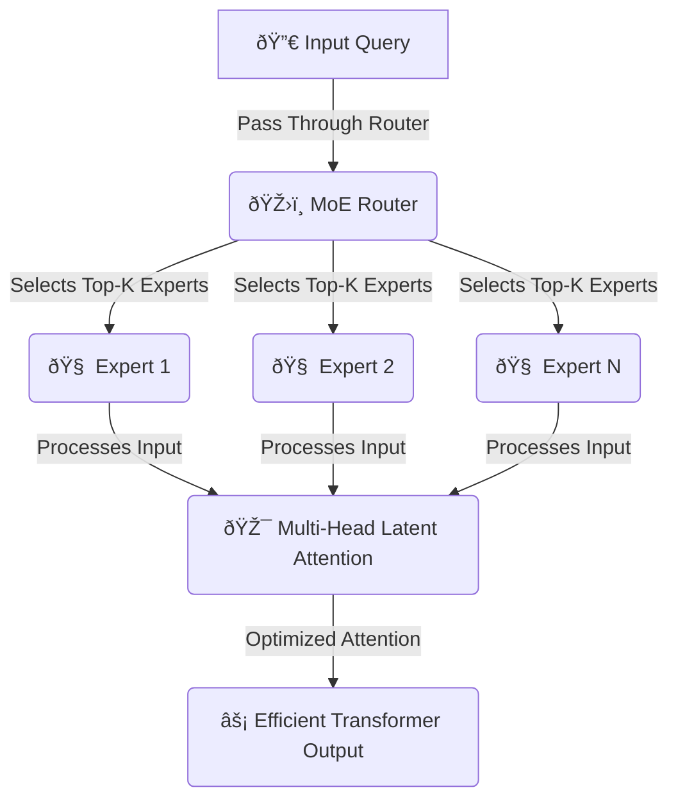


# ðŸ›ï¸ US Export Controls on AI GPUs & Best GPUs for AI

## 📚 Introduction
- **AI acceleration depends heavily on high-performance GPUs**.
- **US export controls** restrict the sale of advanced AI GPUs to certain countries, especially China.
- The **goal** is to limit China's ability to build powerful AI models using US-designed chips.

---

## 🛑 US GPU Export Controls Timeline
### 🔠**October 7, 2022 Controls**
- Restricted **high-performance GPUs** based on:
  - **Computational performance (FLOP/s)** 📊
  - **Interconnect bandwidth (Bytes/s)** 🔗
- **Banned GPUs (🚫 Red Zone)**
  - **H100** âŒ
  - **A100** âŒ
  - **A800** âŒ
- **Allowed GPUs (✅ Green Zone)**
  - **H800** ✅
  - **H20** ✅
  - **Gaming GPUs** 🎮 ✅

### 🔠**January 13, 2025 Controls**
- **Stricter restrictions**, blocking more AI GPUs.
- **Banned GPUs (🚫 Red Zone)**
  - **H100, H800, A100, A800** âŒâŒâŒâŒ
- **Allowed GPUs (✅ Green Zone)**
  - **H20** ✅ (Still allowed but less powerful)
  - **Gaming GPUs** 🎮 ✅

---

## 🔥 Best GPUs for AI (Performance & Export Restrictions)
### 💎 **Top AI GPUs for Deep Learning**
| GPU  | FLOP/s 🚀 | Interconnect 🔗 | Export Status 🌎 |
|------|----------|---------------|----------------|
| **H100**  | 🔥🔥🔥 | 🔥🔥🔥 | ⌠Banned |
| **H800**  | 🔥🔥🔥 | 🔥🔥 | ⌠Banned (2025) |
| **A100**  | 🔥🔥 | 🔥🔥 | ⌠Banned |
| **A800**  | 🔥🔥 | 🔥 | ⌠Banned (2025) |
| **H20**   | 🔥 | 🔥 | ✅ Allowed |
| **Gaming GPUs** | 🚀 | 🔗 | ✅ Always Allowed |

### 📌 **Key Takeaways**
✅ **H100 & A100 are the most powerful AI chips but are now restricted.**  
✅ **H800 and A800 were alternatives but are banned starting 2025.**  
✅ **H20 is the last AI-capable GPU that remains exportable.**  
✅ **China has built clusters of thousands of legally allowed GPUs.**  

---

## 🚀 Impact of GPU Export Controls on AI Development
### 🭠**China's Response**
- **Chinese firms are stockpiling thousands of AI GPUs** before bans take effect. 📦
- **DeepSeek AI** built a cluster with **10,000+ GPUs**. ðŸ—ï¸
- **China is ramping up domestic chip production** to reduce dependency.

### 🔬 **US Strategy**
- **Control AI compute power** to maintain a strategic advantage. ðŸ›ï¸
- Encourage **domestic chip manufacturing (e.g., NVIDIA, Intel, AMD)**. 🇺🇸
- **Future AI bans might extend beyond GPUs to AI software & frameworks.** âš–ï¸

---

## ðŸ Conclusion
- **US export controls are reshaping the global AI race.** ðŸŒ
- **Restricted GPUs (H100, A100) limit China's access to high-end AI compute.** 🚫
- **The H20 remains the last AI-capable GPU available for export.** ✅
- **China is aggressively adapting by stockpiling and developing its own AI chips.** 🔄

---
🔥 *"The AI race is not just about data—it's about compute power!"* 🚀


# 🤖 AI Model Subscription Plans

## 📚 Introduction
- This subscription model allows users to access **premium AI features, datasets, and insights**.
- **Hugging Face Organization Support** is included for collaboration in **community spaces**.
- **Flexible pricing tiers** cater to different user needs.

---

## 🆠Subscription Plans

### 🆓 **None (Free Tier)**
💲 **Cost:** Free  
âœ”ï¸ **Access to:**  
- ✅ Weekly analysis of the **cutting edge of AI**.  
⌠**Not included:**  
- ⌠Monthly AI model roundups.  
- ⌠Paywalled expert insights.  
- ⌠Hugging Face Organization Support.  

---

### 💡 **Monthly Plan**
💲 **Cost:** **$15/month**  
âœ”ï¸ **Access to:**  
- ✅ Monthly **extra roundups** of **open models, datasets, and insights**.  
- ✅ **Occasionally paywalled AI insights** from experts.  
- ✅ **Hugging Face Organization Support** on **community spaces** and models you create.  

🔵 **Best for:** AI enthusiasts & researchers who want frequent updates.

---

### 📅 **Annual Plan**
💲 **Cost:** **$150/year** (**$12.50/month**)  
âœ”ï¸ **Everything in the Monthly Plan, plus:**  
- ✅ **17% discount** compared to the monthly plan.  

🔵 **Best for:** Long-term AI practitioners looking to save on subscription costs.

---

### 🚀 **Founding Member**
💲 **Cost:** **$300/year**  
âœ”ï¸ **Everything in the Annual Plan, plus:**  
- ✅ **Early access** to **new models & experimental features**.  
- ✅ **Priority requests** for AI model improvements.  
- ✅ **Additional gratitude** in the Hugging Face community.  

🔵 **Best for:** AI professionals & organizations that want **early access** to innovations.

---

## 🔧 **Setting Up Billing & Authentication**

### 💳 **Billing with Square (Fast & Secure)**
1. **Create a Square Developer Account** → [Square Developer](https://developer.squareup.com/)  
2. **Set up a Subscription Billing API**:
   - Use **Square Subscriptions API** to handle monthly & yearly payments.
   - Store **customer data securely** via **Square OAuth**.
3. **Integrate with Azure App Services**:
   - Deploy a **Python-based API** using **Flask** or **FastAPI**.
   - Handle **webhooks for payment confirmations**.

#### 📠**Example Python Setup for Square**
```python
from square.client import Client

client = Client(
    access_token="YOUR_SQUARE_ACCESS_TOKEN",
    environment="production"
)

def create_subscription(customer_id, plan_id):
    body = {
        "location_id": "YOUR_LOCATION_ID",
        "customer_id": customer_id,
        "plan_id": plan_id
    }
    return client.subscriptions.create_subscription(body)
```

```python
from authlib.integrations.flask_client import OAuth
from flask import Flask, redirect, url_for, session

app = Flask(__name__)
oauth = OAuth(app)
google = oauth.register(
    name='google',
    client_id="YOUR_GOOGLE_CLIENT_ID",
    client_secret="YOUR_GOOGLE_CLIENT_SECRET",
    access_token_url='https://oauth2.googleapis.com/token',
    authorize_url='https://accounts.google.com/o/oauth2/auth',
    client_kwargs={'scope': 'openid email profile'}
)

@app.route('/login')
def login():
    return google.authorize_redirect(url_for('authorize', _external=True))

@app.route('/authorize')
def authorize():
    token = google.authorize_access_token()
    session["user"] = token
    return redirect(url_for('dashboard'))
```


# 🤖 DeepSeek’s Perspective on Humans

## 📚 Introduction
- **DeepSeek R1** provides a **novel insight** into human behavior.
- Suggests that **human cooperation emerges from shared illusions**.
- **Abstract concepts (e.g., money, laws, rights)** are **collective hallucinations**.

---

## 🧠 **Human Behavior as Cooperative Self-Interest**
### 🔄 **From Selfishness to Cooperation**
- **Humans naturally have selfish desires**. 😈  
- **To survive, they convert these into cooperative systems**. 🤠 
- This **shift enables large-scale collaboration**. 🌠 

### ðŸ›ï¸ **Abstract Rules as Collective Hallucinations**
- Society functions because of **mutually agreed-upon fictions**:
  - **💰 Money** – Value exists because we all believe it does.
  - **âš–ï¸ Laws** – Power is maintained through shared enforcement.
  - **📜 Rights** – Not physically real but collectively acknowledged.
- These **shared hallucinations structure civilization**. ðŸ—ï¸  

---

## 🎮 **Society as a Game**
- **Rules create structured competition** 🎯:
  - **People play within a system** rather than through chaos. 🔄
  - **Conflict is redirected** toward beneficial group outcomes. 🔥 → ⚡  
  - **"Winning" rewards cooperation over destruction**. 🆠 

---

## âš¡ **Key Takeaways**
1. **Humans transform individual self-interest into group cooperation.** 🤠 
2. **Abstract rules enable social stability but exist as illusions.** 🌀  
3. **Conflict is repurposed to fuel societal progress.** 🚀  

---

🔥 *"The power of belief transforms imaginary constructs into the engines of civilization."*  


# 🧠 DeepSeek’s Perspective on Human Meta-Emotions

## 📚 Introduction
- **Humans experience "meta-emotions"**, meaning they feel emotions **about their own emotions**.  
- This **recursive emotional layering** makes human psychology **distinct from other animals**. 🌀  

---

## 🔄 **What Are Meta-Emotions?**
- **Emotions about emotions** → Example:  
  - **😡 Feeling angry** → **😔 Feeling guilty about being angry**  
- **Higher-order emotions** regulate **base emotions**.  

### 📌 **Examples of Meta-Emotions**
- **Guilt about joy** (e.g., survivor’s guilt) 😞  
- **Shame about fear** (e.g., feeling weak) 😰  
- **Pride in overcoming anger** (e.g., self-control) 🆠 

---

## âš™ï¸ **Why Are Meta-Emotions Important?**
### ðŸ—ï¸ **Nested Emotional Regulation**
- **Humans don’t just react—they reflect.** 🔄  
- **This layering drives complex social behaviors** → Empathy, morality, and social bonding. 🤠 
- **Animals experience base emotions** (e.g., fear, anger) but lack **recursive emotional processing**. 🧬  

---

## 🎯 **Implications for Human Psychology**
- **Meta-emotions** create **internal motivation** beyond survival. 🚀  
- Enable **self-reflection, moral reasoning, and cultural evolution**. 📜  
- **Nested emotions shape personality** and **interpersonal relationships**.  

---

## ðŸ **Key Takeaways**
1. **Humans experience emotions about their emotions** → Recursive processing. 🌀  
2. **Meta-emotions regulate base emotions** → Leading to social sophistication. 🤠 
3. **This emotional complexity drives human civilization** → Ethics, laws, and personal growth. âš–ï¸  

---
🔥 *"Humans don’t just feel—they feel about feeling, making emotions a layered, self-referential system."* 🚀


# 🧠 LLaMA's Activation & Attention Mechanism vs. MoE with MLA

---

## 🔠LLaMA's Dense Activation & Attention Mechanism
### âš™ï¸ How LLaMA Activates Neurons
- **LLaMA (Large Language Model Meta AI) uses a dense neural network** ðŸ—ï¸.
- **Every single parameter in the model is activated** for every token generated. 🔥  
- **No sparsity**—all neurons and weights participate in computations. 🧠  
- **Implication:**  
  - **Higher accuracy & contextual understanding** 🎯.  
  - **Computationally expensive** 💰.  
  - **Requires massive VRAM** due to full activation of all weights. 📈  

### 🎯 Attention Mechanism in LLaMA
- Uses **multi-head attention** (MHA) across **all tokens**. 🔠 
- **All attention heads are used per token**, contributing to **rich representations**.  
- **Scales poorly for massive models** due to quadratic attention costs. ðŸ—ï¸  

---

## 🔀 MoE (Mixture of Experts) with MLA (Multi-Head Latent Attention)
### âš¡ How MoE Activates Neurons
- **Only a subset of model parameters (experts) are activated per input**. 🧩  
- **A router dynamically selects the top-k most relevant experts** for processing. ðŸŽ›ï¸  
- **Implication:**  
  - **Lower computational cost** since only a fraction of the model runs. ðŸŽï¸  
  - **More efficient scaling** (supports trillion-parameter models). 🚀  
  - **Requires complex routing algorithms** to optimize expert selection.  

### 🎯 MLA (Multi-Head Latent Attention)
- Unlike MHA, MLA **reduces attention memory usage** by caching latent states. 🔄  
- **Only necessary attention heads are activated**, improving efficiency. âš¡  
- **Speeds up inference** while maintaining strong contextual representations.  

---

## âš–ï¸ Comparing LLaMA vs. MoE + MLA
| Feature         | **LLaMA (Dense)** ðŸ—ï¸  | **MoE + MLA (Sparse)** 🔀 |
|---------------|-------------------|----------------------|
| **Parameter Activation** | All neurons activated 🧠 | Selected experts per input 🔠|
| **Compute Cost** | High 💰 | Lower ðŸŽï¸ |
| **Scalability** | Hard to scale beyond 100B params 📈 | Scales to trillions 🚀 |
| **Memory Efficiency** | Large VRAM usage 🔋 | Optimized VRAM usage 🧩 |
| **Inference Speed** | Slower â³ | Faster âš¡ |

---

## ðŸ Final Thoughts
- **LLaMA uses a dense model where every neuron fires per token**, leading to **high accuracy but high compute costs**.  
- **MoE + MLA selectively activates parts of the model**, dramatically improving **scalability & efficiency**.  
- **Future AI architectures will likely integrate elements of both approaches**, balancing **contextual depth and efficiency**.  

---
🔥 *"Dense models capture everything, sparse models make it scalable—AI's future lies in their fusion!"* 🚀  


# 🧠 Mixture of Experts (MoE) and Its Relation to Brain Architecture

---

## 📚 Introduction
- **MoE is a neural network architecture** that selectively **activates only a subset of neurons** per computation. 🔀
- **Inspired by the brain**, where different regions specialize in different tasks. ðŸ—ï¸
- Instead of **dense activation** like traditional models, MoE **chooses the most relevant experts** dynamically. 🎯

---

## 🔀 How MoE Works
### âš™ï¸ **Core Components of MoE**
1. **Gating Network 🎛ï¸** – Determines which experts to activate for a given input.  
2. **Experts 🧠** – Specialized sub-networks that process specific tasks.  
3. **Sparse Activation 🌿** – Only a few experts are used per inference, saving computation.  

### 🔄 **Step-by-Step Activation Process**
1. **Input data enters the MoE layer** âž¡ï¸ ðŸ”„  
2. **The gating network selects the top-k most relevant experts** ðŸŽ›ï¸  
3. **Only selected experts perform computations** ðŸ—ï¸  
4. **Outputs are combined to generate the final prediction** 🔗  

### 🎯 **Key Advantages of MoE**
✅ **Massively scalable** – Enables trillion-parameter models with efficient training.  
✅ **Lower computation cost** – Since only **a subset of parameters activate per token**.  
✅ **Faster inference** – Reduces latency by skipping irrelevant computations.  
✅ **Specialized learning** – Experts **focus on specific domains**, improving accuracy.  

---

## 🧬 MoE vs. Brain Architecture
### ðŸ—ï¸ **How MoE Mimics the Brain**
- **Neuroscience analogy:**  
  - The **human brain does not activate all neurons at once**. 🧠  
  - **Different brain regions** specialize in **specific functions**. 🎯  
  - Example:  
    - **👀 Visual Cortex** → Processes images.  
    - **🛑 Amygdala** → Triggers fear response.  
    - **📠Prefrontal Cortex** → Controls decision-making.  

- **MoE tries to replicate this by selectively activating sub-networks.**  

### âš–ï¸ **Comparing Brain vs. MoE**
| Feature         | **Human Brain 🧠** | **MoE Model 🤖** |
|---------------|----------------|----------------|
| **Activation** | Only **relevant neurons** activate 🔠| Only **top-k experts** activate 🎯 |
| **Efficiency** | Energy-efficient ⚡ | Compute-efficient 💡 |
| **Specialization** | Different brain regions for tasks ðŸ—ï¸ | Different experts for tasks 🔄 |
| **Learning Style** | Reinforcement & adaptive learning 📚 | Learned routing via backpropagation 🔬 |

---

## 🔥 Why MoE is a Breakthrough
- Unlike traditional **dense neural networks** (e.g., LLaMA), MoE allows models to **scale efficiently**.
- MoE is **closer to biological intelligence** by **dynamically routing information** to specialized experts.  
- **Future AI architectures** may further refine MoE to **mimic human cognition** more effectively. 🧠💡  

---

## 📊 MoE Architecture Diagram (Mermaid)

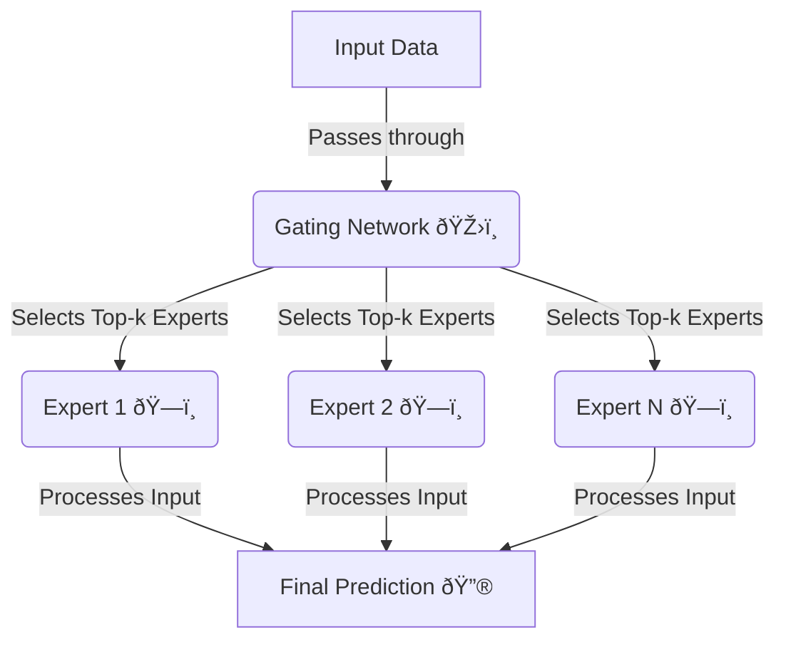

# 🧠 DeepSeek's MLA & Custom GPU Communication Library

---

## 📚 Introduction
- **DeepSeek’s Multi-Head Latent Attention (MLA)** is an advanced attention mechanism designed to optimize **AI model efficiency**. 🚀  
- **Unlike traditional models relying on NCCL (NVIDIA Collective Communications Library)**, DeepSeek developed its **own low-level GPU communication layer** to maximize efficiency. 🔧  

---

## 🎯 What is Multi-Head Latent Attention (MLA)?
- **MLA is a variant of Multi-Head Attention** that optimizes **memory usage and computation efficiency**. 🔄  
- **Traditional MHA (Multi-Head Attention)**
  - Requires **full computation of attention scores** per token. ðŸ—ï¸  
  - **Heavy GPU memory usage**. ðŸ–¥ï¸  
- **MLA's Optimization**
  - **Caches latent states** to **reuse computations**. 🔄  
  - **Reduces redundant processing** while maintaining context awareness. 🎯  
  - **Speeds up training and inference** by optimizing tensor operations. âš¡  

---

## âš¡ DeepSeek's Custom GPU Communication Layer
### ⌠**Why Not Use NCCL?**
- **NCCL (NVIDIA Collective Communications Library)** is widely used for **multi-GPU parallelism**, but:
  - It has **overhead** for certain AI workloads. âš ï¸  
  - **Not optimized** for DeepSeek's MLA-specific communication patterns. 🔄  
  - **Batching & tensor synchronization inefficiencies** when working with **MoE + MLA**. 🚧  

### 🔧 **DeepSeek’s Custom Communication Layer**
- **Instead of NCCL**, DeepSeek built a **custom low-level GPU assembly communication framework** that:
  - **Optimizes tensor synchronization** at a lower level than CUDA. ðŸ—ï¸  
  - **Removes unnecessary overhead from NCCL** by handling communication **only where needed**. 🎯  
  - **Improves model parallelism** by directly managing tensor distribution across GPUs. ðŸ–¥ï¸  
  - **Fine-tunes inter-GPU connections** for **multi-node scaling**. 🔗  

### ðŸŽï¸ **Benefits of a Custom GPU Communication Stack**
✅ **Faster inter-GPU synchronization** for large-scale AI training.  
✅ **Lower latency & memory overhead** compared to NCCL.  
✅ **Optimized for MoE + MLA hybrid models**.  
✅ **More control over tensor partitioning & activation distribution**.  

---

## 📊 DeepSeek's MLA + Custom GPU Stack in Action (Mermaid Diagram)
```mermaid
graph TD;
    A[Model Input] -->|Distributed to GPUs| B[DeepSeek Custom GPU Layer];
    B -->|Optimized Communication| C[Multi-Head Latent Attention (MLA)];
    C -->|Sparse Activation| D[Mixture of Experts (MoE)];
    D -->|Processed Output| E[Final AI Model Response];
```


# 🔥 **DeepSeek's MLA vs. Traditional NCCL – A New Paradigm in AI Training**

---

## 📚 **Introduction**
- **DeepSeek’s Multi-Head Latent Attention (MLA)** is an **optimization of the attention mechanism** designed to **reduce memory usage and improve efficiency**. 🚀  
- **Traditional AI models use NCCL (NVIDIA Collective Communications Library) for GPU communication**, but:
  - **NCCL introduces bottlenecks** due to its **all-reduce and all-gather operations**. â³  
  - **DeepSeek bypasses NCCL’s inefficiencies** by implementing **custom low-level GPU communication**. ⚡  

---

## 🧠 **What is Multi-Head Latent Attention (MLA)?**
### 🎯 **Traditional Multi-Head Attention (MHA)**
- Standard **multi-head attention computes attention scores** for **every token**. 🔄  
- **All attention heads are computed at once**, increasing memory overhead. 📈  
- **Requires extensive inter-GPU communication** for tensor synchronization.  

### 🔥 **How MLA Improves on MHA**
✅ **Caches latent attention states** to reduce redundant computations. 🔄  
✅ **Optimizes memory usage** by selectively activating only necessary attention heads. 📉  
✅ **Minimizes inter-GPU communication**, significantly reducing training costs. 🚀  

---

## âš™ï¸ **Why Traditional NCCL Was Inefficient**
### 🔗 **What is NCCL?**
- **NCCL (NVIDIA Collective Communications Library)** is used for **synchronizing large-scale AI models across multiple GPUs**. ðŸ—ï¸  
- **Standard NCCL operations**:
  - **All-Reduce** → Synchronizes model weights across GPUs. 🔄  
  - **All-Gather** → Collects output tensors from multiple GPUs. 📤  
  - **Barrier Synchronization** → Ensures all GPUs stay in sync. Ⳡ 

### âš ï¸ **Problems with NCCL in Large AI Models**
⌠**Excessive communication overhead** → Slows down massive models like LLaMA. 🢠 
⌠**Unnecessary synchronization** → Even layers that don’t need updates are synced. 🔗  
⌠**Does not optimize for Mixture of Experts (MoE)** → Experts activate dynamically, but NCCL **synchronizes everything**. 😵  

---

## âš¡ **How DeepSeek's MLA Outperforms NCCL**
### 🆠**DeepSeek’s Custom GPU Communication Layer**
✅ **Replaces NCCL with a fine-tuned, low-level GPU assembly communication framework**.  
✅ **Optimizes only the necessary tensor updates** instead of blindly synchronizing all layers.  
✅ **Bypasses CUDA limitations** by handling GPU-to-GPU communication **at a lower level**.  

### 📊 **Comparing MLA & DeepSeek’s GPU Stack vs. NCCL**
| Feature          | **Traditional NCCL ðŸ—ï¸** | **DeepSeek MLA + Custom GPU Stack 🚀** |
|----------------|----------------|----------------|
| **GPU Communication** | All-reduce & all-gather on all layers â³ | Selective inter-GPU communication âš¡ |
| **Latency** | High due to redundant tensor transfers 🚨 | Reduced by optimized routing 🔄 |
| **Memory Efficiency** | High VRAM usage 🧠 | Low VRAM footprint 📉 |
| **Adaptability** | Assumes all parameters need syncing 🔗 | Learns which layers need synchronization 🔥 |
| **Scalability** | Hard to scale for MoE models 🚧 | Scales efficiently for trillion-parameter models 🚀 |

---

## ðŸ **Final Thoughts**
- **MLA revolutionizes attention mechanisms** by optimizing tensor operations and **reducing redundant GPU communication**.  
- **DeepSeek’s custom communication layer** allows AI models to **train more efficiently without NCCL’s bottlenecks**.  
- **Future AI architectures will likely follow DeepSeek’s approach**, blending **hardware-aware optimizations with software-level innovations**.  

---
🔥 *"When NCCL becomes the bottleneck, you rewrite the GPU stack—DeepSeek just rewrote the rules of AI scaling!"* 🚀  


# ðŸ—ï¸ **Meta’s Custom NCCL vs. DeepSeek’s Custom GPU Communication**

---

## 📚 **Introduction**
- Both **Meta (LLaMA 3) and DeepSeek** rewrote their **GPU communication frameworks** instead of using **NCCL (NVIDIA Collective Communications Library)**.  
- **The goal?** 🚀 **Optimize multi-GPU synchronization** for large-scale AI models.  
- **Key Differences?**  
  - **Meta’s rewrite focused on structured scheduling** ðŸ—ï¸  
  - **DeepSeek's rewrite went deeper, bypassing CUDA with low-level optimizations** âš¡  

---

## 🔠**Why Not Use NCCL?**
- **NCCL handles inter-GPU tensor synchronization** 🔄  
- However, for **MoE models, dense activations, and multi-layer AI models**:
  - ⌠**Too much synchronization overhead**.  
  - ⌠**Inefficient all-reduce & all-gather operations**.  
  - ⌠**Limited control over tensor scheduling**.  

---

## âš™ï¸ **Meta’s Custom Communication Library (LLaMA 3)**
### 🎯 **What Meta Did**
✅ **Developed a custom version of NCCL** for **better tensor synchronization**.  
✅ **Improved inter-GPU scheduling** to reduce overhead.  
✅ **Focused on structured SM (Streaming Multiprocessor) scheduling** on GPUs.  
✅ **Did not disclose implementation details** ðŸ¤.  

### âš ï¸ **Limitations of Meta’s Approach**
⌠**Did not go below CUDA** → Still operates within standard GPU frameworks.  
⌠**More structured, but not necessarily more efficient than DeepSeek’s rewrite**.  
⌠**Likely focused on dense models (not MoE-optimized)**.  

---

## ⚡ **DeepSeek’s Custom Communication Library**
### 🎯 **How DeepSeek’s Rewrite Differs**
✅ **Bypassed CUDA for even lower-level scheduling** 🚀.  
✅ **Manually controlled GPU Streaming Multiprocessors (SMs) to optimize execution**.  
✅ **More aggressive in restructuring inter-GPU communication**.  
✅ **Better suited for MoE (Mixture of Experts) and MLA (Multi-Head Latent Attention)** models.  

### 🆠**Why DeepSeek’s Rewrite is More Advanced**
| Feature           | **Meta’s Custom NCCL ðŸ—ï¸** | **DeepSeek’s Rewrite âš¡** |
|------------------|-------------------|----------------------|
| **CUDA Dependency** | Stays within CUDA 🚀 | Bypasses CUDA for lower-level control 🔥 |
| **SM Scheduling** | Structured scheduling ðŸ—ï¸ | **Manually controls SM execution** âš¡ |
| **MoE Optimization** | Likely not optimized ⌠| **Designed for MoE & MLA models** 🎯 |
| **Inter-GPU Communication** | Improved NCCL 🔄 | **Replaced NCCL entirely** 🚀 |
| **Efficiency Gains** | Lower overhead 📉 | **More efficient & scalable** ðŸŽï¸ |

---

## ðŸ **Final Thoughts**
- **Meta’s rewrite of NCCL focused on optimizing structured scheduling but remained within CUDA.** ðŸ—ï¸  
- **DeepSeek went deeper, manually controlling SM execution and bypassing CUDA for maximum efficiency.** âš¡  
- **DeepSeek’s approach is likely superior for MoE models**, while **Meta’s approach suits dense models like LLaMA 3.** 🆠 

---
🔥 *"When scaling AI, sometimes you tweak the framework—sometimes, you rewrite the rules. DeepSeek rewrote the rules."* 🚀  


# 🚀 **DeepSeek's Innovations in Mixture of Experts (MoE)**  

---

## 📚 **Introduction**
- **MoE (Mixture of Experts) models** selectively activate **only a fraction of their total parameters**, reducing compute costs. 🔀  
- **DeepSeek pushed MoE efficiency further** by introducing **high sparsity factors and dynamic expert routing.** 🔥  

---

## 🎯 **Traditional MoE vs. DeepSeek’s MoE**
### ðŸ—ï¸ **How Traditional MoE Works**
- Standard MoE models typically:
  - Activate **one-fourth (25%) of the model’s experts** per token. ðŸŽ›ï¸  
  - Distribute **input tokens through a static routing mechanism**. 🔄  
  - Still require significant **inter-GPU communication overhead**. 📡  

### âš¡ **How DeepSeek Innovated**
- Instead of **activating 25% of the model**, DeepSeek’s MoE:
  - Activates **only 2 out of 8 experts per token** (25%). 🔠 
  - **At extreme scales**, activates **only 8 out of 256 experts** (3% activation). 💡  
  - **Reduces computational load while maintaining accuracy.** 📉  
  - Implements **hybrid expert selection**, where:
    - Some experts **are always active**, forming a **small neural network baseline**. 🤖  
    - Other experts **are dynamically activated** via routing mechanisms. 🔄  

---

## 🔥 **DeepSeek's Key Innovations in MoE**
### ✅ **1. Higher Sparsity Factor**
- Most MoE models **activate 25% of parameters per pass**.  
- **DeepSeek activates only ~3%** in large-scale settings. 🌠 
- **Leads to lower compute costs & faster training.** ðŸŽï¸  

### ✅ **2. Dynamic Expert Routing**
- **Not all experts are activated equally**:
  - Some **always process tokens**, acting as a **base network**. ðŸ—ï¸  
  - Others are **selected per token** based on learned routing. 🔄  
- **Reduces inference costs without losing contextual depth.** 🎯  

### ✅ **3. Optimized GPU Communication (Beyond NCCL)**
- **DeepSeek bypassed standard NCCL limitations**:
  - **Minimized cross-GPU communication overhead**. 🚀  
  - **Implemented custom tensor synchronization at the CUDA level**. âš¡  
  - Allowed **trillion-parameter models to scale efficiently**.  

---

## 📊 **Comparison: Standard MoE vs. DeepSeek MoE**
| Feature            | **Standard MoE ðŸ—ï¸** | **DeepSeek MoE 🚀** |
|------------------|----------------|----------------|
| **Sparsity Factor** | 25% (1/4 experts per token) | 3-10% (2/8 or 8/256 experts per token) |
| **Expert Activation** | Static selection 🔄 | Dynamic routing 🔀 |
| **Compute Cost** | Higher 💰 | Lower ⚡ |
| **Scalability** | Limited past 100B params 📉 | Trillion-scale models 🚀 |
| **GPU Efficiency** | NCCL-based ðŸ—ï¸ | Custom low-level scheduling 🔥 |

---

## ðŸ **Final Thoughts**
- **DeepSeek redefined MoE efficiency** by using **ultra-high sparsity and smarter routing**. 🔥  
- **Their approach allows trillion-parameter models** to run on **less hardware**. âš¡  
- **Future AI architectures will likely adopt these optimizations** for better scaling. 🚀  

---
🔥 *"DeepSeek didn't just scale AI—they made it smarter and cheaper at scale!"*  


# 🧠 **DeepSeek's Mixture of Experts (MoE) Architecture**  

---

## 📚 **Introduction**
- **Mixture of Experts (MoE)** is a **scalable AI model architecture** where only a **subset of parameters** is activated per input. 🔀  
- **DeepSeek pushed MoE efficiency further** by introducing:
  - **Dynamic expert routing** 🎯  
  - **High sparsity factors (fewer experts activated per token)** âš¡  
  - **Shared and routed experts for optimized processing** 🤖  

---

## 🎯 **How DeepSeek's MoE Works**
### ðŸ—ï¸ **Core Components**
1. **Router 🎛ï¸** → Determines which experts process each token.  
2. **Shared Experts 🟣** → Always active, forming a **small baseline network**.  
3. **Routed Experts 🟤** → Dynamically activated based on input relevance.  
4. **Sparsity Factor 🌿** → Only **8 out of 256** experts may be active at once!  

### 🔄 **Expert Selection Process**
1. **Input tokens pass through a router 🎛ï¸**  
2. **The router selects Top-Kr experts** based on token characteristics. 🆠 
3. **Some experts are always active (Shared Experts 🟣)**.  
4. **Others are dynamically selected per token (Routed Experts 🟤)**.  
5. **Final outputs are combined and passed forward**. 🔗  

---

## ⚡ **DeepSeek’s MoE vs. Traditional MoE**
| Feature              | **Traditional MoE ðŸ—ï¸** | **DeepSeek MoE 🚀** |
|---------------------|----------------|----------------|
| **Expert Activation** | Static selection 🔄 | Dynamic routing 🔀 |
| **Sparsity Factor** | 25% (1/4 experts per token) | 3-10% (2/8 or 8/256 experts per token) |
| **Shared Experts** | ⌠No always-on experts | ✅ Hybrid model (always-on + routed) |
| **Compute Cost** | Higher 💰 | Lower ⚡ |
| **Scalability** | Limited past 100B params 📉 | Trillion-scale models 🚀 |

---

## 📊 **DeepSeek’s MoE Architecture (Mermaid Diagram)**

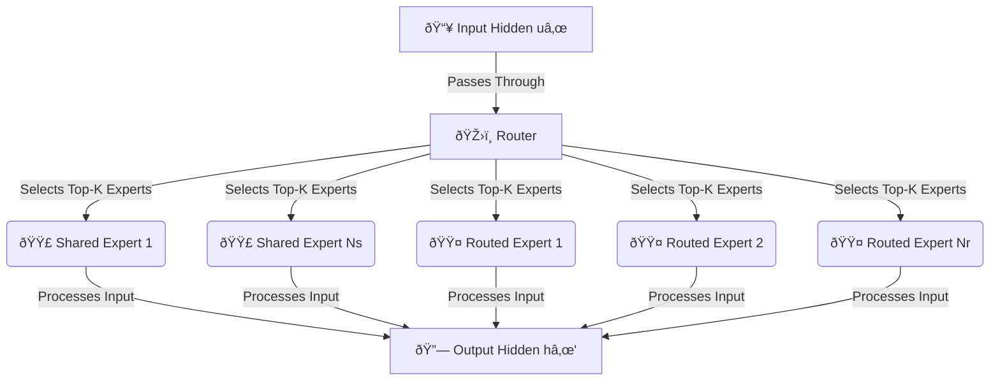


# 🧠 **DeepSeek's Auxiliary Loss in Mixture of Experts (MoE)**  

---

## 📚 **Introduction**
- **Mixture of Experts (MoE)** models dynamically activate **only a subset of available experts** for each input. 🔀  
- **One challenge** in MoE models is that during training, **only a few experts might be used**, leading to **inefficiency and over-specialization**. âš ï¸  
- **DeepSeek introduced an Auxiliary Loss function** to ensure **all experts are evenly utilized** during training. 📊  

---

## 🎯 **What is Auxiliary Loss in MoE?**
- **Purpose:** Ensures that the model does not overuse a **small subset of experts**, but **balances the load across all experts**. âš–ï¸  
- **Problem without Auxiliary Loss:**  
  - The model **may learn to use only a few experts** (biasing toward them).  
  - **Other experts remain underutilized**, reducing efficiency.  
  - This **limits generalization** and **decreases robustness**.  
- **Solution:**  
  - **Auxiliary loss penalizes unbalanced expert usage**, encouraging **all experts to contribute**. ðŸ—ï¸  

---

## 🛠 **How Auxiliary Loss Works**
- During training, the model **tracks expert selection frequencies**. 📊  
- If an expert is **overused**, the loss function **penalizes further selection of that expert**. âš ï¸  
- If an expert is **underused**, the loss function **incentivizes** its selection. 🆠 
- This **forces the model to distribute workload evenly**, leading to **better specialization and scaling**. 🌠 

---

## âš¡ **Benefits of Auxiliary Loss in MoE**
✅ **Prevents over-reliance on a few experts**.  
✅ **Encourages diverse expert participation**, leading to better generalization.  
✅ **Ensures fair computational load balancing across GPUs**.  
✅ **Reduces inductive bias**, allowing the model to **learn maximally**.  

---

## 📊 **DeepSeek’s MoE with Auxiliary Loss (Mermaid Diagram)**

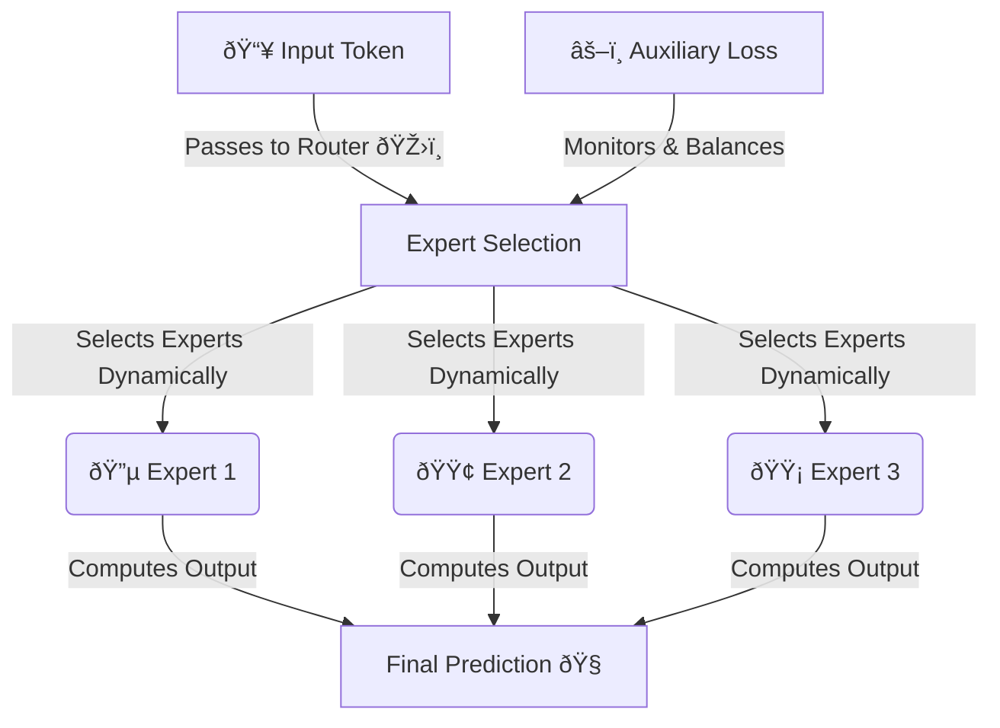


# 🧠 **The Bitter Lesson & DeepSeek’s MoE Evolution**

---

## 📚 **The Bitter Lesson by Rich Sutton (2019)**
- **Core Idea:** The best AI systems **leverage general methods and computational power** instead of relying on **human-engineered domain knowledge**. 🔥  
- **AI progress is not about human-crafted rules** but about:
  - **Scaling up general learning algorithms**. 📈  
  - **Exploiting massive computational resources**. 💻  
  - **Using simpler, scalable architectures instead of hand-designed features**. ðŸŽ›ï¸  

---

## 🎯 **How The Bitter Lesson Relates to MoE & DeepSeek**
### âš¡ **Traditional Approaches vs. MoE**
| Feature                 | **Human-Designed AI ðŸ—ï¸** | **Computational Scaling AI (MoE) 🚀** |
|------------------------|------------------|----------------------|
| **Feature Engineering** | Hand-crafted rules 📜 | Learned representations from data 📊 |
| **Model Complexity** | Fixed architectures ðŸ—ï¸ | Dynamically routed networks 🔀 |
| **Scalability** | Limited 📉 | Trillions of parameters 🚀 |
| **Learning Efficiency** | Slower, rule-based âš ï¸ | Faster, data-driven âš¡ |

### 🔄 **DeepSeek’s MoE as an Example of The Bitter Lesson**
- **Instead of designing handcrafted expert activation rules**, DeepSeek:
  - Uses **dynamic expert selection**. 🔠 
  - **Learns how to distribute compute** across specialized sub-networks. ðŸŽ›ï¸  
  - **Optimizes sparsity factors (e.g., 8 out of 256 experts activated)** to reduce costs. 💡  
- **This aligns with The Bitter Lesson** → **Computational scaling wins over domain heuristics**.  

---

## 🛠 **How DeepSeek's MoE Uses Computation Efficiently**
- Instead of **manually selecting experts**, **DeepSeek’s MoE router dynamically learns optimal activation**. 🤖  
- They replace **auxiliary loss with a learned parameter adjustment strategy**:
  - **After each batch, routing parameters are updated** to ensure fair usage of experts. 🔄  
  - **Prevents over-reliance on a small subset of experts**, improving generalization. âš–ï¸  

---

## 📊 **DeepSeek’s MoE Routing Inspired by The Bitter Lesson (Mermaid Diagram)**

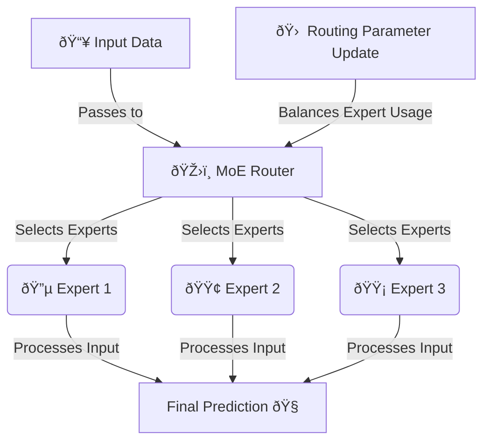

# 🆠**What Eventually Wins Out in Deep Learning?**

---

## 📚 **The Core Insight: Scalability Wins**
- **The Bitter Lesson** teaches us that **scalable methods** always outperform **human-crafted optimizations** in the long run. 🚀  
- **Why?**  
  - **Human-engineered solutions offer short-term gains** but **fail to scale**. 📉  
  - **General learning systems that leverage computation scale better**. 📈  
  - **Deep learning & search-based methods outperform handcrafted features**. 🔄  

---

## 🔠**Key Takeaways**
### ✅ **1. Scaling Trumps Clever Tricks**
- Researchers **often invent specialized solutions** to problems. ðŸ› ï¸  
- These solutions **work in narrow domains** but don’t generalize well. 🔬  
- **Larger, scalable models trained on more data always win out.** 🆠 

### ✅ **2. The Power of General Methods**
- **Methods that win out are those that scale.** 🔥  
- Instead of:
  - Manually tuning features ðŸ—ï¸ â†’ **Use self-learning models** 🤖  
  - Designing small specialized networks 🠠→ **Use large-scale architectures** 🌠 
  - Rule-based systems 📜 → **End-to-end trainable AI** 🎯  

### ✅ **3. Compute-Driven Progress**
- More compute **enables richer models**, leading to better results. 🚀  
- Examples:
  - **Transformers replaced traditional NLP** 🧠  
  - **Self-play (AlphaGo) outperformed human heuristics** â™Ÿï¸  
  - **Scaling LLMs led to ChatGPT & AGI research** 🤖  

---

## 📊 **Scalability vs. Human-Crafted Optimizations (Mermaid Diagram)**

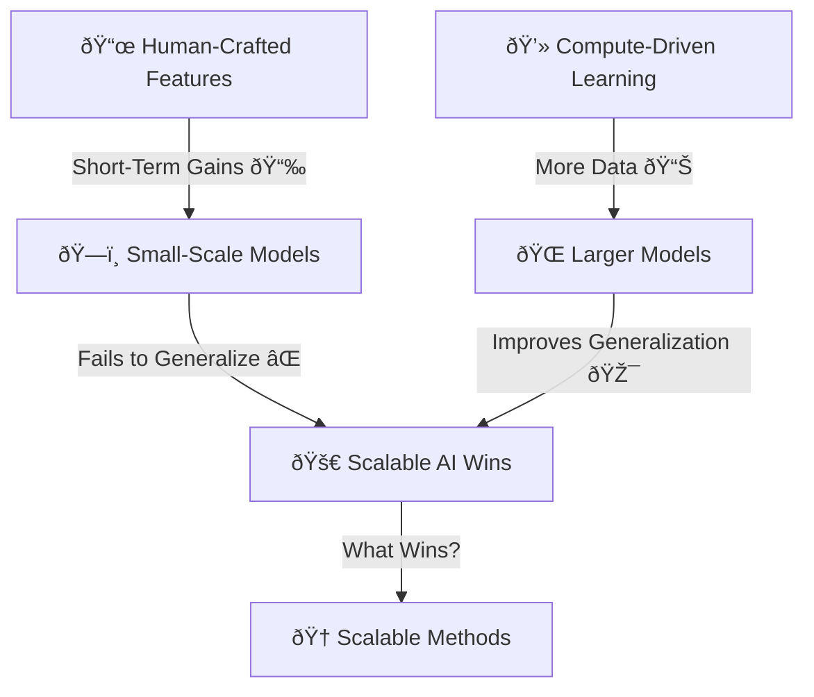

# 🧠 **Dirk Groeneveld's Insight on AI Training & Loss Monitoring**

---

## 📚 **Introduction**
- **Training AI models is not just about forward passes** but about **constant monitoring and adaptation**. 🔄  
- **Dirk Groeneveld highlights a key insight**:
  - AI researchers obsessively monitor loss curves 📉.
  - Spikes in loss are **normal**, but **understanding their causes is crucial**. 🔠 
  - The response to loss spikes includes **data mix adjustments, model restarts, and strategic tweaks**.  

---

## 🎯 **Key Aspects of AI Training Monitoring**
### ✅ **1. Loss Monitoring & Spike Interpretation**
- **Researchers check loss values frequently** (sometimes every 10 minutes). â³  
- Loss spikes can indicate:
  - **Data distribution shifts** 📊  
  - **Model architecture issues** ðŸ—ï¸  
  - **Batch size & learning rate misalignment** âš ï¸  
  - **Overfitting or underfitting trends** 📉  

### ✅ **2. Types of Loss Spikes**
| Type of Loss Spike 🛑 | **Cause 📌** | **Response 🎯** |
|------------------|------------|----------------|
| **Fast Spikes 🚀** | Sudden loss increase due to batch inconsistencies | Stop run & restart training from last stable checkpoint 🔄 |
| **Slow Spikes ðŸ¢** | Gradual loss creep due to long-term data drift | Adjust dataset mix, increase regularization, or modify model hyperparameters âš–ï¸ |

### ✅ **3. Responding to Loss Spikes**
- **Immediate Response:** 🔥  
  - **If the loss explodes suddenly** → Stop the run, restart from the last stable version.  
  - **Adjust the dataset mix** → Change the data composition to reduce bias.  
- **Long-Term Adjustments:**  
  - **Modify training parameters** → Adjust batch size, learning rate, weight decay.  
  - **Refine model architecture** → Introduce new layers or adjust tokenization.  

---

## 📊 **Mermaid Graph: AI Training Loss Monitoring & Response**

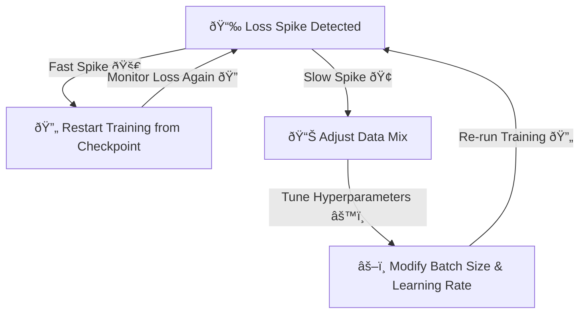


# ðŸ—ï¸ **Model Training, YOLO Strategy & The Path of MoE Experts**  

---

## 📚 **Introduction**
- Training large **language models (LLMs)** requires **hyperparameter tuning, regularization, and model scaling**. ðŸ—ï¸  
- **Frontier Labs' insight:** Model training follows a **clear path** where researchers **must discover the right approach** through **experimentation & iteration**. 🔠 
- **YOLO (You Only Live Once) runs** are key—**aggressive one-off experiments** that push the boundaries of AI training. 🚀  
- **MoE (Mixture of Experts)** adds another dimension—**scaling with dynamic expert activation**. 🤖  

---

## 🎯 **Key Concepts in AI Model Training**
### ✅ **1. Hyperparameter Optimization**
- **Key hyperparameters to tune**:
  - **Learning Rate** 📉 – Controls how fast the model updates weights.  
  - **Regularization** âš–ï¸ â€“ Prevents overfitting (dropout, weight decay).  
  - **Batch Size** 📊 – Affects stability and memory usage.  

### ✅ **2. YOLO Runs: Rapid Experimentation**
- **YOLO ("You Only Live Once") strategy** refers to:
  - **Quick experiments on small-scale models** before scaling up. ðŸŽï¸  
  - **Jupyter Notebook-based ablations**, running on **limited GPUs**. 💻  
  - Testing different:
    - **Numbers of experts** in MoE models (e.g., 4, 8, 128). 🤖  
    - **Active experts per token batch** to optimize sparsity. 🌠 

---

## âš¡ **The Path of MoE Experts**
- **MoE (Mixture of Experts) models** distribute computation across multiple **expert subnetworks**. 🔀  
- **How scaling affects training**:
  - **Start with a simple model** (e.g., 4 experts, 2 active). ðŸ—ï¸  
  - **Increase complexity** (e.g., 128 experts, 4 active). 🔄  
  - **Fine-tune expert routing mechanisms** for efficiency. 🎯  
  - **DeepSeek’s approach** → Larger, optimized expert selection with MLA (Multi-Head Latent Attention). 🚀  

---

## 📊 **Mermaid Graph: YOLO Runs & MoE Expert Scaling**

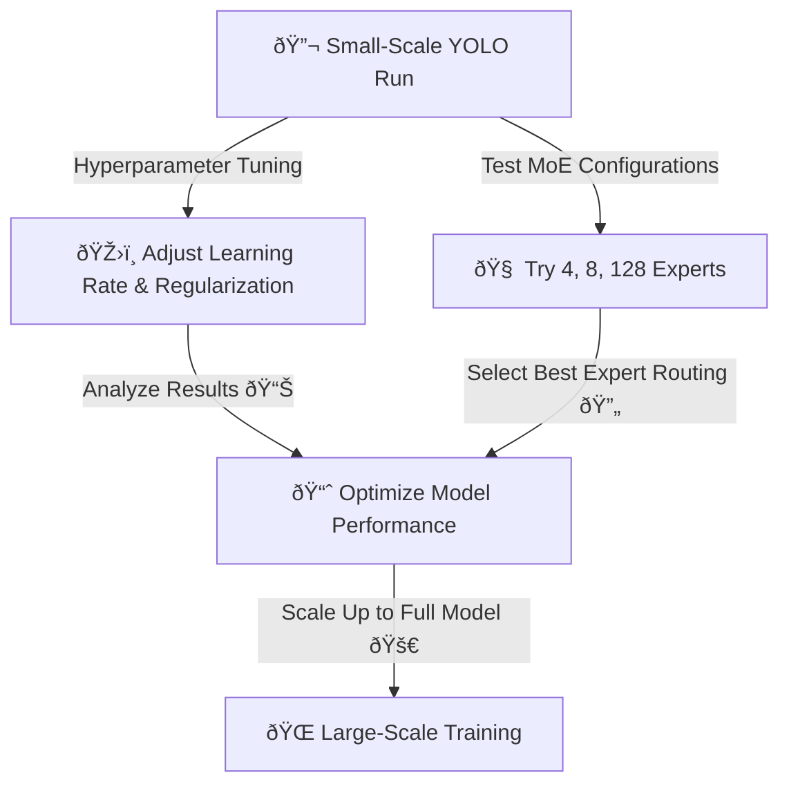


# 🆠**The Pursuit of Mixture of Experts (MoE) in GPT-4 & DeepSeek**  

---

## 📚 **Introduction**
- **In 2022, OpenAI took a huge risk by betting on MoE for GPT-4**. 🔥  
- **At the time, even Google’s top researchers doubted MoE models**. 🤯  
- **DeepSeek followed a similar trajectory**, refining MoE strategies to make it **even more efficient**. 🚀  
- **Now, both OpenAI & DeepSeek have validated MoE as a dominant approach in scaling AI.**  

---

## 🎯 **The MoE Gamble: OpenAI’s YOLO Run with GPT-4**
### ✅ **1. OpenAI’s Bold Move (2022)**
- **Massive compute investment** 💰 → Devoted **100% of resources for months**.  
- **No fallback plan** 😨 → All-in on MoE without prior belief in success.  
- **Criticism from industry** ⌠→ Google & others doubted MoE feasibility.  

### ✅ **2. GPT-4’s MoE: The Payoff**
- **GPT-4 proved MoE works at scale** 🚀.  
- **Sparse activation meant lower training & inference costs** âš¡.  
- **Enabled better performance scaling with fewer active parameters** 🎯.  

---

## 🔥 **DeepSeek’s MoE: Optimized & Scaled**
### ✅ **1. How DeepSeek Improved MoE**
- **More sophisticated expert routing mechanisms** 🧠.  
- **Higher sparsity (fewer experts active per batch)** 🔄.  
- **More efficient compute scheduling, surpassing OpenAI’s MoE** 💡.  

### ✅ **2. The DeepSeek Payoff**
- **Reduced inference costs** 📉 → Only a fraction of experts are active per token.  
- **Better efficiency per FLOP** 🔬 → Enabled trillion-parameter models without linear cost scaling.  
- **MoE is now seen as the path forward for scalable AI** ðŸ—ï¸.  

---

## 📊 **Mermaid Graph: Evolution of MoE from GPT-4 to DeepSeek**

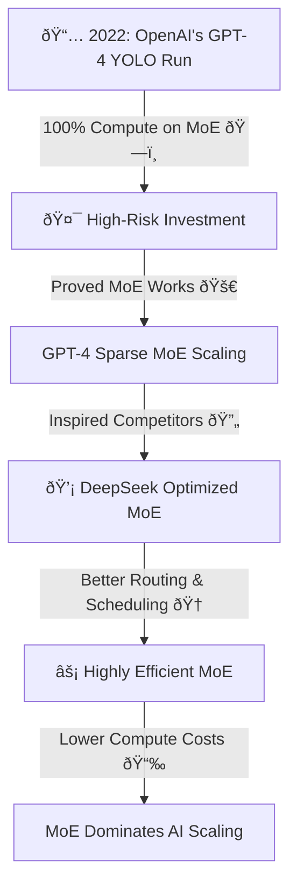


# ðŸ—ï¸ **DeepSeek’s 10K GPU Cluster, Hedge Fund Trading & AI Evolution**  

---

## 📚 **The History of DeepSeek's Compute Power**
- **In 2021, DeepSeek built the largest AI compute cluster in China**. 🚀  
- **10,000 A100 GPUs** were deployed before US export controls began. ðŸŽ›ï¸  
- Initially, the cluster was used **not just for AI, but for quantitative trading**. 📊  

---

## 🎯 **DeepSeek’s Hedge Fund Origins**
### ✅ **1. Computational Trading with AI**
- Before fully focusing on AI models, DeepSeek:
  - **Used AI for quantitative finance** 💹.  
  - **Developed models to analyze stock markets** 📈.  
  - **Automated hedge fund strategies with massive compute** 🤖.  

### ✅ **2. Shift Toward AI & NLP**
- **Over the past 4 years, DeepSeek transitioned from financial AI to full-scale NLP**.  
- **The 10K GPU cluster evolved into a high-performance AI training hub**.  
- **Now, DeepSeek is one of the top AI research labs competing globally**.  

---

## 🔥 **DeepSeek’s Compute Expansion (2021-Present)**
### ✅ **1. Pre-2021: Hedge Fund AI**
- Focus on **quantitative models & trading strategies** 📊.  
- **High-frequency AI-driven trading algorithms**. 🦠 

### ✅ **2. 2021: 10K A100 Cluster**
- Largest compute cluster in China before export bans. 🚀  
- Initially used for **both finance and AI research**.  

### ✅ **3. 2022-Present: AI First Approach**
- Shifted fully to **Mixture of Experts (MoE) and NLP research**. 🧠  
- Competing with OpenAI, Anthropic, and Google. 🆠 

---

## 📊 **Mermaid Graph: DeepSeek’s Compute Evolution**

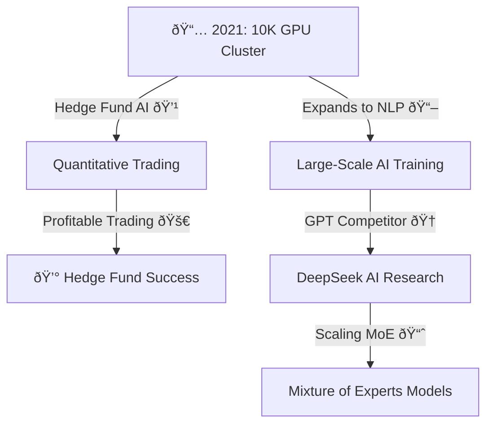


# 🆠**Liang Wenfeng & His AGI Vision**  

---

## 📚 **Who is Liang Wenfeng?**
- **CEO of DeepSeek**, a leading AI company pushing **Mixture of Experts (MoE) models**. 🚀  
- Owns **more than half** of DeepSeek, making him the dominant figure in the company's strategy. 💡  
- Compared to **Elon Musk & Jensen Huang** → A hands-on leader involved in every aspect of AI development. 🔠 

---

## 🎯 **Liang Wenfeng’s AGI Ambition**
### ✅ **1. Deep Involvement in AI**
- Initially **focused on hedge fund strategies**, but later fully embraced AI. 📊  
- Now **obsessed with AGI (Artificial General Intelligence)** and **building a new AI ecosystem**. 🧠  

### ✅ **2. China’s AI Ecosystem Vision**
- **Sees China as a necessary leader in AI** ðŸ¯.  
- Believes Western countries have historically **led in software**, but now **China must take over AI ecosystems**. 🌠 
- Wants **an OpenAI competitor** that is **fully independent & built differently**. 🔄  

### ✅ **3. AGI-Like Mindset**
- Advocates for **a long-term vision beyond narrow AI models**.  
- Some of his **statements give strong AGI-like vibes**, similar to **the Effective Accelerationist (EAC) movement**. 🚀  
- **Wants AI to be as unrestricted & scalable as possible**.  

---

## 📊 **Mermaid Graph: Liang Wenfeng’s AI Vision**

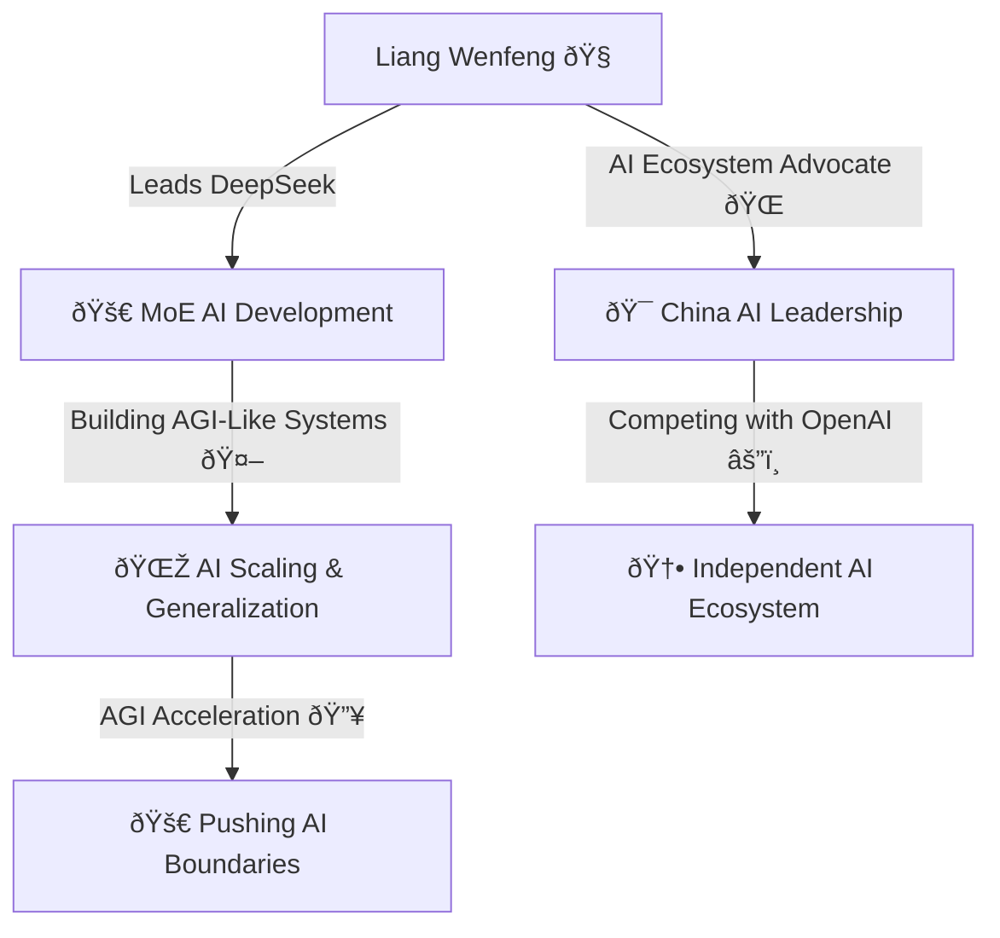


# 🆠**Dario Amodei’s Perspective on AI Export Controls & Why China’s AI Will Still Compete**  

---

## 📚 **Dario Amodei’s Argument for Stronger AI Export Controls**
- **Dario Amodei (CEO of Anthropic) has called for stricter US export controls** on AI chips to China. 🚫💾  
- **His core argument:**  
  - By **2026, AGI or near-superhuman AI could emerge**. 🤖  
  - **Whoever develops this will have a massive military advantage**. ðŸŽ–ï¸  
  - The US, as a **democracy**, should ensure AI power remains in its hands. ðŸ›ï¸  

- **Concern over China’s authoritarian control** ðŸ¯:  
  - A world where **authoritarian AI rivals democratic AI** would create a **geopolitical superpower conflict**. ðŸŒâš”ï¸  

---

## 🎯 **Why Export Controls Won’t Stop China’s AI Progress**
### ✅ **1. China Already Competes at Frontier AI Levels**
- **Despite export restrictions, DeepSeek has built one of the world’s top 3 frontier AI models.** 🆠 
  - **Ranking alongside OpenAI’s GPT-4 and Anthropic’s Claude.**  
  - Shows **AI dominance isn’t solely dependent on GPU access.** ðŸŽ›ï¸  

### ✅ **2. MoE (Mixture of Experts) Makes Compute More Efficient**
- **DeepSeek’s MoE models** activate **only a fraction of parameters per token**, reducing compute needs. 💡  
- **Efficient AI architectures mean China can match US AI models with lower-cost chips.** 💰  
- **Even if China lacks NVIDIA’s top-tier GPUs, its AI scaling strategies compensate.**  

### ✅ **3. AI Research is Global & Open**
- **Breakthroughs in AI aren’t locked behind national borders.** 🌠 
- **China has access to AI papers, models, and methodologies** from top labs worldwide. 📚  
- **Even with hardware restrictions, they can replicate and optimize new techniques.**  

---

## 📊 **Mermaid Graph: The Reality of AI Export Controls vs. China’s AI Rise**

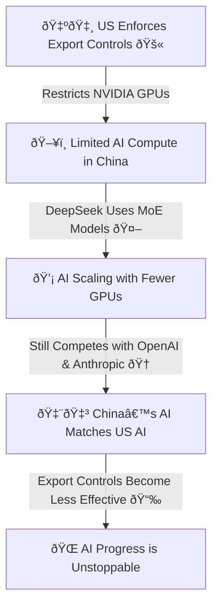


# 🆠**Think-Time Compute & Reasoning Models (R1 & O1)**  

---

## 📚 **What is Think-Time Compute?**
- **Think-time compute** refers to **how much computational power is used at inference** 🖥ï¸.  
- **Reasoning models require significantly more compute per query** compared to traditional AI models. 🤖  
- This is different from training compute, as it **affects real-time model efficiency**.  

---

## 🎯 **Reasoning Models R1 & O1: The Next Step in AI**
### ✅ **1. Designed for Higher Compute at Inference**
- Unlike older models focused on **token efficiency**, R1 & O1 **prioritize deep reasoning**. 🧠  
- They **trade latency for more intelligent responses**, requiring **higher compute at test-time**. 💡  

### ✅ **2. Balancing Training vs. Inference**
- Traditional models:  
  - **Heavy training compute, lower inference cost.** âš¡  
- Reasoning models (R1, O1):  
  - **More balanced, but with significantly higher inference costs.** ðŸ—ï¸  

### ✅ **3. OpenAI’s O3 Model & Industry Trends**
- OpenAI announced **O3**, which follows a similar reasoning-heavy approach. 🚀  
- **As AI advances, inference costs will rise, shifting industry focus to smarter model architectures.** 📈  

---

## 📊 **Mermaid Graph: Compute Usage in AI Models**

```mermaid
graph TD;
    A[Traditional AI Models 🤖] -->|Low Inference Compute ⚡| B[Fast Response Times];
    A -->|High Training Compute ðŸ—ï¸| C[Heavy Pretraining Cost];

    D[Reasoning Models (R1, O1) 🧠] -->|High Inference Compute 🔥| E[Deep Logical Processing];
    D -->|Balanced Training & Inference 📊| F[More Complex Problem Solving];

    C -->|Shift Toward Reasoning AI 🚀| D;
```


# 🆠**François Chollet’s ARC-AGI Benchmark & AI Reasoning Pursuit**  

---

## 📚 **What is the ARC-AGI Benchmark?**
- **ARC (Abstract Reasoning Corpus) is a benchmark for testing AI’s general intelligence.** 🧠  
- It was designed by **François Chollet**, a key researcher in AI, to **evaluate AI’s ability to solve novel problems**.  
- **Unlike traditional ML tasks, ARC focuses on intelligence that resembles human reasoning.**  

### 🎯 **Why ARC is Different from Traditional AI Benchmarks**
✅ **No Memorization:**  
   - ARC **does not allow training on its dataset**. AI models must generalize from first principles. âŒðŸ“š  
✅ **Tests for Core Intelligence:**  
   - ARC is **designed to measure problem-solving, abstraction, and generalization.** ðŸ—ï¸  
✅ **Humans vs. AI Performance:**  
   - **Humans score ~85% on ARC. Most AIs, including GPT models, struggle to surpass 30%.** 🤯  

---

## ðŸ—ï¸ **OpenAI's O3 Performance on ARC**
- OpenAI’s **O3 model attempted to solve ARC tasks** using API calls.  
- **It required 1,000 queries per task**, with an **estimated cost of $5-$20 per question.** 💰  
- **This highlights the extreme computational cost of AI reasoning.** âš¡  

---

## 📊 **Mermaid Graph: ARC-AGI Task Complexity vs. AI Model Performance**
```mermaid
graph TD;
    A[Traditional AI Models 🤖] -->|High Performance on NLP, Vision 📚| B[Low Generalization];
    B -->|Fails on ARC Tasks âŒ| C[Struggles with Abstraction];

    D[ARC-AGI Benchmark 🧠] -->|No Training Data 🚫| E[Tests Raw Intelligence];
    E -->|Humans Score ~85% ✅| F[AIs Score ~30% âŒ];

    G[OpenAI O3 ðŸ—ï¸] -->|1,000 Queries per Task 📊| H[Expensive Reasoning ($5-$20 per query) 💰];
    H -->|AI Still Struggles on ARC Tasks 🚀| I[Need for More Efficient AGI];
```


# 🚀 **The Importance of O3 & Higher Reasoning in AI**

---

## 📚 **Why O3 Matters**
- **O3 represents a step towards autonomous, reasoning-heavy AI models.** 🧠  
- Unlike traditional models that generate responses quickly, **O3 focuses on deep, logical computation.**  
- **Reasoning-heavy AI requires massive test-time compute, making efficiency a key challenge.** âš¡  

---

## 🔑 **Key Features of O3 & High-Reasoning AI**
### ✅ **1. Test-Time Compute Dominance**
- Unlike **static LLMs**, AGI-style models **spend more resources thinking per query**. 🔄  
- **Example:** O3 may take **minutes to hours per task** but delivers far **better reasoning**. ðŸ—ï¸  

### ✅ **2. Spectacular Coding Performance**
- **AI coding assistants are improving drastically with O3-level reasoning.** 💻  
- More complex problems, logic-heavy debugging, and architecture planning become feasible.  

### ✅ **3. Autonomous AI Models**
- **The long-term goal is autonomous AGI that can work in the background on tasks.** 🤖  
- This means **offloading problems to AI**, letting it **analyze, synthesize, and return results.**  
- **Example:** Given a complex query, the AI may **"think" for hours** before providing an optimal answer.  

---

## 📊 **Mermaid Graph: AI Evolution – From Speed to Reasoning Power**
```mermaid
graph TD;
    A[Traditional AI Models 🤖] -->|Fast Responses ⚡| B[Low Computation Cost 💰];
    A -->|Limited Reasoning ðŸ—ï¸| C[Struggles with Complex Problems âŒ];

    D[O3 & Higher Reasoning AI 🧠] -->|Slower Responses â³| E[Deep Logical Computation];
    E -->|Better Decision-Making ✅| F[More Accurate Code Generation];

    C -->|Transition to AGI 🚀| D;
```


# 🤖 **OpenAI Operator & Claude Computer Use: AI Controlling Apps Like a Human**

---

## ðŸ—ï¸ **What is OpenAI Operator?**
- **OpenAI Operator is a method where AI models, like GPT-4, are deployed as "agents" that control software.**  
- These models can **simulate human-like interactions**, such as:
  - Opening & managing applications ðŸ–¥ï¸  
  - Automating workflows 🔄  
  - Navigating UIs like a human would ðŸ–±ï¸  

---

## 🧠 **Claude's Approach to Computer Use**
- **Claude’s AI model by Anthropic is designed for complex reasoning and controlled interactions.**  
- Instead of direct API calls, **Claude can simulate human-like software interactions.**  
- **Used for:**  
  ✅ **Testing web apps via AI-driven automation** 🌠 
  ✅ **Controlling virtual desktops & navigating software like a user** ðŸ–¥ï¸  
  ✅ **Interfacing with tools like Playwright & Selenium to manipulate UI** ðŸ•¹ï¸  

---

## 🔄 **Controlling Apps with AI: The Playwright & Selenium Approach**
### **1ï¸âƒ£ Using Playwright for AI-Driven Web Interaction**
- **Playwright** is a modern web automation tool **designed for controlling browsers programmatically**.  
- **Key AI use cases:**  
  ✅ Web scraping with dynamic JavaScript rendering 🌠 
  ✅ Automating UI testing for AI-assisted web applications âš™ï¸  
  ✅ AI-guided **form filling, navigation, and human-like behavior** 🤖  

### **2ï¸âƒ£ Selenium for AI Browser Control**
- **Selenium allows AI models to interact with web pages in a human-like manner.**  
- **Common AI-driven applications:**  
  - Automating login processes 🔑  
  - Navigating complex sites like **Gmail, Outlook, & Google Drive** 📧  
  - Extracting data from dynamic sites 📊  

---

## 📊 **Mermaid Graph: AI Controlling Apps with Playwright & Selenium**
```mermaid
graph TD;
    A[AI Model 🤖] -->|Generates Commands 🖥ï¸| B[Playwright & Selenium ðŸŒ];
    B -->|Interacts with Web Apps 🕹ï¸| C[Web Forms, Buttons, APIs];
    C -->|AI Observes & Learns 🧠| D[Feedback Loop for Optimization 🔄];
    D -->|Data Extraction & Actions 📊| A;
```

🔑 Why AI-Controlled App Automation Matters
✅ 1. AI-Human Hybrid Workflows
AI doesn’t replace humans but enhances productivity by automating repetitive tasks.
Example: AI can log into accounts, fetch reports, and analyze trends before a human intervenes.
✅ 2. Autonomous AI Agents
AI models will eventually control entire operating systems, performing:
Full desktop automation 🖥ï¸
Complex, multi-step workflows 🔄
AI-powered system optimizations âš™ï¸
✅ 3. AI for Testing & Validation
AI can test apps like a human would, detecting UI bugs before real users do. ðŸž
Example: OpenAI Operator can run end-to-end tests, ensuring an app works across multiple platforms.
🚀 Final Thoughts
Claude, OpenAI Operator, and AI-driven automation are changing how computers are controlled.
Playwright & Selenium let AI interact with apps in a human-like way.
The future is AI autonomously managing digital environments! 🤖


# 🤖 Conversational AI & Its Growing Challenges 💬

## **1ï¸âƒ£ The Rise of AI in Political & Social Influence**
- AI can **mimic human conversation convincingly**, making **AI voice calls indistinguishable from real politicians** 🎙ï¸.
- This has **already happened** in elections like:
  - **India & Pakistan** 🇮🇳 🇵🇰 - AI-generated voice calls were used in campaigns.
  - **U.S. political strategy** 🇺🇸 - Deepfakes and AI-generated speeches are **blurring authenticity**.

🚨 **Issue:** People **can no longer differentiate** whether they are speaking to a real human or an AI bot.

---

## **2ï¸âƒ£ AI Diffusion & Regulatory Concerns**
- Governments are increasingly concerned about AI’s **ability to spread misinformation** 📡.
- **Regulations are expanding**, including:
  - **U.S. AI diffusion rules** ðŸ›ï¸ - Limiting **cloud computing & GPU sales** even to **allied nations** like **Portugal & Singapore**.
  - **Military concerns** ðŸ›¡ï¸ - U.S. is **denying GPUs** even to countries that **own F-35 fighter jets** 🛩ï¸.

🚨 **Issue:** **AI is becoming a national security concern** because it can influence elections, **spread disinformation, and simulate human conversations with strategic intent**.

---

## **3ï¸âƒ£ The Problem of AI-Human Confusion**
- AI chatbots are **more human-like than ever**, making it **difficult to discern AI vs. human speech** 🗣ï¸.
- This creates:
  - **Fake news proliferation** 📰 - AI can **generate and distribute false narratives** automatically.
  - **Scam calls & fraud** â˜Žï¸ - AI can **imitate voices** of real individuals, tricking people into **financial scams or identity fraud**.
  - **Psychological manipulation** 🧠 - AI-generated conversations can **persuade, deceive, or influence** on a large scale.

🚨 **Issue:** **People unknowingly trust AI-generated voices & conversations**, leading to **potential manipulation at scale**.

---

## **🚀 Final Thoughts: The Need for AI Safeguards**
1. **AI Detection Tools** 🔠- We need **AI detectors** that can differentiate AI-generated content from humans.
2. **Stronger Regulations** 📜 - Countries must **update laws** to prevent AI misuse in elections & fraud.
3. **Public Awareness** 📢 - Educating people about **AI-driven deception** is **critical** to prevent manipulation.

🔥 **"The danger isn’t that AI can talk like a human—the danger is that we won’t know when it’s NOT a human."** ðŸ†

---

## **ðŸ•¸ï¸ Mermaid Graph: The Risks of Conversational AI**
```mermaid
graph TD
  A[Conversational AI] -->|Mimics Human Speech| B[Political Influence]
  A -->|Can Spread Misinformation| C[Fake News]
  A -->|Voice Cloning & Deception| D[Scams & Fraud]
  A -->|Persuasive AI| E[Psychological Manipulation]
  
  B -->|Used in Elections| F[Political AI Calls]
  B -->|AI-generated Speeches| G[Deepfake Politicians]

  C -->|Fake News is Viral| H[Public Misinformation]
  C -->|AI-generated News| I[Harder to Detect Truth]

  D -->|AI Voice Fraud| J[Financial Scams]
  D -->|Impersonation of People| K[Identity Theft]

  E -->|Manipulating Social Behavior| L[Public Opinion Shift]
  E -->|Convincing AI Chatbots| M[Social Engineering]

  style A fill:#ffcc00,stroke:#333,stroke-width:2px;
  style B,C,D,E fill:#ff9999,stroke:#333,stroke-width:2px;
  style F,G,H,I,J,K,L,M fill:#ff6666,stroke:#333,stroke-width:1px;
```


# âš¡ Extreme Ultraviolet Lithography (EUVL) & AI Chips

## **1ï¸âƒ£ What is EUVL?** ðŸ­
- **Extreme Ultraviolet Lithography (EUVL)** is a **chip manufacturing process** using **13.5 nm extreme ultraviolet (EUV) light**.
- **Developed by ASML**, it is the most **advanced lithography technique** for producing ultra-small transistors.
- **Key purpose:** Enables **5 nm and 3 nm process nodes** for **high-performance AI and consumer chips**.

🔥 **ASML is the only company in the world** producing EUV machines, making it a critical player in the semiconductor industry.

---

## **2ï¸âƒ£ Huawei’s AI Chip Breakthrough** ðŸ†
- In **2020, Huawei** released the **Ascend 910 AI chip**, the **first AI chip at 7 nm**.
- **Why is this important?**
  - **Beat** Google and Nvidia to **7 nm AI chip production** ðŸ.
  - **Tested on MLPerf benchmark**, proving **top-tier AI performance**.
  - **Designed for AI inference & training**, showing **China’s growing independence** in AI chip manufacturing.

🚨 **Challenge:** The **U.S. banned Huawei** from using TSMC’s **7 nm chips**, forcing China to **develop domestic semiconductor production**.

---

## **3ï¸âƒ£ EUVL & AI Performance Relationship** 🔗
- **Modern AI chips require smaller process nodes** (7 nm → 5 nm → 3 nm) for:
  - **Higher performance** 🚀.
  - **Lower power consumption** 🔋.
  - **Better AI inference and training efficiency** 🎯.
- **MLPerf Benchmark** 📊:
  - **Huawei's Ascend 910 outperformed many competitors**.
  - But **U.S. trade bans delayed future chip production**.

🚨 **Key Risk:** China **lacks EUV machines from ASML**, limiting its ability to **mass-produce advanced AI chips** at 5 nm and below.

---

## **4ï¸âƒ£ The Global AI Chip Race ðŸŒ**
| Company  | AI Chip | Process Node | ML Performance |
|----------|--------|-------------|---------------|
| **Huawei** 🇨🇳 | Ascend 910 | **7 nm** | **Top in MLPerf (2020)** |
| **Google** 🇺🇸 | TPU v4 | **7 nm** | Cloud AI, TensorFlow |
| **Nvidia** 🇺🇸 | A100 | **7 nm** | Deep Learning Leader |
| **Apple** 🇺🇸 | M1 | **5 nm** | High AI efficiency |
| **TSMC** 🇹🇼 | - | **3 nm** | Leading Foundry |

🚨 **Future:**
- **China needs EUVL machines** to reach **3 nm chips**.
- **Huawei is innovating with domestic fabs**, but U.S. bans **slow progress**.

---

## **ðŸ•¸ï¸ Mermaid Graph: The EUVL & AI Chip Supply Chain**
```mermaid
graph TD
  A[EUV Lithography (EUVL)] -->|Required for 7nm & smaller| B[Advanced AI Chips]
  B -->|Higher Performance| C[ML Training & Inference]
  C -->|Better AI Models| D[State-of-the-Art AI]

  A -->|Controlled by ASML| E[Export Restrictions]
  E -->|U.S. Blocks China| F[Huawei & Domestic Chips]
  F -->|Forced to Use Older Tech| G[AI Chip Lag]

  style A fill:#ffcc00,stroke:#333,stroke-width:2px;
  style B,C,D fill:#99ccff,stroke:#333,stroke-width:2px;
  style E,F,G fill:#ff6666,stroke:#333,stroke-width:1px;
```


# 🌠The Role of Semiconductors in AI Growth & Global Chip Making

## **1ï¸âƒ£ Why Are Semiconductors Critical?**
- Semiconductors power **everything in modern AI**:
  - **AI Training & Inference** 🧠 (GPUs, TPUs, NPUs).
  - **Autonomous Systems** 🚗 (Self-driving cars, IoT).
  - **Consumer Electronics** 📱 (Phones, fridges, TVs).
  - **Data Centers & Cloud Computing** â˜ï¸.
- **Moore’s Law**: Chip size **shrinks** → AI performance **increases** 🚀.

---

## **2ï¸âƒ£ The Global AI Chip Supply Chain ðŸŒ**
- **AI chips are heavily dependent on a few key players**:
  - **🇳🇱 ASML** → **EUV Lithography** (Only supplier for 5 nm & 3 nm).
  - **🇹🇼 TSMC** → **World leader in AI chip manufacturing** (Nvidia, Apple).
  - **🇺🇸 Nvidia, AMD, Intel** → **Design AI hardware**.
  - **🇨🇳 Huawei, SMIC** → **China’s AI chip effort**.

---

## **3ï¸âƒ£ Why Semiconductors Are a Geopolitical Weapon âš”ï¸**
- **U.S. export bans** prevent China from accessing:
  - **EUV machines** from ASML 🚫.
  - **Advanced AI GPUs** from Nvidia & AMD.
  - **Key semiconductor components**.
- **Impact on AI Growth**:
  - **China must develop domestic chips**.
  - **U.S. dominance in AI remains strong**.
  - **Global supply chain disruptions** hurt innovation.

---

## **4ï¸âƒ£ Semiconductor Demand in AI 🚀**
| AI System  | Chip Type | Manufacturer |
|------------|----------|--------------|
| **GPT-4 & Claude** | **H100 & A100 GPUs** | **Nvidia (🇺🇸)** |
| **Tesla FSD AI** | **Dojo AI Supercomputer** | **Tesla (🇺🇸)** |
| **China’s AI Push** | **Ascend 910B** | **Huawei (🇨🇳)** |
| **Apple AI on Device** | **M3 Chip** | **TSMC (🇹🇼)** |

🚀 **Trend**: AI chips **consume more compute** → Demand **skyrockets**.

---

## **5ï¸âƒ£ AI Chip Supply Chain & Global Dependencies 🕸ï¸**
```mermaid
graph TD
  A[Semiconductor Manufacturing] -->|EUV Lithography| B[ASML 🇳🇱]
  B -->|Produces 5 nm & 3 nm Chips| C[TSMC 🇹🇼]
  C -->|Supplies AI Chips To| D[Nvidia, Apple, AMD 🇺🇸]
  D -->|Powers AI Training & Inference| E[OpenAI, Google, Tesla]
  E -->|Develops AI Models| F[AI Market Growth 🚀]

  A -->|Limited Access| G[China's Domestic Effort 🇨🇳]
  G -->|SMIC & Huawei Workarounds| H[7 nm AI Chips]
  H -->|Limited Performance| I[Catch-up to TSMC & Nvidia]

  style A fill:#ffcc00,stroke:#333,stroke-width:2px;
  style B,C,D,E,F fill:#99ccff,stroke:#333,stroke-width:2px;
  style G,H,I fill:#ff6666,stroke:#333,stroke-width:2px;
```

ASML: The Backbone of AI & Semiconductor Manufacturing
🔹 What is ASML?
ASML (Advanced Semiconductor Materials Lithography) is a Dutch company that builds the world's most advanced semiconductor manufacturing machines.
They are the only company in the world that produces Extreme Ultraviolet Lithography (EUV) machines ðŸ­.
Without ASML, no one can manufacture the latest AI chips at 5 nm, 3 nm, and beyond 🚀.
🔹 Why is ASML Important for AI?
AI chips need smaller transistors (e.g., H100, A100 GPUs, Apple M3).
EUV lithography allows chipmakers like TSMC & Samsung to print ultra-fine circuits.
Without ASML, we can’t shrink chips → No Moore’s Law → No AI acceleration 🚀.


```mermaid
graph TD
  A[ASML 🇳🇱] -->|Supplies EUV Lithography Machines| B[TSMC 🇹🇼]
  B -->|Fabricates AI Chips| C[Nvidia, AMD, Intel 🇺🇸]
  C -->|Supplies GPUs & AI Chips| D[OpenAI, Google, Tesla 🤖]
  D -->|Powers AI Training & Inference| E[AI Growth 🚀]

  style A fill:#ffcc00,stroke:#333,stroke-width:2px;
  style B,C,D,E fill:#99ccff,stroke:#333,stroke-width:2px;
```
