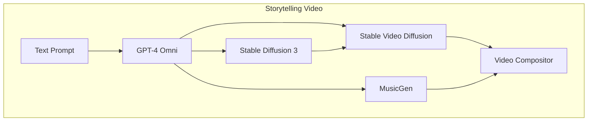
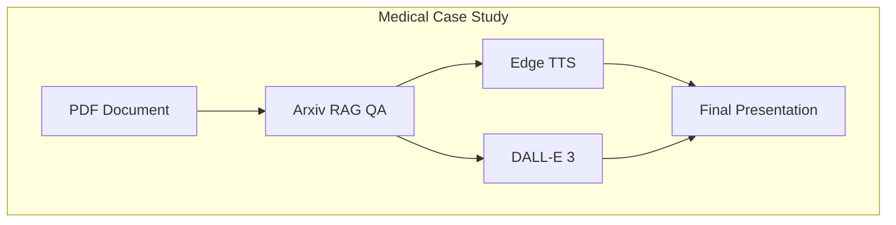
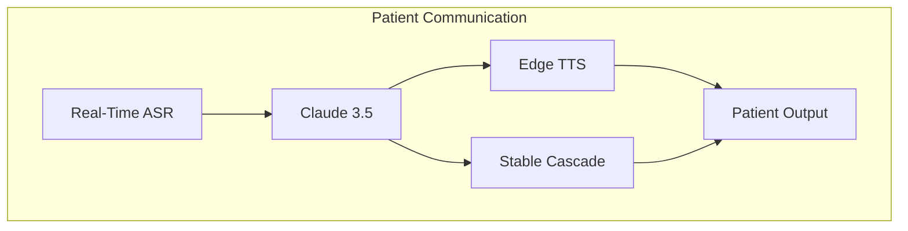
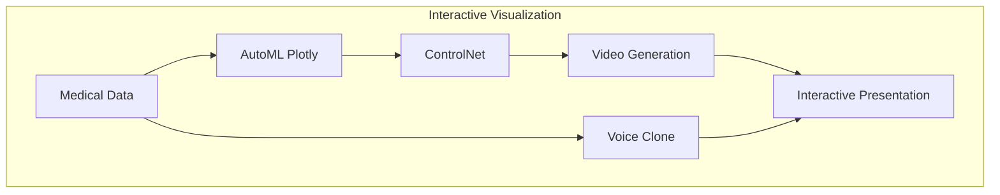

# AI Multimodal Media Workflows and Pipelines

# Text-to-Video with Music

# Medical Documentation to Multimedia

# Real-time Patient Interaction

# Medical Training Content

# Interactive Medical Visualization

