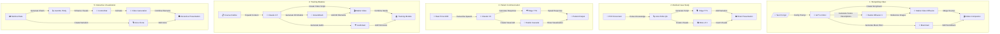

```mermaid
graph TD
    %% 1: Storytelling Video
    subgraph "1: Storytelling Video"
        T1[/"📝 Text Prompt"/] -->|"Fortify Prompt"| GPT["🤖 GPT-4 Omni"]
        GPT -->|"Generate Scene Descriptions"| IMG["🎨 Stable Diffusion 3"]
        GPT -->|"Create Storyboard"| VID["🎥 Stable Video Diffusion"]
        IMG -->|"Reference Images"| VID
        GPT -->|"Generate Music Brief"| AUD["🎵 MusicGen"]
        VID -->|"Merge Scenes"| COMP["🎬 Video Compositor"]
        AUD -->|"Add Soundtrack"| COMP
    end

    %% 2: Medical Documentation to Multimedia
    subgraph "2: Medical Case Study"
        DOC["📄 PDF Document"] -->|"Extract Knowledge"| RAG["🔍 Arxiv RAG QA"]
        RAG -->|"Generate Script"| TTS["🗣️ Edge TTS"]
        RAG -->|"Create Visuals"| IMG2["🖼️ DALL-E 3"]
        TTS -->|"Add Narration"| FINAL["📊 Final Presentation"]
        IMG2 -->|"Insert Visuals"| FINAL
    end

    %% 3: Real-time Patient Interaction
    subgraph "3: Patient Communication"
        SPEECH["🎤 Real-Time ASR"] -->|"Transcribe Speech"| CLAUDE["🧠 Claude 3.5"]
        CLAUDE -->|"Generate Response"| TRANS["🔊 Edge TTS"]
        CLAUDE -->|"Create Visual Aid"| VIS["📸 Stable Cascade"]
        TRANS -->|"Speak Response"| OUT["👥 Patient Output"]
        VIS -->|"Show Visualization"| OUT
    end

    %% 4: Medical Training Content
    subgraph "4: Training Material"
        PROMPT["📋 Course Outline"] -->|"Expand Content"| LLM["🤖 Claude 3.5"]
        LLM -->|"Generate 3D Models"| MESH["💠 InstantMesh"]
        LLM -->|"Create Video Script"| SVID["🎬 Stable Video"]
        MESH -->|"Add 3D Elements"| SVID
        LLM -->|"Generate Audio"| AUDIO["🔉 AudioGen"]
        SVID -->|"Combine Media"| FINAL2["📚 Training Module"]
        AUDIO -->|"Add Voiceover"| FINAL2
    end

    %% 5: Interactive Medical Visualization
    subgraph "5: Interactive Visualization"
        DATA["📊 Medical Data"] -->|"Generate Charts"| PLOT["📈 AutoML Plotly"]
        PLOT -->|"Enhance Visuals"| IMG3["🎨 ControlNet"]
        IMG3 -->|"Animate"| VID2["🎥 Video Generation"]
        DATA -->|"Create Narration"| VOICE["🎙️ Voice Clone"]
        VID2 -->|"Combine Elements"| PRESENT["🖥️ Interactive Presentation"]
        VOICE -->|"Add Voice"| PRESENT
    end

```
