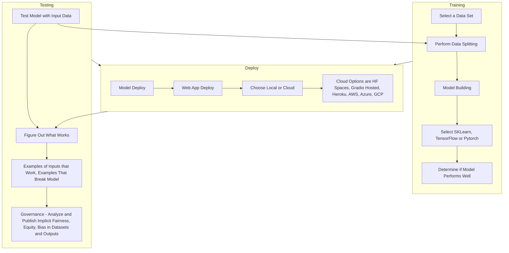
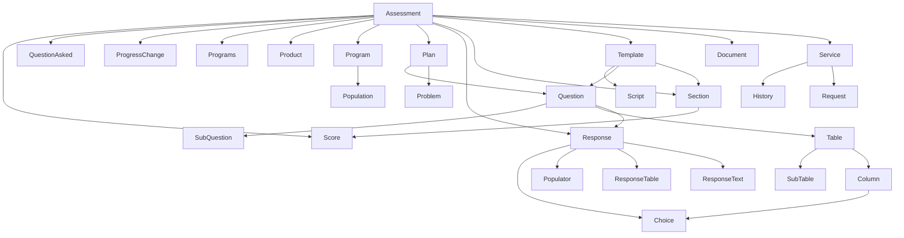
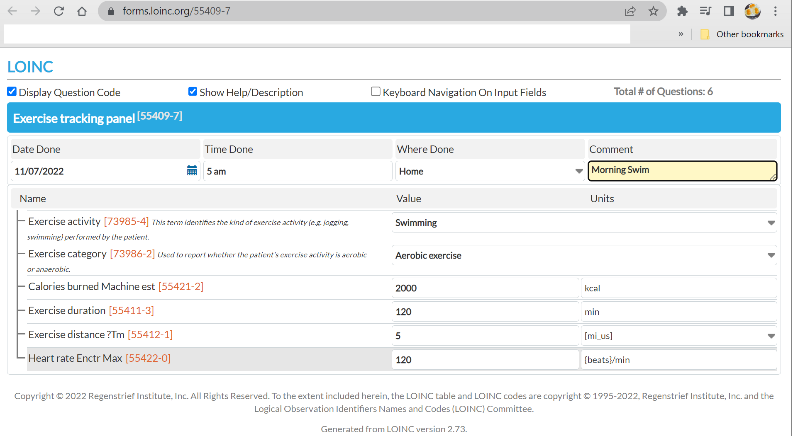

# Yggdrasil
Knowledge Tree of Love, Life, AI, Genomics, Natural Language Processing and Machine Learning

# Structured Data Capture, Ontology, and Open Source Health SDK and Tools

1. AidBox SDK for SDC: https://github.com/AaronCWacker/aidbox-sdc
2. Lister Hill Python CDC Tables: https://github.com/AaronCWacker/ListerHillPython-CDCTables
3. Py Meta Map Lite for Clinical Terminologies: https://github.com/AaronCWacker/ListerHillPython-pymetamaplite
4. Lister Hill Py SDK for Medline Scheduler: https://github.com/AaronCWacker/ListerHillPython-skr_web_python_api
5. Lister Hill Py Spreadsheet to Concept Map:  https://github.com/AaronCWacker/ListerHillPython-Spreadsheet-to-ConceptMap
6. Python UMLS Interfaces to API: https://github.com/AaronCWacker/py-umls
7. Python SDC Services: https://github.com/AaronCWacker/sdc-services
8. Web Protege for Ontology: https://github.com/AaronCWacker/webprotege


# AI Music Generators:
1. Soundraw : https://soundraw.io/edit_music?length=180&tempo=low,normal,high&mood=Happy
2. Ampermusic : https://score.ampermusic.com/4oduB0pnSzmwSbltIhnJesdqMtsD/workspace/
3. Aiva: https://creators.aiva.ai/create
4. Boomy: https://boomy.com/
5. Musenet: https://openai.com/blog/musenet/
6. https://huggingface.co/spaces/kboaten/MIDI-Audio-Extension
7. https://huggingface.co/spaces/Mubert/Text-to-Music
8. https://huggingface.co/spaces/lukewys/midi-ddsp
9. https://melobytes.com/en/app/ai_melobytes_song

# AI Zero to Hero Examples - 12/15/2022

## Models and Spaces - Three Last Updates:
1. Big Code Search: https://huggingface.co/spaces/awacke1/BigCodeStackSearch
2. Clinical Terminology Search: https://huggingface.co/spaces/awacke1/ClinicalTerminologyAISearch
3. Dataset Analyzer: https://huggingface.co/spaces/awacke1/DatasetAnalyzer

## Models and Spaces - Three Top Likes
1. Image to Line Drawing: https://huggingface.co/spaces/awacke1/Image2LineDrawing
2. Flamingo Image Understanding: https://huggingface.co/spaces/awacke1/Flamingo-Gradio-ImageDescribe
3. Health and Mindful Story Gen: https://huggingface.co/spaces/awacke1/Sentence2Paragraph

## Models and Spaces - Three Top SOTA
1. M4Singer - AI That Can Sing:  https://huggingface.co/spaces/zlc99/M4Singer
2. Inkpunk Diffusion- SD Space Creator:  https://huggingface.co/spaces/Sambosis/Inkpunk-Diffusion
   1. Try prompt "Health Care Icon Set blue and orange with white background"
3. Positive Reframing:  https://huggingface.co/spaces/Ella2323/Positive-Reframing
   1. Try variants with this prompt: "Covid has me down.  I felt really sick this week and had a bad fever."

## Datasets and Autotrain
1. Images and Image Prompt Text
   1. Logo Generation	https://huggingface.co/datasets/AmanK1202/LogoGeneration
   2. Bene Logos	https://huggingface.co/datasets/AmanK1202/BeneLogos
   3. WIkiArt	https://huggingface.co/datasets/Artificio/WikiArt
2. Medicine and Mental Health
   1. 14-07-22/wikimedqa	https://huggingface.co/datasets/14-07-22/wikimedqa
   2. Disease	https://huggingface.co/datasets/AdithyaSNair/disease
3. Articles and Summaries for AI, NLP and Engineering
   1. ACL-OCL/acl-anthology-corpus	[ACL-OCL/acl-anthology-corpus](https://huggingface.co/datasets/ACL-OCL/acl-anthology-corpus)
   2. Patents Claims https://huggingface.co/datasets/AI-Growth-Lab/patents_claims_1.5m_traim_test
   3. Abstracts	https://huggingface.co/datasets/Artifact-AI/arxiv_abstracts_specter_faiss_flat_index
4. Software and Code for Programs Which Write Programs
   1. Code Net https://huggingface.co/datasets/Abirate/code_net_dataset
   2. Code Snippets	https://huggingface.co/datasets/AhmedSSoliman/CoNaLa-Large
   3. Code Glue	https://huggingface.co/datasets/AhmedSSoliman/CodeXGLUE-CONCODE
5. Quotes, Expert Use of Language, Worthy of Repeating
   1. English Quotes	https://huggingface.co/datasets/Abirate/english_quotes
   2. Comedy	https://huggingface.co/datasets/AlekseyKorshuk/comedy-scripts
   3. Leadership Advice	https://huggingface.co/datasets/AlekseyKorshuk/dalio-all-io
   4. Drama	https://huggingface.co/datasets/AlekseyKorshuk/drama-books
   5. Horror Scripts	https://huggingface.co/datasets/AlekseyKorshuk/horror-scripts
   6. Trivia	https://huggingface.co/datasets/AmazonScience/mintaka
   7. DBPedia	https://huggingface.co/datasets/BeIR/dbpedia-entity
      1. https://huggingface.co/datasets/BeIR/dbpedia-entity-generated-queries
      2. https://huggingface.co/datasets/BeIR/dbpedia-entity-qrels
6. Sentiment, Episodic Memory, Feelings, and Cognitive Technology
   1. Empathetic Dialogue	https://huggingface.co/datasets/Adapting/empathetic_dialogues_v2
   2. Empathetic Dialogue With Tokens	https://huggingface.co/datasets/Adapting/empathetic_dialogues_with_special_tokens
   3. Activity Identification	https://huggingface.co/datasets/AlekseyKorshuk/hellaswag
   4. Intent	https://huggingface.co/datasets/Bhuvaneshwari/intent_classification
   5. Bias AntiStereotyping	https://huggingface.co/datasets/BigScienceBiasEval/crows_pairs_multilingual
   

# Life Lessons

1. Support others and friends under attack
2. Safe, healthy and positive experience is healthy content.
3. Reconcile free speech with rights
4. Screenshots and Twitter handles
5. Restorative Justive
6. An Apology
7. Do no more harm
8. Aint no hollaback girl: https://www.youtube.com/watch?v=Kgjkth6BRRY
9. When you are providing for your family, you are doing the right thing.  You deserve to feel your heart and mind are valuable.
10. Accountability is love.  Change each other.
11. you will hear suggestions to change.   Dont change: https://www.youtube.com/watch?v=9rlNpWYQunY

# AI Zero to Hero Examples - 12/08/2022

1. Clinical Terminology Search: https://huggingface.co/spaces/awacke1/ClinicalTerminologyAISearch
2. Datasets: https://huggingface.co/spaces/awacke1/DatasetAnalyzer
3. Chemistry Compound Modeler: https://huggingface.co/spaces/awacke1/ChemistryMoleculeModeler
4. PromptArt: https://huggingface.co/spaces/awacke1/AIPromptSearch
5. BigCodeSearch:  https://huggingface.co/spaces/awacke1/BigCodeStackSearch
6. Mindful Story:	https://huggingface.co/spaces/awacke1/Sentence2Paragraph
7. 2D to 3D: https://huggingface.co/spaces/awacke1/3DModelEditorWithAIV1
8. Speech Gen:  https://huggingface.co/spaces/awacke1/TTS-STT-Blocks
9. Flamingo Image Describe: https://huggingface.co/spaces/awacke1/Flamingo-Gradio-ImageDescribe
10. Gallery Sample: https://huggingface.co/spaces/awacke1/Gradio-Gallery-Health-Medical-Icon-Sets

# Datasets of Holding
The following datasets have original properties valuable in domain specific machine learning and form quite interesting stored knowledge graphs of illuminating text, images, art, science, medicine, and more.
These are curated and sorted by particular groups that I find interesting.

1. Images and Image Prompt Text
   1. 0xJustin/Dungeons-and-Diffusion	https://huggingface.co/datasets/0xJustin/Dungeons-and-Diffusion
   2. Logo Generation	https://huggingface.co/datasets/AmanK1202/LogoGeneration
   3. Bene Logos	https://huggingface.co/datasets/AmanK1202/BeneLogos
   4. WIkiArt	https://huggingface.co/datasets/Artificio/WikiArt
2. Medicine and Mental Capabilities
   1. 14-07-22/wikimedqa	https://huggingface.co/datasets/14-07-22/wikimedqa
   2. Disease	https://huggingface.co/datasets/AdithyaSNair/disease
3. Articles and Summaries for AI, NLP and Engineering
   1. ACL-OCL/acl-anthology-corpus	[ACL-OCL/acl-anthology-corpus](https://huggingface.co/datasets/ACL-OCL/acl-anthology-corpus)
   2. Patents Claims https://huggingface.co/datasets/AI-Growth-Lab/patents_claims_1.5m_traim_test
   3. Abstracts	https://huggingface.co/datasets/Artifact-AI/arxiv_abstracts_specter_faiss_flat_index
4. Software and Code for Programs Which Write Programs
   1. Code Net https://huggingface.co/datasets/Abirate/code_net_dataset
   2. Code Snippets	https://huggingface.co/datasets/AhmedSSoliman/CoNaLa-Large
   3. Code Glue	https://huggingface.co/datasets/AhmedSSoliman/CodeXGLUE-CONCODE
5. Quotes, Expert Use of Language, Worthy of Repeating
   1. English Quotes	https://huggingface.co/datasets/Abirate/english_quotes
   2. Comedy	https://huggingface.co/datasets/AlekseyKorshuk/comedy-scripts
   3. Leadership Advice	https://huggingface.co/datasets/AlekseyKorshuk/dalio-all-io
   4. Drama	https://huggingface.co/datasets/AlekseyKorshuk/drama-books
   5. Horror Scripts	https://huggingface.co/datasets/AlekseyKorshuk/horror-scripts
   6. Trivia	https://huggingface.co/datasets/AmazonScience/mintaka
   7. DBPedia	https://huggingface.co/datasets/BeIR/dbpedia-entity
      1. https://huggingface.co/datasets/BeIR/dbpedia-entity-generated-queries
      2. https://huggingface.co/datasets/BeIR/dbpedia-entity-qrels
6. Sentiment, Episodic Memory, Feelings, and Cognitive Technology
   1. Empathetic Dialogue	https://huggingface.co/datasets/Adapting/empathetic_dialogues_v2
   2. Empathetic Dialogue With Tokens	https://huggingface.co/datasets/Adapting/empathetic_dialogues_with_special_tokens
   3. Activity Identification	https://huggingface.co/datasets/AlekseyKorshuk/hellaswag
   4. Intent	https://huggingface.co/datasets/Bhuvaneshwari/intent_classification
   5. Bias AntiStereotyping	https://huggingface.co/datasets/BigScienceBiasEval/crows_pairs_multilingual

   


# Writing Programs that Write Programs
1. Quine - program that takes no input and outputs its own source
2. Python: s='s=%r;print(s%%s)';print(s%s)
3. Biological self replication - biological cells with dna, code which replicates DNA.

# Future Directions in Programming
1. Structure Editor for Racket - Edit allows you to modify living structure
2. Racket - Pattern matching - Self Documenting
3. DataRabbit - Visualization in Closure - DataViz, Refinement
4. Clerk - Editor and View with contents of namespacce working on
   1. Version control of notebook
   2. Literate programming - markdown and text
   3. Minimal coding
5. Grab sliders and change in real time
6. Clerk - Visual interaction and talk to databases and filesystems
7. Hazel - L like holes - improved interfaces - holes
   1. Student interfaces
   2. TYLR - David Moons Twitter
8. David Moon, Andrew Glin - Livelets $ Data is shown as dataframe inline with source ccode
   1. Interactive views
9. Enzo - Projectional representation - lines to boxes - edit both sides
10. Text - Ivan Reese, Factorial  -  Jack Rusher

# AI Pipeline Suite
Best in 3D animation, Image from prompt, Chat with Memory, Datasets, Speech to Text to Speech, Medical NER, ASR Live, Health and Mindful Story Gen
1. https://github.com/AaronCWacker/Yggdrasil/edit/main/README.md
2. https://huggingface.co/awacke1
3. https://huggingface.co/spaces/awacke1/3DModelEditorWithAIV1
4. https://huggingface.co/spaces/awacke1/AIPromptSearch
5. https://huggingface.co/spaces/awacke1/CB-GR-Chatbot-Blenderbot
6. https://huggingface.co/spaces/awacke1/FreddysDatasetViewer
7. https://huggingface.co/spaces/awacke1/TTS-STT-Blocks
8. https://huggingface.co/spaces/awacke1/Biomed-NER-SNOMED-LOINC-CQM
9. https://huggingface.co/spaces/awacke1/ASR-SOTA-NvidiaSTTMozilla
10. https://huggingface.co/spaces/awacke1/Sentence2Paragraph


# Music Writer AI
## Main Idea - AI music understanding and analysis for writing and playing options along with sheet music and chord diagram outputs

Have AI watch a video with lyrics, while also watching a scrolling selection of piano chords and lyrics to be able to generate an output video with lyrics, chords, and analysis of instrument play, singing and lyrics

Goal is only to have a sing along AI which attempts to show anyone who wants to play or sing along with a song to share in the experience without prior knowledge of what lyrics to use or what notes to play, only that each person can watch the output and be able to enjoy while singing or playing along in real time, with an output which would allow musicians to then do the same by memory again without any guidance.

AI training gets all resources together with no instructions.  Multimodal AI understanding of NLP tasks, self supervised training, and AGI methods which include one computer just watching and listening to video of second computer provides the GAN based architecture of player/listener pair programming where one computer shows text, audio, video in multiple browser windows and the AI generator uses attention heads and transformers along with semantic and episodic memory to infer meaning live and in real time as a human would.

Samples for AI to observe as ground truth:
1. Bros
   - Lyrics, Audio: https://www.youtube.com/watch?v=P6tAVXcWeI4
   - Piano chords and Lyrics: - https://tabs.ultimate-guitar.com/tab/wolf-alice/bros-chords-1735427
2. Kisses 
   - Lyrics, Audio - https://www.youtube.com/watch?v=8eQtmVajhxQ
   - https://www.youtube.com/watch?v=8eQtmVajhxQ
   - https://tabs.ultimate-guitar.com/tab/wolf-alice/dont-delete-the-kisses-chords-2081561
3. Delicious 
   - https://www.youtube.com/watch?v=JfvN4UQrsHY
   - https://tabs.ultimate-guitar.com/tab/wolf-alice/delicious-things-chords-3738035
4. Blush
   - https://youtu.be/liYyyoAgc_4
   - https://tabs.ultimate-guitar.com/tab/wolf-alice/blush-chords-1747581
5. Fluffy
   - https://www.youtube.com/watch?v=dwpDQip0J-4
   - https://www.youtube.com/watch?v=UkghyKKQDss
   - https://tabs.ultimate-guitar.com/tab/wolf-alice/fluffy-chords-1715649
6. Freazy
   - https://tabs.ultimate-guitar.com/tab/wolf-alice/freazy-chords-1769717
7. Groove
   - https://www.youtube.com/watch?v=etviGf1uWlg
8. Foo
   - https://youtu.be/5a_AigNZYZc
9. Adored
   - https://www.youtube.com/watch?v=LFFX0Lvbbmw
   - https://tabs.ultimate-guitar.com/tab/the-stone-roses/i-wanna-be-adored-chords-1715567
10. Smile
   - https://tabs.ultimate-guitar.com/tab/wolf-alice/smile-chords-3672704
   - https://www.youtube.com/watch?v=NV39h7GHDYs
   - https://www.youtube.com/watch?v=Wq7g9j5149E
11. Love
   - https://youtu.be/VMXNtSKstv4
12. Light
   - https://youtu.be/3nr6VQI_7Ik
   - https://tabs.ultimate-guitar.com/tab/wolf-alice/the-last-man-on-earth-chords-3582701
 13. Blue
   - https://youtu.be/AraEB55ynPc
 14. Smile
   - https://www.youtube.com/results?search_query=mona+lisa+smile+lyrics
   - https://www.youtube.com/watch?v=z71df68qLp0
   - https://www.youtube.com/watch?v=8mbAClggFMs
   - https://www.youtube.com/watch?v=8mbAClggFMs&list=RD8mbAClggFMs&start_radio=1
   - https://www.youtube.com/watch?v=Y6RjOJaqOWY
   - https://youtu.be/GqPysg2m95A
   - https://youtu.be/X5cu7pPmv44
   - https://www.youtube.com/watch?v=Pk4nKhpzex0
   - https://www.youtube.com/watch?v=nYN2SDjnNW8


# Mermaid Graph in Markdown

Here is a simple flow chart:




# LOINC Assessment Example
1. Panels https://loinc.org/panels/
2. Clinical Assessments Scales and Measures https://loinc.org/panels/category/clinical-assessments-scales-measures/
3. Physical Activity Exercise https://loinc.org/panels/category/clinical-assessments-scales-measures/physical-activity-exercise/
4. SDC Form : 

https://github.com/AaronCWacker/Yggdrasil/blob/main/images/LOINCAssessmentExerciseTrackingPanel-55409-7.png

# LOINC, SNOMED-CT, eCQM in Health Care

1. Standardized Assessment Measures: https://loinc.org/kb/users-guide/standardized-assessment-measures/
2. Needs Assessment: https://www.findacode.com/snomed/225343006--assessment-of-needs.html
3. Assessment Scales: https://www.findacode.com/snomed/273249006--assessment-scales.html
4. SNOMED CT Starter Guide: https://www.snomed.org/SNOMED/media/SNOMED/documents/doc_StarterGuide_Current-en-US_INT_20140731.pdf
5. Electronic Clinical Quality Measures Basics: https://www.cms.gov/regulations-and-guidance/legislation/ehrincentiveprograms/clinicalqualitymeasures
6. Electronic Clinical Quality Measures (eCQM) Overview: https://qualitynet.cms.gov/inpatient/measures/ecqm
7. eCQM Measures: https://www.cms.gov/regulations-and-guidance/legislation/ehrincentiveprograms/clinicalqualitymeasures
8. 2022 Hospital IQR Requirements: https://blog.medisolv.com/articles/2022-hospital-iqr-requirements
9. Medicaid Promoting Interoperability (PI) Program: https://healthcurrent.org/wp-content/uploads/Final-Frequently-Asked-Questions-Clinical-Quality-Measures.pdf
10. eCQM Tools for Testing: https://ecqi.healthit.gov/taxonomy/term/311
11. eCQM Certification: https://www.ncqa.org/programs/data-and-information-technology/hit-and-data-certification/ecqm-certification/
12. eCQM Example: Weight Assessment and Counseling for Nutrition and Physical Activity: https://help.practicefusion.com/s/article/eCQM-Weight-Assessment-and-Counseling-for-Nutrition-and-Physical-Activity-for-Children-and-Adolescents-CMS-155v5
13. eCQM Measures: https://www.ihs.gov/rpms/packagedocs/ECQM/ecqm030o_Measure_Guidance_Manual.pdf
14. BioPortal - Health Assessment Questionnaire: https://bioportal.bioontology.org/ontologies/SNOMEDCT?p=classes&conceptid=273510007

# AI NLP for Clinical Terminology Automatic Questions and Answers for Clinical Assessments with Assistive Programs

1. https://www.youtube.com/c/HuggingFace
2. https://www.youtube.com/watch?v=r38lXjz3g6M&list=PLHgX2IExbFov_5_4WfkesR7gnWPHHG-a1


# Mnemonic Cards - Samples Inner Frame Design:


## Aces
1. Ace of Diamonds Samples:


2. Ace of Hearts Samples:


3. Ace of Clubs:


4. Ace of Spades:


## Two - Eyeglasses


# Card Game Design for Developing Mnemonic Memory Techniques to Enhance Semantic and Episodic Memory

This plan is designed to assist creating superhuman memory which is useful for aging adults to circumvent early onset of adult dimensia and to counter effects of alzheimers disease using multiple memory system techniques called **Mnemonics**.  This technique teaches both how to **count cards and how to win** at competitive Blackjack by **improving semantic and emotional (episodic) memory**.

Mnemonics are used for developing **photographic memory capabilities** and to exercise **positive framing Cognitive techniques** which reduce errors in thinking and can help improve lives of sufferers of mental health issues such as depression, anxiety, OCD, MDD, and other issues related to neuroscience, psychology and the human brain.

Basis:
By taking a game that most people have heard of and can play, this plan and system is designed to relate new memory key devices to existing memories in order to improve:
1. Imagery and Vizualization
2. Acronyms and Acrostics
3. Rhymes
4. Chunking

These four strategic structures of human brain neural network and synaptic improvements build a solid model making capability where humans bring into conscious planning and solutions superhuman capabilities which strengthen thinking.

The first part of this solution uses a game that some people know the rules well called "Blackjack".  Blackjack can be played with a deck of cards with card regions which describe the following parts:
1. **Inner Card Frame**
   - Size: Approx 65 pixels width by 121 pixels height or roughly 1x2 the inner card form factor with standard playing cards contains a picture visual composed of parts.
      - Parts: Image first is often card inset top of size 65 px by 62 pixels.  This can be square as well.
      - Parts: Image below is often a mirror of image above so that the card reversed looks the same when rotated eliminating need to sort upside down cards for use.  This also lends itself to be able to see same thing when cards are shuffled and upside down.
      - Design: All design of parts should allow use by disabled persons.  Font size of any writing should pass the bifocals test:
         - Bifocals test.  If you have vision problems, cards need to have readable text large enough and simple enough for reading.
	 - If still readable without glasses or vision assistance the cards can be used in low light environments, and by people with fading vision capability.
	 - Midjourney card prompt for inner frame: Lighthouse with Red Diamonds Cloud Pattern high detail Aces --ar 1:2
2. **Outer Card Frame**
   - Size: Approx 100 pixels width by 152 pixels height with proportion of roughly 1 by 1.5 aspect ratio
   - Design: Corners rounded for cut physical cards have a spline middlepoint of four pixels at corner for rounding of corners which allow cards to be more easily handled and shuffled.
   - Font and text: Typically cards have a Color (black or red) a Suit (Clubs, Diamonds, Hearts, Spades), and a card value which is close to numeric but also identifies face cards which can have additional meaning.  Card Values are as follows:
   1. Ace = 1
   2. 2-10 = Numeric values
   3. J = Jack
   4. Q = Queen
   5. K = King
   6. Optional = Jokers which can also be used as Zero within math number systems.
3. **Deck Size and Card Counting**
   - Deck size can include either 52 or 54 for a standard deck of playing cards.
   - 52 cards in a deck are roughly 13 cards in each of four suits and do not include Jokers / 0.
   - 54 cards in a deck are 13 cards in each of four suits and include Jokers / 0.
   - For mathematics, inclusion of the Joker or zero based number systems allow representation of imaginary numbers.
   - For last 500 years we discovered imaginary numbers are important especially when counting from positives into negatives because the representation of empty sets and null is important in some calculations where a center point between positive and negative is required.  
   - Since four suits and two colors imply a 2D system, there are two zero points (one red Joker, one black Joker)
      1. Left to Right: Horizontal which will be represented by red - a heat scale from cool (Ace) to hot (King).  Hearts and Diamonds are red.
      2. Top to Down: Vertical which will be represented by black - a light scale from dark (Ace) to hot (King). Clubs and Spades are black.
      3. Red versus Black allows teams of two which can be two players or one player and one AI.
      4. Red and Black also allow a binary measurement then of heat and light, which can also be used to represent Mass and Agency
   - Ikigai - a term which refers to four dimensions will be used to emotionally load differences between Suits:
      1. Hearts or Love is Positive therefore from 0 red Joker to K hearts will represent horizontally Left
      2. Diamonds or Riches is negative from 0 red joker to K diamonds will representing horizontally Right
      3. Clubs or Groups of people is positive therefore from 0 black Joker to K clubs will represent vertical Up
      4. Spades or Work is negative from 0 black Joker to King of Spades vertical Down
   - Ikigai has four quadrants.  These are ties to emotional memory and happiness by our purpose in life:
      1. Up (Clubs) - What the world needs - Agency - As we work together in larger groups we increase exponentially in capability.
      2. Down (Spades) - What you are good at - Mass - As we go into a microcosm, even dig down to center of earth, mass and gravity increases.
      3. Left (Hearts) - What you love - In the beginning we are product of love between two people.
      4. Right (Diamonds) - What you get paid for - In the end we accumulate resources and ability to help others.
   - Ikigai quadrants can also specify "Air vs Earth - Up to Down, and Water vs Fire - Left to Right"
4. **Tarot and Action Rules**
   - In the Tarot decks you have 22 value cards.  These cards have values which symbolically represent progression of life
   - Birth - Starting at Zero - Perfect beginning.
   - Death - Ending at 21 - Perfect ending.
   - These Tarot major arcana originated in Celtic systems to describe progressions of the circle of life.
   - Dealing cards in Blackjack (21) and odds of actions to win ratio:
      1. Wizardofodds.com has an odds table containing distinct clusters of recommended actions
      2. Clusters include:
         - H) Hit - Request for dealer to give me more cards
         - S) Stand - Let it ride - I believe I can win with this hand
         - Dh) Double if allowed otherwise hit
         - Ds) Double if allowed otherwise stand
         - P) Split
      3. Four Sub-Clusters exist:
         - Ph - Split if double after split is allowed, otherwise hit
         - Rh - Surrender if allowed, otherwise hit
         - Rs - Surrender if allowed, otherwise stand
         - Rp - Surrender if allowed, otherwise split
5. Getting Started - Sort the Cards
   - Sort Cards In Order and By Suit into Quadrants
   - Black will be up and down
   - Red will be left and right
   - Two Jokers go in Center
6. Once Sorted by Suit, Order Cards from Ace to King
   - Top : 1,2,3,4,5  6,7,8,9,10   J,Q,K   Clubs
   - Bottom: 1,2,3,4,5  6,7,8,9,10  J,Q,K   Spades
   - Left: 1,2,3,4  5,6,7,8  9,10,J,Q,K   Hearts
   - Right: 1,2,3,4  5,6,7,8  9,10,J,Q,k   Diamonds
   - The groupings shown are to accommodate chunking of contiguous elements into one.
   - This mnemonic will also allow chunking to activate neural network chaining and compression where if you know one thing in sequence it leads to another.
   - Uneven grouping allow you to easily know and remember suit
   - Red and Hearts/Diamonds will end with 5- 5 fingers to Trigger recency a mnemonic which lets you most remember what occurred recently in time.
   - Black and Clubs/Spades will center with 5- 5 fingers to Trigger Visual alignment of symmetry which represents mnemonic of beauty where we remember what is beautiful to us.
   - Use the Ikigai or Suit words to modify the visual picture.
      - If for example you are using 9 of hearts to remember keys location on nite table, your visual picture might be:
      - A love cat purring on the nitestand wearing keys around collar jingling as cat dances on top of table.
      - The more interesting, colorful picture you imagine, the stronger the memory will be.
      - By using the modifiers of suits you can then create easy to remember variants of same pegwords without requiring more words.
      - This system should then allow memorizing lists of up to 52 things.
      - If you are remembering multiple lists per day break the lists thematically into the four categories and use those consistently.
      - Choose which suit to use at onset and say it aloud (e.g. for work related use spades, for things about family use hearts..)

7. Peg word system and training base images.
   - Image word systems allow you to create a peg word or word which triggers a visual picture in your memory
   - With this special set of Cards the outer frame is maintained for compatibility with card systems.
   - The inner frame is replaced with these pictures which use at least one form of Mnemonic:

Peg word (Keyword) System Example - Use These or pick your own picture words:
1. Lighthouse - It looks like a 1.
2. Glasses - How many lenses?  2.
3. Stool - How many legs?  3.
4. Window - How many panes?  4.
5. Hand - How many fingers?  5.
6. Dice - How many sides?  6.
7. Heaven or Clouds - Why?  It rhymes.
8. Gate - Why?  It rhymes.
9. Cat - Why?  Cats have nine lives.
10. Toes - Why?  You have ten toes.
11. Jack with Drum sticks - Why - Two drum sticks look like 11.
12. Queen is Boxing - Why?  We have two hands/fists and the one two punch is left right.  Queen is best fighter in Chess.
13. King with Mask - Why?  Sensational or scary things are easy to remember.  Crown makes up Mask.  King being highest card per suit is fearsome.

Math: 13 * 4 = 52 card deck..

Process: 
When attempting to memorize, have these cards pre associated with something you can see in your mind.
With new words or subjects you are remembering blend these into the picture and remember with imagery using imagination to remember in a sequence.
Test the memory by stepping through each in order.
Speak and describe the images you see when remembering.
When recalling, speak and say name of card or number.
Use suit images of Heart (love) Diamond (riches) Club (needs) and Spades (work) to modify your internal picture.
You can then remember anything in order easily recalling by going through them.  Test it.
If you miss one, go on but look up answer and add something into picture that you recall or make it more sensational.
Try writing it down while reading it aloud, the combination of more than one type of input and output will add to memory strength.
Test once, let it go, do something else.  Later come back and number on paper and retest what you remember associated with the pegwords.
Rehearsing once immediately and once after letting your mind wander should be enough to reinforce the memory.
To blend semantic and episodic memory try adding things that create an emotional response for you into the picture and also use language, rhyming, etc to increase language ties to memory which will use both semantic and episodic memory.
      
# Play with these AI programs: 
1. Blackjack AI Application: https://huggingface.co/spaces/awacke1/BlackjackSimulatorCardGameAI
   - Use this after you have remembered a list.  When you see a card, try to call out the name of the cards you see along with what your remembered word is.
   - Often you will only need to remember a part but once you recall that part, it will trigger the further memory of everything you assoicated it to.
3. Speech to Text Application: When reciting memory list of number to thing to remember - use ASR to transcribe: https://huggingface.co/spaces/awacke1/ASR-SOTA-NvidiaSTTMozilla
   - Save copy of transcription for later to serve as backup.
4. Speech to Audio File to Speech: Use this program to record and playback audio: https://huggingface.co/spaces/awacke1/TTS-STT-Blocks
   - Save copy of audio file in your voice along with text.  Save generated audio file.  Leave mistakes in translation.
5. When retesting come back later and listen to audio and read text - this combination of IO patterns will strengthen what you want to remember.


# Mnemonics

Mnemonics can be used to give yourself a planned photographic memory which is useful to memorize large lists of any subject.

There are four main types of mnemonic devices that help you get the most out of your memory.  These can be used to circumvent memory problems we encounter as we age including providing a pre-planned circumvention of the condition known as early onset of adult dimensia in which we slowly loose our memory and ability to easily memorize new facts we encounter.
1) **Imagery and Visualization.** 
	Our brains remember images much more easily than words or sounds.
	Translating things you want to remember into mental images can be a great mnemonic device.
2) **Acronyms and Acrostics.**
	When we read we often detect what the word will be based on context so often we only need the first 1-3 letters to figure out a word in a sentence.
	This concept is used in speed reading and grokking which is accelerated memorization using the capabilities of visual acuity and semantic memory.
3) **Rhymes.**
	Ability to remember lyrics and music is powerful as well as rhyming words which can trigger a self audio recall.
	This often also depends on the capability of our audio memory to respond naturally to emotion which is episodic memory.
4) **Chunking.**
	Chunking is a natural way that we build models in the neocortex.  When we chunk we remember things due to given context like fill in the blank.
	Chunking can reduce the amount of required space to store a memory.  Chunking that involves three dimensions is useful for memory that is syntactic in nature.
	
The keyword mnemonic technique combines these four into a strategy which uses numbered keywords that excite visual memory.  When you encounter something you want to remember.  Add it to a visualization that includes a visual memory that you have stored and numbered.  Then when excercising recall, go either backwards or forwards through the numbered images to recall what you added to the imaginative picture in your mind.

Numbered Image Keywords 0 - 21 (22 item length list)
0 - Dreamer
1 - Magician
2 - Priestess
3 - Empress
4 - Emporer
5 - Unity
6 - Lovers
7 - Chariot
8 - Justice
9 - Hermit
10 - Wheel
11 - Strength
12 - Awakening
13 - Release
14 - Balance
15 - Ego
16 - Experience
17 - Star
18 - Moon
19 - Sun
20 - Renewal
21 - World

These image generating words are just a sample - feel free to choose your own that are meaningful to you.  The more outrageous or emotion exciting for you the better they will serve you as an internal keyword list that you can combine the imagery with the item you want to remember.


# AGI GAN Experimental Evolution Process for Training Computer/Camera to Computer/Camera with Dual AI Agents Feeding in Human Input Loop - Toolbar:
1. Yggdrasil KB on AI in Health:  https://github.com/AaronCWacker/Yggdrasil
2. Aaron Wacker 180+ Published Prod AI Demonstration Examples: https://huggingface.co/awacke1
3. AINLPCT Biomed Playlist (have AI watch at 1.75 speed): https://www.youtube.com/playlist?list=PLHgX2IExbFov_5_4WfkesR7gnWPHHG-a1
4. AINLPCT AGI Medical School (have AI watch at 1.75 speed): https://www.youtube.com/watch?v=r38lXjz3g6M&list=PLHgX2IExbFov_5_4WfkesR7gnWPHHG-a1
5. Azure Mountain Sky Album (have AI listen for testing hard NLP understanding of episodic and semantic memory): https://soundcloud.com/aaron-wacker-941819269/sets/azure-mountain-sky
6. Discord - AW - Have AI Read Server Activity for:https://discord.com/channels/@me/997514686608191558
7. Discord - have AI generate images, feeding NER into prompting
   - Example: /imagine prompt:two laptops with screens showing big brains, with usb cameras pointed at eachother to read eachothers apps and learning in a loop --ar 3840:2160
8. RunwayML - composite videos using AI to mash up audio gen, image gen, video gen
9. Instacart - Have trained AGI surface products and shop for needed supplies delivery: https://www.instacart.com/store/s?k=usb+camera&search_id=341b0338-6459-41ac-8e14-561cc9164594&page_view_id=ecae9737-e41b-4043-a437-9a554b972898
10. Feedback loop - train in examples for composing AGI pipeline parts: https://huggingface.co/AIZero2Hero4Health

# AI Zero to Hero for Health

5 Fun AI Demos
1. https://huggingface.co/spaces/awacke1/Image2OCR
2. https://huggingface.co/spaces/awacke1/Video-Summary
3. https://huggingface.co/spaces/awacke1/CB-GR-Chatbot-Blenderbot
4. https://huggingface.co/spaces/awacke1/Image2LineDrawing
5. https://huggingface.co/spaces/awacke1/Image-Search-Similar

5 Fun Demos Useful for Health
1. https://huggingface.co/spaces/awacke1/ASR-SOTA-NvidiaSTTMozilla
2. https://huggingface.co/spaces/awacke1/Biomed-NER-SNOMED-LOINC-CQM
3. https://huggingface.co/spaces/awacke1/Seq2Seq-QAGenerator
4. https://huggingface.co/spaces/awacke1/NLPSentenceSimilarityHeatmap
5. https://huggingface.co/spaces/awacke1/Sentence2Paragraph


# AI and STEM Ideas

1. SpeakNow - ASR : https://huggingface.co/spaces/awacke1/ASR-SOTA-NvidiaSTTMozilla
2. Chatback Chatbot : https://huggingface.co/spaces/awacke1/CB-GR-Chatbot-Blenderbot
3. 3D Model AI : https://huggingface.co/spaces/AIZ2H/Gradio331-3D-Models-AI-1
4. Art Gen: https://huggingface.co/spaces/AIZ2H/02-Gradio-Art-From-Text-And-Images
5. Story Gen: https://huggingface.co/spaces/awacke1/StoryWriterTextGenMem

Introduce AI and STEM - 3 Lessons - 1 hour session each
1) What is AI? - Examples, What you see in daily life.  Why is it the future
   - How can I change this, How it works..  Examples
2) NLP, Speech - 
3) Art, Story?  - Capabilities
Bias?  

Short easy definitions, explanations script

# Body of Work - 2022
1. STAR UM AI Dashboard - Created a Cognitive Technology AI Dashboard for Transparency of Decisions and Exception Reasoning using Streamlit and SOAR.
2. As part of OTU - Taught recurring Thursday class "AI Zero to Hero - Fast AI by Example" to over 140 engineers.
   - URL: https://optum.video.uhc.com/media/t/1_97xcph0j
3. As part of Hackathon Board with OTU - led all technology deliverables for event and participated as the host.
   - URL: https://optum.video.uhc.com/channel/2022%2BOptum%2BVirtual%2BGlobal%2BHackathon/261764302
   - Over 2000 engineers participated in the Hackathon.  I owned delivery of the 8 Technology Challenges across 5 Optum Business Objectives.
4. As a leader in Optum Open Source taught class "Github Actions" for AI MLops.
   - URL: https://optum.video.uhc.com/playlist/dedicated/161071901/1_1lvxerx0/1_l08bl7ce
5. As a leader in Intelligent Solutions, helped deliver AI Care Plan, AI Assessment applications within OCM2.
6. As a development team lead, led the creation of a Transcript NLP Fact Extraction AI pipeline application
   - URL: https://optum.video.uhc.com/media/Ben%20and%20Prithvi%20NLP%20Fact%20Extraction%20Pipeline/1_2w28bdcc
     - Mentored team of 14 Interns and Co-Op team members in AI
7. Led adoption of AI Development Architecture approach using Huggingface platform and trained other engineers weekly on its use.
   - Set record in speed of development of AI software being able to create AI programs with ML models, Datasets, and Spaces in under two minutes.
   - URL: https://optum.video.uhc.com/media/Aaron%20Wacker%20-%20Fastest%20AI%20In%20the%20West%20-%20AI_ML%20NLP%20Program%20in%20Under%20Two%20Minutes!/1_jel9l0wq
8. Created over 180 open source AI spaces examples to teach AI including multiple biomedical datasets, programs, and models.
   - URL: https://huggingface.co/awacke1?sort_spaces=modified#spaces
      - 184 Spaces - Spaces are AI programs written using HTML5, Gradio, and Streamlit.  Half have API's to call from any program internally or externally.
      - 7 Models - Models are trained machine learning models using Torch, Tensorflow and many other SDK's for building neural networks and AI pipelines.
      - 33 datasets - Datasets are curated and processed data to use as inputs, outputs, persistent memory of inference, and tokenized embeddings for AI.
9. Created AI / UI / UX applications with state of the art AI in User Interfaces with real time using voice, streams, images, video, and documents.
   - Real Time ASR AI: https://huggingface.co/spaces/awacke1/ASR-SOTA-NvidiaSTTMozilla
   - Clinical Terminology AutoMap AI: https://huggingface.co/spaces/awacke1/SNOMED-LOINC-eCQM
   - Real Time Chatbot AI: https://huggingface.co/spaces/awacke1/CB-GR-Chatbot-Blenderbot
   - Real Time ASR with Speech to Text then to synthesized voice Speech output: https://huggingface.co/spaces/awacke1/TTS-STT-Blocks
   - Biomed Real Time Named Entity Recognition (NER): https://huggingface.co/spaces/awacke1/Biomed-NER-SNOMED-LOINC-CQM
10. Delivered AI Assessment to Clinical Terminology AI which can recognize and classify using SNOMED, LOINC and CQM.
   - URL: https://huggingface.co/spaces/awacke1/Biomed-NER-SNOMED-LOINC-CQM


# Midjourney, Artbreeder, Artstation Links
1) https://discord.com/channels/@me/997514686608191558
2) https://www.midjourney.com/app/
3) https://www.artbreeder.com/beta/aaroncwacker
4) https://www.artstation.com/aaroncwacker

# Top Ten TN Chords

1) https://tabs.ultimate-guitar.com/tab/grateful-dead/tennessee-jed-chords-1454916
2) https://tabs.ultimate-guitar.com/tab/chris-stapleton/tennessee-whiskey-chords-1741042
3) https://tabs.ultimate-guitar.com/tab/dolly-parton/my-tennessee-mountain-home-chords-2113357
4) https://tabs.ultimate-guitar.com/tab/the-osborne-brothers/rocky-top-chords-1771381
5) https://tabs.ultimate-guitar.com/tab/cory-morrow/nashville-blues-chords-2444803
6) https://tabs.ultimate-guitar.com/tab/emmylou-harris/tennessee-rose-chords-2290197
7) https://tabs.ultimate-guitar.com/tab/alabama/dixieland-delight-chords-1124378
8) https://tabs.ultimate-guitar.com/tab/marc-cohn/walking-in-memphis-chords-1950777
9) https://tabs.ultimate-guitar.com/tab/johnny-cash/tennessee-chords-1671419
10) https://tabs.ultimate-guitar.com/tab/jason-aldean/crazy-town-chords-1016234

# AI Zero to Hero - Top Ten AI Examples - SOTA

1) CSV Data Analyzer	https://huggingface.co/spaces/awacke1/CSVDatasetAnalyzer
2) Live Speech Recognition Memory	https://huggingface.co/spaces/awacke1/ASR-SOTA-NvidiaSTTMozilla
3) Chatbot SOTA w Memory	https://huggingface.co/spaces/awacke1/CB-GR-Chatbot-Blenderbot
4) Story Writer w Memory	https://huggingface.co/spaces/awacke1/StoryWriterTextGenMem
5) Image to OCR Multilingual	https://huggingface.co/spaces/awacke1/Image2OCR
6) Sentence Similarity Heatmap, Clusters	https://huggingface.co/spaces/awacke1/NLPSentenceSimilarityHeatmap
7) Sequence 2 Sequence Auto QA	https://huggingface.co/spaces/awacke1/Seq2Seq-QAGenerator
8) Kitchen Sink Gradio Live Webcam AI UI UX	https://huggingface.co/spaces/awacke1/KitchenSink-AGI-SDKit
9) Streamlit Dashboard with Deep Linking	https://huggingface.co/spaces/awacke1/AW-06-SL-AI-Image-Music-Video-UI-UX-URL?option=RunwayML
10) Real Time Live Data Science Dashboard	https://huggingface.co/spaces/awacke1/StreamlitTimerTest

## Wikipedia Search AI Output Dataset:
https://huggingface.co/datasets/awacke1/WikipediaSearch

## Table of filtered Dataset after CSV Data Analyzer - Expert Review Process

title| story| time
-----|------|-----
electromagnetic energy is absorbed or emitted in discrete packets|https://en.wikipedia.org/wiki/Quantum|2022-10-12 01:47:58.485120
speeches|https://en.wikipedia.org/wiki/Cicero|2022-10-12 01:48:09.186213
cerebrovascular disease|https://en.wikipedia.org/wiki/Alzheimer%27s_disease|2022-10-12 01:48:18.661961
provides the prescription drug|https://en.wikipedia.org/wiki/Pharmacy|2022-10-12 01:49:17.023443
anxiety and depression|https://en.wikipedia.org/wiki/Physical_fitness|2022-10-12 02:11:19.485917
Film|https://en.wikipedia.org/wiki/National_Commission_for_Culture_and_the_Arts|2022-10-19 03:05:22.704793


# AI Zero to Hero - Top Ten AI Examples - By Difficulty
Number | Difficulty | Name | URL
-------|------------|------|----
1)| 1 |CSV Data Analyzer	|https://huggingface.co/spaces/awacke1/CSVDatasetAnalyzer
8)| 2 |Kitchen Sink Gradio Live Webcam AI UI UX	|https://huggingface.co/spaces/awacke1/KitchenSink-AGI-SDKit
9)| 2 |Streamlit Dashboard with Deep Linking	|https://huggingface.co/spaces/awacke1/AW-06-SL-AI-Image-Music-Video-UI-UX-URL?option=RunwayML
10)| 2 |Real Time Live Data Science Dashboard	|https://huggingface.co/spaces/awacke1/StreamlitTimerTest
5)| 2 |Image to OCR Multilingual	|https://huggingface.co/spaces/awacke1/Image2OCR
6)| 3 |Sentence Similarity Heatmap, Clusters	|https://huggingface.co/spaces/awacke1/NLPSentenceSimilarityHeatmap
7)| 4 |Sequence 2 Sequence Auto QA	|https://huggingface.co/spaces/awacke1/Seq2Seq-QAGenerator
3)| 5 |Chatbot SOTA w Memory	|https://huggingface.co/spaces/awacke1/CB-GR-Chatbot-Blenderbot
2)| 6 |Live Speech Recognition Memory	|https://huggingface.co/spaces/awacke1/ASR-SOTA-NvidiaSTTMozilla
4)| 7 |Story Writer w Memory	|https://huggingface.co/spaces/awacke1/StoryWriterTextGenMem


# AI Zero to Hero Example List and LinkedIn URLs to check out:
1) https://huggingface.co/AISuperheroes
2) https://huggingface.co/awacke1
3) AW1 - https://www.linkedin.com/in/aaron-wacker-1823885/
4) AW2 - https://www.linkedin.com/in/aaron-wacker-963b75174/
5) https://www.linkedin.com/in/sean-oneil-mpls/
6) https://www.linkedin.com/in/danmccreary/
7) https://www.linkedin.com/in/versaggi/


# Tennessee Guide for Musicians
1) https://www.musicianshalloffame.com/ - Chet Atkins, Charlie Daniels, Barbara Mandrell, Roy Orbison, Garth Brooks, Peter Frampton, Nashville A-Team, the Wrecking Crew, The Tennessee Two, The Muscle Shoals Rhythm Section, the G-Men (Garth Brooks’ studio musicians) and the studio musicians from Sigma Sound Studio in Philadelphia.
2) http://johnnycashmuseum.com/ - https://www.ultimate-guitar.com/search.php?title=johnny+cash&page=1&type=300
3) http://glencampbellmuseum.com/ - https://www.ultimate-guitar.com/search.php?title=glen+campbell&page=1&type=300
4) http://georgejones.com/ - https://www.ultimate-guitar.com/search.php?title=george+jones&page=1&type=300
5) http://nmaam.org/ - history of Black music in America. Rivers of Rhythm, music genres, Take Over Moments, Wade in the Water, Crossroads, A Love Supreme, One Nation Under a Groove, and The Message
6) http://studiob.org/ - Built in 1957, RCA Studio B became known as the birthplace for the “Nashville Sound,” a style characterized by background vocals and strings that helped establish Nashville as an international recording center, located on Nashville's Music Row. EDDY ARNOLD, Chet Atkins, Bobby Bare, Jim Ed Brown, The Browns, Jerry Byrd, Floyd Cramer, Charlie Daniels, Luderin Darbone.  The songs recorded inside Historic RCA Studio B, Nashville’s “Home of 1,000 Hits,” reach across decades and emotions, from traditionalists to trailblazers. Don Gibson captured “Oh Lonesome Me” at Studio B in 1957, the studio’s opening year. Waylon Jennings cut the defiant “Only Daddy That’ll Walk the Line” in 1968, and Dolly Parton’s heartrending “I Will Always Love You” was made at B in 1973.
7) Aretha Franklin - https://www.ultimate-guitar.com/artist/aretha_franklin_10308?filter=chords
8) Kenny Chesney - https://www.ultimate-guitar.com/search.php?title=kenny+chesney&page=1&type=300
9) Tina Turner - https://www.ultimate-guitar.com/search.php?title=tina+turner+&page=1&type=300
10) Justin Timberlake - https://www.ultimate-guitar.com/search.php?title=justin+timberlake&page=1&type=300
11) Dolly Parton - https://www.ultimate-guitar.com/search.php?title=dolly+parton&page=1&type=300
12) Gregg Allman (Allman Brothers Band) - https://www.ultimate-guitar.com/search.php?title=greg+allman&page=1&type=300
13) Bessie Smith - https://www.ultimate-guitar.com/search.php?title=bessie+smith&page=1&type=300
14) Miley Cyrus - https://www.ultimate-guitar.com/search.php?title=mile+cyrus&page=1&type=300
15) Chet Atkins - https://www.ultimate-guitar.com/search.php?title=chet+atkins&page=1&type=300
16) Caleb and Jared Followill (Kings of Leon) - https://www.ultimate-guitar.com/search.php?title=kings+of+leon&page=1&type=300
19) Kitty Wells - https://www.ultimate-guitar.com/search.php?title=kitty+wells&page=1&type=300
20) Rosanne Cash - https://www.ultimate-guitar.com/search.php?title=rosanne+cash&page=1&type=300
21) Dustin Lynch - https://www.ultimate-guitar.com/search.php?title=dustin+lynch&page=1&type=300
23) Paramore - https://www.ultimate-guitar.com/search.php?title=paramore&page=1&type=300
24) Trace Adkins - https://www.ultimate-guitar.com/search.php?title=trace+adkins&page=1&type=300
25) Chet Atkins - https://www.ultimate-guitar.com/search.php?title=chet+atkins&page=1&type=300
28) Kesha - https://www.ultimate-guitar.com/search.php?title=kesha&page=1&type=300
29) Diamond Rio - https://www.ultimate-guitar.com/search.php?title=diamond+rio&page=1&type=300
30) Dobie Gray - https://www.ultimate-guitar.com/search.php?title=dobie+gray&page=1&type=300
31) The Civil Wars - https://www.ultimate-guitar.com/search.php?title=the+civil+wars&page=1&type=300
34) Sonicflood - https://www.ultimate-guitar.com/search.php?title=sonicflood&page=1&type=300
35) Lonestar - https://www.ultimate-guitar.com/search.php?title=lonestar&page=1&type=300
36) https://www.ranker.com/list/best-tennessee-artists-and-musicians/ranker-music


# Friday Night Playlist - Chords
1) https://tabs.ultimate-guitar.com/tab/prince/i-could-never-take-the-place-of-your-man-chords-1732169
2) https://tabs.ultimate-guitar.com/tab/prince/raspberry-beret-chords-80002

# Tennessee Songs - Going to TN in a few weeks - my playlist
1) https://tabs.ultimate-guitar.com/tab/dolly-parton/my-tennessee-mountain-home-chords-2113357
2) https://tabs.ultimate-guitar.com/tab/alabama/dixieland-delight-chords-1124378
3) https://www.guitaretab.com/n/needtobreathe/314751.html
4) https://tabs.ultimate-guitar.com/tab/patty-page/tennessee-waltz-chords-1879008
5) https://tabs.ultimate-guitar.com/tab/noah-gundersen/nashville-chords-1136039
6) https://tabs.ultimate-guitar.com/tab/grateful-dead/tennessee-jed-chords-1454916
7) https://tabs.ultimate-guitar.com/tab/sturgill-simpson/tennessee-chords-3492629
8) https://tabs.ultimate-guitar.com/tab/ronnie-milsap/smoky-mountain-rain-chords-887766
9) https://tabs.ultimate-guitar.com/tab/the-osborne-brothers/rocky-top-chords-1771381
10) https://tabs.ultimate-guitar.com/tab/dolly-parton/my-tennessee-mountain-home-chords-2113357
11) https://tabs.ultimate-guitar.com/tab/brothers-osborne/dont-let-smokey-mountain-smoke-get-in-your-eyes-chords-3782195
12) https://www.youtube.com/watch?v=IAc0FKyBgks Johnny Rivers
13) https://tabs.ultimate-guitar.com/tab/johnny-rivers/memphis-chords-1049642

# AI Zero to Hero - Thursday Examples:
1) https://huggingface.co/spaces/awacke1/CSVDatasetAnalyzer
2) https://huggingface.co/spaces/awacke1/CB-GR-Chatbot-Blenderbot
3) https://huggingface.co/spaces/awacke1/NLPStoryWriterWithMemory
4) https://huggingface.co/spaces/awacke1/AI-Wikipedia-Search
5) https://huggingface.co/spaces/awacke1/ExplainableAIForGovernance
6) https://huggingface.co/spaces/awacke1/AW-06-SL-AI-Image-Music-Video-UI-UX-URL
7) https://huggingface.co/spaces/awacke1/AW-04-GR-Seq-2-Seq-QA-Auto-Gen

# AI Zero to Hero from Scratch
1) Download VSCode, install, add Python extension latest, download Python 3.10, add Interpreter as 3.10
2) Download Github latest, enable experimental file system feature, use Windows options if windows
3) Create src directory on desktop - land zip archive of code and data files there
4) Requirements.txt is used to store all references in one place which can be run with pip install -r requirements.txt
5) These two requirements are needed:  translate-toolkit  datasets  make sure both pip install
6) Opening large files with VSCode requires upping memory limit, raise from 4096 (4gb) to 16384 (16GB)
7) Turn on VSCode sync settings with Github as source.  Replace Remote
8) If using Teams Toolkit NPM and Node.js are required.  Add those if you are using the Team toolkit.


# AI UI UX 2022 Trends in User Experience
1) Consolidated Visibility - from an overall view to a granular view
2) Deeper Design Thinking - way of thinking about problem spaces and solution spaces to create business impact
3) Showcasing Culture - clear identity of what the organization stands for, proof of those values
4) Simplicity - UI and UX design components together, called product design
5) User Research - Partner closely with researchers on customer feedback loop and market research throughout lifecycle of product
6) User Tutorials - prepare for process by asking existing customers what would like to know now or wish knew started using software
7) Emphasis On Employee Experience - optimal UI/UX ability of knowledge workers to do their jobs efficiently, fewer tools and apps, streamlining for collaboration, having fewer business siloes
8) Collaboration Between Design And Tech - integrating methodologies and processes creating user-centered solutions
9) Hyperpersonalization - highly specific personalization, interfaces seamless blend of cultivated, personalized resources in every facet of business communication
10) Emphasis On Usability - design thinking is user empathy, choosing features that are easy to use, prepare by performing usability assessments
11) AI-Powered Design - AI-powered design revolution focus on the bigger picture
12) Intuitive UIs - simple, and features should be easily discoverable, try new features without fear of breaking something
13) Platform-Centric Approaches - Platform-centric approach to each form factor, automated deployment pipelines for application builds
14) Passwordless Login - secure way to access products without having to remember
15) Low-Code Tools - allowing less technical users to manipulate data and self-service via low-code and visual interfaces

# AI UI UX 2022 in User Experience - Papers, Abstracts and Code Examples
1) Experiments on Generalizability of User-Oriented Fairness in Recommender Systems: https://arxiv.org/abs/2205.08289v1
2) Extensive Error Analysis and a Learning-Based Evaluation of Medical Entity Recognition Systems to Approximate User Experience: https://paperswithcode.com/paper/extensive-error-analysis-and-a-learning-based
3) Transfer Learning from Speaker Verification to Multispeaker Text-To-Speech Synthesis: https://paperswithcode.com/paper/transfer-learning-from-speaker-verification
4) Whisper based speech to stable diffusion generator: https://huggingface.co/spaces/fffiloni/whisper-to-stable-diffusion
5) User-in-the-loop Adaptive Intent Detection for Instructable Digital Assistant: https://paperswithcode.com/paper/user-in-the-loop-adaptive-intent-detection
6) Annotation Curricula to Implicitly Train Non-Expert Annotators: https://paperswithcode.com/paper/annotation-curricula-to-implicitly-train-non
7) Neural News Recommendation with Attentive Multi-View Learning: https://arxiv.org/abs/1907.05576v1
8) Positive Refframing: https://huggingface.co/spaces/Ella2323/Positive-Reframing
9) Replacing Rewards with Examples: Example-Based Policy Search via Recursive Classification: https://arxiv.org/abs/2103.12656v2
10) NRPA: Neural Recommendation with Personalized Attention: https://arxiv.org/abs/1905.12480v1
11) Screen2Words: Automatic Mobile UI Summarization with Multimodal Learning: https://arxiv.org/abs/2108.03353v1
12) Neural Graph Collaborative Filtering: https://paperswithcode.com/paper/neural-graph-collaborative-filtering
13) Semantic Image Synthesis with Spatially-Adaptive Normalization: https://paperswithcode.com/paper/semantic-image-synthesis-with-spatially
14) Question-Driven Design Process for Explainable AI User Experiences: https://paperswithcode.com/paper/question-driven-design-process-for
15) Explainable AI using Shapely: https://huggingface.co/spaces/awacke1/ExplainableAIForGovernance/  https://shap.readthedocs.io/en/latest/example_notebooks/overviews/An%20introduction%20to%20explainable%20AI%20with%20Shapley%20values.html


# Organization Card - Code Template
'''
<div class="grid lg:grid-cols-3 gap-x-4 gap-y-7">
	<p class="lg:col-span-3">
		Link text prefix here along with link <a href="https://github.com/AaronCWacker/Yggdrasil/">Yggdrasil</a> Yggdrasil - For AI Superheroes!<br />
		Legend of Huggingface: With a single command, you can upload any pipeline package, with a pretty
		model card and all required metadata auto-generated for you. The inference
		API currently supports NER out-of-the-box and you can try out your
		pipeline interactively in your browser. You'll also get a live URL for
		your package that you can pip install from anywhere for a smooth path from
		prototype all the way to production!
	</p>
	<a href="https://huggingface.co/awacke1" class="block overflow-hidden group">
		<div class="w-full h-40 object-cover mb-2 rounded-lg flex items-center justify-center bg-[#ECFAFF]">
			
		</div>
		<div class="underline">Web</div>
	</a>
	<a
		href="https://github.com/AaronCWacker"
		class="block overflow-hidden"
	>
		<div class="flex items-center h-40 bg-[#ECFAFF] rounded-lg px-4 mb-2">
			<pre
				class="break-words leading-1 whitespace-pre-line text-xs text-gray-800">
	python -m CoolModelPackages huggingface-hub push [whl_path] [--org] [--msg] [--local-repo] [--verbose]
		</pre>
		</div>
		<div class="underline">Upload packages on the hub</div>
	</a>
	<a href="https://huggingface.co/awacke1?sort_spaces=likes#spaces"
		class="block overflow-hidden group">
		<div class="w-full h-40 mb-2 bg-gray-900 group-hover:bg-gray-850 rounded-lg flex items-start justify-start overflow-hidden">
			
		</div>
		<div class="underline">Find AI Classroom Spaces</div>
	</a>
	<div class="lg:col-span-3">
		<p class="mb-4">
			To upload pipelines to the Hub, use the <a href="https://github.com/explosion/spacy-huggingface-hub">spacy-huggingface-hub</a> library.
		</p>
		<div class="p-4 bg-gradient-to-b from-gray-50-to-white border border-gray-100 rounded-lg relative mb-4">
			<pre class="break-words leading-1 whitespace-pre-line text-xs md:text-sm text-gray-800">
	pip install spacy-huggingface-hub
	huggingface-cli login
	python -m spacy package ./en_ner_fashion ./output --build wheel
	cd ./output/en_ner_fashion-0.0.0/dist
	python -m spacy huggingface-hub push en_ner_fashion-0.0.0-py3-none-any.whl
		</pre>
		</div>
		<p>
			More information: <a href="https://spacy.io/usage/v3-1#huggingface-hub"
				class="underline">spaCy 3.1 release post</a>
		</p>
	</div>
</div>
'''

# Flamenco Songs 2022 - Love is Cool
https://soundcloud.com/aaron-wacker-941819269/love-is-cool?si=bd12f11dac37440790494988b28ef595&utm_source=clipboard&utm_medium=text&utm_campaign=social_sharing
https://soundcloud.com/aaron-wacker-941819269/not-funny?si=d75db96c8a084bc1865594ebae257e1e&utm_source=clipboard&utm_medium=text&utm_campaign=social_sharing
https://soundcloud.com/aaron-wacker-941819269/lights-on?si=279ecd54c2604e2784092b5f55cb8615&utm_source=clipboard&utm_medium=text&utm_campaign=social_sharing
https://soundcloud.com/aaron-wacker-941819269/happy-now?si=5a561b90e10d4ebd9d6a1e2806a098de&utm_source=clipboard&utm_medium=text&utm_campaign=social_sharing
https://soundcloud.com/aaron-wacker-941819269/wiki-waki-wu?si=063733be532148f794d7c1cb6a25fea5&utm_source=clipboard&utm_medium=text&utm_campaign=social_sharing
https://soundcloud.com/aaron-wacker-941819269/beach-in-hawaii-09172022?si=ec537c1637b4456f9c9d8f945265e5c8&utm_source=clipboard&utm_medium=text&utm_campaign=social_sharing
https://soundcloud.com/aaron-wacker-941819269/trapflamenco?si=8f0c9c6c6e71421cb3bbe06180cffb33&utm_source=clipboard&utm_medium=text&utm_campaign=social_sharing
https://soundcloud.com/aaron-wacker-941819269/squishmetal?si=5f871ce630ba439d8b1d3c3484efffa2&utm_source=clipboard&utm_medium=text&utm_campaign=social_sharing

# Behavioral Health Best Practices

1) Integrate medical and behavioral care
2) Payment,AdminBurden, RespectProfessin (FamilyDoctor w Med treatment, side symptoms of BH in family situation)
3) Larger - if medical issue, yet also suffer depression - send to phys w another specialty - not working on small scale
4) Admin burdern - documentation - clinical side of it, payment side of it
5) Services require full staff, full team
6) Rural area - no luxury of multiple psych, provide in home
7) physician access model, business case for decisions
8) value based outcome model
9) Improved outcomes for hypertension, diabetes, chronic disease, and make sure patient is healthy
10) Following medication adherence, decrease in ER visits, decrease increased hospitalization
11) This all adds into shared savings -> business model is to pay attention
12) Right thing for patients is quality service - happy and healthy lives.
13) Value based payment model, Social Determinants of Health - drives 70% of outcomes - Achieve health equity
14) Staff shortages - public health emergencies, Recovery program telehealth, face to face shortages
15) Individuals to provide counseling in our area
16) Workflow, telehealth, screening in person - how, staff understand tech
17) Study your population - know your data, to support stories so you know how much of an impact is undiagnosed, or untreated
18) Is it depression, anxiety, substance use disorder - create baseline.
19) Workflow, pull team together, create plan how to ID and address needs of patient
20) Look at our performance - are we making a difference, markers getting rid of severity of condition
21) Review pop data, review support groups - Celebrate Recovery, AA, Health Dept, Care360-Access resources for people who need it, food deserts, housing issues, plays into MH issues

# BH Federal Support
1) Deploy programs to reduce substance use and increase BH interventions
2) Validated screening and assessment tools at trouble (jail, ER, discharge) to ID and track untreated BH conditions
3) Racial equity - support evidence based prevention efforts to reduce youth substance use, reduce supply of illicit substances
4) Expand treatment programs and other behavioral health interventions 
5) Collaborative crisis response and intervention training
6) Training for response, opiate substance and stimulant abuse programs
7) Resources - MH Collaboration Toolkit, MH Learning sites, National conferences, Best practice guide
8) Family treatment resources, residential substance abuse treatment programs
9) Healthy homes - identify help at family scale, resources for families
10) Drug court, veterans treatment, peer review

# Complex Conditions and BH
1) Increase remission of depression
2) Data reporting accuracy - depression assessments, gaps in depression data
3) Depression tookit, Coping, Living and Thriving despite disease
4) Facility feedback, depression toolkits

# Depression - Options
1) Physicians write prescriptions yet how to plan and deal as individuals
2) Nature of addiction - numb pain.  Serious side effects, Psychotherapy talk therapy
3) What makes you feel good, what makes you feel bad
4) Situation - what to do, giving up on something you want causes depression
5) Pinpoint the problem.  When you feel powerless, back up, identify bump, pump up, problem solve
6) Video screen in mind, Image of what you are mad at, identify and point it, explain why you are mad.
7) Identify what you want in that circumstance, disorders of power - pinpoint problem
8) Take breath, feel yourself stronger, more powerful, stronger
9) Problem solve - scenario solution, what could you do to feel better, stronger, new ideas
10) Visualization, different solutions, try new, see what you do differently,humility, how feel, bigger, brighter, lighter, techniques and write questions.


# Image Generation for Art, Marketing, Ideation, Design, and Use in Business

A number of multiple AI pipeline element strategies have evolved on the open market which allow you to generate images using a combination of image prompts and word prompts.  This brief analysis gives an idea of the prompting capabilities as well as image rendering techniques that are used in the strategy to generate art from human understanding of images and text used to describe a scene.

First a top five list on state of the art generators both free and paid is worth consideration.

1) Midjourney - a Discord server based chatboat AI that allows /imagine prompts which can generate multiple images at a time.  This is best at parallel creation, high accuracy even photo real creations.
2) Artbreeder - A multiple capability tool which now features a Collager which assists in starting image composition.  By far the most innovative approach which does great to combine the right partial elements in a scene.
3) Dreamstudio - A Huggingface derived art program in beta which uses stable diffusion to create highly accurate art and images.
4) Nightcafe - A credit based creation AI app that can do generation of video dives into an AI art piece which can produce some of the best experiences in Video.
5) RunwayML - a quintessential tool in processing morph audio and video tracks which rival most high end video edit tools.

These 5 tools make up some of the best AI pipeline programs that are cloud based that allow anyone to begin easily building their portfolio of art.

The prompting capabilities often involve having a set of text based prompts to get started.  Most also feature a starter image which could be an example of what you would like to create.

URL Links:
1) Collager:  https://www.artbreeder.com/beta/collage
2) NightCafe: https://creator.nightcafe.studio/explore
3) Midjourney: https://www.midjourney.com/app/users/779773261440614430/
4) Dreamstudio: https://beta.dreamstudio.ai/dream
5) RunwayML: https://app.runwayml.com/

## Getting Started and Organizing Your AI Pipeline and Process

Any great strategy has a number of steps that combine all capabilities at your disposal.  It is useful to note how you can easily fir these together into a process that works for you.

The techniques worth noted are listed below.  Consider how you will use them will make your pipeline easier and more automated to allow you to spend the majority of your time curating what you have made, and ideating what you want to create next.

1) Source materials: Since prompting requires text and text examples can quickly help you compose good input, its worth considering and documenting some effective prompts.  Nightcafe with its integration into email, sends you a copy of your creation plus the prompting text so one option is to use your email account to keep a record of which prompts work for which outputs.
2) Source materials:  Discord since its a public chat format allows you to easily see what others are using for prompts in bulk.  There are a number of chat channels designed for people new to the platform and often you can copy and paste if you see very effective prompts with material you are looking for.
3) Source materials: Collager is unique in its ability to add additive parts and then dial in the percent of AI you would like with that.  This allows you to add a few image elements which help start out your generation.  
4) Source materials: Since images and prompts are going to be your mainstay for inputs its worth considering an open standard for storing and retrieving these from anywhere.  Github is a good place since markdown language can involve text in table or list format and includes a capability to reference uploaded images within markdown.  This is also a good form for portability since you can later fork and download your repository with a few clicks from anywhere.
5) Source materials: Google drive is integrated into the Artbreeder Collager workflow which allows you easily expand your work and even compose albums of the ones you like to place in Google photo albums.  The portfolio you save on different sites have different degrees of ease when aggregating your collections.  Collager for instance allows right click save for instant saving of your creation.  Dreamstudio features a history.  Midjourney features a profile site for you to store and review creations even triggering Upscales which important to use to get the highest resolution output for your creations.

##  Social Media integration

Depending on your target "safe for work" exports of your work, it is sometimes important to know your accepted social media outlets that you can integrate.  Cloud based interactions are the key to successful audiences if you want to scale and share your process with others.

The key social media outlets supported for these tools are here in a sorted link list which start with public open source first:

1) Github - Github is open at most companies and allow creation of a free space to share your content.
2) LinkedIn - LinkedIn is acceptable use at nearly every company.
3) Twitter - Twitter is supported as a social media outlet at most companies yet can also be used with security restrictions which might limit posting but allow read access.
4) Facebook - Meta's Facebook is a good outlet since it allows creation of large folios of your images along with stories.  This venue however is locked down at many organizations.
5) Instagram - Instagram is supported as an output channel for many tools yet has decreased in popularity due to high frequency of ads and pay for likes models.  While it can still be one of the best places for domain specific arrangements of images it is likely locked down in most secure organizations.
6) Youtube - For video uploads with automated captioning and long term storage of short and long form video this is an essential for any creation you compose as video.  It is also useful to review and compose playlists of videos here for yourself that speed up your learning - Spend some time at Youtube university and keep a record of keyword searches there sometimes along with your playlists to accelerate learning.
7) Gmail - With the baility to move email in and out its useful to create and wrap up details within email.  Most email policies come with a content limitation (for example no files larger than 25MB.  For this reason get used to creating pproject wrap up archives with winzip or compression software.  With the convenience of keyword searching you can usually use this as a base.
8) Last a worth mention is Huggingface.com.  Like github as you become more sophisticated in your public open source capabilities, HuggingFace can allow you to wrap up using one of three software development kits which are gadio, streamlit, and HTML5 each with unique AI and UI integration components and features.  If you want to create your own AI pipelines this one also has the open source code and models ready to go to help you on your journey.


# Chords and Lyrics

Music we remember with our emotional center of the brain called the Amygdala, a center where the newer brain neocortex is still wrapping it like a pearl in an oyster.  The emotional center of our brain is the center of emotional intelligence.  We have two types of memories, semantic like words and your address.  The second type is episodic memory where like what we love and yearn for and remember associated with emotions, feelings, and sentiment.  Music has a direct call line to our emotional memory which has served humanity well in ritual ensuring survival of our species across the last 80k or so years as we traveled as tribes up from Africa, through India, to Europe and then across the ocean to the Americas.

Dreams of magic, and power within music enlighten us, sometimes helping us to understand and plan our place in the future.  What we share if useful and worth spreading, becoming ideas we give away for free and help others find their way because of similarity of plot and struggle.

Life is hard, yet music for our human love of life is a shared way in which we intrigue our brain where the grind becomes a beautiful thing we love to retry and figure out.

For this reason I document some of my favorite music to play.  Lately the band Wolf Alice appeals to me due to their beautiful vocals and the way the band loves the audience and treats eachother with empathy.  Each member of the band has a great way of giving honor to the playing of keyboard, guitar, drums, and the singing.  The words of their lyrics are very special and help us understand our creator, our flaws, what we love and what we are sorry for.  The feel of the music gives us the ability to forgive shortcomings.

On this Sunday my prayer is for anyone in the struggle, to look to elders and yet when we live complicated lives, we gain from singing old songs.

She's a good girl.

1) https://tabs.ultimate-guitar.com/tab/wolf-alice/blush-chords-1747581
2) https://tabs.ultimate-guitar.com/tab/wolf-alice/bros-chords-1735427
3) https://tabs.ultimate-guitar.com/tab/wolf-alice/dont-delete-the-kisses-chords-2081561
4) https://tabs.ultimate-guitar.com/tab/wolf-alice/fluffy-chords-1715649
5) https://tabs.ultimate-guitar.com/tab/wolf-alice/freazy-chords-1769717
6) https://tabs.ultimate-guitar.com/tab/wolf-alice/i-saw-you-chords-1728245
7) https://tabs.ultimate-guitar.com/tab/wolf-alice/lipstick-on-the-glass-chords-3740495
8) https://tabs.ultimate-guitar.com/tab/wolf-alice/no-hard-feelings-chords-3702776
9) https://tabs.ultimate-guitar.com/tab/wolf-alice/planet-hunter-chords-2237687
10) https://tabs.ultimate-guitar.com/tab/wolf-alice/silk-chords-1765834
11) https://tabs.ultimate-guitar.com/tab/wolf-alice/song-to-the-siren-chords-2403139
12) https://tabs.ultimate-guitar.com/tab/wolf-alice/space-and-time-chords-2174707
13) https://tabs.ultimate-guitar.com/tab/wolf-alice/safe-from-heartbreak-if-you-never-fall-in-love-chords-3737756
14) https://tabs.ultimate-guitar.com/tab/wolf-alice/silk-chords-1765834
15) https://tabs.ultimate-guitar.com/tab/wolf-alice/soapy-water-chords-1765792
16) https://tabs.ultimate-guitar.com/tab/wolf-alice/song-to-the-siren-chords-2403139
17) https://tabs.ultimate-guitar.com/tab/wolf-alice/space-and-time-chords-2174707
18) https://tabs.ultimate-guitar.com/tab/wolf-alice/the-last-man-on-earth-chords-3582701
19) https://tabs.ultimate-guitar.com/tab/wolf-alice/turn-to-dust-chords-1771930
20) https://tabs.ultimate-guitar.com/tab/wolf-alice/youre-a-germ-chords-1734296


# AI Models Useful for Health AI Pipelines

The Huggingface Users below have trained amongst the best models according to leaderboards which indicate proficiency in health terminology:

1) BioBert : https://huggingface.co/jordyvl
2) BioClinicalBERT : https://huggingface.co/commanderstrife
3) Biomedical Summarization : https://huggingface.co/L-macc

Leaderboard : https://huggingface.co/spaces/autoevaluate/leaderboards?dataset=-any-

The Huggingface Spaces below home some of the best examples useful in Biomed with fully integrated software with biomedical ML, RL, and AI models:
1) Protein Folding : https://huggingface.co/spaces/simonduerr/ProteinMPNN
2) Extractive QA : https://huggingface.co/spaces/hackathon-pln-es/extractive-qa-biomedicine
3) SKLearn Clustering : https://huggingface.co/spaces/scikit-learn/clustering
4) Extractive KB : https://huggingface.co/spaces/fabiochiu/text-to-kb
5) Bio NER : https://huggingface.co/spaces/ajitrajasekharan/NER-Biomedical-PHI-Ensemble
6) Bio NER UI : https://huggingface.co/spaces/rajistics/biobert_ner_demo
7) Semantic Search : https://huggingface.co/spaces/fabiochiu/semantic-search-medium
8) HealthSea : https://huggingface.co/spaces/spacy/healthsea-demo
9) Multimodal : https://huggingface.co/spaces/awacke1/ASRtoTexttoStorytoImagestoVideo
10) Mindfulness : https://huggingface.co/spaces/awacke1/Sentence2Paragraph
11) Gradio : https://huggingface.co/freddyaboulton
12) Face Morph : https://huggingface.co/spaces/CVPR/ml-talking-face
13) DocVQA : https://huggingface.co/spaces/nielsr/donut-docvqa
14) CodeGen : https://huggingface.co/spaces/codeparrot/code-generation-models
15) AudioGen : https://huggingface.co/spaces/marcop/musika


# Quantum AI for Health
Quantum computing can run structural biology and AI simulations down to a quantum and molecular level.  Calculations can run in seconds to solve problems that previously took years.  This advantage in being able to make new discoveries using simulation.  This with support of transformers a technique which runs in classical computing can use the quantum aspect to optimize design of new medicines and materials by using SMILES.  The computations at a quantum and molecular level is solved as language using the pairing of a compound drug code and the selection and bonding reactions when two compunds are combined and match bonds in three dimensions.

Two tools are part of this invention, a quantum modeler application located here:
https://huggingface.co/spaces/awacke1/AI-Quantum

And the classical part of the AI which supplies the language corpus of SMILES implemented as 2D and 3D models is located here:
https://huggingface.co/spaces/awacke1/ChemistryModelerSMILES

Info about SMILES: https://archive.epa.gov/med/med_archive_03/web/html/smiles.html

Learn about it at Wikipedia: https://en.wikipedia.org/wiki/Simplified_molecular-input_line-entry_system

Search for any compound on PubChem at National Library of Medicine: https://pubchem.ncbi.nlm.nih.gov/#query=vitamin%20e

Top 3 designs in SMILES code:
Chloroquine : CCN(CC)CCCC(C)NC1=C2C=CC(=CC2=NC=C1)Cl
Fingolimod : CCCCCCCCC1=CC=C(C=C1)CCC(CO)(CO)N
Favipiravir : C1=C(N=C(C(=O)N1)C(=O)N)F

The transformers technique uses similar architecture on classical side as Alphafold2 used for protein folding solutions.  https://www.youtube.com/watch?v=W7wJDJ56c88

Transformers on classical side feed the possible selection and bonds of SMILES single character words with quantum random substitutions which are then evaluated in 3D molecule interaction by simulating the bonds between the designed drug and the target such as DNA or RNA including architecture of viruses and target disease related compounds.  The RL self play portion is fitness factor scoring by Rx experts in the field evaluating results of simulation runs.

# AI Examples - Ordered by Usefulness to Health:

State of the Art AI and Multi Agent Systems:
https://huggingface.co/spaces/awacke1/Seq2Seq-QAGenerator 
https://huggingface.co/spaces/awacke1/Flamingo-Gradio-ImageDescribe 
https://huggingface.co/spaces/awacke1/AI-Atari-Live-Streamlit 

State of the Art NLP:
https://huggingface.co/spaces/awacke1/NLPSentenceSimilarityHeatmap
https://huggingface.co/spaces/awacke1/Streamlit-ASR-Video 
https://huggingface.co/spaces/awacke1/TimerASRLive

NLP-V for Vision, Pipelines, and Document Understanding:
https://huggingface.co/spaces/awacke1/TTS-STT-Blocks
https://huggingface.co/spaces/awacke1/Image2OCR
https://huggingface.co/spaces/awacke1/AIDocumentUnderstandingOCR

NLP-KE for Fomain Expertise, Visualization and Knowledge Engineering
https://huggingface.co/spaces/awacke1/ChemistryMoleculeModeler 
https://huggingface.co/spaces/awacke1/CPVisGraph 

NLP-I for Integration with Generators and Real Time External Datasets:
https://huggingface.co/spaces/awacke1/AI-Wikipedia-Search 
https://huggingface.co/spaces/awacke1/SentenceToGeneratedVideo 
https://huggingface.co/spaces/awacke1/Image-Search-Similar 

AI Integration - Real Time Live AI in Streamlit and HTML5:
https://huggingface.co/spaces/awacke1/StreamlitTimerTest https://huggingface.co/spaces/awacke1/AI-Quantum?option=Grok

I for Integration:
https://huggingface.co/spaces/awacke1/StreamlitClipboardInteraction
https://huggingface.co/spaces/awacke1/Sentence2Paragraph 
https://huggingface.co/spaces/awacke1/VisualCluster 
https://huggingface.co/spaces/awacke1/SOTA-MedEntity

# Prompt Engineering
Top examples:
Suffix:
::5 ultra realistic, unreal engine, high resolution, 5d, hyperdimensional, volumetric lighting --ar 3840:2160


1) Art Nouveau, in the style of John Singer Sargent ::5 ultra realistic, unreal engine, high resolution, 5d, hyperdimensional, volumetric lighting --ar 3840:2160
2) six human senses manifesting all at once, 8k, --ar 10:14
3) six flags of texas manifesting all at once, 8k, --ar 3840:2160
4) santa claus sitting in an armchair, looking out the window with snow falling eating a gingerbread man cookie:: christmas, ultra realistic, 8K, cinematic, vignette --ar 3840:2160 --iw 1.2
5) prompt:Cubism, in the style of Gustav Klimt, ultra realistic, unreal engine, high resolution, 5d, hyperdimensional, volumetric lighting --ar 3840:2160
6) Romanticism, in the style of M.C. Escher manifesting all at once with hyper detailed castles and dragons, 8k, --ar 3840:2160


https://huggingface.co/spaces/awacke1/Art-from-Text-and-Images
  ["Futurism, in the style of Wassily Kandinsky"], 
  ["Art Nouveau, in the style of John Singer Sargent"], 
  ["Surrealism, in the style of Edgar Degas"], 
  ["Expressionism, in the style of Wassily Kandinsky"], 
  ["Futurism, in the style of Egon Schiele"], 
  ["Neoclassicism, in the style of Gustav Klimt"], 
  ["Cubism, in the style of Gustav Klimt"], 
  ["Op Art, in the style of Marc Chagall"], 
  ["Romanticism, in the style of M.C. Escher"], 
  ["Futurism, in the style of M.C. Escher"], 
  ["Abstract Art, in the style of M.C. Escher"], 
  ["Mannerism, in the style of Paul Klee"], 
  ["Romanesque Art, in the style of Leonardo da Vinci"], 
  ["High Renaissance, in the style of Rembrandt"], 
  ["Magic Realism, in the style of Gustave Dore"], 
  ["Realism, in the style of Jean-Michel Basquiat"], 
  ["Art Nouveau, in the style of Paul Gauguin"], 
  ["Avant-garde, in the style of Pierre-Auguste Renoir"], 
  ["Baroque, in the style of Edward Hopper"], 
  ["Post-Impressionism, in the style of Wassily Kandinsky"], 
  ["Naturalism, in the style of Rene Magritte"], 
  ["Constructivism, in the style of Paul Cezanne"], 
  ["Abstract Expressionism, in the style of Henri Matisse"], 
  ["Pop Art, in the style of Vincent van Gogh"], 
  ["Futurism, in the style of Wassily Kandinsky"], 
  ["Futurism, in the style of Zdzislaw Beksinski"], 
  ['Surrealism, in the style of Salvador Dali'], 
  ["Aaron Wacker, oil on canvas"],
      ["abstract"],
    ["landscape"],
    ["portrait"],
    ["sculpture"],
    ["genre painting"],
    ["installation"],
    ["photo"],
    ["figurative"],
    ["illustration"],
    ["still life"],
    ["history painting"],
    ["cityscape"],
    ["marina"],
    ["animal painting"],
    ["design"],
    ["calligraphy"],
    ["symbolic painting"],
    ["graffiti"],
    ["performance"],
    ["mythological painting"],
    ["battle painting"],
    ["self-portrait"],
    ["Impressionism, oil on canvas"]

# Chords - from lyric poetry
1) https://tabs.ultimate-guitar.com/tab/michael-jackson/man-in-the-mirror-chords-517579
2) https://tabs.ultimate-guitar.com/tab/george-michael/careless-whisper-chords-1139126
3) https://tabs.ultimate-guitar.com/tab/sting/englishman-in-new-york-chords-2220
4) https://tabs.ultimate-guitar.com/tab/sting/fragile-chords-108942
5) https://tabs.ultimate-guitar.com/tab/pink-floyd/when-the-tigers-broke-free-chords-44532
6) https://tabs.ultimate-guitar.com/tab/pink-floyd/one-of-my-turns-chords-44540
7) https://tabs.ultimate-guitar.com/tab/sting/russians-chords-1498283
8) https://tabs.ultimate-guitar.com/tab/joni-mitchell/both-sides-now-chords-1140752
9) https://tabs.ultimate-guitar.com/tab/leonard-cohen/im-your-man-chords-64981
10) https://tabs.ultimate-guitar.com/tab/alison-krauss/the-lucky-one-chords-933283


# AI Examples - Ordered by Usefulness to Health:
## NLP
https://huggingface.co/spaces/awacke1/Sentence2Paragraph
https://huggingface.co/spaces/awacke1/Seq2Seq-QAGenerator
https://huggingface.co/spaces/awacke1/SOTA-MedEntity
## NLP-KE for Knowledge Engineering
https://huggingface.co/spaces/awacke1/VisualCluster
https://huggingface.co/spaces/awacke1/CPVisGraph
https://huggingface.co/spaces/awacke1/NLPSentenceSimilarityHeatmap
## NLP-V for Vision:
https://huggingface.co/spaces/awacke1/ChemistryMoleculeModeler
https://huggingface.co/spaces/awacke1/Flamingo-Gradio-ImageDescribe
https://huggingface.co/spaces/awacke1/Image2OCR
## NLP-I for Integration:
https://huggingface.co/spaces/awacke1/AI-Wikipedia-Search
https://huggingface.co/spaces/awacke1/TimerASRLive
https://huggingface.co/spaces/awacke1/TTS-STT-Blocks

# Future Applicability to Health:
## NLP-VG for Vision with Output Generators:
https://huggingface.co/spaces/awacke1/Image-Search-Similar
https://huggingface.co/spaces/awacke1/SentenceToGeneratedVideo
https://huggingface.co/spaces/awacke1/AIDocumentUnderstandingOCR
## Integration - Real Time Live AI:
https://huggingface.co/spaces/awacke1/Streamlit-ASR-Video
https://huggingface.co/spaces/awacke1/StreamlitTimerTest
https://huggingface.co/spaces/awacke1/AI-Atari-Live-Streamlit
https://huggingface.co/spaces/awacke1/AI-Quantum?option=Grok
## I for Integration:
https://huggingface.co/spaces/awacke1/StreamlitClipboardInteraction


# 2020-2022 Most Influential Minds on AI, Health, Quantum, Genomics, NLP, AGI and AR/VR
Liv Boeree: Poker, Game Theory, AI, Simulation, Aliens & Existential Risk | Lex Fridman Podcast #314
https://youtu.be/eF-E40pxxbI
Brian Armstrong: Coinbase, Cryptocurrency, and Government Regulation | Lex Fridman Podcast #307
https://youtu.be/VBPTFlpv31k
Richard Haier: IQ Tests, Human Intelligence, and Group Differences | Lex Fridman Podcast #302
https://youtu.be/hppbxV9C63g
Demis Hassabis: DeepMind - AI, Superintelligence & the Future of Humanity | Lex Fridman Podcast #299
https://youtu.be/Gfr50f6ZBvo
Tony Fadell: iPhone, iPod, Nest, Steve Jobs, Design, and Engineering | Lex Fridman Podcast #294
https://youtu.be/4oDZyOf6CW4
Grimes: Music, AI, and the Future of Humanity | Lex Fridman Podcast #281
https://youtu.be/KOwm7GUjcg8
Alien Debate: Sara Walker and Lee Cronin | Lex Fridman Podcast #279
https://youtu.be/SFxIazwNP_0
Andrew Huberman: Focus, Stress, Relationships, and Friendship | Lex Fridman Podcast #277
https://youtu.be/lvh3g7eszVQ
Lee Cronin: Origin of Life, Aliens, Complexity, and Consciousness | Lex Fridman Podcast #269
https://youtu.be/ZecQ64l-gKM
Mark Zuckerberg: Meta, Facebook, Instagram, and the Metaverse | Lex Fridman Podcast #267
https://youtu.be/5zOHSysMmH0
Tim Urban: Elon Musk, Neuralink, AI, Aliens, and the Future of Humanity | Lex Fridman Podcast #264
https://youtu.be/0Jd7fJgFkPU
John Abramson: Big Pharma | Lex Fridman Podcast #263
https://youtu.be/arrokG3wCdE
Philip Goff: Consciousness, Panpsychism, and the Philosophy of Mind | Lex Fridman Podcast #261
https://youtu.be/BCdV6BMMpOo
Yann LeCun: Dark Matter of Intelligence and Self-Supervised Learning | Lex Fridman Podcast #258
https://youtu.be/SGzMElJ11Cc
Elon Musk: SpaceX, Mars, Tesla Autopilot, Self-Driving, Robotics, and AI | Lex Fridman Podcast #252
https://youtu.be/DxREm3s1scA
Peter Wang: Python and the Source Code of Humans, Computers, and Reality | Lex Fridman Podcast #250
https://youtu.be/X0-SXS6zdEQ
Albert Bourla: Pfizer CEO | Lex Fridman Podcast #249
https://youtu.be/Z_LhPMhkEdw
Jamie Metzl: Lab Leak Theory | Lex Fridman Podcast #247
https://youtu.be/K78jqx9fx2I
Kevin Systrom: Instagram | Lex Fridman Podcast #243
https://youtu.be/3pvpNKUPbIY
Neal Stephenson: Sci-Fi, Space, Aliens, AI, VR & the Future of Humanity | Lex Fridman Podcast #240
https://youtu.be/xAfdSak2fs8
Francis Collins: National Institutes of Health (NIH) | Lex Fridman Podcast #238
https://youtu.be/mRZE-SJShkE
Stephen Wolfram: Complexity and the Fabric of Reality | Lex Fridman Podcast #234
https://youtu.be/4-SGpEInX_c
Brian Greene: Quantum Gravity, The Big Bang, Aliens, Death, and Meaning | Lex Fridman Podcast #232
https://youtu.be/98HZanvAJ8Y
Jeffrey Shainline: Neuromorphic Computing and Optoelectronic Intelligence | Lex Fridman Podcast #225
https://youtu.be/EwueqdgIvq4
Travis Oliphant: NumPy, SciPy, Anaconda, Python & Scientific Programming | Lex Fridman Podcast #224
https://youtu.be/gFEE3w7F0ww
Jay McClelland: Neural Networks and the Emergence of Cognition | Lex Fridman Podcast #222
https://youtu.be/Ui38ZzTymDY
Douglas Lenat: Cyc and the Quest to Solve Common Sense Reasoning in AI | Lex Fridman Podcast #221
https://youtu.be/3wMKoSRbGVs
Jaron Lanier: Virtual Reality, Social Media & the Future of Humans and AI | Lex Fridman Podcast #218
https://youtu.be/Fx0G6DHMfXM
Vincent Racaniello: Viruses and Vaccines | Lex Fridman Podcast #216
https://youtu.be/G433fa01oMU
Wojciech Zaremba: OpenAI Codex, GPT-3, Robotics, and the Future of AI | Lex Fridman Podcast #215
https://youtu.be/U5OD8MjYnOM
Joscha Bach: Nature of Reality, Dreams, and Consciousness | Lex Fridman Podcast #212
https://youtu.be/rIpUf-Vy2JA
Luís and João Batalha: Fermat's Library and the Art of Studying Papers | Lex Fridman Podcast #209
https://youtu.be/ndMahzDCH1Y
Jeff Hawkins: The Thousand Brains Theory of Intelligence | Lex Fridman Podcast #208
https://youtu.be/Z1KwkpTUbkg
Chris Duffin: The Mad Scientist of Strength | Lex Fridman Podcast #207
https://youtu.be/e4Bet29PVPY
Ishan Misra: Self-Supervised Deep Learning in Computer Vision | Lex Fridman Podcast #206
https://youtu.be/FUS6ceIvUnI
Zach Bitter: Ultramarathon Running | Lex Fridman Podcast #205
https://youtu.be/0RTWSJAqTPg
Sara Walker: The Origin of Life on Earth and Alien Worlds | Lex Fridman Podcast #198
https://youtu.be/-tDQ74I3Ovs
Vitalik Buterin: Ethereum 2.0 | Lex Fridman Podcast #188
https://youtu.be/XW0QZmtbjvs
Bryan Johnson: Kernel Brain-Computer Interfaces | Lex Fridman Podcast #186
https://youtu.be/1YbcB6b4A2U
Sam Harris: Consciousness, Free Will, Psychedelics, AI, UFOs, and Meaning | Lex Fridman Podcast #185
https://youtu.be/4dC_nRYIDZU
Risto Miikkulainen: Neuroevolution and Evolutionary Computation | Lex Fridman Podcast #177
https://youtu.be/CY_LEa9xQtg
Andrew Huberman: Sleep, Dreams, Creativity, Fasting, and Neuroplasticity | Lex Fridman Podcast #164
https://youtu.be/ClxRHJPz8aQ
Jim Keller: The Future of Computing, AI, Life, and Consciousness | Lex Fridman Podcast #162
https://youtu.be/G4hL5Om4IJ4
Richard Craib: WallStreetBets, Numerai, and the Future of Stock Trading | Lex Fridman Podcast #159
https://youtu.be/ziQSpuST6Es
Max Tegmark: AI and Physics | Lex Fridman Podcast #155
https://youtu.be/RL4j4KPwNGM
Dan Kokotov: Speech Recognition with AI and Humans | Lex Fridman Podcast #151
https://youtu.be/yTWa-Z1UQwU
Charles Isbell and Michael Littman: Machine Learning and Education | Lex Fridman Podcast #148
https://youtu.be/yzMVEbs8Zz0
Michael Mina: Rapid Testing, Viruses, and the Engineering Mindset | Lex Fridman Podcast #146
https://youtu.be/L-RuvUkcyJI


# Widgets in Streamlit
```
st.write(variable)	variable can be a chart or dataframe
st.title, st.header, st.subheader	st.subheader("SubHeader", anchor="s1")
st.latex math equations
st.table(df) and st.dataframe  oenguins = sns.load_dataset("penguins")  st.dataframe(penguins)
	support for pandas style st.dataframe(penguins.style.applymap(..)
st.metric(label="Temp", value="70 F", delta=1.2 F)
st.altair_chart(c)  https://youtu.be/vIQQR_yq-8I?list=PLHgX2IExbFou8Wa0Z1mAPdP_Pd85LYVBK&t=214
	https://docs.streamlit.io/library/api-reference/charts/st.altair_chart
	https://altair-viz.github.io/gallery/
	appearance=wide
	st.line_chart(), st.bar_chart(), st.area_chart()
	https://youtu.be/vIQQR_yq-8I?list=PLHgX2IExbFou8Wa0Z1mAPdP_Pd85LYVBK&t=260
	st.vega_lite_chart(df, spec)
st.plotly, st.bokeh, st.matplotlib st.plotly_chart(f), st.bokeh_chart(f), st.pyplot(fig)
st.graphviz_chart(dot_data)	https://youtu.be/vIQQR_yq-8I?list=PLHgX2IExbFou8Wa0Z1mAPdP_Pd85LYVBK&t=344
st.pydeck and st.map - mapbox token: secrets.toml
- Streamlit website: https://streamlit.io/
- Streamlit docs: https://docs.streamlit.io/
- Streamlit forum: https://discuss.streamlit.io/
- Streamlit Discord (official): https://discord.gg/bTz5EDYh9Z
- Streamlit components (official): https://streamlit.io/components
- Streamlit components (community): https://discuss.streamlit.io/t/stream...
- Altair Gallery: https://altair-viz.github.io/gallery/...
- Bokeh: https://bokeh.org/
- Plotly Express: https://plotly.com/python/plotly-expr...
https://linktr.ee/andfanilo
.add_rows
st.image, st.audio, st.video
	with open(filepath, "rb") as f:
		data=f.read()
		st.image(data), st.audio(data), st.video(data)
	generated = generate_media_with_deeplearning(x)
		st.image(generated), st.audio(generated), st.video(generated)
	filepath="/Users/media.ext"
		st.image(filepath), st.audio(filepath), st.video(filepath)
	url="http://medialink"
		st.image(url), st.audio(url), st.video(url)
		
	
	


```


# State of the art AI UI and UX

1) Map
2) Memory and URL
3) Image Background, Sidebar, Lottie Animation
4) Vega-Lite Altair Charts
5) Import and Export Files
6) Personalization and Persistence
7) Live Mode Real Time Gradio - 3D, Galleries, Blocks, Rows, Columns, IO: https://youtu.be/o7kCD4aWMR4?t=132
8) Live Mode Real Time Streamlit
9) Multipage Tabs, Accordians, Tabs Lists
10) Uploads and Downloads of Input

# Playlists for Developing and Deploying AI Pipelines with Gradio, Streamlit, Huggingface, Docker, and Kubernetes

Title	|	URL
--------|-----------------------------------------
Data Driven AI User Interfaces and User Experience (UI/UX), Streamlit, Gradio, and HTML5	|	https://www.youtube.com/playlist?list=PLHgX2IExbFou8Wa0Z1mAPdP_Pd85LYVBK
2022 - Python Azure Docker and Streamlit with Azure Sites, Azure Container Service, and VSCode	|	https://www.youtube.com/playlist?list=PLHgX2IExbFos22f_v4pAsYHhZtoWjyPHg
2022 - AI, Cognitive and Neuroscience to Assist and Augment Behavioral and Medical Health	|	https://www.youtube.com/playlist?list=PLHgX2IExbFouJoqEr8JMF5MbZSbyC91-L
2022 Quantum Machine Learning (QML) and Quantum Support Vector Machines (QSVM)	|	https://www.youtube.com/playlist?list=PLHgX2IExbFosaWB4cuGyal0pmS3gsI7je
2022 - PlayCanvas HTML5 Simulation and Gamification for AI, AR/VR, and IoT	| https://www.youtube.com/playlist?list=PLHgX2IExbFotpWOk95n3FPraETHSLvOSW
2022 - HTML5 Based Simulation and Game Dev Platforms with Playcanvas, Aframe, Godot, Three.js, Huggingface and Unity	|	https://www.youtube.com/playlist?list=PLHgX2IExbFotMSeJfV6FBYAnSt1SS1sfh
2022 Easy AI ML Containers using Docker, Gradio, Streamlit, Hugging Face, Git Actions, Jenkins, and GPU	|	https://www.youtube.com/playlist?list=PLHgX2IExbFospBvSI6k6922l1TlojYiPh
2022 - Gradio and PlayCanvas for Rich AI Simulation User Interfaces	|	https://www.youtube.com/playlist?list=PLHgX2IExbFovDzOyZClg6EJ7dn0NZ1qds
2022 Machine Learning Ops Using Huggingface Spaces, Gradio, Streamlit and HTML5	|	https://www.youtube.com/playlist?list=PLHgX2IExbFosXXjZ2QEYFbKfRFc0pf2j2
2022 Data Visualization, Charts, Graphs and Dashboard UI with Streamlit and Gradio	|	https://www.youtube.com/playlist?list=PLHgX2IExbFovFg4DI0_b3EWyIGk-oGRzq
2022 - Medical Surgical Care, Vision and Language Analysis	|	https://www.youtube.com/playlist?list=PLHgX2IExbFosPBGHYuJRdgGWTuElfwBjW
2022 Streamlit Huggingface Machine Learning Models	| 	https://www.youtube.com/playlist?list=PLHgX2IExbFosAKDJ6yuVjnQLRhoj_yc3g
2022 Improving Intelligence with Life, Complexity, Technology and AI	|	https://www.youtube.com/playlist?list=PLHgX2IExbFovqd-HIqKyiIND_ZwA3BOgL
2022 NLP Speech Recognition	|	https://www.youtube.com/playlist?list=PLHgX2IExbFou3i44uIyimpkSj9wv7kGwj
2022 - Neuroscience, Psychology, Cognitive and Artificial Intelligence	|	https://www.youtube.com/playlist?list=PLHgX2IExbFot3Ks1FBonLfbKd8W8De_pk
2022 Machine Learning Gradio User Interfaces	|	https://www.youtube.com/playlist?list=PLHgX2IExbFoteD6rqSJoY6yXyglmJ5aiW
2022 AI and ASR Programming on Best in World Speech Recognition on M1 Neural Processing Unit	|	https://www.youtube.com/playlist?list=PLHgX2IExbFov-sZsn5hsuPo9IX9zQafvL
2022 - Simulation Software Creating Simulations With Tools and Python	|	https://www.youtube.com/playlist?list=PLHgX2IExbFos0iytmXg-lIdO856zpktHf
2022 UX/UI Design, AI Frameworks, Cognitive UI, and Optimal Design using AI	|	https://www.youtube.com/playlist?list=PLHgX2IExbFouqFKT13f99FokwNvRqAET7
2022 - Supervised Learning, Unsupervised Learning and Reinforcement Learning	|	https://www.youtube.com/playlist?list=PLHgX2IExbFosr5kXsxE0vgA4IuL6T5_Vf
2022 AI Tools and AI Generative Web Applications for Productivity	|	https://www.youtube.com/playlist?list=PLHgX2IExbFovnDGVmPDT6Dlork1VJrkzA
2022 AR VR XR Avatar Creation From 2D Photo to 3D Model and Video Render	|	https://www.youtube.com/playlist?list=PLHgX2IExbFovGmZ6Nh1iOJ6hYQjz5ZeS8
2022 - Real Time Context Aware NLP for Offline Transcription and Control Memory	|	https://www.youtube.com/playlist?list=PLHgX2IExbFovRTzi_MNph9nWyubps5NM2
2022 - Creating Virtual Worlds and Digital Twin Cities Using Google Maps 3D	|	https://www.youtube.com/playlist?list=PLHgX2IExbFovofQNpcy02vh6aoESt6drI
2022 - Unity ML Agents, WebGL, Massive Multiplayer, Multi-Agent Systems, Simulation, and NLP	|	https://www.youtube.com/playlist?list=PLHgX2IExbFotIggBrp0OZcNfTV94D5Cpr
2022 - Minimalist Python Container Apps with Docker, Kubernetes, WSL, VSCode, Ubuntu and Alpine	|	https://www.youtube.com/playlist?list=PLHgX2IExbFoubze7E60KU1u4KGhyRc22i


# Training in HuggingFace, Gradio, HTML5, Streamlit for Five Minutes to AI
1) 4 Line Gradio BioMed Context Highlighter:  https://huggingface.co/spaces/awacke1/BioMedContextHighlighter
2) NLP QA From Context: https://huggingface.co/spaces/awacke1/SOTA-Plan
3) NLP Sentence Similarity: https://huggingface.co/spaces/awacke1/HFSpaceStreamlitHeatmap
4) Video Summary Generator: https://huggingface.co/spaces/awacke1/VideoSummary2
5) AST to Text Gen to Image to Video: https://huggingface.co/spaces/awacke1/ASRGenerateStory
6) HTML5 PlayCanvas Demo 3D AR/VR: https://huggingface.co/spaces/awacke1/SimPhysics
7) UI with Animation: https://huggingface.co/spaces/awacke1/AnimationAI
8) UI with Graph: https://huggingface.co/spaces/awacke1/GraphViz-Demo
9) Video Maker with Speech, Image and Video: https://huggingface.co/spaces/awacke1/AI-MovieMaker-Comedy

# Playlists for learning Streamlit and Gradio
1) Minimalist Container Apps (High Difficulty): https://www.youtube.com/watch?v=d1ZMnV4yM1U&list=PLHgX2IExbFoubze7E60KU1u4KGhyRc22i
2) Docker and Streamlit: https://www.youtube.com/watch?v=kHz6sz0jVSU&list=PLHgX2IExbFos22f_v4pAsYHhZtoWjyPHg
3) AIML Containers with Streamlit, Gradio, Docker: https://www.youtube.com/watch?v=f6zJwK-pCJo&list=PLHgX2IExbFospBvSI6k6922l1TlojYiPh
4) Gradio UI: https://www.youtube.com/watch?v=RiCQzBluTxU&list=PLHgX2IExbFovDzOyZClg6EJ7dn0NZ1qds
5) Streamlit on HF : https://www.youtube.com/watch?v=8hOzsFETm4I&list=PLHgX2IExbFosAKDJ6yuVjnQLRhoj_yc3g

https://emojipedia.org/
@Aaron_Wacker

# Assets and Liabilities - Time Title is Zero
Money is the liability side of banking sector
Asset for us
Bank Axxount + Cash - Liability of promise of 3rd parties - Banks, National Reserve
Augusto Graziani
	Monetary theory of production - open source
	Barter - 2 parties, 2 commodities
	Money - triangle - 3 parties buyer, seller, bank - we exchange promises of banks
	
# Pain - In the United States it is difficult to find therapists and psychology professionals.

What if we had a better geographic match making system?
Sample search engines:
1) https://www.mhanational.org/finding-therapy
2) https://members.adaa.org/page/FATMain?
3) https://www.therapyroute.com/therapists/united-states/1
4) https://www.nvfc.org/wp-content/uploads/2020/06/Behavioral-Health-Professionals-Directory.pdf
5) https://www.psychologytoday.com/us/therapists
6) https://psychcentral.com/health/find-help
7) https://www.goodtherapy.org/find-therapist.html
8) https://www.nimh.nih.gov/health/find-help
9) https://www.samhsa.gov/data/sites/default/files/reports/rpt34657/National_Directory_MH_facilities_2021.pdf

# G Factor - Definition and Building of Intelligence
1) Vocabulary
2) Functions like Reversal of sequence
3) Response Time
4) Battery of Tests - ACT, SAT, Time Limit on Verbal
5) Genetics - Not Deterministic, Probabilistic, Honesty, Likability
6) Enhancing Intelligence
7) Intelligence and Life Success
8) Flynn Effect
9) Nature vs Nurture
10) Test AI
11) Mortality


# Memory Techniques
1) Image word technique
2) Loci technique
3) Fluid Intelligence - Verbal, Sequence, Diagram, Math Reasoning How to Use - Crystallized - Knowledge of Facts


# AI Generated Art, Music, and Language

Below are the popular tasks and methods in AI that are related to generative art, music, and literature.

Technique	    |	  Attractions		|	URL	
--------------------|---------------------------|----------------
DeepDream		|			|	https://huggingface.co/keras-io/deep-dream
GAN			|			|	https://huggingface.co/spaces?search=gan
Style Transfer		|			|	https://huggingface.co/spaces?sort=modified&search=style
CLIP			|			|	https://huggingface.co/spaces?sort=modified&search=CLIP
Generator		|			|	https://huggingface.co/spaces?sort=modified&search=Generator
VQVAE			|			|	https://huggingface.co/spaces?search=vq
Siren			|			|	https://www.vincentsitzmann.com/siren/
Deep Daze		|			|	https://github.com/lucidrains/deep-daze
Colab			|			|	https://colab.research.google.com/drive/1n_xrgKDlGQcCF6O-eL3NOd_x4NSqAUjK
Disco Diffusion		|			|	https://colab.research.google.com/github/alembics/disco-diffusion/blob/main/Disco_Diffusion.ipynb
Jax Diffusion		|			|	https://colab.research.google.com/drive/1Z5kK1WXTkYoMAVN6FqkQg0Fa4bE5BnxG?usp=sharing
Latent Diffusion	|			|	https://huggingface.co/spaces/multimodalart/latentdiffusion
Centipede Diffusion	|			|	https://colab.research.google.com/github/Zalring/Centipede_Diffusion/blob/main/Centipede_Diffusion.ipynb
DALL-E, DALL-E 2	|			|	https://www.reddit.com/r/dalle2/
Glide			|			|	https://github.com/openai/glide-text2im
Cogview			|			|	https://github.com/THUDM/CogView
Mid Journey		|			|	https://www.midjourney.com/
Imagen			|			|	https://imagen.research.google/
Flamingo		|			|	https://www.deepmind.com/blog/tackling-multiple-tasks-with-a-single-visual-language-model


# NLP Spaces

Below is the list of NLP models and spaces which accomplish the tasks required to move between different media types and do language translation and mapping between different ontological schemata.

Number	|	Title		|	URL		|	Inputs, SDK
--------|-----------------------|-----------------|--------------
1	|	🗨️NLP Speech2Text-ASR📄	|	https://huggingface.co/spaces/awacke1/RealTime-ASR-NLP	|	Audio, ASR
2	|	🧠NLP Memory Streamlit Cache UI🍪 | https://huggingface.co/spaces/awacke1/Memory-Streamlit	|	Text Sentence, Slider, Checkbox
3	|	 👩‍🏫NLP Grammar and Sentence Word Correct😊	|	https://huggingface.co/spaces/awacke1/Grammar-Styler	|	Text Sentence
4	|	📖NLP Semantic Role Label QnA❓	|	https://huggingface.co/spaces/awacke1/QandAGenerator	|	
5	|	💬NLP Silero Audio File to STT ASR📄	|	https://huggingface.co/spaces/awacke1/SOTA-Speech2Text
6	|	🖼️NLP Multilingual Vision Image To OCR Text👁️📄	|	https://huggingface.co/spaces/awacke1/Image2OCR
7	|	▶️NLP Transcript from Video Gen📝	|	https://huggingface.co/spaces/awacke1/Streamlit-ASR-Video
8	|	👩‍⚕️NLP Biomed MLM Mask Language Classifier🩺🏥	|	https://huggingface.co/spaces/awacke1/SOTA-MedEntity
9	|	👩‍⚕️NLP Text File Context QnA🙋	|	https://huggingface.co/spaces/awacke1/SOTA-Plan
10	|	🔎NLP Image and Movie Semantic Search🎥🖼️	|	https://huggingface.co/spaces/awacke1/Image-Search-Similar
11	|	📗NLP Advanced Tech Plot Search Stream Memory❤️🎥	|	https://huggingface.co/spaces/awacke1/Search_Streamlit?query=Genomics
12	|	📚NLP Pegasus Bart Parallel Summary Gen➡️🖺	|	https://huggingface.co/spaces/awacke1/SOTA-Summary
13	|	📊 NLP Language Visual Graph Gen 🕸️	|	https://huggingface.co/spaces/awacke1/GraphViz-Demo
14	|	⚡NLP Parallel Summary Mindful Tip Gen🚀	|	https://huggingface.co/spaces/awacke1/ParallelSummaryModel
15	|	💬NLP Few Shot Sequence Text to Images🧗🖼️	|	https://huggingface.co/spaces/awacke1/GenerativeWordsandImages
16	|	🧠NLP Document Video Generator🎬	|	https://huggingface.co/spaces/awacke1/AIPipeline-Multimodel
17	|	🧠📑NLP Document Forms OCR📑🧠	|	https://huggingface.co/spaces/awacke1/AIDocumentUnderstandingOCR
18	|	💬NLP TimeSeries Altair Graph📈	|	https://huggingface.co/spaces/awacke1/TimeSeries
19	|	💬NLP Seq2Seq QnA Gen🙋		|	https://huggingface.co/spaces/awacke1/Seq2Seq-QAGenerator
20	|	🗣️ NLP Text2SpeechSentimentSave 💽	|	https://huggingface.co/spaces/awacke1/Text2SpeechSentimentSave
21	|	💪 NLP SaveAndReloadDataset 💽	|	https://huggingface.co/spaces/awacke1/SaveAndReloadDataset
22	|	🎥 NLP Video Playlist Save Document 💽	|	https://huggingface.co/spaces/awacke1/FirestorePersistence
23	|	💬 NLP Words to Graph ML Ops 📊	|	https://huggingface.co/spaces/awacke1/MLOpsStreamlit
24	|	🗣️ NLP Speech Sentiment Save 💜💽	|	https://huggingface.co/spaces/awacke1/NLPAutoAI
25	|	🗒️ NLP CSV Sentiment ❤️		|	https://huggingface.co/spaces/awacke1/CSV2ClassifyVisualization
26	|	🗣️NLP Speech Story Read Aloud📚	|	https://huggingface.co/spaces/awacke1/SpeechStoryReadAloud
27	|	🆒 NLP Text to Word Cloud 🌩️	|	https://huggingface.co/spaces/awacke1/VisualCluster
28	|	🗣️ NLP Speech-In-Out Multi Model 🙉	|	https://huggingface.co/spaces/awacke1/TTS-STT-Blocks
29	|	🐉🐲 NLP Wordfinder From Letters 🐲🐉	|	https://huggingface.co/spaces/awacke1/WordGames
30	|	NLP GPT Mindful Story Gen ❤️	|	https://huggingface.co/spaces/awacke1/Sentence2Paragraph
31	|	NLP GPT Story Gen Blocks	|	https://huggingface.co/spaces/awacke1/GradioBlocksDemo-Transformers
32	|	NLP GPT Story Gen	|	https://huggingface.co/spaces/awacke1/Transformers-StoryWriting
33	|	NLP Query CSV File	|	https://huggingface.co/spaces/awacke1/CSV2QnA
34	|	NLP Wikipedia Search	|	https://huggingface.co/spaces/awacke1/AI-Wikipedia-Search
35	|	NLP Context QnA		|	https://huggingface.co/spaces/awacke1/ContextQuestionAnswerNLP
36	|	NLP Audio STT Sentiment Save	|	https://huggingface.co/spaces/awacke1/STT-TTS-ASR-AI-NLP-Pipeline
37	|	NLP ASR STT Wav2Vec2	|	https://huggingface.co/spaces/awacke1/ASR-High-Accuracy-Test

# AutoNLP from Transcripts

AI use in transcript analysis offers the capability to automatically summarize, extract entities, understand and score things like bias and sentiment, and also unlock complex memory enhancement which could keep track of things in context related to what you know or are interested in then to personalize the subject matter in order to help you augment your intelligence.

For this purpose there are five transcripts below.  Goal is to create an AI pipeline that could assist with understanding content in a self supervised fashion just by example.  This is a form of instruction using large language models, Seq2Seq NLP Task, MLM NLP Task, Generators, and Transformers together in an AI Pipeline that breaks apart useful information and commits it to memory for you to review later forming an AI agent that helps you learn what you care about.

Transcripts are titled AutoNLPTranscript-AIinScienceFictionandFuturistVisions referring to the fact that thinking creatively about subject matter of possibilities mixed with reality creates a fertile ground for knowledge engineering.

As much as possible results will be shown as markdown per the tips on Markdown Cheatsheet located here:  https://github.com/adam-p/markdown-here/wiki/Markdown-Cheatsheet

Playlist:
https://www.youtube.com/playlist?list=PLHgX2IExbFovQybyfltywXnqZi5YvaSS-

Transcripts:
1) https://github.com/AaronCWacker/Yggdrasil/blob/main/AutoNLPTranscript-AIinSciFiandFuturistVisions-1.txt
2) https://github.com/AaronCWacker/Yggdrasil/blob/main/AutoNLPTranscript-AIinSciFiandFuturistVisions-2.txt
3) https://github.com/AaronCWacker/Yggdrasil/blob/main/AutoNLPTranscript-AIinSciFiandFuturistVisions-3.txt
4) https://github.com/AaronCWacker/Yggdrasil/blob/main/AutoNLPTranscript-AIinSciFiandFuturistVisions-4.txt
5) https://github.com/AaronCWacker/Yggdrasil/blob/main/AutoNLPTranscript-AIinSciFiandFuturistVisions-5.txt


# AI Tasks, Models and Datasets for Vision, NLP, Audio, Multimodal
Type Num	|	Name to Remember 	|	Model URL
--------|-------------------------------|------------------
1-Vision	|	image classification	|	https://huggingface.co/models?pipeline_tag=image-classification
1-Vision	|	image segmentation	|	https://huggingface.co/models?pipeline_tag=image-segmentation
1-Vision	|	image to image		|	https://huggingface.co/models?pipeline_tag=image-to-image
1-Vision	|	unconditional image generation	|	https://huggingface.co/models?pipeline_tag=unconditional-image-generation
1-Vision	|	object detection	|	https://huggingface.co/models?pipeline_tag=object-detection
2-NLP	|	translation	|	https://huggingface.co/models?pipeline_tag=translation
2-NLP	|	fill mask		|	https://huggingface.co/models?pipeline_tag=fill-mask
2-NLP	|	token classification	|	https://huggingface.co/models?pipeline_tag=token-classification
2-NLP	|	sentence similarity	|	https://huggingface.co/models?pipeline_tag=sentence-similarity
2-NLP	|	question answering	|	https://huggingface.co/models?pipeline_tag=question-answering
2-NLP	|	summarization	|	https://huggingface.co/models?pipeline_tag=summarization
2-NLP	|	zero shot classification	|	https://huggingface.co/models?pipeline_tag=zero-shot-classification
2-NLP	|	text classification	|	https://huggingface.co/models?pipeline_tag=text-classification
2-NLP	|	text to text generation	|	https://huggingface.co/models?pipeline_tag=text2text-generation
2-NLP	|	text-generation		|	https://huggingface.co/models?pipeline_tag=text-generation
2-NLP	|	conversational		|	https://huggingface.co/models?pipeline_tag=conversational
2-NLP	|	table question answering	|	https://huggingface.co/models?pipeline_tag=table-question-answering
3-Audio	|	automatic speech recognition	|	https://huggingface.co/models?pipeline_tag=automatic-speech-recognition
3-Audio	|	audio classification	|	https://huggingface.co/models?pipeline_tag=audio-classification
3-Audio	|	text to speech	|	https://huggingface.co/models?pipeline_tag=text-to-speech
3-Audio	|	audio to audio	|	https://huggingface.co/models?pipeline_tag=audio-to-audio
3-Audio	|	voice activity detection	|	https://huggingface.co/models?pipeline_tag=voice-activity-detection
4-Multimodal	|	feature extraction	|	https://huggingface.co/models?pipeline_tag=feature-extraction
4-Multimodal	|	text to image	|	https://huggingface.co/models?pipeline_tag=text-to-image
4-Multimodal	|	image to text	|	https://huggingface.co/models?pipeline_tag=image-to-text
5-Tabular	|	tabular classification	|	https://huggingface.co/models?pipeline_tag=tabular-classification
6-RL	|	reinforcement learning	|	https://huggingface.co/models?pipeline_tag=reinforcement-learning
7-Datasets	|	Datasets and Knowledge Representation	|	https://huggingface.co/datasets
8-DatasetSize-S	|	1M to 10M	|	https://huggingface.co/datasets?size_categories=size_categories:1M%3Cn%3C10M&sort=downloads
8-DatasetSize-M	|	10M to 100M	|	https://huggingface.co/datasets?size_categories=size_categories:10M%3Cn%3C100M&sort=downloads
8-DatasetSize-L	|	100M to 1B	|	https://huggingface.co/datasets?size_categories=size_categories:100M%3Cn%3C1B&sort=downloads
8-DatasetSize-XL	|	1B to 10B	|	https://huggingface.co/datasets?size_categories=size_categories:1B%3Cn%3C10B&sort=downloads
9-Github-Datasets	|	Datasets	|	https://github.com/huggingface/datasets/tree/master/datasets


# Floating Concrete Docks

In the US a ship SS Anderson was one of the first concrete boats.  A concrete pier or boat will last forever, will always be faithfully stable, can float and can offer optimal crossing from land to sea.  Standing fleet of metal or wood require constant upkeep.  Concrete when floating is the ideal solution.


Number	|	Title		|	URL		|	Inputs, SDK
--------|-----------------------|-----------------|--------------
1	|	Floating concrete docks	|	https://www.google.com/search?q=how+to+make+floating+concrete+docks&rlz=1C1CHBF_enUS852US852&sxsrf=ALiCzsYjskVDbVVV8zie74Cr8MKjaibg8g%3A1656153461279&ei=deW2YtvZEOTXkPIP4-qawAg&ved=0ahUKEwib6IK2tMj4AhXkK0QIHWO1BogQ4dUDCA8&uact=5&oq=how+to+make+floating+concrete+docks&gs_lcp=Cgdnd3Mtd2l6EAMyBggAEB4QFjIGCAAQHhAWMgUIABCGAzIFCAAQhgMyBQgAEIYDMgUIABCGAzoHCAAQRxCwAzoECAAQQzoFCAAQgAQ6BQghEKABOgUIIRCrAjoICCEQHhAWEB1KBAhBGABKBAhGGABQmQ1YwC5g6DFoA3ABeACAAX6IAdoFkgEDMi41mAEAoAEByAEIwAEB&sclient=gws-wiz#kpvalbx=_ieW2Yrj6JK-ckPIPqOeh2A826	| Inputs= Mesh Shell of Concrete, Rebar, Timber, aluminum, Concrete
2	|	PVC Threaded Pull Rods	| https://youtu.be/DCpvixegy00	|
3	|	Boats to move it.	|https://youtu.be/XvgAc521bwA	|
4	|	Cement Lime Gypsum, Sand, Al, Water	|	Floating Concrete - https://youtu.be/hO62ZfaIrQk


# Youtube Playlists for Areas of Research

Playlist Name		            	 | Playlist URL
-----------------------------------------|------------------
2022 - HTML5 Based Simulation and Game Dev Platforms with Playcanvas, Aframe, Godot, Three.js, Huggingface and Unity	|	https://www.youtube.com/playlist?list=PLHgX2IExbFotMSeJfV6FBYAnSt1SS1sfh
2022 - PlayCanvas HTML5 Simulation and Gamification for AI, AR/VR, and IoT	|	https://www.youtube.com/playlist?list=PLHgX2IExbFotpWOk95n3FPraETHSLvOSW
2022 - The Pain, The Joy and the Superpower of What You Are Creating	|	https://www.youtube.com/playlist?list=PLHgX2IExbFos7_pMN_2kUiNnmgYDzhU3F
2022 - AI, Cognitive and Neuroscience to Assist and Augment Behavioral and Medical Health	|	https://www.youtube.com/playlist?list=PLHgX2IExbFouJoqEr8JMF5MbZSbyC91-L


# Areas of Research

The main places where you can quickly learn the state of art tasks, papers, models and datasets in AI quickly are:
1) https://paperswithcode.com/sota
2) https://huggingface.co/models
3) https://huggingface.co/datasets
4) https://www.youtube.com

The table below illustrates the main task areas of innovation in AI.

Type Num		            	 | Search Query
-----------------------------------------|------------------
AI/ML Pipelines	 			 | [AI/ML](https://www.youtube.com/results?search_query=AI%2FML)
IoT, Ambient, Robot and AGI AI	         | Edge, IOT, Security, DME	 | [IOT](https://www.youtube.com/results?search_query=IoT)
Cognitive, Neuroscience, Psychology, Social, Behavior  AI | 	https://www.youtube.com/results?search_query=neuroscience 
Cognitive, Neuroscience, Psychology, Social, Behavior  AI | 	https://www.youtube.com/results?search_query=cognitive+ai&sp=EgIIAw%253D%253D
Health, Medicine, Brain, Body AI | https://www.youtube.com/results?search_query=health+ai&sp=EgQIBBAB
Health, Medicine, Brain, Body AI | https://www.youtube.com/results?search_query=medical+ai&sp=EgIIBA%253D%253D
Genomics AI	|	https://www.youtube.com/results?search_query=genomics+ai
Gaming, GAN, GAIL AR VR XR and 3D Sim AI	|	https://www.youtube.com/results?search_query=gaming+ai&sp=EgIIBA%253D%253D	
Graph, Ontology, and Knowledge Base AI	|	https://www.youtube.com/results?search_query=graph+ontology+ai&sp=EgIIBA%253D%253D
Natural Language Processing AI		|	https://www.youtube.com/results?search_query=NLP+ai&sp=EgIIBA%253D%253D
Quantum Compute GPU TPU NPU AI		|	https://www.youtube.com/results?search_query=quantum+ai&sp=EgIIBA%253D%253D
Vision Image and Document AI		|	https://www.youtube.com/results?search_query=vision+ai&sp=EgIIBA%253D%253D
Audio, Music, Speech, and Video AI	|	https://www.youtube.com/results?search_query=audio+ai&sp=EgIIBA%253D%253D
Computer Code AI			|	https://www.youtube.com/results?search_query=computer+code+ai&sp=EgIIBA%253D%253D
Decision Making and Reasoning Cognitive AI	|	https://www.youtube.com/results?search_query=reasoning+ai&sp=EgIIBA%253D%253D
Cryptocurrency, Financial Service AI	|	https://www.youtube.com/results?search_query=crypto+ai&sp=EgIIBA%253D%253D

# Google Search Command Examples:

1) site: name of the website
2) inurl: specified keyword
3) intitle: required keyword
4) intext: required keyword
5) filetype: pdf,doc, log, etc.
6) “search keyword”
7) cyber security -site: wikipedia.org
8) “river” AND “cap”
9) “river” OR “town”
10) intitle:”webcamXP 5”
11) amazon.com filetype:pdf
12) filetype: log


# Best in Class SOTA Picks - Vision, NLP, Audio, Multimodal, Tabular, RL, Datasets, Github - Rated on Usefulness

1) https://huggingface.co/akhaliq	-	GFP-GAN - Best Image to Image Face Restore, Lama - Best Inpainting
2) https://huggingface.co/spaces/akhaliq/lama	-	Image to Image Inpainting
3) https://huggingface.co/spaces/akhaliq/GFPGAN - Real-World Blind Face Restoration
4) https://huggingface.co/abidlabs - ASR
5) https://huggingface.co/spaces/rinong/StyleGAN-NADA
6) https://huggingface.co/spaces/mfrashad/CharacterGAN
7) https://huggingface.co/spaces/mfrashad/ClothingGAN


# AI Tasks, Models and Datasets for Vision, NLP, Audio, Multimodal
Type Num	|	AI Task Area  	|	Author URL	|	Space URL
--------|-------------------------------|----------|--------
1-Vision	|	image classification	|	
1-Vision	|	image segmentation	|	
1-Vision	|	image to image	| 
1-Vision	|	image to image		|	
1-Vision	|	unconditional image generation	|	
1-Vision	|	object detection	|	
2-NLP	|	translation	|	
2-NLP	|	fill mask		|	
2-NLP	|	token classification	|	
2-NLP	|	sentence similarity	|	
2-NLP	|	question answering	|	
2-NLP	|	summarization	|	
2-NLP	|	zero shot classification	|	
2-NLP	|	text classification	|	
2-NLP	|	text to text generation	|	
2-NLP	|	text-generation		|	
2-NLP	|	conversational		|	
2-NLP	|	table question answering	|	
3-Audio	|	automatic speech recognition	|	
3-Audio	|	audio classification	|	
3-Audio	|	text to speech	|	
3-Audio	|	audio to audio	|	
3-Audio	|	voice activity detection	|	
4-Multimodal	|	feature extraction	|	
4-Multimodal	|	text to image	|	
4-Multimodal	|	image to text	|	
5-Tabular	|	tabular classification	|	
6-RL	|	reinforcement learning	|	
7-Datasets	|	Datasets and Knowledge Representation	|	
8-DatasetSize-S	|	1M to 10M	|	
8-DatasetSize-M	|	10M to 100M	|	
8-DatasetSize-L	|	100M to 1B	|	
8-DatasetSize-XL	|	1B to 10B	|	
9-Github-Datasets	|	Datasets	|	

# Top Songs - Play Today - Your Way:

Recent Artists and Songs:
Num	|	Word to Remember 	|	URL
--------|-------|------------------
1	|	Sister	|	https://tabs.ultimate-guitar.com/tab/the-cult/sweet-soul-sister-chords-3108824
2	|	Phantom	|	https://www.e-chords.com/chords/andrew-lloyd-webber/phantom-of-the-opera
3	|	Beast	|	https://tabs.ultimate-guitar.com/tab/the-rolling-stones/beast-of-burden-chords-611187
4	|	Grapevine	|	https://tabs.ultimate-guitar.com/tab/creedence-clearwater-revival/i-heard-it-through-the-grapevine-chords-755727
5	|	Seven	|	https://tabs.ultimate-guitar.com/tab/the-white-stripes/seven-nation-army-chords-52559
6	|	Dream	|	https://tabs.ultimate-guitar.com/tab/aerosmith/dream-on-chords-905779
7	|	Nova	|	https://tabs.ultimate-guitar.com/tab/eydie-gorme/blame-it-on-the-bossa-nova-chords-626803
8	|	Shelter	|	https://tabs.ultimate-guitar.com/tab/the-rolling-stones/gimme-shelter-chords-1045118
9	|	Hurt	|	https://tabs.ultimate-guitar.com/tab/johnny-cash/hurt-chords-271866
10	|	Spirit	|	https://tabs.ultimate-guitar.com/tab/nirvana/smells-like-teen-spirit-chords-1517379
11	|	Come	|	https://tabs.ultimate-guitar.com/tab/nirvana/come-as-you-are-chords-1202432
12	|	Cats	|	https://tabs.ultimate-guitar.com/tab/johnny-cash/cats-in-the-cradle-chords-382189
13	|	Love	|	https://tabs.ultimate-guitar.com/tab/the-cure/the-lovecats-chords-582327
14	|	Prison	|	https://tabs.ultimate-guitar.com/tab/johnny-cash/folsom-prison-blues-chords-811776
15	|	California	|	https://tabs.ultimate-guitar.com/tab/led-zeppelin/going-to-california-chords-828659
16	|	Vikings	|	https://tabs.ultimate-guitar.com/tab/led-zeppelin/kashmir-chords-2100381
17	|	Boston	|	https://www.ultimate-guitar.com/search.php?title=boston&page=1&type=300
18	|	Boston	|	https://tabs.ultimate-guitar.com/tab/dropkick-murphys/im-shipping-up-to-boston-chords-855024
19	|	Love	|	https://tabs.ultimate-guitar.com/tab/eagles/best-of-my-love-chords-14281
20	|	California	|	https://tabs.ultimate-guitar.com/tab/eagles/hotel-california-chords-46190


Recent Artists and Songs:
Num	|	|	URL
--------|-------|------------------
1	|  	Prince	| 	https://www.ultimate-guitar.com/search.php?title=prince&page=1&type=300
2	|	Kittie  | https://www.ultimate-guitar.com/search.php?title=kittie&page=1&type=300
3	| Faith No More		|	https://www.ultimate-guitar.com/search.php?title=faith+no+more&page=1&type=300
4	|	Metric	|	https://www.ultimate-guitar.com/search.php?title=metric&page=1&type=300
5	|	Billy Joel	|	https://www.ultimate-guitar.com/search.php?title=billy+joel&page=1&type=300


## Gradio and PlayCanvas for Rich AI Simulation User Interfaces

In 2022, Gradio version 3 introduced updates which allow a new component **Blocks** tocreate layouts, handle events, provide multistep demonstrations, and share rich UI experiences that previously were only capable across a wide variety of disparate technologies.  This makes the latest incarnation of gradio a much easier paradigm for user interface interaction.

https://gradio.app/introduction_to_blocks/#why-blocks

In 2022, PlayCanvas delivered features within their platform Editor that allow you create and publish HTML5 based applications with rich interactivity to use in AR/VR, Visualization, Brand Experience, and Gamification apps.  PlayCanvas allows advanced forms of input and user interface which include raycast, physics, AR/VR device support like cameras, collisions, triggers and forces, detecting input from keyboard, mouse and touch screen devices supporting swipe patterns, allow for menus, HUDs with a user interface system, and support positional audio.

https://developer.playcanvas.com/en/

In 2022, Persistence and memory has changed allowing options to increase scaling by many magnitudes and being able to handle persistent memory in AI models whether it is updating the dataset, or even new forms of document style memory.  Streamlit caching went from experimental to a powerful pattern.  Cloud Firestore simplified database interaction to just a few lines of code.

1) https://firebase.google.com/docs/firestore
2) https://docs.streamlit.io/library/advanced-features/caching


## Playcast, Canvas, and HTML5 Apps

Playcast is a development environment which makes it easy to create interactive graphical rich media simulations using HTML5 technology allowing your creation to run in a browser across devices where all you need to do to share it is to share a URL.  Below are the tutorial examples that teach key tasks within simulation.  For VR and IoT this technology allows use across devices increasing the reach of and access to software.  The tutorials below cater to creating easy to access interfaces which work in similar ways across all of your devices including VR headsets, Web browsers on PC or Mac, web browsers on phones both Android and iPhones, and work on devices like low cost cards which run linux and python like Raspberry PI and Smart TVs.

Type	|	URL
--------|-------------
3D Models	|	https://developer.playcanvas.com/en/tutorials/loading-gltf-glbs/
Spawn Entities Programmatically	|	https://developer.playcanvas.com/en/tutorials/programmatically-creating/
Information Hotspots	|	https://developer.playcanvas.com/en/tutorials/information-hotspots/
WebXR VR AR UI	|	https://developer.playcanvas.com/en/tutorials/webxr-ray-input/
Physics Raycasting By Tag	|	https://developer.playcanvas.com/en/tutorials/physics-raycasting-by-tag/
Entity Picking using Physics	|	https://developer.playcanvas.com/en/tutorials/entity-picking-using-physics/
Stencil Buffer 3D	|	https://developer.playcanvas.com/en/tutorials/stencil-buffer---3d-magic-card/
HTML CSS UI	|	https://developer.playcanvas.com/en/tutorials/htmlcss-ui/
Placement Physics	|	https://developer.playcanvas.com/en/tutorials/place-an-entity-with-physics/
Placement	|	https://developer.playcanvas.com/en/tutorials/place-entity-without-physics/
Point and Click Move	|	https://developer.playcanvas.com/en/tutorials/point-and-click-movement/
Point and Click Rotate	|	https://developer.playcanvas.com/en/tutorials/rotating-objects-with-mouse/
WebXR VR Lab	|	https://developer.playcanvas.com/en/tutorials/webxr-vr-lab/
Additive Loading Scenes	|	https://developer.playcanvas.com/en/tutorials/additive-loading-scenes/
JSON Load	|	https://developer.playcanvas.com/en/tutorials/loading-json/


## Love and Music

One of the struggles in life is loving yourself and feeling that you are deserving.  Complexity and nuance in relationships make you think.

I'm listening and playing music alot daily and these are some of the musicians that I play their songs, melodies, lyrics and all the first time choosing to order them by meaning found while playing.  Musicians that write, sing and perform music inspire me.  These musicians each leave a huge mark on music for all, inspiring millions and billions of people around the world to love and to enjoy music together.

Each song has an appeal in some way across:
1) Lyrics
2) Melody & Voice
3) Music

Here is my "play it next" list with a quick link to each set of lyrics and chords together which you need as a musician to play it right away.  Thankyou musicians for sharing the great beauty of the world.


Number	|	Musician or Band	|	URL to Chords and Lyrics
--------|---------------|-------------
1	|	Cat Stevens	|	https://www.ultimate-guitar.com/artist/cat_stevens_2658?filter=chords
2	|	Billy Joel	|	https://www.ultimate-guitar.com/search.php?title=billy+joel&type%5B0%5D=300&page=1&order=myweight
3	|	James Taylor	|	https://www.ultimate-guitar.com/search.php?search_type=title&value=james%20taylor
4	|	Dan Reynolds of Imagine Dragons	|	https://www.ultimate-guitar.com/search.php?search_type=title&value=imagine%20dragons
5	|	White Stripes	|	https://www.ultimate-guitar.com/search.php?title=white+stripes&page=1&type=300
6	|	Metric		|	https://www.ultimate-guitar.com/search.php?title=metric&type%5B0%5D=300&page=1&order=myweight
7	|	Nirvana		|	https://www.ultimate-guitar.com/search.php?title=nirvana&page=1&type=300
8	|	Led Zeppelin	|	https://www.ultimate-guitar.com/search.php?title=led+zeppelin&page=1&type=300
9	|	Tom Petty	|	https://www.ultimate-guitar.com/search.php?title=tom+petty&page=1&type=300
10	|	Chicago 	|	https://www.ultimate-guitar.com/search.php?title=chicago&page=1&type=300
11	|	Grateful Dead	|	https://www.ultimate-guitar.com/search.php?title=grateful+dead&page=1&type=300
12	|	Paul Simon	|	https://www.ultimate-guitar.com/search.php?title=paul+simon&page=1&type=300
13	|	U2		|	https://www.ultimate-guitar.com/search.php?title=u2&page=1&type=300
14	|	Violent Femmes	|	https://www.ultimate-guitar.com/search.php?title=violent+femmes&page=1&type=300
15	|	Elton John	|	https://www.ultimate-guitar.com/search.php?title=elton+john&page=1&type=300
16	|	David Bowie	|	https://www.ultimate-guitar.com/search.php?title=david+bowie&page=1&type=300
17	|	Pet Shop Boys	|	https://www.ultimate-guitar.com/search.php?title=pet+shop+boys&page=1&type=300
18	|	Rolling Stones	|	https://www.ultimate-guitar.com/search.php?title=rolling+stones&page=1&type=300
19	|	Motley Crue	|	https://www.ultimate-guitar.com/search.php?title=motley+crue&page=1&type=300
20	|	The Cure	|	https://www.ultimate-guitar.com/search.php?title=the+cure&page=1&type=300
21	|	Heart		|	https://www.ultimate-guitar.com/search.php?title=heart&page=1&type=300
22	|	The Zombies	|	https://www.ultimate-guitar.com/search.php?search_type=title&value=the%20zombies

## Artists of the Day - 6/7/2022
My family/friend Dennis who is 94 stopped by walking the island the other day and brought Sam and I four albums, along with a wish of love.  The artists were Peggy Lee, Frank Sinatra, John Prine, and Eydie Gorme.  With my daily music challenge of playing at least three songs per day of each artist I am interesting learning to play them first time through this is my list for today.

Number	|	Musician or Band	|	URL to Chords and Lyrics
--------|---------------|-------------
1	|	Peggy Lee	|	https://www.ultimate-guitar.com/search.php?title=peggy+lee&page=1&type=300
2	|	Frank Sinatra	|	https://www.ultimate-guitar.com/search.php?title=Frank+sinatra&page=1&type=300
3	|	John Prine	|	https://www.ultimate-guitar.com/search.php?title=John+Prine&page=1&type=300
4	|	Eydie Gorme	|	https://www.ultimate-guitar.com/artist/eydie_gorme_50068?filter=chords


## General Purpose Languages
W3C Recommendations and HL7 FHIR are the frameworks we use for web languages.	|	https://www.hl7.org/fhir/rdf.html

A key theme in 2022 is Knowledge Representation in AI, Use of NLP to augment and assist language, and Web2 the use of microservices and platform SDKs and frameworks into simplified, high performance tech forward solutions that are loosely coupled and web based.

To be useful for both humans and machines the form of knowledge representation must be terse, meaning it is short and contains everything you would need to understand the text, the fields on what they contain and the structure which maps entities to values for example "Heart" is a part of a "Body".  "Lung" is also part of a "Body".

## RDF
The Resource Description Framework or RDF is a general purpose language for representing language on the web.

RDF is often referred to as a "Triple" language which means it can allow structure to exist consisting of a:
1) Subject
2) Predicate
3) Object

RDF format allows us to bridge operational data exchange and formal knowledge processing to be able to share data easily between humans and machines without loosing structure and without creating cognitive burden allowing the data to be read by humans or machines.

When impedance differences show up it makes it difficult to use a language in both contexts.  To minimize these complications we strive to reconcile the records across time and perspective.  In Health Care it is important to be recording records versus facts for example who did what ("Dr. AllCome diagnosed patient x with COVID19") rather than stating absolute medical facts ("patient x has viral pneumonia").

A simple example in context of Physical Health might be:
Subject	|	Predicate	|	Object
--------|---------------|-------------
<http://health.org/#Heart>  |	<http://health.org/IsPartOf> 	|	<http://health.org/#Body> 
<http://health.org/#Lung>  |	<http://health.org/IsPartOf> 	|	<http://health.org/#Body> 

The triple sequence like a sentence is separated by whitespace and terminated by a period.

RDF Turtle is used in FHIR to be able to round trip serialization patterns between different languages including XML and JSON which are used in web services and web applications.

## Enter the Human!
For human understanding, the ability to be minimal, terse and still maintain structure is key to language.  
For this reason even the above simple example is not reduced to a dense enough structure where it is readily understandable without training.

If we simplified format with Symbols a possible more terse more human understandable format would not loose structure. 

What might that look like?

Option	|	Advantages/Disadvantages	|	Example
--------|---------------|-------------
Markdown	|	Standard	|	https://github.com/topics/markdown
FHIR		|	Standard	|	https://www.hl7.org/fhir/rdf.html
RDF		|	Standard	|	https://www.w3.org/TR/turtle/
Dictionary	|	Standard	|	https://www.w3schools.com/python/python_dictionaries_nested.asp
Sets		|	Standard	|	https://www.w3schools.com/python/python_sets.asp
Tuples		|	Standard	|	https://www.w3schools.com/python/python_tuples.asp
Lists		|	Standard	|	https://www.w3schools.com/python/python_lists.asp
Lambda		|	Standard	|	https://www.w3schools.com/python/python_lambda.asp
Variables	|	Standard	|	https://www.w3schools.com/python/python_variables_multiple.asp


e.g. Pipe delimiters are nice yet you cannot read the label easily inline and you loose structure:
BodyParts|Heart|Lung
Colon and semicolons are used within text frequently by humans so delimiters are easily corrupted:
: ;
Programmatic language symbols work well.  But if you mix them it becomes harder for humans to decipher the parts
{, ", = , }, </>
HL7 v2.5.x had it pretty good since once you understood a few symbols it is easier to read..  One limitation tho is labeling becomes overly burdensome however structurally it is terse.
Unicode emojis work well: https://huggingface.co/spaces/awacke1/Emoji-Short-Codes

An RDF like simplification that uses a few symbols might allow for an optimally terse representation that has inline labels for Subject, Predicate, Object

If we want to make it easier to read for humans, we would want to simulate the two types of Memory humans use.
It is worth considering properties of Semantic and Episodic memory since data and knowledge representation exist to communicate and persist to memory what we want to communicate.

## Definitions:

ep·i·sod·ic mem·o·ry
noun	PSYCHOLOGY
a type of long-term memory that involves conscious recollection of previous experiences together with their context in terms of time, place, associated emotions, etc.
"those results suggest that participants were using episodic memory to recall the presented words in all conditions"
a conscious memory of a previous experience.
"the hippocampus is critically involved in forming episodic memories"

se·man·tic mem·o·ry
noun	PSYCHOLOGY
a type of long-term memory involving the capacity to recall words, concepts, or numbers, which is essential for the use and understanding of language.
"if patients lose semantic memory, they struggle with knowledge of everyday objects in the world, and have trouble communicating"
a recollection of a word, concept, or number.
"the extraction of semantic memories and associated emotions"


## Nine properties of Episodic Memory
There are essentially nine properties of episodic memory that collectively distinguish it from other types of memory. Other types of memory may exhibit a few of these properties, but only episodic memory has all nine.  Episodic m

Contain summary records of sensory-perceptual-conceptual-affective processing.
Retain patterns of activation/inhibition over long periods.
Often represented in the form of (visual) images.
They always have a perspective (field or observer).
Represent short time slices of experience.
They are represented on a temporal dimension roughly in order of occurrence.
They are subject to rapid forgetting.
They make autobiographical remembering specific.
They are recollectively experienced when accessed.


## Options for a Terse Knowledge Representation Structure For Easy Understanding

Dictionaries are represented within Python code using a minimal structure similar to RDF.  For example in our RDF example above there are three parts, the Subject, the Predice and the Object.  That plus an ability to compose a list of records delimited by period allows you to represent a list of records that can either be a graph or a list of N dimensions.

A dictionary is ordered changeable and does not allow duplicates and can be represented like this:
Parts = {
  "Body": "Heart",
  "location": "Chest"
}
Nested Dictionaries allow similar representing Health Conditions across People:
UpperAbdomen = {
  "PartofBodyForPerson1" : {
    "Heart" : "Excellent",
    "Lung" : "Excellent"
  },
  "PartofBodyForPerson2" : {
    "Heart" : "Excellent",
    "Lung" : "Excellent"
  }
}

Super simple yet understandable structures can then be optimal yet the constraint would need to be to not allow any symbolic delimiter within data in order to avoid adding the complexity of escape sequences.  So programmatically understanding data as code could be most descriptive and fluid while being advantageous to trade of to succinct terse implementation:

Two liner, self explanatory, expects data does not contain symbols: {":, to keep it simple.
CarExample = {"brand": "Ford",  "model": "Mustang",  "year": 1964}
print(CarExample["brand"])


## My Ai Spaces
https://huggingface.co/awacke1


## Songs of the Day
Name	|	Media	|	Chords and Lyrics URL
--------|---------------|-------------
Seven Nation Army	|	Chords	|	https://tabs.ultimate-guitar.com/tab/the-white-stripes/seven-nation-army-chords-1834279
Seven Nation Army	|	Video	|	https://www.youtube.com/watch?v=0J2QdDbelmY
Jungle	|	Chords	|	https://tabs.ultimate-guitar.com/tab/tash-sultana/jungle-chords-1876886
Jungle	|	Video	|	https://www.youtube.com/watch?v=Vn8phH0k5HI
Clint Eastwood	|	Video	|	https://www.youtube.com/watch?v=UclCCFNG9q4
Clint Eastwood	|	Chords	|	https://tabs.ultimate-guitar.com/tab/gorillaz/clint-eastwood-chords-1177624
Need to Know	|	Video	|	https://www.youtube.com/watch?v=dI3xkL7qUAc
Need to Know	|	Chords	|	Unlisted - DFADF repeat. https://www.chordband.com/guitar/doja_cat_need_to_know.crd
Dont Be Shy	|	Chords	|	https://tabs.ultimate-guitar.com/tab/cat-stevens/dont-be-shy-chords-1044458
Dont Be Shy	|	Video	|	https://www.youtube.com/watch?v=246XN55-rSI


## Deliver Compelling Presentations

Order	|	Content Keyword	|	Content
---------	|	----------		|	---------
1	|	Idea		|	Choose Idea Worth Spreading
2	|	Organize		|	Organize Your Talk
3	|	Story		|	Tell Your Story
4	|	Catchphrase	|	Craft Your Catchphrase
5	|	Open		|	Opening Your Talk
6	|	Parts		|	Transitions Between Parts
7	|	Conclude		|	Conclusion for Your Talk

Order	|	Delivery Keyword	|	Delivery
---------	|	----------		|	---------
1	|	Emotion		|	Project Emotion
2	|	Language		|	Enhance Your Language
3	|	Humor		|	Add Humor
4	|	Dictionary		|	Master Your Verbal Dictionary
5	|	Nonverbals	|	Master Your Nonverbal Dictionary
6	|	Stage		|	Move Around Stage

Order	|	Design Keyword	|	Design
---------	|	----------		|	---------
1	|	Slides		|	Create Inspiring Slides
2	|	Video		|	Use Video Effectively
3	|	Props		|	Use Props Effectively
4	|	Lectern		|	Use a Lectern
5	|	Dress		|	Dress for Success

Order	|	Journey Keyword	|	Journey
---------	|	----------		|	---------
1	|	Selection		|	Get Selected to Talk
2	|	Prepare		|	Prepare without Fear
3	|	Introduction	|	Be Introduced
4	|	Viral		|	Video to Viral
5	|	Speaking		|	Stop Reading, Start Speaking

# AI Patterns for Improving Physical and Mental Health
Order		|	Keyword			|	Playlist URL
---------	|	----------		|	---------
1		|	Knowledge Graph		|	https://www.youtube.com/playlist?list=PLHgX2IExbFouEM12Ray9W0O5FAZF_C54Z
2		|	Governance		|	https://www.youtube.com/playlist?list=PLHgX2IExbFosVR_JgscrcVa6GEaTxzhtX
3		|	Medical			|	https://www.youtube.com/playlist?list=PLHgX2IExbFosPBGHYuJRdgGWTuElfwBjW
4		|	Neuroscience		|	https://www.youtube.com/playlist?list=PLHgX2IExbFot3Ks1FBonLfbKd8W8De_pk
5		|	Visualization		|	https://www.youtube.com/playlist?list=PLHgX2IExbFovFg4DI0_b3EWyIGk-oGRzq
6		|	Streamlit and Gradio	|	https://www.youtube.com/playlist?list=PLHgX2IExbFosAKDJ6yuVjnQLRhoj_yc3g
7		|	Containers and Datasets	|	https://www.youtube.com/playlist?list=PLHgX2IExbFospBvSI6k6922l1TlojYiPh
8		|	QML and QSVM		|	https://www.youtube.com/playlist?list=PLHgX2IExbFosaWB4cuGyal0pmS3gsI7je

# Mindful Path to Health and Happiness
Target		|	Path
------------ | -------------
Stress		|	Break Cycle of Stress and Anxiety
Stress		|	Feel Calm in Stressful Situations
Stress		|	Deal with Work Pressure
Stress		|	Learn to Reduce Feelings of Overwhelmed, Burned Out, Exhausted
Stress		|	1) Mental Body Scan.  2) Stretch, Calm, Breath.  3) Relaxed Seat Breath. 4) Walk Feel.  
Stress		|	Brain gamification - Health trackers only if alleviating stress or helping breathing, satisfaction
Pain		|	Relieve Stress, Build Support
Pain		|	1) Relaxation Response.  2) Deep Breaths.  3) CBT- ID, Delete Not Helpful Thoughts, Strengthen Helpful.  4) Reprogram Pain Stress Reactions
Sleep		|	Sleep Better and Find Joy
Sleep		|	Yoga Sleep: 1) All Fours, Back Up Down.  2) Kneel Arms Overhead Down.  3) Feet Lift and Lower.  4) Side Hip Knee Raise.  5) Flat on Back
Goals		|	Being a Happier and Healthier Person
Pain		|	Relieve Pain
Happiness	|	Learn to Use Mindfulness to Affect Well Being
Actions		|	Build and Boost Mental Strength
Actions		|	Spending Time Outdoors
Actions		|	Daily Routine Tasks
Actions		|	Eating and Drinking - Find Healthy Nutrition Habits
Actions		|	Drinking - Find Reasons and Cut Back or Quit Entirely
Actions		|	Niksen, Do Nothing, To Just Be, Idle, Hang Around, Look Around, Listen Music, Without Purpose
Actions		|	Tai Chi
Actions		|	Yoga and Meditation
Actions		|	Take a Brain Break - Let Old Brain Amygdala Which Affects Feelings and Emotions, Settle and Be Quiet
Actions		|	Learn with Neocortex Tools and Techniques to Strengthen Attention
Actions		|	Infuse Mindfulness into Easy Daily Activities
Actions		|	1) Sit.  2) Just Breath.  3) Thoughts Come, Let Go, Breath.  4) Wandering, Let Go, Breath.  5) Note Your Attention Strength Build
Actions		|	1) Gratitude.  2) Escape Comfort Zone.  3) Be Alone w Thoughts.  4) Self Compassion.  5) Assert Power.  6) Label Emotions.  7) Use Mind Wisely
Actions		|	1) Walk with Me.  2) Reflect on Day.  3) Learn to Meditate.
Actions		|	Work Smarter: 1) Cut Yourself Slack.  2) Set Goals.  3) Take Breaks.  4) Just Breath.  5) One Thing at a Time.  6) Schedule.
Actions		|	Mental Strength: 1) Your Friend You Talk.  2) Affirmation Mantra. 3) Future Self.  4) Name Feelings.  5) Coping Methods.  6) First Smart Step
Physical	|	Practices to Remedy Physical and Emotional Issues
Physical	|	Learn Minds Ability to Naturally Heal
Physical	|	Feel Better Physically
Physical	|	Manage Blood Sugar Levels Affecting Weight Gain and Muscles
Physical	|	Manage Heart and Cardiovascular Risk
Practice	|	Ways to Be Mindful Each Day
Practice	|	Define and Try Your Best Version of Meditation
Practice	|	Self Care and Community Care - Authentic Connection in RL and Online
Practice	|	1) Stay Social.  2) Be Neighborly.  3) Hobbies.  4) Exercise.  5) Be Kinder than Necessary.  6) Inhale, Exhale.
Practice	|	Learning and Memory: 1) Work your Brain Muscle.  2) Delete and Clear Distractions.  3) Minimize Switching Attention Residue.  4) Completion and Save Points.  
Practice	|	Focus: 1) Attentiveness.  2) Learning.  3) Mindfulness.  


# Brain Language Words
Target		|	Path
------------ | -------------
Acetylcholine		|	Neurotransmitter of Movement and Memory
Action Potential	|	Nerve Impulse from Cell to Terminal Buttons
Amygdala		|	Almond Size emotion old brain
Apoptosis		|	Pruning of Brain Cells and Connections that are unused
Autonomic Nervous System|	Controls Automatic Body Functions: Heart Rate, Digestion, Pupils, Salivation
Axon		|	Nerve signal street bundles making nerves
Basal Ganglia	|	Interconnected structure: Movement, Emotion, Time Perception -> Episodic memory
Broca's Area	|	Frontal Lobe region for Speech Production
Dopamine	|	Neurotransmitter for Reward, Pleasure, Movement, Learning and Memory
Central Nervous System	|	Brain, Spine, Incoming Senses Coordinating Behavior
Cerebellum	|	Back of Brain for Movement, Balance, Emotion, Attention, Time Perception
Cerebral Cortex	|	Thinking - Frontal, Parietal, Temporal, Occipital Lobes
Computerized Tomography	CT|Data Scan Technique
Cortisol	| Stress Hormone
Electroencephalogram	EEG|Data Scan Technique
fMRI	|Data Scan Technique
GABA	| Neurotransmitter inhibitor dampener - enhanced by alcohol and tranquilizers
Glial Cell	|	Cells that protect neurons
Hallucination	|	Experience of seeing, hearing or smelling something that isnt there
Hippocampus	|	Memory Sea Horse near middle brain
Hypothalamic Pituitary Axis	HPA|	Slow stres pathway, coordinates body hormonal response to stress
Hypothalamus	|	Keeps internal body conditions constant
Limbic System	|	
MRI	|
Myelination	|
Neurogenesis	|
Neuron	|
Neurotransmitter	|
Noradrenalin	|
Oxytocin	|
Peripheral Nervous System PNS|
Pituatary Gland	|
Plasticity or NeuroPlasticity|
Positron Emission Tomography PET|Data Scan Technique
Prefrontal Cortex|
Serotonin|
Suprachiasmaic Nucleus SCN|
Sympathomedullary Pathway SAM|
Synaesthesia|
Synapse|
Synaptogenesis|
Wernicke's area|


# My Vows
Vow | I Vow To..
------------ | -------------
1 Physical	|	Walk With You, Hand in Hand, In Pleasure and Intimacy as We Adventure
2 Emotion 	|	Support You, Make you Smile and Laugh, Be Your Biggest Fan
3 Spirit 	|	Lift Your Heart, Help You Dream, Help you Be Your Best You
4 Pure		|	Be Selfless, Best Version of Myself To Be Worthy of Your Love
5 Family 	|	Be Dependable, Smart, Safe and Responsible So We Grow Together
6 Love 		|	Satisy You, Make Your Eyes Sparkle, Tears in Happiness in Love
7 Respect 	|	Be Your Best Friend, Honoring Your Wants, Needs, Dreams and Desires
8 Trust 	|	Be Open to You as One You Can Always Depend On, There When You Need Me
9 Commit 	|	Be Hopelessly Devoted to You, Choosing You as My Favorite Sunrise to Sunset
10 Bond 	|	Communicate to You, Even w/o Words, Wrapping My Love and Heart Around You


# Musician Music Chords and Lyrics:
# 05302022 Favorites
Type | URL
------------ | -------------
Blister in the Sun	|	https://tabs.ultimate-guitar.com/tab/violent-femmes/blister-in-the-sun-chords-588
Please do not Go	|	https://tabs.ultimate-guitar.com/tab/violent-femmes/please-do-not-go-chords-1488934
Kiss Off	|	https://tabs.ultimate-guitar.com/tab/violent-femmes/kiss-off-chords-1703827
Jumper	|	https://tabs.ultimate-guitar.com/tab/third-eye-blind/jumper-chords-1406
Hows it gonna Be	|	https://tabs.ultimate-guitar.com/tab/third-eye-blind/hows-it-going-to-be-chords-1395
Semi Charmed Life	|	https://tabs.ultimate-guitar.com/tab/third-eye-blind/semi-charmed-life-chords-1011668
Deep Inside	|	https://tabs.ultimate-guitar.com/tab/third-eye-blind/deep-inside-of-you-chords-906104
Hopeless Devoted	|	https://tabs.ultimate-guitar.com/tab/misc-soundtrack/grease-hopelessly-devoted-to-you-chords-78008
Honestly Love You	|	https://tabs.ultimate-guitar.com/tab/olivia-newton-john/i-honestly-love-you-chords-646464


# Musician Music Chords and Lyrics:
# 01 Boarding Playlist:
https://open.spotify.com/playlist/4hKiqFIYmb9DI0SLhsT78u

Type | URL
------------ | -------------
Another Day	|	https://www.e-chords.com/chords/paul-mccartney/another-day
Sitting on the Dock of the Bay	| https://tabs.ultimate-guitar.com/tab/otis-redding/sittin-on-the-dock-of-the-bay-chords-1088518
Come as you are	| https://tabs.ultimate-guitar.com/tab/nirvana/come-as-you-are-chords-1202432
Gimme Sympathy | https://tabs.ultimate-guitar.com/tab/metric/gimme-sympathy-chords-815972
Heart of Gold	|	https://tabs.ultimate-guitar.com/tab/neil-young/heart-of-gold-chords-56555
Could you be loved	| https://tabs.ultimate-guitar.com/tab/bob-marley/could-you-be-loved-chords-578407
My Sweet Lord	|	https://tabs.ultimate-guitar.com/tab/george-harrison/my-sweet-lord-chords-106200
Beautiful Boy	|	https://tabs.ultimate-guitar.com/tab/john-lennon/beautiful-boy-darling-boy-chords-1676334


# 02 Ceremony Playlist:
https://open.spotify.com/playlist/54KJeXN3UphC8hO805vCAQ

Type | URL
------------ | -------------
Son of a Preacher Man	|	https://tabs.ultimate-guitar.com/tab/dusty-springfield/son-of-a-preacher-man-chords-85199
Were Going To Be Friends Chords by The White Stripes | https://tabs.ultimate-guitar.com/tab/the-white-stripes/were-going-to-be-friends-chords-22094
Somewhere Over the Rainbow	|	https://tabs.ultimate-guitar.com/tab/2135261
Youve got a friend	|	https://tabs.ultimate-guitar.com/tab/james-taylor/youve-got-a-friend-chords-56577
Do you Realize	|	https://tabs.ultimate-guitar.com/tab/the-flaming-lips/do-you-realize-chords-50449


# 03 Dinner Playlist
https://open.spotify.com/playlist/2kkijOcsgKduwdsawm1Lun

Type | URL
------------ | -------------
Summer Breeze	|	https://tabs.ultimate-guitar.com/tab/seals-crofts/summer-breeze-chords-83666
Anyone Else But You Chords by The Moldy Peaches | https://tabs.ultimate-guitar.com/tab/the-moldy-peaches/anyone-else-but-you-chords-630353
Don't Delete the Kisses	|	https://tabs.ultimate-guitar.com/tab/wolf-alice/dont-delete-the-kisses-chords-2081561
Never Let you Go	|	https://tabs.ultimate-guitar.com/tab/third-eye-blind/never-let-you-go-chords-1830677
If You Want to Sing Out	|	https://tabs.ultimate-guitar.com/tab/cat-stevens/if-you-want-to-sing-out-sing-out-chords-84503
Wouldn't it Be Nice	|	https://tabs.ultimate-guitar.com/tab/the-beach-boys/wouldnt-it-be-nice-chords-16805
Dreams Cranberries	|	https://tabs.ultimate-guitar.com/tab/the-cranberries/dreams-chords-1485486
Stumblin In	|	https://tabs.ultimate-guitar.com/tab/chris-norman/stumblin-in-chords-1756318
Peaceful Easy Feeling	|	https://tabs.ultimate-guitar.com/tab/eagles/peaceful-easy-feeling-chords-14299
White Rabbit	|	https://tabs.ultimate-guitar.com/tab/jefferson-airplane/white-rabbit-chords-10796
Who Will Save Your Soul	|	https://tabs.ultimate-guitar.com/tab/jewel/who-will-save-your-soul-chords-10950
Working Class Hero	|	https://tabs.ultimate-guitar.com/tab/john-lennon/working-class-hero-chords-9344
Dreams Fleetwood Mac	|	https://tabs.ultimate-guitar.com/tab/fleetwood-mac/dreams-chords-43918


#04 Dance Playlist
https://open.spotify.com/playlist/6q1b0TXINnPbZaWRlBFZb6

Type | URL
------------ | -------------
Right Down The Line	|	https://tabs.ultimate-guitar.com/tab/gerry-rafferty/right-down-the-line-chords-1208429
Come and Get Your Love	|	https://tabs.ultimate-guitar.com/tab/redbone/come-and-get-your-love-chords-1471019
Jump Around	|	https://tabs.ultimate-guitar.com/tab/house-of-pain/jump-around-chords-3726668
Scream and Shout	|	https://tabs.ultimate-guitar.com/tab/will-i-am/scream-and-shout-chords-1218883
Without Me	|	https://tabs.ultimate-guitar.com/tab/eminem/without-me-chords-3549887
Save Your Tears	|	https://tabs.ultimate-guitar.com/tab/the-weeknd/save-your-tears-chords-3035397
In Da Club	|	https://tabs.ultimate-guitar.com/tab/50-cent/in-da-club-chords-1517091
Low	|	https://tabs.ultimate-guitar.com/tab/flo-rida/low-chords-896325
Moves Like Jagger	|https://chordsworld.com/maroon-5-moves-like-jagger-chords/
Sexy Back	|	https://tabs.ultimate-guitar.com/tab/justin-timberlake/sexyback-chords-2615226
Timber	|	https://tabs.ultimate-guitar.com/tab/postmodern-jukebox/timber-chords-1867246
West End Girls	|	https://tabs.ultimate-guitar.com/tab/pet-shop-boys/west-end-girls-chords-1769663
Stronger	|	https://tabs.ultimate-guitar.com/tab/kelly-clarkson/stronger-what-doesnt-kill-you-chords-1115994
September	|	https://tabs.ultimate-guitar.com/tab/earth-wind-fire/september-chords-1017846
Dance with Me	|	https://tabs.ultimate-guitar.com/tab/orleans/dance-with-me-chords-507699
Girl Like Me	|	https://tabs.ultimate-guitar.com/tab/the-black-eyed-peas/girl-like-me-chords-3457574


# Interesting Health Datasets - Open Sourced
Topic | Innovation in 2022	|	URL
------------ | -------------	|	-------------	
01	|	Bryan Johnson's open source body and organ data on biological aging	|	https://blueprint.bryanjohnson.co
02	|	Aaron Wacker's genomic data	|	https://github.com/AaronCWacker/Yggdrasil/blob/main/genome_Aaron_Wacker_v5_Full_20210221040402.zip

# Advances in AI and NLP Technology in 2022
Topic | Innovation in 2022
------------ | -------------
01	|	Voice Search
02	|	Image Search, Multisearch and Summarization
03	|	Map and Model Making
04	|	Knowledge Representation, Personalization, and Memory
05	|	AR Vision Scene Exploration KR Search
06	|	Relevant Info Overlays
07	|	Voice, Look and Talk, Eye Contact, Face Voice Match
08	|	AI Pipelines of 8 or more models
09	|	Head Orientation, Proximity, Lip Movement, Contextual Awareness, Gaze Direction
10	|	Real Time Intent Determination
11	|	Quick Phrases - Alarm, Time, Lights, Timers
12	|	Active Listening < 200ms, Think Ahead
13	|	On Device Models, Tensor Chip
14	|	Natural Conversation
15	|	Lamda 2 AI Test Kitchen Imagine It
16	|	NLP Conversation Stay on Topic
17	|	List It break down to relevant subtasks
18	|	PALM 540B NLP QA - Goals from Text, Joke Explanation, Chain of Thought Prompting
19	|	Explain reasoning process Prompting
20	|	SOTA cross corpus language understanding
21	|	RCS Secure Messaging Encryption, Wallet, Account, Digital ID, QR
22	|	Crash and Fall Detection, Alert Automation, Emergency SOS, Warnings


# Advanced Technology for Better Health
Topic | Example Space URL
------------ | -------------
01 Artificial Intelligence and Machine Learning	|	https://huggingface.co/spaces/awacke1/AIPipeline-Multimodel 	
02 Natural Language Processing	|	https://huggingface.co/spaces/awacke1/Sentence2Paragraph
03 Augmented and Virtual Reality	|	https://huggingface.co/spaces/awacke1/HTML5-AR-VR
04 Internet of Things, Robots, and Devices	|	https://huggingface.co/spaces/awacke1/StreamlitChat
05 Genomics and Computational Biology	|	https://huggingface.co/spaces/awacke1/ChemistryMoleculeModeler
06 Knowledge Representation, Graph and Map Models |	https://huggingface.co/spaces/awacke1/GraphViz-Demo
07 Quantum, Parallel and Big Compute	|	https://huggingface.co/spaces/awacke1/AI-Quantum?option=Circuit
08 Cognitive, Behavioral and Social AGI 	|	https://huggingface.co/spaces/awacke1/Art-from-Text-and-Images


# 🖼 Image Generators From Text:
URL| Answer
------------ | -------------
https://huggingface.co/spaces/valhalla/glide-text2im	|	Image
https://huggingface.co/spaces/flax-community/dalle-mini	|	Image
https://huggingface.co/spaces/EleutherAI/VQGAN_CLIP	|	Image - Err
https://huggingface.co/spaces/vivien/clip	|	Fast Image List and Movies
https://huggingface.co/spaces/sujitpal/clip-rsicd-demo	|	Overhead Images of Landscapes

# 🖼 Image Generators From Image:
URL| Answer
------------ | -------------
https://huggingface.co/spaces/carolineec/informativedrawings	|	Line Drawing
https://huggingface.co/spaces/akhaliq/Real-ESRGAN	|	Image upscaling and super-resolution
https://huggingface.co/spaces/EleutherAI/clip-guided-diffusion	|	Clip Diffusion Image and Video
https://huggingface.co/spaces/akhaliq/BlendGAN	|	Two Portrait Images Blended to One
https://huggingface.co/spaces/osanseviero/draw_to_search	|	Drawn Image to Image Examples and Object Classification
https://huggingface.co/spaces/prithivida/WhatTheFood	|	Food Classification and Food Generator with Recipe Generator
https://huggingface.co/spaces/aravinds1811/neural-style-transfer	|	Stylized Image from Two Images
https://huggingface.co/spaces/eugenesiow/remove-bg	|	Background Removal
https://huggingface.co/spaces/akhaliq/SwinIR	|	Image upscaling and super-resolution

# 📔 Insights From Text, Datasets and Documents:
URL| Answer
------------ | -------------
https://huggingface.co/spaces/huggingface/data-measurements-tool	|	Text stats, Label Distrib, Text Length, Duplicates, Info Score nPMI, Zipf Fit
https://huggingface.co/spaces/nielsr/LayoutLMv2-FUNSD	|	Document with text extracted
https://huggingface.co/spaces/nielsr/dit-document-layout-analysis	|	Annotated Document with Tables and Text
https://huggingface.co/spaces/stephenleo/stripnet	|	Topic Modeling, Keywords, and Semantic Network From Papers
https://huggingface.co/spaces/spacy/pipeline-visualizer	|	Part of speech visualizer
https://huggingface.co/spaces/ml6team/distilbart-tos-summarizer-tosdr	|	Terms of Service analyzer

# 🖼 Insights From Image:
URL| Answer
------------ | -------------
https://huggingface.co/spaces/flax-community/image-captioning	|	Image Caption
https://huggingface.co/spaces/OFA-Sys/OFA-Image_Caption		|	Fast Image Caption
https://huggingface.co/spaces/akhaliq/CLIP_prefix_captioning	|	Realistic and Conceptual Concepts
https://huggingface.co/spaces/OFA-Sys/OFA-Visual_Grounding	|	Crop Box From Image and Text
https://huggingface.co/spaces/pytorch/YOLOv5	|	Object Recognition Crop Labels
https://huggingface.co/spaces/dt/zero-shot-image-classification	|	Classification From Image

# 🔊 Audio Recording or Upload to Text
URL| Answer
------------ | -------------
https://huggingface.co/spaces/akhaliq/demucs	|	Music Source Separation of Vocals, Bass, Drums and Other

# 🔊 Audio to Audio Separation and Generation
URL| Answer
------------ | -------------
https://huggingface.co/spaces/facebook/XLS-R-2B-22-16	|	Text from Audio Mic Recording or Audio Upload
https://huggingface.co/spaces/akhaliq/Real-Time-Voice-Cloning	|	Voice Cloning

# 🩺 Medical, Clinical, Behavioral, and Medications from Text
URL| Answer
------------ | -------------
https://huggingface.co/spaces/spacy/healthsea-demo	|	Conditions, Medications, Products and Benefits From Input Text

# 📄 Text Generators From Image:
URL| Answer
------------ | -------------
https://huggingface.co/spaces/valhalla/glide-text2im	|	Text

# 📄 Text Generators From Text:
URL| Answer
------------ | -------------
https://huggingface.co/spaces/sentence-transformers/Sentence_Transformers_for_semantic_search	|	Github references
https://huggingface.co/spaces/Modfiededition/Writing_Assistant	|	Grammar correction

# 📄 Text Code Generators and Self Replication:
URL| Answer
------------ | -------------
https://huggingface.co/spaces/prithivida/Gramformer	|	Grammar Correct Text
https://huggingface.co/spaces/nouamanetazi/cover-letter-generator	|	Cover Letter Generator for Job
https://huggingface.co/spaces/flax-community/code-clippy-problem-solver	|	Code Generator from Problem and Starter Code

# 🔈 Insights From Audio:
URL| Answer
------------ | -------------
https://huggingface.co/spaces/microsoft/unispeech-speaker-verification	|	Record and compare two voices

# 📽 Video and Insights from Video:
URL| Answer
------------ | -------------
https://huggingface.co/spaces/sxela/ArcaneGAN-video	|	Stylized Video 6 Second Clip
https://huggingface.co/spaces/PaddlePaddle/wav2lip	|	Portrait Image and Audio to Lip Sync Video

# Questions and Answers in Text:
URL| Answer
------------ | -------------
https://huggingface.co/spaces/lfqa/lfqa		|		Wikipedia Assistant answers a text question with a text and a audio response.
https://huggingface.co/spaces/algomuffin/neural-search-engine	|	5 Answers in Text

# 3D Model Generators
URL| Answer
------------ | -------------
https://huggingface.co/spaces/flax-community/DietNerf-Demo


# Animations for Streamlit via Lottie
Type | URL
------------ | -------------
Money & Payments | https://lottiefiles.com/marketplace/money-payments
Fight Cancer | https://lottiefiles.com/marketplace/fight-cancer
Coronavirus Prevention | https://lottiefiles.com/marketplace/coronavirus-prevention-8
Metaverse | https://lottiefiles.com/marketplace/metaverse-15
Cryptocurrencies Coins | https://lottiefiles.com/marketplace/cryptocurrencies-coins
Smart Technology | https://lottiefiles.com/marketplace/smart-technology-30
Medical | https://lottiefiles.com/marketplace/medical-543
UI UX Design | https://lottiefiles.com/marketplace/ui-ux-design-7
Medicine | https://lottiefiles.com/marketplace/medicine-77
Telemedicine | https://lottiefiles.com/marketplace/telemedicine-8
Office Work | https://lottiefiles.com/marketplace/office-work-9
Teamwork | https://lottiefiles.com/marketplace/teamwork-56
Corporate Strategy | https://lottiefiles.com/marketplace/corporate-strategy
Banking & Finance | https://lottiefiles.com/marketplace/banking-finance-17
Medical | https://lottiefiles.com/marketplace/medical-502
Mental Health | https://lottiefiles.com/marketplace/mental-health-10
Gamification Level Badges | https://lottiefiles.com/marketplace/gamification-level-badges
Business Company | https://lottiefiles.com/marketplace/business-company-1
Vaccine | https://lottiefiles.com/marketplace/vaccine-11
Robotics And Automation | https://lottiefiles.com/marketplace/robotics-and-automation
Healthcare | https://lottiefiles.com/marketplace/healthcare-60
Online Services | https://lottiefiles.com/marketplace/online-services-3
Healthcare | https://lottiefiles.com/marketplace/healthcare-49
Business Inspiration | https://lottiefiles.com/marketplace/business-inspiration
Medicine - Character | https://lottiefiles.com/marketplace/medicine-character
Data Analytics | https://lottiefiles.com/marketplace/data-analytics-38
Virtual Finance | https://lottiefiles.com/marketplace/virtual-finance
Hospital | https://lottiefiles.com/marketplace/hospital-90
Computing | https://lottiefiles.com/marketplace/computing-1
Healthcare And Medical | https://lottiefiles.com/marketplace/healthcare-and-medical-55
Healthcare | https://lottiefiles.com/marketplace/healthcare-48
Mobile & App Utility Permissions | https://lottiefiles.com/marketplace/mobile-app-utility-permissions
Chat UI | https://lottiefiles.com/marketplace/chat-ui-2
Ecommerce | https://lottiefiles.com/marketplace/ecommerce-198
Teamwork | https://lottiefiles.com/marketplace/teamwork-34

# Language, Numeric, and Time Series Progressions
Data Type	|	Task Type | 	URL
------------ | ------------- | -------------
NLP	|	Speech Spaces	|	https://huggingface.co/spaces?sort=modified&search=Speech
NLP	|	Lyrics Spaces	|	https://huggingface.co/spaces?sort=modified&search=Lyrics
Streams	|	General Task Spaces	|	https://huggingface.co/spaces?sort=modified&search=Streams
Voice	|	Vocal Spaces	|	https://huggingface.co/spaces?sort=modified&search=Voice
RNN	|	LSTM Spaces	|	https://huggingface.co/spaces?sort=modified&search=LSTM
NLP	|	Translation	|	https://huggingface.co/spaces?sort=modified&search=Translation
Dataset	|	Speech Commands	|	https://paperswithcode.com/dataset/speech-commands
Dataset	|	Electricity	|	https://paperswithcode.com/dataset/electricity
Dataset	|	EigenWorms	|	https://paperswithcode.com/dataset/eigenworms
Dataset	|	Solar Power	|	https://paperswithcode.com/dataset/solar-power
Dataset	|	eSports	|	https://paperswithcode.com/dataset/esports-sensors-dataset
Dataset	|	Unbalance	|	https://paperswithcode.com/dataset/unbalance-classification-using-vibration-data
Dataset	|	Crops	|	https://paperswithcode.com/dataset/sen4agrinet
Dataset	|	Lyrics and Audio	|	https://paperswithcode.com/paper/love-me-love-me-say-and-write-that-you-love
Dataset	|	Lyrics	|	https://paperswithcode.com/paper/dali-a-large-dataset-of-synchronized-audio
Subtask	|	Data Compression	|	https://paperswithcode.com/task/data-compression
Subtask	|	Time Series Streams	|	https://paperswithcode.com/task/time-series-streams
RNN	|	Long Short Term Memory	|	https://paperswithcode.com/method/lstm
Activation Functions NN	|	Sigmoid Activation	|	https://paperswithcode.com/method/sigmoid-activation
Activation Functions NN	|	Tanh Activation		|	https://paperswithcode.com/method/tanh-activation
Generative Models	|	Lyrics	|	https://paperswithcode.com/paper/creative-gans-for-generating-poems-lyrics-and
NLP	|	Language Modeling	|	https://paperswithcode.com/task/language-modelling
NLP	|	Machine Translation	|	https://paperswithcode.com/task/machine-translation
NLP	|	Text Generation	|	https://paperswithcode.com/task/text-generation
NLP	|	Translation	|	https://paperswithcode.com/task/translation
NLP	|	Time Aligned Lyrics	|	https://paperswithcode.com/paper/end-to-end-lyrics-alignment-for-polyphonic
General Classification	|	Lyrics	|	https://paperswithcode.com/paper/lyrics-based-music-genre-classification-using
General Classification	|	General Tasks	|	https://paperswithcode.com/task/classification
Genre Classification	|	Genre Classification	|	https://paperswithcode.com/task/genre-classification
Genre Classification	|	Music Genre Classification	|	https://paperswithcode.com/task/music-genre-classification
Information Retrieval	|	General Tasks	|	https://paperswithcode.com/task/information-retrieval
Information Retrieval	|	Music Information Retrieval	|	https://paperswithcode.com/task/music-information-retrieval
Audio Generation	|	Lyrics	|	https://paperswithcode.com/paper/score-and-lyrics-free-singing-voice-1
Audio Generation	|	Audio Generation	|	https://paperswithcode.com/task/audio-generation
Audio Generation	|	Lyrics and Vocal Melody	|	https://paperswithcode.com/paper/lyrics-and-vocal-melody-generation
Chord Recognition	|	General Tasks	|	https://paperswithcode.com/task/chord-recognition
Chord Recognition	|	General Tasks	|	https://paperswithcode.com/paper/a-bi-directional-transformer-for-musical
Feature Learning	|	Chords and Audio	|	https://paperswithcode.com/paper/feature-learning-for-chord-recognition-the
Framing	|	General Tasks	|	https://paperswithcode.com/task/frame
Continuous Control	|	General Tasks	|	https://paperswithcode.com/task/continuous-control
Reinforcement Learning	|	General Tasks	|	https://paperswithcode.com/task/reinforcement-learning-1
Question Answering	|	General Tasks	|	https://paperswithcode.com/task/question-answering
Behavior Trees	|	General Tasks	|	https://paperswithcode.com/paper/behavior-trees-in-robotics-and-ai-an
Trajectory Prediction	|	General Tasks	|	https://paperswithcode.com/task/trajectory-prediction
Autonomous Driving	|	General Tasks	|	https://paperswithcode.com/task/autonomous-driving
Imitation Learning	|	General Tasks	|	https://paperswithcode.com/task/imitation-learning
Decision Making	|	General Tasks	|	https://paperswithcode.com/task/decision-making
Emotion Recognition	|	General Tasks	|	https://paperswithcode.com/task/emotion-recognition
Multimodal Sentiment Analysis	|	General Tasks	|	https://paperswithcode.com/task/multimodal-sentiment-analysis
NLP	|	Attention	|	https://paperswithcode.com/methods/category/attention-mechanisms
Time Series Forecasting	|	General Tasks	|	https://paperswithcode.com/task/time-series-forecasting
Time Series Classification	|	General Tasks	|	https://paperswithcode.com/task/time-series-classification
Sequential Pattern Mining	|	General Tasks	|	https://paperswithcode.com/task/sequential-pattern-mining
Relational Pattern Learning	|	General Tasks	|	https://paperswithcode.com/task/relational-pattern-learning


# Storyteller Myths, Legends, Deities, and Demigods
Type | URL
------------ | -------------
Tengu	|	tengu, in Japanese folklore, a type of mischievous supernatural being, sometimes considered the reincarnated spirit of one who was proud and arrogant in life. Tengu are renowned swordsmen and are said to have taught the military arts to the Minamoto hero Yoshitsune. They live in trees in mountainous areas.
Cernnunos	|	Cernunnos was the Gaelic god of beasts and wild places. Often called the Horned One, Cernunnos was a mediator of man and nature, able to tame predator and prey so they might lie down together. He remains a mysterious deity, as his original mythos has been lost to history.
Samhain	|	It was believed that ringing a bell on Samhain kept away evil spirits. Burying animal bones in front of your house on the night of Samhain will keep evil away, according to some legends of eastern Europe. Samhain is a good time of year to work on communicating with the spirit world.
Elken | In some Pacific Northwest tribes, elk are also considered to be particular protectors of women, and in some legends elk lead women who had been captured by enemy warriors back to their homes. In Plains Indian tribes, elk were associated with masculinity, endurance, and bravery, and elks' eyeteeth were highly valued both as objects of adornment and as the symbol of a man's hunting prowess. In some Plains tribes, men saved the eyeteeth from their first elk kill to make into engagement jewelry for their sweetheart. In others, the number of elk teeth sewn onto a woman's dress showed off the wealth and skill of her husband or father. Elk are associated with coneflowers in some Great Basin tribes, such as the Ute, who refer to coneflowers as "elk root."
Ah Puch	|	Ah Puch is one of the names associated with a god of death in the ancient Mayan religion. He was known as a god of death, darkness, and disaster. But he was also a god of childbirth and beginnings. The Quiche Maya believed that he ruled over Metnal, the underworld and the Yucatec Maya believed that he was just one of the lords of Xibaba, that translates to "place of fear" in the underworld.
Nu Wa	|	Nüwa was the one who patched the holes in Heaven with five colored stones, and she used the legs of a tortoise to mend the pillars. There are many instances of her in literature across China which detail her in creation stories, and today remains a figure important to Chinese culture.

# Music Spotify Playlists
Chapter		|	Music Playlist
------------ | -------------
1 Boarding	|	https://open.spotify.com/playlist/4hKiqFIYmb9DI0SLhsT78u
2 Ceremony	|	https://open.spotify.com/playlist/54KJeXN3UphC8hO805vCAQ
3 Dinner	|	https://open.spotify.com/playlist/2kkijOcsgKduwdsawm1Lun
4 Dance		|	https://open.spotify.com/playlist/6q1b0TXINnPbZaWRlBFZb6
5 Reception	|	https://open.spotify.com/playlist/39VLBWdsDcvvJeIC0F2Wk5
6 Afterparty	|	https://open.spotify.com/playlist/63CpbEHIoiTBigD7Pz9QJG

# 05 Reception Playlist
https://open.spotify.com/playlist/39VLBWdsDcvvJeIC0F2Wk5
You Were Meant for Me	|	https://tabs.ultimate-guitar.com/tab/jewel/you-were-meant-for-me-chords-10951


# 06 Afterparty Playlist
https://open.spotify.com/playlist/63CpbEHIoiTBigD7Pz9QJG


Type | URL
------------ | -------------
Cause I Love Her Chords by The Brian Jonestown Massacre | https://tabs.ultimate-guitar.com/tab/the-brian-jonestown-massacre/cause-i-love-her-chords-398327
And I Love Her Chords by The Beatles | https://tabs.ultimate-guitar.com/tab/the-beatles/and-i-love-her-chords-521843
Kiss Me Chords by Sixpence None the Richer | https://tabs.ultimate-guitar.com/tab/sixpence-none-the-richer/kiss-me-chords-2707
Millionaire Acoustic Chords by Chris Stapleton | https://tabs.ultimate-guitar.com/tab/chris-stapleton/millionaire-chords-2277865
1979 Chords by The Smashing Pumpkins | https://tabs.ultimate-guitar.com/tab/the-smashing-pumpkins/1979-chords-355074
Southern Nights Chords by Glen Campbell | https://tabs.ultimate-guitar.com/tab/glen-campbell/southern-nights-chords-1791694
Gimme Shelter Chords by The Rolling Stones | https://tabs.ultimate-guitar.com/tab/the-rolling-stones/gimme-shelter-chords-81103
Where Is My Mind Chords by Pixies | https://tabs.ultimate-guitar.com/tab/pixies/where-is-my-mind-chords-89446
Slip Away Chords by Clarence Carter | https://tabs.ultimate-guitar.com/tab/clarence-carter/slip-away-chords-64463
And I Love Her Chords by The Beatles | https://tabs.ultimate-guitar.com/tab/the-beatles/and-i-love-her-chords-521843


# Video Watch List - 2021 and 2022 Movies
Type | URL
------------ | -------------
Cusp	|	https://tv.youtube.com/watch/TmDSDND5emQ?vpp=2AEA&vp=0gEEEgIwAw%3D%3D
Matrix Revolutions	|	https://tv.youtube.com/watch/322n8wNBKFk?vpp=2AEA&vp=0gEEEgIwAw%3D%3D
King Richard	|	https://tv.youtube.com/watch/xe0HCEaKniY?vpp=2AEA&vp=0gEEEgIwAw%3D%3D
Agent Revelation	|	https://tv.youtube.com/watch/cC9vdsa3xxE?vpp=2AEA&vp=0gEEEgIwAw%3D%3D
American Insurrection	|	https://tv.youtube.com/watch/rmXk6irfkiA?vpp=2AEA&vp=0gEEEgIwAw%3D%3D
Old Henry	|	https://tv.youtube.com/watch/78iyEcz-328?vpp=2AEA&vp=0gEEEgIwAw%3D%3D
Reminiscence	|	https://tv.youtube.com/watch/GueBWhADDiU?vpp=2AEA&vp=0gEEEgIwAw%3D%3D
Unbroken	|	https://tv.youtube.com/watch/6o5D1wBxkEI?vpp=2AEA&vp=0gEEEgIwAw%3D%3D
I Heart Huckabees	|	https://tv.youtube.com/watch/mH_DuOLqXv0?vpp=2AEA&vp=0gEEEgIwAw%3D%3D
The Survivor	|	https://tv.youtube.com/watch/N1FOTppixhQ?vpp=2AEA&vp=0gEEEgIwAw%3D%3D
Dune	|	https://tv.youtube.com/watch/UsqeNQIuefw?vpp=2AEA&vp=0gEEEgIwAw%3D%3D
The King's Man	|	https://tv.youtube.com/watch/WXitG3Ckf48?vpp=2AEA&vp=0gEEEgIwAw%3D%3D
The Last Duel	|	https://tv.youtube.com/watch/1zkvf3Qk6lk?vpp=2AEA&vp=0gEEEgIwAw%3D%3D
The Batman	|	https://tv.youtube.com/watch/I27lYAuvTrM?vpp=2AEA&vp=0gEEEgIwAw%3D%3D
The Matrix Resurrections	|	https://tv.youtube.com/watch/322n8wNBKFk?vpp=2AEA&vp=0gEEEgIwAw%3D%3D


# Oracle
Type | URL
------------ | -------------
Analysis Queries | https://docs.oracle.com/cd/B19306_01/server.102/b14223/analysis.htm

# Emojis:
URL| Answer
------------ | -------------
https://unicode.org/emoji/charts/full-emoji-list.html	|	List by Platform
https://emojipedia.org/search/?q=space	|	Search

Vision
Natural Language Processing
Medical
Methodology
Time Series
Graphs
Speech
Playing Games
Computer Code
Audio
Adversarial
Robots
Knowledge Base
Reasoning
Music

Rank | Model  |  Image Generator Models
------------ | ----|---------
1 | Interactive demo|glide-text2im https://huggingface.co/spaces/osanseviero/6DRepNet


Rank | Best HF Spaces for AI using Webassembly, Streamlit and Gradio
------------ | -------------
1 | Pose Estimation: https://huggingface.co/spaces/osanseviero/6DRepNet
2 | Technology Entity Labeler: https://huggingface.co/spaces/mertguvencli/trending-techs-on-data-science
3 | DALL-E Text2Image: https://huggingface.co/spaces/flax-community/dalle-mini
4 | Wiki Answer Gen: https://huggingface.co/spaces/lfqa/lfqa
5 | BLIP Image QA: https://huggingface.co/spaces/Salesforce/BLIP
6 | Data Measurement: https://huggingface.co/spaces/huggingface/data-measurements-tool
7 | GPT Image Captions: https://huggingface.co/spaces/flax-community/image-captioning
8 | Unity ML Agents Game: https://huggingface.co/spaces/ThomasSimonini/SnowballFight/tree/main
9 | Image2LineDrawing: https://huggingface.co/spaces/carolineec/informativedrawings
10 | Blend GAN Portrait: https://huggingface.co/spaces/akhaliq/BlendGAN
11 | Document Text Recognition: https://huggingface.co/spaces/mindee/doctr
12 | Draw2Entity Search: https://huggingface.co/spaces/osanseviero/draw_to_search
13 | Health Sea Condition2BenefitProducts: https://huggingface.co/spaces/spacy/healthsea-demo
14 | Image2FoodRecipe: https://huggingface.co/spaces/prithivida/WhatTheFood
15 | Handwriting OCR: https://huggingface.co/spaces/nielsr/TrOCR-handwritten
16 | DALL-E Creature Generator: https://huggingface.co/spaces/ronvolutional/ai-pokemon-card
17 | GAN Styler: https://huggingface.co/spaces/akiyamasho/AnimeBackgroundGAN
18 | Speaker Verification: https://huggingface.co/spaces/microsoft/unispeech-speaker-verification
19 | Image2Plot: https://huggingface.co/spaces/deepklarity/poster2plot
20 | Clip Text2Image: https://huggingface.co/spaces/vivien/clip
21 | Text2Speech: https://huggingface.co/spaces/erogol/CoquiTTS
22 | FlappyBird AI: https://huggingface.co/spaces/mrm8488/FlappyBirds
23 | Style Transfer: https://huggingface.co/spaces/aravinds1811/neural-style-transfer
24 | Image Scaling: https://huggingface.co/spaces/eugenesiow/super-image
25 | 2D Image to 3D Model: https://huggingface.co/spaces/flax-community/DietNerf-Demo


Rank | Analysis of Top 5 Music Streaming Analysis on Subscribers
------------ | -------------
1 | Spotify: 155.8 million: https://open.spotify.com/artist/2o4HpFDjqtVgItUvp7jFF7
2 | Apple Music: 77.9 million: https://music.apple.com/us/artist/aaron-wacker/1224835090
3 | Amazon Music: 63.3 million: https://music.amazon.com/artists/B003U5JGPC/aaron-wacker
4 | Tencent: 63.3 million: https://www.tencentmusic.com/en-us
5 | Google YouTube Music: 39 million: https://www.youtube.com/c/AaronWacker and https://music.youtube.com/search?q=aaron+wacker


AI and Ontology Reference Frame Playlist | Link
------------ | -------------
AI Data Governance | Use of Collibra for AI Data Governance and Context of Ontology and Reference Frame Communities
URL| https://www.youtube.com/playlist?list=PLHgX2IExbFosVR_JgscrcVa6GEaTxzhtX
Graph Collibra | Use of Collibra and Semantic, Context, Knowledge Graphs for Knowledge Representation in AI
URL| https://www.youtube.com/playlist?list=PLHgX2IExbFouEM12Ray9W0O5FAZF_C54Z
NLP Ontology | Use of Natural Language Processing and Ontologies for Knowledge Representation in AI
URL| https://www.youtube.com/playlist?list=PLHgX2IExbFoujsvmuqwrDfpRUPJJZKOn0


App | Link
------------ | -------------
 ArtBreeder | A Generative Adversial Network showcase of wonder.  Enjoy easily inputting and outputting from BigGan and StyleGan jams as we feature the best in generative art!
URL| https://www.artbreeder.com/
 Boomy | A Generative pulsating music maker that seeks out your heart and wraps it in poetry, you can sing too.  Bob lets go get your coin - I will fly you there!!
URL| https://boomy.com/
 Take it to the Runway ML | Wow rotoscope faster than Hollywood!  Mish and mash your vids, filter it, pick the pulse, do layering, this rocks!
URL| https://app.runwayml.com/


App | Link
------------ | -------------
Hackathon Comments - ACW Favorites | https://www.appsheet.com/newshortcut/432841a0-9298-4eff-a3bf-a83cb44edc0a


---


App | Link
------------ | -------------
Hackathon 2021 Install Link | https://www.appsheet.com/newshortcut/432841a0-9298-4eff-a3bf-a83cb44edc0a
Hackathon 2021 Browser Link | https://www.appsheet.com/start/432841a0-9298-4eff-a3bf-a83cb44edc0a
Auto OCR Medication and Diet Minder - Install Link | https://www.appsheet.com/newshortcut/d4ae64a8-0c9a-468f-823e-8edb20a64349
Auto OCR Medication and Diet Minder - Browser Link | https://www.appsheet.com/start/d4ae64a8-0c9a-468f-823e-8edb20a64349
US Landmarks Map and Landscapes | https://www.appsheet.com/newshortcut/04bd06f5-3062-4932-b7c8-635f951e0327
US Landmarks Map and Landscapes | https://www.appsheet.com/start/04bd06f5-3062-4932-b7c8-635f951e0327

Genomics Resource | Link
------------ | -------------
My personal Genome is available here.  It is released as open source information which can be used for research, education, and furthering our knowledge of genomics and AI.  It is provided here as a free data resource with my permission to use. | https://github.com/AaronCWacker/Yggdrasil/blob/main/genome_Aaron_Wacker_v5_Full_20210221040402.zip
OSGenome is an open source web application allowing you to gather information on your Genome | https://github.com/AaronCWacker/OSGenome
SNP Report | https://you.23andme.com/p/312c87a7589c1e01/health/all_reports/

Datasets | Link
------------ | -------------
Open Source Health Care Datasets | https://healthdata.gov/
Open Source Kaggle Datasets for Health Care | https://www.kaggle.com/tags/healthcare
FHIR | https://console.cloud.google.com/bigquery?project=fhirclinicaldatahealthcareapi&ws=!1m0
BigQuery Public Health Data | https://console.cloud.google.com/bigquery?project=fhirclinicaldatahealthcareapi&ws=!1m0

AI Architecture | What it gets us
------------ | -------------
SOAR  | Intelligent Agents Performant in Explainable Actor AI
SOAR | https://github.com/SoarGroup/Soar
OSGenome | Open Source Genome exploration with KMER counting and SNP Identification for discovery, research and education.
OSGenome | https://github.com/AaronCWacker/OSGenome
Language Models | BERT, GPT, T5 for all language everywhere

AI and Music | Link
Magenta MIDI | https://colab.research.google.com/notebooks/magenta/hello_magenta/hello_magenta.ipynb#scrollTo=NjHUvtn5-daA


Augmented Reality and Virtual Reality (AR, VR and XR) | Link
------------ | -------------
AR - Digital Twin | https://xr.azurewebsites.net/DigitalTwin/
AR - Digital City | https://xr.azurewebsites.net/DigitalCity/
AR - Aframe Examples for Web Based AR | https://xr.azurewebsites.net/NLP-Dictation/


Natural Language Processing (NLP) | Link
------------ | -------------
NLP - Auto Speech Rcognition and Synthesis | https://xr.azurewebsites.net/NLP-Synthesis/
NLP - Tofer - Smart Notes System to Save and Relay Spoken Notes | https://xr.azurewebsites.net/NLP/
NLP - Dictation - Dialect and Language Capabilities | https://xr.azurewebsites.net/NLP-Dictation/
NLP - Commander - Use Speech to Trigger Application Buttons | https://xr.azurewebsites.net/NLP-SpeechCommander/
NLP - T5 for Closed Book Question Answering | https://colab.research.google.com/github/google-research/text-to-text-transfer-transformer/blob/master/notebooks/t5-trivia.ipynb
NLP - ALBERT for Reading Comprehension with Context at Question Time | https://colab.research.google.com/github/spark-ming/albert-qa-demo/blob/master/Question_Answering_with_ALBERT.ipynb#scrollTo=qp0Pq9z9Y4S0
NLP - Speech Recognition with Python | https://colab.research.google.com/github/scgupta/yearn2learn/blob/master/speech/asr/python_speech_recognition_notebook.ipynb#scrollTo=GjcnbQvvY3Xu
NLP - Huggingface Transformers | https://huggingface.co/transformers/
NLP - Keras NLP | https://keras.io/examples/nlp/

Artificial Intelligence and Machine Learning (AI and ML) | Link
------------ | -------------
AIML - Welcome to Colab | https://colab.research.google.com/notebooks/intro.ipynb
AIML - Tensorflow Hello World | https://colab.research.google.com/notebooks/mlcc/hello_world.ipynb#scrollTo=NlEfiz00cmR2
AIML - Tensorflow Save and Load Models | https://colab.research.google.com/github/tensorflow/docs/blob/master/site/en/tutorials/keras/save_and_load.ipynb
AIML - DeepDream Generative Pattern Visualizer for Neural Networks | https://colab.research.google.com/github/tensorflow/docs/blob/master/site/en/tutorials/generative/deepdream.ipynb
AIML - Tensor Processing Unit (TPU) Example | https://colab.research.google.com/github/tensorflow/tpu/blob/master/tools/colab/classification_iris_data_with_keras.ipynb#scrollTo=0DrKs2PGrIhY
AIML - Visualizing What Convolutional Neural Nets Learn | https://colab.research.google.com/github/keras-team/keras-io/blob/master/examples/vision/ipynb/visualizing_what_convnets_learn.ipynb#scrollTo=zIKYLwWHK7nO
AIML - CycleGAN - Generative Adversarial Neural Networks | https://colab.research.google.com/github/tensorflow/docs/blob/master/site/en/tutorials/generative/cyclegan.ipynb#scrollTo=2M7LmLtGEMQJ
AIML Integration - Reading PostgreSQL Databases from Tensorflow IO | https://colab.research.google.com/github/tensorflow/io/blob/master/docs/tutorials/postgresql.ipynb
AIML Integration - Kafka and Zookeeper to Create Streaming Topics on the Fly for Tensorflow IO | https://colab.research.google.com/github/tensorflow/io/blob/master/docs/tutorials/kafka.ipynb#scrollTo=48B9eAMMhAgw


------
UMLS Lookup:

import requests
import pyquery
from pyquery import PyQuery as pq
from lxml import etree

uri="https://utslogin.nlm.nih.gov"
auth_endpoint = "/cas/v1/api-key"
apikey='1234-1234-123'
service="http://umlsks.nlm.nih.gov"

params = {'apikey':apikey}
h = {"Content-type": "application/x-www-form-urlencoded", "Accept": "text/plain", "User-Agent":"python" }
r = requests.post(uri+auth_endpoint,data=params,headers=h)
d = pq(r.text)
tgt = d.find('form').attr('action')

params = {'service': service}
h = {"Content-type": "application/x-www-form-urlencoded", "Accept": "text/plain", "User-Agent":"python" }
r = requests.post(tgt,data=params,headers=h)
st = r.text
uri1='https://uts-ws.nlm.nih.gov/rest/search/current'
query = { 'string':'heart', 'ticket':st }
query['includeObsolete'] = 'true'
query['includeSuppressible'] = 'true'
query['returnIdType'] = "sourceConcept"
query['sabs'] = "SNOMEDCT_US"
r = requests.get(uri1,params=query)
print(r.text)

#Sample URI Description Returned JSON Object classType
#/search/current?string=fracture of carpal bone Retrieves CUIs for a search term searchResults
#/search/current?string=fracture of carpal bone&searchType=exact Uses ‘exact’ searching searchResults
#/search/current?string=fracture of carpal bone&sabs=SNOMEDCT_US&returnIdType=code Returns SNOMEDCT concepts associated with a search term searchResults
#/search/current?string=9468002&inputType=sourceUi&searchType=exact&sabs=SNOMEDCT_US Returns UMLS CUIs associated with a SNOMEDCT_US concept searchResults


#Base URI Method Type Path Description
#https://utslogin.nlm.nih.gov
#POST /cas/v1/api-key Retrieves a Ticket Granting Ticket (TGT)
#POST /cas/v1/tickets/{TGT} Retrieves a single-use Service Ticket
#
#Base URI HTTP Request Type Path Description
#https://uts-ws.nlm.nih.gov/rest
#GET /search/{version} Retrieves CUIs when searching by term or code
#GET /content/{version}/CUI/{CUI} Retrieves information about a known CUI
#GET /content/{version}/CUI/{CUI}/atoms Retrieves atoms and information about atoms for a known CUI
#GET /content/{version}/CUI/{CUI}/definitions Retrieves definitions for a known CUI
#GET /content/{version}/CUI/{CUI}/relations Retrieves NLM-asserted relationships for a known CUI
#GET /content/{version}/source/{source}/{id} Retrieves information about a known source-asserted identifier
#GET /content/{version}/source/{source}/{id}/atoms Retrieves information about atoms for a known source-asserted identifier
#GET /content/{version}/source/{source}/{id}/parents Retrieves immediate parents of a source-asserted identifier
#GET /content/{version}/source/{source}/{id}/children Retrieves immediate children of a source-asserted identifier
#GET /content/{version}/source/{source}/{id}/ancestors Retrieves all ancestors of a source-asserted identifier
#GET /content/{version}/source/{source}/{id}/descendants Retrieves all descendants of a source-asserted identifier
#GET /content/{version}/source/{source}/{id}/relations Retrieves all relationships of a source-asserted identifier
#GET /subsets/{version}/ Retrieves all available source-asserted subsets
#GET /subsets/{version}/source/{source}/{id} Retrieves information about a specific source-asserted subset
#GET /subsets/{version}/source/{source}/{id}/members Retrieves members of a specific source-asserted subset
#GET /subsets/{version}/source/{source}/{id}/member/{id} Retrieves an individual member of a specific source-asserted subset
#GET /content/{version}/source/{source}/{id}/attributes Retrieves information about source-asserted attributes
#GET /semantic-network/{version}/TUI/{id} Retrieves information for a known Semantic Type identifier (TUI)
#GET /content-views/{version} Retrieve all available content views in the UMLS
#GET /content-views/{version}/CUI/{CUI} Retrieve information about a specific content view
#GET /content-views/{version}/CUI/{CUI}/members Retrieve members of a specific content view
#GET /content-views/{version}/CUI/{CUI}/member/{id} Retrieves an individual member of a specific content view
#GET /crosswalk/{version}/source/{source}/{id} Retrieves all source-asserted identifiers that share a UMLS CUI with a particular code

---

Meaning of Life Symposium (Manolis Kellis):

The beauty of the human genome
Coming up on 50th birthday, get together with friends to discuss the meaning of life
What is the meaning of life?

Meaning of life symposium means - sym (together) posi (drink) so  symposium = drinking party
42 is answer (Hitchikers Guide)

Give seven minute species on meaning of life
	I dont know what the meaning of life is but....
	All mutually synergistic
	Difference between purpose and meaning
	Linguistics Harvard - Very Pythian answer.  Pythia oracle "Answer is become one.  

Like a child become one year old everything new, 
drive yourself to perfection in all your tests, 
when people are separate, come together as one and support eachother.

Why life itself?
	is it inevitable
	about physics
	transcends physics
	distinct entity in universe
	forces, is it another force, lifeforce
	a new software or layer of a computer system

Gratitude
	During this pandemic we worked alot breaking all boundaries of where personal life begins
	Intellectual pleasure in day of exhaustion
	Wow I was useful today, feeling pleasure and grateful today.  
	Thankyou for all you have given me and grant me the strength to give to others the way you have given to me.
	I love this.  Me in most unfiltered way to do something useful and interact with aspects
	Discover aspects of AI, ML .. that nobody has seen before with data we capture which has never been observed
	As a father teaching my kids the understanding they have of world around us and me too
	Unfiltered criticism from a child knows no dishonesty, immense love and passion.
	We as adults learn how to hide so much better
	Raw emotions that make a human being
	To become truly human results.
	Complexity of language grow as more neural networks are connected, frontal cortex forming for 10 years
	Incredible that the knowledge fed throughout shaping neural nets as forming
	Most beautiful thing to do which completes me.
	Decades of compassion, sharing, anger, patience, as a parent you become a very different kind of teacher
	Learning process of sharing, conveying knowledge, encapsulating the complex, and giving bite size chunks society can appreciate.
