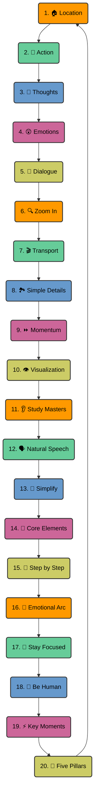

```mermaid
graph TD
    1("1. 🏠 Location") --> 2("2. 🏃 Action")
    2 --> 3("3. 🧠 Thoughts")
    3 --> 4("4. 😲 Emotions")
    4 --> 5("5. 💬 Dialogue")
    5 --> 6("6. 🔍 Zoom In")
    6 --> 7("7. 🎬 Transport")
    7 --> 8("8. 🏞️ Simple Details")
    8 --> 9("9. ⏩ Momentum")
    9 --> 10("10. 👁️ Visualization")
    10 --> 11("11. 👂 Study Masters")
    11 --> 12("12. 🗣️ Natural Speech")
    12 --> 13("13. 🤸 Simplify")
    13 --> 14("14. 🧩 Core Elements")
    14 --> 15("15. 🚶 Step by Step")
    15 --> 16("16. 🌊 Emotional Arc")
    16 --> 17("17. 🎯 Stay Focused")
    17 --> 18("18. 🤔 Be Human")
    18 --> 19("19. ⚡ Key Moments")
    19 --> 20("20. 🧠 Five Pillars")
    20 --> 1

    %% Style definitions
    classDef foundation fill:#ff9900,stroke:#333,stroke-width:2px,color:#000;
    classDef technique fill:#66cc99,stroke:#333,stroke-width:2px,color:#000;
    classDef learning fill:#6699cc,stroke:#333,stroke-width:2px,color:#000;
    classDef mastery fill:#cc6699,stroke:#333,stroke-width:2px,color:#000;
    
    %% Apply styles
    class 1,2,3,4,5 foundation;
    class 6,7,8,9,10 technique;
    class 11,12,13,14,15 learning;
    class 16,17,18,19,20 mastery;
    
    class 1,6,11,16 emphasis;
    class 2,7,12,17 action;
    class 3,8,13,18 thought;
    class 4,9,14,19 emotion;
    class 5,10,15,20 technique;
    
    classDef emphasis fill:#ff9900,stroke:#333,stroke-width:2px;
    classDef action fill:#66cc99,stroke:#333,stroke-width:2px;
    classDef thought fill:#6699cc,stroke:#333,stroke-width:2px;
    classDef emotion fill:#cc6699,stroke:#333,stroke-width:2px;
    classDef technique fill:#cccc66,stroke:#333,stroke-width:2px;
```

    
